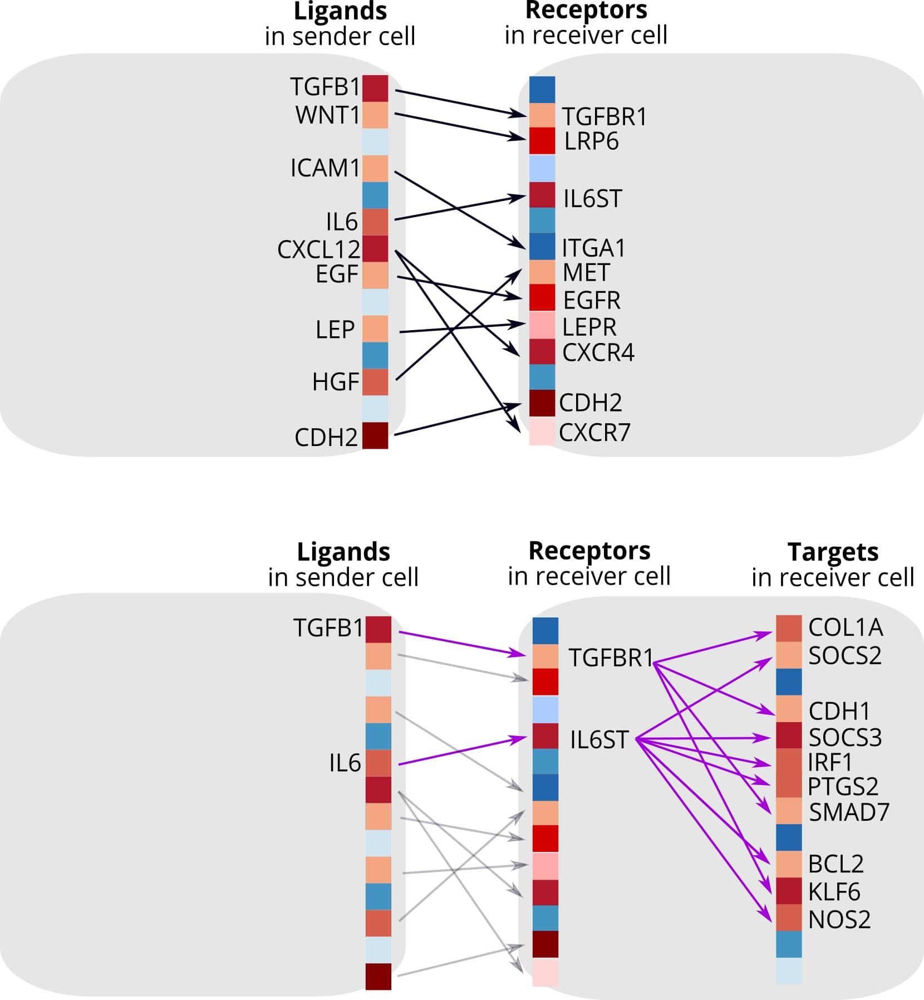
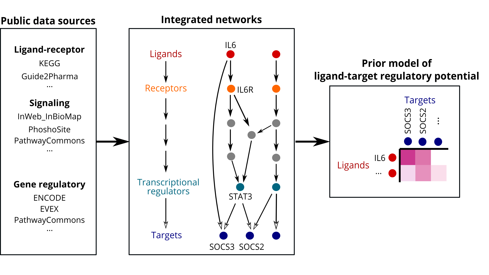
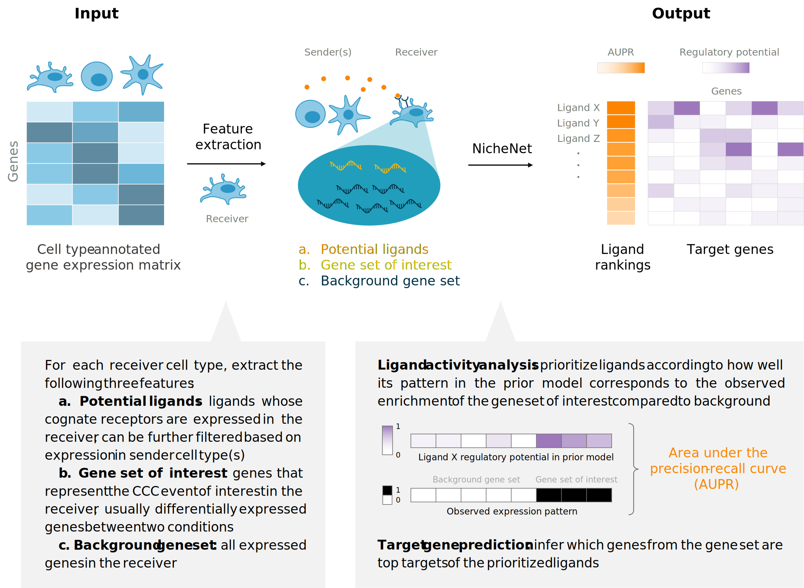

<!-- README.md is generated from README.Rmd. Please edit that file -->
<!-- github markdown built using
rmarkdown::render("README.Rmd",output_format = "md_document")
-->

# nichenetr

<!-- badges: start -->

<!-- badges: end -->

**nichenetr: the R implementation of the NicheNet method.** The goal of
NicheNet is to study intercellular communication from a computational
perspective. NicheNet uses human or mouse gene expression data of
interacting cells as input and combines this with a prior model that
integrates existing knowledge on ligand-to-target signaling paths. This
allows to predict ligand-receptor interactions that might drive gene
expression changes in cells of interest.

We describe the NicheNet algorithm in the following paper: [NicheNet:
modeling intercellular communication by linking ligands to target
genes](https://www.nature.com/articles/s41592-019-0667-5).

## Installation of nichenetr

Installation typically takes a few minutes, depending on the number of
dependencies that has already been installed on your PC. You can install
nichenetr (and required dependencies) from github with:

    if(!requireNamespace("devtools", quietly = TRUE)) {
      install.packages("devtools") 
    }

    devtools::install_github("saeyslab/nichenetr")

nichenetr was tested on both Windows and Linux (most recently tested R
version: R 4.3.2)

## Overview of NicheNet

<h3>
Background
</h3>

NicheNet strongly differs from most computational approaches to study
cell-cell communication (CCC), as summarized conceptually by the figure
below (**top panel:** current ligand-receptor inference approaches;
**bottom panel:** NicheNet). Many approaches to study CCC from
expression data involve linking ligands expressed by sender cells to
their corresponding receptors expressed by receiver cells. However,
functional understanding of a CCC process also requires knowing how
these inferred ligand-receptor interactions result in changes in the
expression of downstream target genes within the receiver cells.
Therefore, we developed NicheNet to consider the gene regulatory effects
of ligands.   
   

At the core of NicheNet is a prior knowledge model, created by
integrating three types of databases—ligand-receptor interactions,
signaling pathways, and transcription factor (TF) regulation—to form a
complete communication network spanning from ligands to their downstream
target genes (see figure below). Therefore, this model goes beyond
ligand-receptor interactions and incorporates intracellular signaling
and transcriptional regulation as well. As a result, NicheNet is able to
predict which ligands influence the expression in another cell, which
target genes are affected by each ligand, and which signaling mediators
may be involved. By generating these novel types of hypotheses, NicheNet
can drive an improved functional understanding of a CCC process of
interest. Note that although we provide a pre-built prior model, it is
also possible to construct your own model (see vignettes below).

<h3>
Main functionalities of nichenetr
</h3>

-   Assessing how well ligands expressed by a sender cell can predict
    changes in gene expression in the receiver cell
-   Prioritizing ligands based on their effect on gene expression
-   Inferring putative ligand-target links active in the system under
    study
-   Inferring potential signaling paths between ligands and target genes
    of interest: to generate causal hypotheses and check which data
    sources support the predictions
-   Validation of the prior ligand-target model
-   Construction of user-defined prior ligand-target models

Moreover, we provide instructions on how to make intuitive
visualizations of the main predictions (e.g., via circos plots as shown
here below).

  

As input to NicheNet, users must provide cell type-annotated expression
data that reflects a cell-cell communication (CCC) event. The input can
be single-cell or sorted bulk data from human or mouse. As output,
NicheNet returns the ranking of ligands that best explain the CCC event
of interest, as well as candidate target genes with high potential to be
regulated by these ligands. As an intermediate step, we extract the
three features required for the analysis: a list of potential ligands, a
gene set that captures the downstream effects of the CCC event of
interest, and a background set of genes. Further explanation on each
feature can be found in the introductory vignette.

   

## Learning to use nichenetr

The following vignettes contain the explanation on how to perform a
basic NicheNet analysis on a Seurat object. This includes prioritizing
ligands and predicting target genes of prioritized ligands. We recommend
starting with the step-by-step analysis, but we also demonstrate the use
of a single wrapper function. This demo analysis takes only a few
minutes to run.

-   [Perform NicheNet analysis starting from a Seurat object:
    step-by-step
    analysis](vignettes/seurat_steps.md):`vignette("seurat_steps", package="nichenetr")`
-   [Perform NicheNet analysis starting from a Seurat
    object](vignettes/seurat_wrapper.md):`vignette("seurat_wrapper", package="nichenetr")`

Case study on HNSCC tumor which demonstrates the flexibility of
NicheNet. Here, the gene set of interest was determined by the original
authors, and the expression data is a matrix rather than a Seurat
object.

-   [NicheNet’s ligand activity analysis on a gene set of
    interest](vignettes/ligand_activity_geneset.md):
    `vignette("ligand_activity_geneset", package="nichenetr")`

The following vignettes contain explanation on how to do some follow-up
analyses after performing the most basic analysis:

-   [Prioritization of ligands based on expression
    values](vignettes/seurat_steps_prioritization.md):
    `vignette("seurat_steps_prioritization", package="nichenetr")`
-   [Inferring ligand-to-target signaling
    paths](vignettes/ligand_target_signaling_path.md):
    `vignette("ligand_target_signaling_path", package="nichenetr")`
-   [Assess how well top-ranked ligands can predict a gene set of
    interest](vignettes/target_prediction_evaluation_geneset.md):
    `vignette("target_prediction_evaluation_geneset", package="nichenetr")`
-   [Single-cell NicheNet’s ligand activity
    analysis](vignettes/ligand_activity_single_cell.md):
    `vignette("ligand_activity_single_cell", package="nichenetr")`

If you want to make a circos plot visualization of the NicheNet output
to show active ligand-target links between interacting cells, you can
check following vignettes:

-   [Seurat Wrapper + circos
    visualization](vignettes/seurat_wrapper_circos.md):`vignette("seurat_wrapper_circos", package="nichenetr")`.
-   [HNSCC case study + double circos
    visualization](vignettes/circos.md):`vignette("circos", package="nichenetr")`.

People interested in building their own models or benchmarking their own
models against NicheNet can read one of the following vignettes:

-   [Model construction](vignettes/model_construction.md):
    `vignette("model_construction", package="nichenetr")`
-   [Using LIANA ligand-receptor databases to construct the
    ligand-target model](vignettes/model_construction_with_liana.md):
    `vignette("model_construction_with_liana", package="nichenetr")`
-   [Model evaluation: target gene and ligand activity
    prediction](vignettes/model_evaluation.md):
    `vignette("model_evaluation", package="nichenetr")`
-   [Parameter optimization via
    NSGAII-R](vignettes/parameter_optimization.md):
    `vignette("parameter_optimization", package="nichenetr")`

## FAQ

Check the FAQ page at [FAQ NicheNet](vignettes/faq.md):
`vignette("faq", package="nichenetr")`

<h2>
Previous updates
</h2>

**20-06-2023:**

-   MultiNicheNet - a multi-sample, multi-condition extension of
    NicheNet - is now available on
    [biorxiv](https://www.biorxiv.org/content/10.1101/2023.06.13.544751v1)
    and [Github](https://github.com/saeyslab/multinichenetr).
-   MultiNicheNet uses an [updated prior model
    (v2)](https://zenodo.org/record/7074291/) consisting of additional
    ligand-receptor interactions from the [Omnipath
    database](https://omnipathdb.org/) and from [Verschueren et
    al. (2020)](https://www.sciencedirect.com/science/article/pii/S0092867420306942?via%3Dihub).
    We have now also updated the vignettes of NicheNet to use the new
    model instead.
-   **New functionality:** we have included additional functions to
    prioritize ligands not only based on the ligand activity, but also
    on the ligand and receptor expression, cell type specificity, and
    condition specificity. This is similar to the criteria used in
    Differential NicheNet and MultiNicheNet. See the [Prioritizing
    ligands based on expression
    values](vignettes/seurat_steps_prioritization.md) vignette for more
    information.
-   Due to this more generalizable prioritization scheme, we will no
    longer provide support for Differential NicheNet.
-   We included code for making a ligand-receptor-target circos plot in
    the [Circos plot visualization](vignettes/circos.md) vignette.

<h5>
Deprecated vignettes
</h5>

Differential NicheNet has been deprecated: we will not longer provide
support or code fixes on Differential NicheNet and its vignettes. You
may want to consider using the [general prioritization
scheme](vignettes/seurat_steps_prioritization.md) instead.

-   [Differential NicheNet analysis between niches of
    interest](vignettes/differential_nichenet.md):`vignette("differential_nichenet", package="nichenetr")`
-   [Differential NicheNet analysis between conditions of
    interest](vignettes/differential_nichenet_pEMT.md):`vignette("differential_nichenet_pEMT", package="nichenetr")`

In NicheNet v2, the mouse and human ligand-target models are uploaded
separately so symbol conversion is not necessary. If you are still using
the NicheNet v1 model, you can check the following vignette on how to
convert the model (given in human symbols) to mouse symbols:

-   [Converting NicheNet’s model from human to mouse
    symbols](vignettes/symbol_conversion.md):
    `vignette("symbol_conversion", package="nichenetr")`

**12-01-2022:** In the Liver Atlas paper from Guilliams et al.: [Spatial
proteogenomics reveals distinct and evolutionarily conserved hepatic
macrophage
niches](https://www.sciencedirect.com/science/article/pii/S0092867421014811),
we used Differential NicheNet, an extension to the default NicheNet
algorithm. **Differential NicheNet** can be used to compare cell-cell
interactions between different niches and better predict niche-specific
ligand-receptor (L-R) pairs. It was used in that paper to predict
ligand-receptor pairs specific for the Kupffer cell niche in mouse and
human.

The main difference between the classic NicheNet pipeline and the
Differential NicheNet pipeline is that Differential NicheNet also uses
the differential expression between the conditions/niches of the
ligand-receptor pairs for prioritization in addition to the ligand
activities. The classic NicheNet pipeline on the contrary uses only
ligand acivity for prioritization (and shows differential expression
only in visualizations).

So if you have data of multiple conditions or niches, and you want to
include differential expression of the ligand-receptor pairs in the
prioritization, we recommend you check out Differential NicheNet (update
nichenetr to the 1.1.0 version). At the bottom of this page, you can
find the links to two vignettes illustrating a Differential NicheNet
analysis. We recommend these vignettes if you want to apply Differential
NicheNet on your own data. If you want to see the code used for the
analyses used in the Guilliams et al. paper, see
<https://github.com/saeyslab/NicheNet_LiverCellAtlas>.

**15-10-2019:** Bonnardel, T’Jonck et al. used NicheNet to predict
upstream niche signals driving Kupffer cell differentiation [Stellate
Cells, Hepatocytes, and Endothelial Cells Imprint the Kupffer Cell
Identity on Monocytes Colonizing the Liver Macrophage
Niche](https://www.cell.com/immunity/fulltext/S1074-7613(19)30368-1).

## References

Browaeys, R., Saelens, W. & Saeys, Y. NicheNet: modeling intercellular
communication by linking ligands to target genes. Nat Methods (2019)
<doi:10.1038/s41592-019-0667-5>

Bonnardel et al. Stellate Cells, Hepatocytes, and Endothelial Cells
Imprint the Kupffer Cell Identity on Monocytes Colonizing the Liver
Macrophage Niche. Immunity (2019) <doi:10.1016/j.immuni.2019.08.017>

Guilliams et al. Spatial proteogenomics reveals distinct and
evolutionarily conserved hepatic macrophage niches. Cell (2022)
<doi:10.1016/j.cell.2021.12.018>
