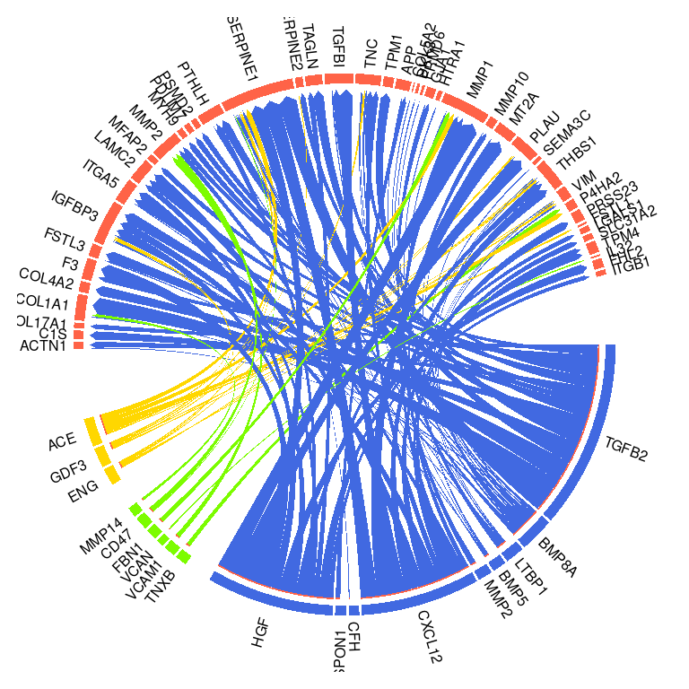
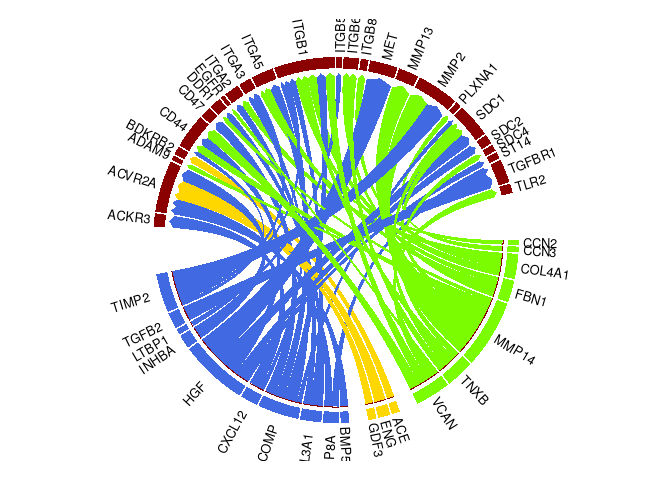
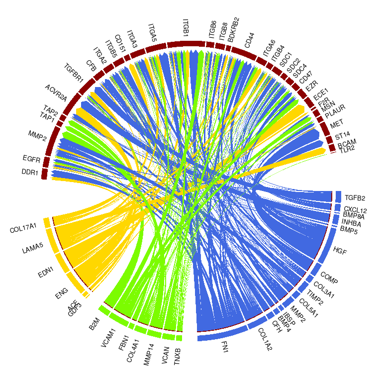

Circos plot visualization to show active ligand-target links between
interacting cells
================
Robin Browaeys & Chananchida Sang-aram
2023-07-20

<!-- github markdown built using 
rmarkdown::render("vignettes/circos.Rmd", output_format = "github_document")
-->

This vignette shows how to visualize the output of a NicheNet analysis
in a circos plot. This is an additional demonstration to [Seurat
Wrapper + Circos visualization](seurat_wrapper_circos.md). Here, we will
use a normal matrix as input instead of a Seurat object.

We will use the same dataset as from [NicheNet’s ligand activity
analysis on a gene set of interest: predict active ligands and their
target genes](ligand_activity_geneset.md) Puram et al. (2017). In
contrast to the basic vignette, we will look at communication between
multiple cell types. More specifically, we will predict which ligands
expressed by both CAFs and endothelial cells can induce the p-EMT
program in neighboring malignant cells.

### Load packages

``` r
library(nichenetr)
library(tidyverse)
library(circlize)
```

### Read in NicheNet’s networks

``` r
lr_network <- readRDS(url("https://zenodo.org/record/7074291/files/lr_network_human_21122021.rds"))
ligand_target_matrix <- readRDS(url("https://zenodo.org/record/7074291/files/ligand_target_matrix_nsga2r_final.rds"))
weighted_networks <- readRDS(url("https://zenodo.org/record/7074291/files/weighted_networks_nsga2r_final.rds"))
  
lr_network <- lr_network %>% distinct(from, to)
```

### Read in the expression data of interacting cells

This is publicly available single-cell data from CAF and malignant cells
from HNSCC tumors.

``` r
hnscc_expression <- readRDS(url("https://zenodo.org/record/3260758/files/hnscc_expression.rds"))
expression <- hnscc_expression$expression
sample_info <- hnscc_expression$sample_info # contains meta-information about the cells

# Convert gene names
colnames(expression) <- convert_alias_to_symbols(colnames(expression), "human", verbose = FALSE)
```

### Define a set of potential ligands

``` r
tumors_remove <- c("HN10","HN","HN12", "HN13", "HN24", "HN7", "HN8","HN23")

CAF_ids <- sample_info %>%
  filter(`Lymph node` == 0 & !(tumor %in% tumors_remove) &
           `non-cancer cell type` == "CAF") %>% pull(cell)
endothelial_ids <- sample_info %>%
  filter(`Lymph node` == 0 & !(tumor %in% tumors_remove) &
           `non-cancer cell type` == "Endothelial") %>% pull(cell)
malignant_ids <- sample_info %>% filter(`Lymph node` == 0 &
                                          !(tumor %in% tumors_remove) &
                                          `classified  as cancer cell` == 1) %>% pull(cell)


# Define expressed genes in CAFs, endothelial cells and malignant cells
expressed_genes_CAFs <- expression[CAF_ids,] %>%
  apply(2,function(x){10*(2**x - 1)}) %>%
  apply(2,function(x){log2(mean(x) + 1)}) %>% .[. >= 4] %>%
  names()

expressed_genes_endothelial <- expression[endothelial_ids,] %>%
  apply(2,function(x){10*(2**x - 1)}) %>%
  apply(2,function(x){log2(mean(x) + 1)}) %>% .[. >= 4] %>%
  names()

expressed_genes_malignant <- expression[malignant_ids,] %>%
  apply(2,function(x){10*(2**x - 1)}) %>%
  apply(2,function(x){log2(mean(x) + 1)}) %>% .[. >= 4] %>%
  names()

# Define expressed ligands and receptors
ligands <- lr_network %>% pull(from) %>% unique()
expressed_ligands_CAFs <- intersect(ligands,expressed_genes_CAFs)
expressed_ligands_endothelial <- intersect(ligands,expressed_genes_endothelial)
expressed_ligands <- union(expressed_ligands_CAFs, expressed_genes_endothelial)

receptors <- lr_network %>% pull(to) %>% unique()
expressed_receptors <- intersect(receptors,expressed_genes_malignant)

# Define potential ligands
potential_ligands <- lr_network %>%
  filter(from %in% expressed_ligands & to %in% expressed_receptors) %>%
  pull(from) %>% unique()
```

### Define the gene set of interest and background of genes

We will use the p-EMT gene set defined by Puram et al. as gene set of
interest and use all genes expressed in malignant cells as background of
genes.

``` r
pemt_geneset <- readr::read_tsv(url("https://zenodo.org/record/3260758/files/pemt_signature.txt"),
                                col_names = "gene") %>%
  pull(gene) %>% .[. %in% rownames(ligand_target_matrix)]

background_expressed_genes <- expressed_genes_malignant %>%
  .[. %in% rownames(ligand_target_matrix)]
```

### Perform NicheNet’s ligand activity analysis

With the ligand activity analysis, we assess how well each potential
ligand can predict the p-EMT gene set compared to the background of
expressed genes. Note that we combine the ligands from CAFs and
endothelial cells in one ligand activity analysis now. Later on, we will
look which of the top-ranked ligands is mainly expressed by which of
both cell types.

``` r
ligand_activities <-  predict_ligand_activities(geneset = pemt_geneset,
                                                background_expressed_genes = background_expressed_genes,
                                                ligand_target_matrix = ligand_target_matrix,
                                                potential_ligands = potential_ligands)
```

Now, we want to rank the ligands based on their ligand activity (AUPR).
We will choose the top 20 ligands here - as opposed to the top 30 in the
main vignette - to avoid overcrowding the circos plot.

``` r
ligand_activities %>% arrange(-aupr_corrected) 
## # A tibble: 242 × 5
##    test_ligand auroc   aupr aupr_corrected pearson
##    <chr>       <dbl>  <dbl>          <dbl>   <dbl>
##  1 TGFB2       0.772 0.120          0.105    0.195
##  2 BMP8A       0.774 0.0852         0.0699   0.175
##  3 INHBA       0.777 0.0837         0.0685   0.122
##  4 CXCL12      0.714 0.0829         0.0676   0.141
##  5 GDF3        0.763 0.0788         0.0635   0.154
##  6 LTBP1       0.727 0.0762         0.0609   0.160
##  7 ACE         0.717 0.0740         0.0587   0.146
##  8 CCN2        0.736 0.0734         0.0581   0.141
##  9 TNXB        0.719 0.0717         0.0564   0.157
## 10 ENG         0.764 0.0703         0.0551   0.145
## # ℹ 232 more rows
best_upstream_ligands <- ligand_activities %>%
  top_n(20, aupr_corrected) %>%
  arrange(-aupr_corrected) %>%
  pull(test_ligand)

head(best_upstream_ligands)
## [1] "TGFB2"  "BMP8A"  "INHBA"  "CXCL12" "GDF3"   "LTBP1"
```

Determine now which prioritized ligands are expressed by CAFs and or
endothelial cells.

``` r
# There is a lot of overlap between both cell types in terms of expressed ligands
intersect(best_upstream_ligands %>% intersect(expressed_ligands_CAFs),
          best_upstream_ligands %>% intersect(expressed_ligands_endothelial))
##  [1] "CXCL12" "LTBP1"  "CCN2"   "TNXB"   "ENG"    "VCAN"   "CCN3"   "COL4A1" "HGF"    "TIMP2"  "FBN1"

# Therefore, determine which ligands are more strongly expressed in which of the two
# Calculate average expression of each ligand in CAFs and endothelial cells
ligand_expression_tbl <- tibble(
  ligand = best_upstream_ligands, 
  CAF = expression[CAF_ids,best_upstream_ligands] %>%
    apply(2,function(x){10*(2**x - 1)}) %>%
    apply(2,function(x){log2(mean(x) + 1)}),
  endothelial = expression[endothelial_ids,best_upstream_ligands] %>%
    apply(2,function(x){10*(2**x - 1)}) %>%
    apply(2,function(x){log2(mean(x) + 1)}))

head(ligand_expression_tbl)
## # A tibble: 6 × 3
##   ligand   CAF endothelial
##   <chr>  <dbl>       <dbl>
## 1 TGFB2   4.62       0.722
## 2 BMP8A   4.66       1.71 
## 3 INHBA   8.14       0.423
## 4 CXCL12 11.0        6.56 
## 5 GDF3    0          4.98 
## 6 LTBP1   7.53       4.43

# Assign ligand to a cell type based on which cell type has much higher average expression
# If ligand is not expressed more highly enough in either cell type, assign to general category
CAF_specific_ligands <- ligand_expression_tbl %>% filter(CAF > endothelial + 2) %>% pull(ligand)
endothelial_specific_ligands <- ligand_expression_tbl %>% filter(endothelial > CAF + 2) %>% pull(ligand)
general_ligands <- setdiff(best_upstream_ligands,c(CAF_specific_ligands,endothelial_specific_ligands))

ligand_type_indication_df <- tibble(
  ligand_type = c(rep("CAF-specific", times = CAF_specific_ligands %>% length()),
                  rep("General", times = general_ligands %>% length()),
                  rep("Endothelial-specific", times = endothelial_specific_ligands %>% length())),
  ligand = c(CAF_specific_ligands, general_ligands, endothelial_specific_ligands))

head(ligand_type_indication_df)
## # A tibble: 6 × 2
##   ligand_type  ligand
##   <chr>        <chr> 
## 1 CAF-specific TGFB2 
## 2 CAF-specific BMP8A 
## 3 CAF-specific INHBA 
## 4 CAF-specific CXCL12
## 5 CAF-specific LTBP1 
## 6 CAF-specific BMP5
```

### Infer target genes of top-ranked ligands and visualize in a circos plot

First, get the active ligand-target links by looking which of the p-EMT
genes are among the top-predicted target genes for the prioritized
ligands:

``` r
active_ligand_target_links_df <- best_upstream_ligands %>%
  lapply(get_weighted_ligand_target_links,
         geneset = pemt_geneset,
         ligand_target_matrix = ligand_target_matrix,
         n = 250) %>% bind_rows()

active_ligand_target_links_df <- active_ligand_target_links_df %>%
  mutate(target_type = "p_emt")
```

Note that you can make a circos plot for multiple gene sets by combining
different dataframes and differentiating which target belongs to which
gene set via the “target type” column.

To avoid making a circos plots with too many ligand-target links, we
will show only links with a weight higher than a predefined cutoff:
links belonging to the 66% of lowest scores were removed. Not that this
cutoffs and other cutoffs used for this visualization can be changed
according to the user’s needs.

``` r
circos_links <- get_ligand_target_links_oi(ligand_type_indication_df,
                                           active_ligand_target_links_df,
                                           cutoff = 0.66) 
```

Prepare the circos visualization by giving each segment of ligands and
targets a specific color and order, as well as gaps between different
cell types. By default, cell types are ordered alphabetically, followed
by “General” (then they are drawn counter-clockwise). Users can give a
specific order to the cell types by providing a vector of cell types to
the argument `celltype_order`. The gaps between the different segments
can also be defined by providing a named list to the argument `widths`.

``` r
ligand_colors <- c("General" = "lawngreen",
                   "CAF-specific" = "royalblue",
                   "Endothelial-specific" = "gold")
target_colors <- c("p_emt" = "tomato")


vis_circos_obj <- prepare_circos_visualization(circos_links,
                                               ligand_colors = ligand_colors,
                                               target_colors = target_colors,
                                               celltype_order = NULL) 
```

Render the circos plot where all links have the same transparency. Here,
only the widths of the blocks that indicate each target gene is
proportional the ligand-target regulatory potential (~prior knowledge
supporting the regulatory interaction).

``` r
draw_circos_plot(vis_circos_obj, transparency = FALSE,  args.circos.text = list(cex = 0.5)) 
```

<!-- -->

Render the circos plot where the degree of transparency determined by
the regulatory potential value of a ligand-target interaction.

``` r
draw_circos_plot(vis_circos_obj, transparency = TRUE,  args.circos.text = list(cex = 0.5)) 
```

<!-- -->

To create a legend for the circos plot, we can use the
`ComplexHeatmap::Legend` function and creating a gTree object from it
with `grid::grid.grabExpr`. As the circos plot is drawn on base R
graphics (i.e., it is not a ggplot object), we will get the plot using
`recordPlot()`.

``` r
par(bg = "transparent")

# Default celltype order
celltype_order <- unique(circos_links$ligand_type) %>% sort() %>% .[. != "General"] %>% c(., "General")

# Create legend
circos_legend <- ComplexHeatmap::Legend(
  labels = celltype_order,
  background = ligand_colors[celltype_order],
  type = "point",
  grid_height = unit(3, "mm"),
  grid_width = unit(3, "mm"),
  labels_gp = gpar(fontsize = 8)
  )

circos_legend_grob <- grid::grid.grabExpr(draw(circos_legend))

draw_circos_plot(vis_circos_obj, transparency = TRUE, args.circos.text = list(cex = 0.5))
p_circos_no_legend <- recordPlot()
```

We can combine the circos plot and the legend using
`cowplot::plot_grid`.

``` r
cowplot::plot_grid(p_circos_no_legend, circos_legend_grob, rel_widths = c(1, 0.1))
```

<!-- -->

We can save this plot to an svg file.

``` r
svg("ligand_target_circos.svg", width = 10, height = 10)
cowplot::plot_grid(p_circos_no_legend, circos_legend_grob, rel_widths = c(1, 0.1))
dev.off()
## png 
##   2
```

### Visualize ligand-receptor interactions of the prioritized ligands in a circos plot

To create a ligand-receptor chord diagram, we can perform similar steps
as above using the weighted ligand-receptor dataframe instead. However,
as as `prepare_circos_visualization` accesses “target” and “target_type”
columns, it is necessary to rename the columns accordingly even though
the dataframe contains receptor and not target gene information.

``` r
lr_network_top_df <- get_weighted_ligand_receptor_links(best_upstream_ligands,
                                   expressed_receptors,
                                   lr_network,
                                   weighted_networks$lr_sig) %>%
  rename(ligand=from, target=to) %>% 
  mutate(target_type = "p_emt_receptor") %>% 
  inner_join(ligand_type_indication_df)

receptor_colors <- c("p_emt_receptor" = "darkred")

vis_circos_receptor_obj <- prepare_circos_visualization(lr_network_top_df,
                                                        ligand_colors = ligand_colors,
                                                        target_colors = receptor_colors) 
```

When drawing the plot, the argument `link.visible` = TRUE is also
necessary for making all links visible, since no cutoff is used to
filter out ligand-receptor interactions.

``` r
draw_circos_plot(vis_circos_receptor_obj, transparency = FALSE,
                 link.visible = TRUE,  args.circos.text = list(cex = 0.8)) 
```

<!-- -->

Just as above, if `transparency = TRUE`, the degree of transparency is
determined by the prior interaction weight of the ligand-receptor
interaction.

``` r
draw_circos_plot(vis_circos_receptor_obj, transparency = TRUE,
                 link.visible = TRUE,  args.circos.text = list(cex = 0.8)) 
```

<!-- -->

### Adding an outer track to the circos plot (ligand-receptor-target circos plot)

In the paper of Bonnardel, T’Jonck et al. [Stellate Cells, Hepatocytes,
and Endothelial Cells Imprint the Kupffer Cell Identity on Monocytes
Colonizing the Liver Macrophage
Niche](https://www.cell.com/immunity/fulltext/S1074-7613(19)30368-1), we
showed in Fig. 6B a ligand-receptor-target circos plot to visualize the
main NicheNet predictions. This “ligand-receptor-target” circos plot was
made by making first two separate circos plots: the ligand-target and
ligand-receptor circos plot. Then these circos plots were overlayed in
Inkscape (with the center of the two circles at the same location and
the ligand-receptor circos plot bigger than the ligand-target one). To
generate the combined circos plot as shown in Fig. 6B, we then manually
removed all elements of the ligand-receptor circos plot except the outer
receptor layer.

It is also possible to generate this kind of plot programmatically,
given that you are able to group your ligands. Below, we demonstrate two
approaches that uses either the `circlize::draw.sector` or
`circlize::highlight.sector` function. The former is more complicated
but gives you the flexibility to draw receptor arcs of different
lengths, while the `highlight.sector` function is constrained to the
widths of the targets in the inner track.

#### Using the `draw.sector` function

For demonstration purposes, we will use a subset of ligands and divide
them into four groups that differ in the signaling pathways they
interact with. Then, we assign targets and receptors to each ligand
group based on their relative rankings (and summed weights in case the
rankings are the same). The way we assigned targets and receptors to
ligand groups here does not always lead to the most biologically
meaningful results, as you will see in the final plot. Hence, it is best
if you curate this list manually, e.g., through prior knowledge and by
also looking at the ligand-target and ligand-receptor heatmap. Also keep
in mind that there is no real correspondence between receptors and
targets, as explained more
[here](https://github.com/saeyslab/nichenetr/issues/20#issuecomment-611601039).

``` r
groups <- list(group1 = c("TGFB2", "ENG"),
               group2 = grep("BMP|GDF|INHBA", best_upstream_ligands, value = TRUE),
               group3 = grep("COL|MMP|TIMP", best_upstream_ligands, value = TRUE),
               group4 = "CXCL12")

# Create list of targets for each group of ligand
targets <- lapply(names(groups), function(i) {
  # Rank each target for each ligand
  active_ligand_target_links_df %>% group_by(ligand) %>% mutate(target_rank = dense_rank(desc(weight))) %>%
    filter(ligand %in% groups[[i]]) %>%
    # Make two metrics for each target -> summed weight and avg_rank
    group_by(target) %>%
    summarise(n = n(), summed_weight=sum(weight), avg_rank = mean(target_rank)) %>%
    # Only keep targets that are connected to at least half of ligands in the group
    filter(n > (length(groups[[i]])/2)) %>% mutate(type = i)
}) %>% do.call(rbind, .)

# Check if any targets are distinct per group (groups 2 and 4 have some)
lapply(paste0("group", 1:5), function(group_name) setdiff(targets %>% filter(type == group_name) %>% pull(target), targets %>% filter(type != group_name) %>% pull(target)))
## [[1]]
## character(0)
## 
## [[2]]
## [1] "DKK3"   "GJA1"   "HTRA1"  "SEMA3C"
## 
## [[3]]
## character(0)
## 
## [[4]]
## [1] "LAMC2"   "MMP10"   "PRSS23"  "SLC31A2" "TPM4"   
## 
## [[5]]
## character(0)

# Assign target to a specific group, first based on ranking and second based on weight
targets_filtered <- targets %>% group_by(target) %>% filter(avg_rank == min(avg_rank)) %>%
  filter(summed_weight == max(summed_weight)) %>% ungroup()

# Do the same for receptors
receptor_colors <- c("#387D7A", "#9DA9A0", "#DD7373", "#725752") %>% setNames(names(groups))

receptors <- lapply(names(groups), function(i) {
  weighted_networks$lr_sig %>% filter(from %in% groups[[i]] & to %in% unique(lr_network_top_df$target)) %>% 
    group_by(from) %>% mutate(receptor_rank = dense_rank(desc(weight))) %>%
    group_by(to) %>%  summarise(summed_weight=sum(weight),  avg_weight=mean(weight),  avg_rank = mean(receptor_rank)) %>%
    mutate(type=i, color = receptor_colors[i]) %>% rename(receptor = to)
}) %>% do.call(rbind, .)

# Check distinct receptors per group
lapply(paste0("group", 1:5), function(group_name) setdiff(receptors %>% filter(type == group_name) %>% pull(receptor), receptors %>% filter(type != group_name) %>% pull(receptor)))
## [[1]]
## [1] "MET"
## 
## [[2]]
## character(0)
## 
## [[3]]
## [1] "ADAM9" "CD47"  "DDR1"  "ITGA2" "ITGA3" "ITGB5" "ITGB6" "ITGB8" "ST14" 
## 
## [[4]]
## [1] "ACKR3"
## 
## [[5]]
## character(0)
 
# Assign receptor to a specific group
receptors_filtered <- receptors %>% group_by(receptor) %>% filter(avg_rank == min(avg_rank)) %>%
  filter(summed_weight == max(summed_weight)) %>% ungroup()
```

Next, run the same functions as the plots before, after filtering the
ligand assignment dataframe and the ligand-target links dataframe. We
also add the group information to the targets

``` r

circos_links_subset <- get_ligand_target_links_oi(
  ligand_type_indication_df %>% filter(ligand %in% unlist(groups)),
  active_ligand_target_links_df %>% filter(ligand %in% unlist(groups)) %>%
    # Add group information
    inner_join(targets_filtered, by="target") %>%
    select(-target_type, n, summed_weight, avg_rank) %>%
    rename(target_type=type),
  cutoff = 0.66)

ligand_colors <- c("General" = "lawngreen",
                   "CAF-specific" = "royalblue",
                   "Endothelial-specific" = "gold")
target_colors <- rep("tomato", 4) %>% setNames(names(groups))

# Define specific gaps
vis_circos_obj_subset <- prepare_circos_visualization(circos_links_subset,
                             ligand_colors = ligand_colors,
                             target_colors = target_colors,
                             widths = list(width_same_cell_same_ligand_type = 0.6,
                                           width_different_cell = 4.5,
                                           width_ligand_target = 12,
                                           width_same_cell_same_target_type = 0.6))
```

Finally, we create the plot by adding an extra layer in
`preAllocateTracks`, and we add a `for` loop at the end to draw the
outer layer.

``` r
circos.par(gap.degree = vis_circos_obj_subset$gaps)

chordDiagram(vis_circos_obj_subset$links_circle,
             order=vis_circos_obj_subset$order,
             transparency=0,
             directional = 1,
             link.sort = TRUE,
             link.decreasing = FALSE,
             grid.col = vis_circos_obj_subset$ligand_colors,
             diffHeight = 0.005,
             direction.type = c("diffHeight", "arrows"),
             link.arr.type = "big.arrow",
             link.visible = vis_circos_obj_subset$links_circle$weight >=
               attr(vis_circos_obj_subset$links_circle, "cutoff_include_all_ligands"),
             annotationTrack = "grid",
    # Add extra track for outer layer
    preAllocateTracks = list(list(track.height = 0.025),
                             list(track.height = 0.25)))

# we go back to the first track and customize sector labels
circos.track(track.index = 2, panel.fun = function(x, y) {
    circos.text(CELL_META$xcenter, CELL_META$ylim[1], CELL_META$sector.index,
        facing = "clockwise", niceFacing = TRUE, adj = c(0, 0.55), cex = 0.8)
}, bg.border = NA) #


padding <- 0.05        # Gaps between receptor arcs
rou_adjustment <- 0.08 # Might need adjustment
for (group in unique(targets_filtered$type)){
  # Subset target and receptor
  targets_subset <- targets_filtered %>% filter(type == group)
  receptors_subset <- receptors_filtered %>% filter(type == group)
  
  # Get approximate position of outer ring
  pos <- circlize(c(0, 1), c(0, 1), track.index = 1)
  rou1 <- pos[1, "rou"]-rou_adjustment
  rou2 <- pos[2, "rou"]-rou_adjustment
  
  # Get range of angles from first to last target of the current group
  theta1 <- circlize:::get.sector.data((targets_subset %>% pull(target) %>% .[1]))["start.degree"]
  theta2 <- circlize:::get.sector.data((targets_subset %>% pull(target) %>% .[length(.)]))["end.degree"]
  
  # Scale the arc lengths according to the summed ligand-receptor weights
  receptors_subset_scaled <- receptors_subset %>%
    mutate(scaled_weight = summed_weight/sum(summed_weight)*(theta1-theta2))
  # For each receptor
  current_theta <- theta1
  for (i in 1:nrow(receptors_subset_scaled)){
    # Get end angle of the arc
    end_theta <- current_theta-(receptors_subset_scaled %>% slice(i) %>% pull(scaled_weight))
    d1 <- abs(end_theta-current_theta) # For gaps
    
    # Main function - we draw the arc here
    draw.sector(current_theta+(d1*-padding), end_theta-(d1*-padding),
                rou1, rou2,
                col = receptors_subset_scaled %>% slice(i) %>% pull(color),
                clock.wise = TRUE, border=NA)
    
    # Add text containing receptor name
    pos_text <- reverse.circlize((current_theta + end_theta)/2 + ifelse(current_theta < end_theta, 180, 0), (rou1 +  rou2)/2)
    # It's going to give a Note that point is out of plotting region
    suppressMessages(circos.text(pos_text[1,1], pos_text[1,2]+convert_y(7, "mm"),
                labels = receptors_subset_scaled %>% slice(i) %>% pull(receptor),
                niceFacing=TRUE, facing="clockwise", cex=0.6))
    
    current_theta <- end_theta
  }
  
}
```

<!-- -->

``` r

circos.clear()
```

As mentioned previously, the resulting plot will require some further
manual tweaking (e.g., ITGA5 should be in group 3).

#### Using the `highlight.sector` function

With this function, it is not possible to draw receptor arcs that end at
different points from the target arcs. To demonstrate this, we will
randomly assign the target genes into one of three groups (Receptors A,
B, and C).

``` r
set.seed(10)
target_gene_groups <- data.frame(target_type = sample(c("Receptor A", "Receptor B", "Receptor C"),
                                                      length(unique(circos_links$target)), replace = TRUE),
                                 target = unique(circos_links$target))
head(target_gene_groups)
##   target_type  target
## 1  Receptor C   ACTN1
## 2  Receptor A     C1S
## 3  Receptor B COL17A1
## 4  Receptor C  COL1A1
## 5  Receptor B  COL4A2
## 6  Receptor C      F3
```

Again, define the colors of the receptors (outer layer) and targets
(inner layer). Then, run `prepare_circos_visualization` to get the order
of the targets and the gaps between them.

``` r

receptor_group_colors <- c("#387D7A", "#9DA9A0", "#704E2E") %>%
  setNames(unique(target_gene_groups$target_type))

target_colors <- rep("tomato", 3) %>% setNames(unique(target_gene_groups$target_type))

vis_circos_obj2 <- prepare_circos_visualization(circos_links %>% select(-target_type) %>%
                                                  # Combine target gene group information to circos_links
                                                  inner_join(target_gene_groups, by="target"),
                             ligand_colors = ligand_colors,
                             target_colors = target_colors,
                             widths = list(width_same_cell_same_ligand_type = 0.6,
                                           width_different_cell = 4.5,
                                           width_ligand_target = 12,
                                           width_same_cell_same_target_type = 0.6))
```

The general idea here is similar - adding an extra layer in
`preAllocateTracks` and a `for` loop at the end to draw the outer
layer - but the function allows for much cleaner code.

``` r
circos.par(gap.degree = vis_circos_obj2$gaps)
chordDiagram(vis_circos_obj2$links_circle,
             directional = 1,
             transparency=0,
             order=vis_circos_obj2$order,
             link.sort = TRUE,
             link.decreasing = FALSE,
             grid.col = vis_circos_obj2$ligand_colors,
             diffHeight = 0.005,
             direction.type = c("diffHeight", "arrows"),
             link.arr.type = "big.arrow",
             link.visible = vis_circos_obj2$links_circle$weight >=
               attr(vis_circos_obj2$links_circle, "cutoff_include_all_ligands"),
             annotationTrack = "grid",
    # Add extra track for outer layer
    preAllocateTracks = list(list(track.height = 0.025),
                             list(track.height = 0.2)))

# we go back to the first track and customize sector labels
circos.track(track.index = 2, panel.fun = function(x, y) {
    circos.text(CELL_META$xcenter, CELL_META$ylim[1], CELL_META$sector.index,
        facing = "clockwise", niceFacing = TRUE, adj = c(0, 0.55), cex = 0.8)
}, bg.border = NA) #

# Add outer layer
for (target_gene_group in unique(target_gene_groups$target_type)){
  highlight.sector(target_gene_groups %>% filter(target_type == target_gene_group) %>% pull(target),
                   track.index = 1,
                 col = receptor_group_colors[target_gene_group],
                 text = target_gene_group,
                 cex = 0.8, facing="bending.inside", niceFacing = TRUE, text.vjust = "5mm")
}
```

<!-- -->

``` r

circos.clear()
```

### References

Bonnardel et al., 2019, Immunity 51, 1–17, [Stellate Cells, Hepatocytes,
and Endothelial Cells Imprint the Kupffer Cell Identity on Monocytes
Colonizing the Liver Macrophage
Niche](https://doi.org/10.1016/j.immuni.2019.08.017)

<div id="refs" class="references csl-bib-body hanging-indent">

<div id="ref-puram_single-cell_2017" class="csl-entry">

Puram, Sidharth V., Itay Tirosh, Anuraag S. Parikh, Anoop P. Patel,
Keren Yizhak, Shawn Gillespie, Christopher Rodman, et al. 2017.
“Single-Cell Transcriptomic Analysis of Primary and Metastatic Tumor
Ecosystems in Head and Neck Cancer.” *Cell* 171 (7): 1611–1624.e24.
<https://doi.org/10.1016/j.cell.2017.10.044>.

</div>

</div>
