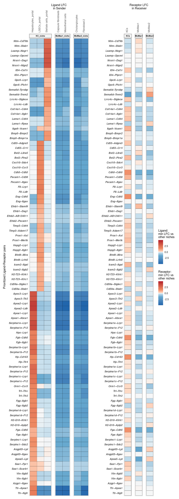
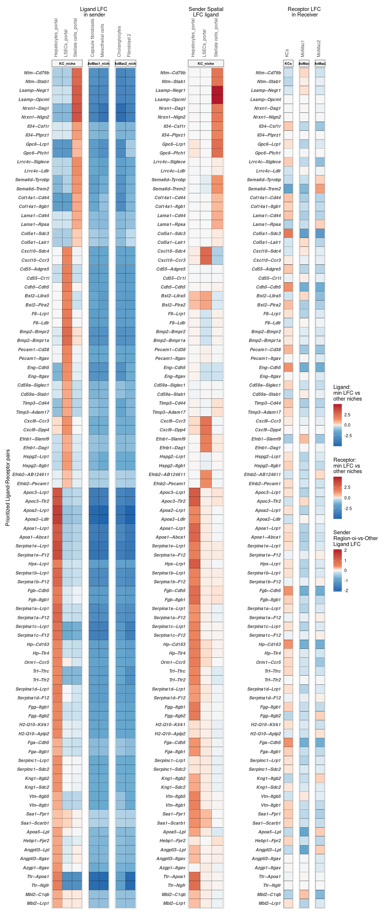
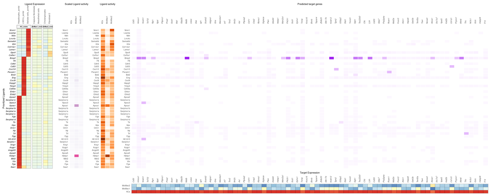
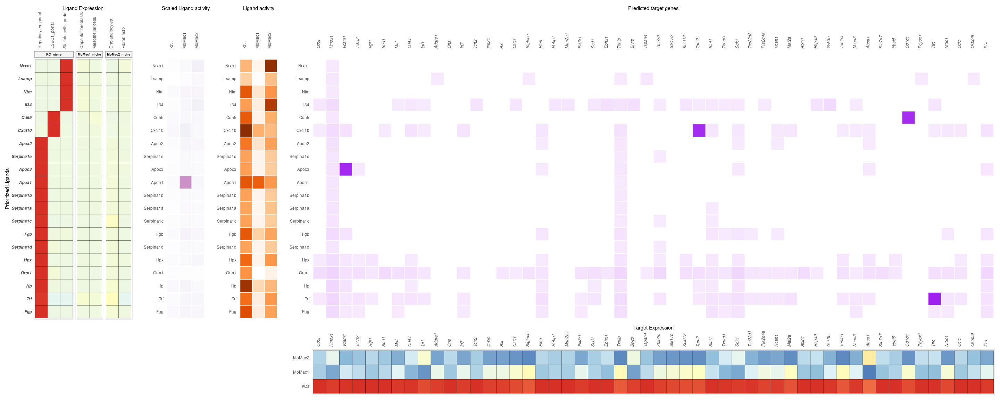

Differential NicheNet analysis between niches of interest
================
Robin Browaeys
20212-01-12

<!-- github markdown built using 
rmarkdown::render("vignettes/differential_nichenet.Rmd", output_format = "github_document")
-->

This vignette guides you in detail through all the steps of a
Differential NicheNet analysis. As example expression data of
interacting cells, we will here use subset of the liver scRNAseq data
generated in the paper from Guilliams et al: [Spatial proteogenomics
reveals distinct and evolutionarily conserved hepatic macrophage
niches](https://www.sciencedirect.com/science/article/pii/S0092867421014811).
We took a subset of the data (deposited on
<https://zenodo.org/deposit/5840787>) for demonstration purposes because
of the large size of the entire dataset. For exploration and downloading
of all the data from the paper, we refer to: [Liver Atlas Data
Portal](https://www.livercellatlas.org/). For the code used for all the
Differential NicheNet analyses on the entire liver cell atlas dataset,
see <https://github.com/saeyslab/NicheNet_LiverCellAtlas>.

The goal of Differential NicheNet is to predict ligand-receptors pairs
that are both differentially expressed and active between different
niches of interest.

In this vignette, we will look at cell-cell communication differences
between the Kupffer cell niche, the bile duct macrophage niche, and the
capsule macrophage niche, with the macrophages in each niche as receiver
cell of interest. This means that we are interested in identifying the
niche-specific ligands important for the identity of each of these
macrophage subtypes.

# 0. Read in the expression data of interest, and the NicheNet ligand-receptor network and ligand-target matrix

## Load in packages

``` r
library(nichenetr)
library(RColorBrewer)
library(tidyverse)
library(Seurat) 
```

## Read in the expression data

``` r
seurat_obj = readRDS(url("https://zenodo.org/record/5840787/files/seurat_obj_subset_integrated_zonation.rds"))
DimPlot(seurat_obj, group.by = "celltype", label = TRUE) 
```

<!-- -->

``` r
seurat_obj = SetIdent(seurat_obj, value = "celltype")
```

As you can see, the LSECs, hepatocytes and Stellate cells are each
divided in two groups, based on their spatial location (periportal and
pericentral).

## Read in the NicheNet ligand-receptor network and ligand-target matrix

The used ligand-receptor network and ligand-target matrix can be
downloaded from Zenodo
[](https://doi.org/10.5281/zenodo.7074291).

``` r
ligand_target_matrix = readRDS(url("https://zenodo.org/record/7074291/files/ligand_target_matrix_nsga2r_final_mouse.rds"))
ligand_target_matrix[1:5,1:5] # target genes in rows, ligands in columns
##               2300002M23Rik 2610528A11Rik 9530003J23Rik            a          A2m
## 0610005C13Rik  0.000000e+00  0.000000e+00  1.311297e-05 0.000000e+00 1.390053e-05
## 0610009B22Rik  0.000000e+00  0.000000e+00  1.269301e-05 0.000000e+00 1.345536e-05
## 0610009L18Rik  8.872902e-05  4.977197e-05  2.581909e-04 7.570125e-05 9.802264e-05
## 0610010F05Rik  2.194046e-03  1.111556e-03  3.142374e-03 1.631658e-03 2.585820e-03
## 0610010K14Rik  2.271606e-03  9.360769e-04  3.546140e-03 1.697713e-03 2.632082e-03
```

``` r
lr_network = readRDS(url("https://zenodo.org/record/7074291/files/lr_network_mouse_21122021.rds"))
lr_network = lr_network %>% dplyr::rename(ligand = from, receptor = to) %>% distinct(ligand, receptor)

head(lr_network)
## # A tibble: 6 × 2
##   ligand        receptor
##   <chr>         <chr>   
## 1 2300002M23Rik Ddr1    
## 2 2610528A11Rik Gpr15   
## 3 9530003J23Rik Itgal   
## 4 a             Atrn    
## 5 a             F11r    
## 6 a             Mc1r
```

# 1. Define the niches/microenvironments of interest

Each niche should have at least one “sender/niche” cell population and
one “receiver/target” cell population (present in your expression data)

In this case study, we are interested to find differences in cell-cell
interactions to hepatic macrophages in three different niches: 1) the
Kupffer cell niche, 2) the bile-duct or lipid-associated macrophage
niche, and 3) the capsule macrophage niche.

Based on imaging and spatial transcriptomics, the composition of each
niche was defined as follows:

The receiver cell population in the Kupffer cell niche is the “KCs” cell
type, the sender cell types are: “LSECs_portal”,“Hepatocytes_portal”,
and “Stellate cells_portal”. The receiver cell population in the
lipid-associated macrophage (MoMac2) niche is the “MoMac2” cell type,
the sender cell types are: “Cholangiocytes”, and “Fibroblast 2”. The
receiver cell population in the capsule macrophage (MoMac1) niche is the
“MoMac1” cell type, the sender cell types are: “Capsule fibroblasts”,
and “Mesothelial cells”.

! Important: your receiver cell type should consist of 1 cluster!

``` r
niches = list(
    "KC_niche" = list(
      "sender" = c("LSECs_portal","Hepatocytes_portal","Stellate cells_portal"),
      "receiver" = c("KCs")),
    "MoMac2_niche" = list(
      "sender" = c("Cholangiocytes","Fibroblast 2"),
      "receiver" = c("MoMac2")),
    "MoMac1_niche" = list(
      "sender" = c("Capsule fibroblasts","Mesothelial cells"),
      "receiver" = c("MoMac1"))
  )
```

# 2. Calculate differential expression between the niches

In this step, we will determine DE between the different niches for both
senders and receivers to define the DE of L-R pairs.

### Calculate DE

The method to calculate the differential expression is here the standard
Seurat Wilcoxon test, but this can be replaced if wanted by the user
(only requirement: output tables `DE_sender_processed` and
`DE_receiver_processed` should be in the same format as shown here).

DE will be calculated for each pairwise sender (or receiver) cell type
comparision between the niches (so across niches, not within niche). In
our case study, this means e.g. that DE of LSECs_portal ligands will be
calculated by DE analysis of LSECs_portal vs Cholangiocytes;
LSECs_portal vs Fibroblast 2; LSECs_portal vs Capsule fibroblasts; and
LSECs_portal vs Mesothelial cells. We split the cells per cell type
instead of merging all cells from the other niche to avoid that the DE
analysis will be driven by the most abundant cell types.

``` r
assay_oi = "SCT" # other possibilities: RNA,...

# If you use convert_to_alias before here, this one won't work
seurat_obj = Seurat::PrepSCTFindMarkers(seurat_obj, assay = "SCT", verbose = FALSE)

seurat_obj = alias_to_symbol_seurat(seurat_obj, organism = "mouse")
DE_sender = calculate_niche_de(seurat_obj = seurat_obj %>% subset(features = lr_network$ligand %>% intersect(rownames(seurat_obj))), niches = niches, type = "sender", assay_oi = assay_oi) # only ligands important for sender cell types
## [1] "Calculate Sender DE between: LSECs_portal and Cholangiocytes"     
## [2] "Calculate Sender DE between: LSECs_portal and Fibroblast 2"       
## [3] "Calculate Sender DE between: LSECs_portal and Capsule fibroblasts"
## [4] "Calculate Sender DE between: LSECs_portal and Mesothelial cells"  
## [1] "Calculate Sender DE between: Hepatocytes_portal and Cholangiocytes"     
## [2] "Calculate Sender DE between: Hepatocytes_portal and Fibroblast 2"       
## [3] "Calculate Sender DE between: Hepatocytes_portal and Capsule fibroblasts"
## [4] "Calculate Sender DE between: Hepatocytes_portal and Mesothelial cells"  
## [1] "Calculate Sender DE between: Stellate cells_portal and Cholangiocytes"     
## [2] "Calculate Sender DE between: Stellate cells_portal and Fibroblast 2"       
## [3] "Calculate Sender DE between: Stellate cells_portal and Capsule fibroblasts"
## [4] "Calculate Sender DE between: Stellate cells_portal and Mesothelial cells"  
## [1] "Calculate Sender DE between: Cholangiocytes and LSECs_portal"         
## [2] "Calculate Sender DE between: Cholangiocytes and Hepatocytes_portal"   
## [3] "Calculate Sender DE between: Cholangiocytes and Stellate cells_portal"
## [4] "Calculate Sender DE between: Cholangiocytes and Capsule fibroblasts"  
## [5] "Calculate Sender DE between: Cholangiocytes and Mesothelial cells"    
## [1] "Calculate Sender DE between: Fibroblast 2 and LSECs_portal"         
## [2] "Calculate Sender DE between: Fibroblast 2 and Hepatocytes_portal"   
## [3] "Calculate Sender DE between: Fibroblast 2 and Stellate cells_portal"
## [4] "Calculate Sender DE between: Fibroblast 2 and Capsule fibroblasts"  
## [5] "Calculate Sender DE between: Fibroblast 2 and Mesothelial cells"    
## [1] "Calculate Sender DE between: Capsule fibroblasts and LSECs_portal"         
## [2] "Calculate Sender DE between: Capsule fibroblasts and Hepatocytes_portal"   
## [3] "Calculate Sender DE between: Capsule fibroblasts and Stellate cells_portal"
## [4] "Calculate Sender DE between: Capsule fibroblasts and Cholangiocytes"       
## [5] "Calculate Sender DE between: Capsule fibroblasts and Fibroblast 2"         
## [1] "Calculate Sender DE between: Mesothelial cells and LSECs_portal"         
## [2] "Calculate Sender DE between: Mesothelial cells and Hepatocytes_portal"   
## [3] "Calculate Sender DE between: Mesothelial cells and Stellate cells_portal"
## [4] "Calculate Sender DE between: Mesothelial cells and Cholangiocytes"       
## [5] "Calculate Sender DE between: Mesothelial cells and Fibroblast 2"
DE_receiver = calculate_niche_de(seurat_obj = seurat_obj %>% subset(features = lr_network$receptor %>% unique()), niches = niches, type = "receiver", assay_oi = assay_oi) # only receptors now, later on: DE analysis to find targets
## # A tibble: 3 × 2
##   receiver receiver_other_niche
##   <chr>    <chr>               
## 1 KCs      MoMac2              
## 2 KCs      MoMac1              
## 3 MoMac2   MoMac1              
## [1] "Calculate receiver DE between: KCs and MoMac2" "Calculate receiver DE between: KCs and MoMac1"
## [1] "Calculate receiver DE between: MoMac2 and KCs"    "Calculate receiver DE between: MoMac2 and MoMac1"
## [1] "Calculate receiver DE between: MoMac1 and KCs"    "Calculate receiver DE between: MoMac1 and MoMac2"

DE_sender = DE_sender %>% mutate(avg_log2FC = ifelse(avg_log2FC == Inf, max(avg_log2FC[is.finite(avg_log2FC)]), ifelse(avg_log2FC == -Inf, min(avg_log2FC[is.finite(avg_log2FC)]), avg_log2FC)))
DE_receiver = DE_receiver %>% mutate(avg_log2FC = ifelse(avg_log2FC == Inf, max(avg_log2FC[is.finite(avg_log2FC)]), ifelse(avg_log2FC == -Inf, min(avg_log2FC[is.finite(avg_log2FC)]), avg_log2FC)))
```

### Process DE results:

``` r
expression_pct = 0.10
DE_sender_processed = process_niche_de(DE_table = DE_sender, niches = niches, expression_pct = expression_pct, type = "sender")
DE_receiver_processed = process_niche_de(DE_table = DE_receiver, niches = niches, expression_pct = expression_pct, type = "receiver")
```

### Combine sender-receiver DE based on L-R pairs:

As mentioned above, DE of ligands from one sender cell type is
determined be calculating DE between that cell type, and all the sender
cell types of the other niche. To summarize the DE of ligands of that
cell type we have several options: we could take the average LFC, but
also the minimum LFC compared to the other niche. We recommend using the
minimum LFC, because this is the strongest specificity measure of ligand
expression, because a high min LFC means that a ligand is more strongly
expressed in the cell type of niche 1 compared to all cell types of
niche 2 (in contrast to a high average LFC, which does not exclude that
one or more cell types in niche 2 also strongly express that ligand).

``` r
specificity_score_LR_pairs = "min_lfc"
DE_sender_receiver = combine_sender_receiver_de(DE_sender_processed, DE_receiver_processed, lr_network, specificity_score = specificity_score_LR_pairs)
```

# 3. Optional: Calculate differential expression between the different spatial regions

To improve the cell-cell interaction predictions, you can consider
spatial information if possible and applicable. Spatial information can
come from microscopy data, or from spatial transcriptomics data such as
Visium.

There are several ways to incorporate spatial information in the
Differential NicheNet pipeline. First, you can only consider cell types
as belonging to the same niche if they are in the same spatial location.
Another way is including spatial differential expression of
ligand-receptor pairs within one cell type in the prioritization
framework.

For example: We have a cell type X, located in regions A and B, and we
want to study cell-cell communication in region A. We first add only
celltypeX of regionA in the niche definition, and then calculate DE
between celltypeX-regionA and celltypeX-regionB to give higher
prioritization weight to regionA-specific ligands.

In this case study, our region of interest is the periportal region of
the liver, because KCs in mouse are predominantly located in the
periportal region. Therefore we will give higher weight to ligands that
are in the niche cells of KCs higher expressed in the periportal
compared to the pericentral region.

We do this as follows, by first defining a ‘spatial info’ dataframe. If
there is no spatial information in your data: set the following two
parameters to FALSE, and make a mock ‘spatial_info’ data frame.

``` r
include_spatial_info_sender = TRUE # if not spatial info to include: put this to false 
include_spatial_info_receiver = FALSE # if spatial info to include: put this to true 
```

``` r
spatial_info = tibble(celltype_region_oi = c("LSECs_portal","Hepatocytes_portal","Stellate cells_portal"), 
                      celltype_other_region = c("LSECs_central","Hepatocytes_central","Stellate cells_central")
                      ) %>% 
  mutate(niche =  "KC_niche", celltype_type = "sender")
specificity_score_spatial = "lfc"
```

``` r
# this is how this should be defined if you don't have spatial info
# mock spatial info
if(include_spatial_info_sender == FALSE & include_spatial_info_receiver == FALSE){
    spatial_info = tibble(celltype_region_oi = NA, celltype_other_region = NA) %>% mutate(niche =  niches %>% names() %>% head(1), celltype_type = "sender")
} 
```

``` r
if(include_spatial_info_sender == TRUE){
  sender_spatial_DE = calculate_spatial_DE(seurat_obj = seurat_obj %>% subset(features = lr_network$ligand %>% unique()), spatial_info = spatial_info %>% filter(celltype_type == "sender"), assay_oi = assay_oi)
  sender_spatial_DE_processed = process_spatial_de(DE_table = sender_spatial_DE, type = "sender", lr_network = lr_network, expression_pct = expression_pct, specificity_score = specificity_score_spatial)

  # add a neutral spatial score for sender celltypes in which the spatial is not known / not of importance
  sender_spatial_DE_others = get_non_spatial_de(niches = niches, spatial_info = spatial_info, type = "sender", lr_network = lr_network)
  sender_spatial_DE_processed = sender_spatial_DE_processed %>% bind_rows(sender_spatial_DE_others)

  sender_spatial_DE_processed = sender_spatial_DE_processed %>% mutate(scaled_ligand_score_spatial = scale_quantile_adapted(ligand_score_spatial))

} else {
  # # add a neutral spatial score for all sender celltypes (for none of them, spatial is relevant in this case)
  sender_spatial_DE_processed = get_non_spatial_de(niches = niches, spatial_info = spatial_info, type = "sender", lr_network = lr_network)
  sender_spatial_DE_processed = sender_spatial_DE_processed %>% mutate(scaled_ligand_score_spatial = scale_quantile_adapted(ligand_score_spatial))  

}
## [1] "Calculate Spatial DE between: LSECs_portal and LSECs_central"
## [1] "Calculate Spatial DE between: Hepatocytes_portal and Hepatocytes_central"
## [1] "Calculate Spatial DE between: Stellate cells_portal and Stellate cells_central"
```

``` r
if(include_spatial_info_receiver == TRUE){
  receiver_spatial_DE = calculate_spatial_DE(seurat_obj = seurat_obj %>% subset(features = lr_network$receptor %>% unique()), spatial_info = spatial_info %>% filter(celltype_type == "receiver"), assay_oi = assay_oi)
  receiver_spatial_DE_processed = process_spatial_de(DE_table = receiver_spatial_DE, type = "receiver", lr_network = lr_network, expression_pct = expression_pct, specificity_score = specificity_score_spatial)

  # add a neutral spatial score for receiver celltypes in which the spatial is not known / not of importance
  receiver_spatial_DE_others = get_non_spatial_de(niches = niches, spatial_info = spatial_info, type = "receiver", lr_network = lr_network)
  receiver_spatial_DE_processed = receiver_spatial_DE_processed %>% bind_rows(receiver_spatial_DE_others)

  receiver_spatial_DE_processed = receiver_spatial_DE_processed %>% mutate(scaled_receptor_score_spatial = scale_quantile_adapted(receptor_score_spatial))

} else {
    # # add a neutral spatial score for all receiver celltypes (for none of them, spatial is relevant in this case)
  receiver_spatial_DE_processed = get_non_spatial_de(niches = niches, spatial_info = spatial_info, type = "receiver", lr_network = lr_network)
  receiver_spatial_DE_processed = receiver_spatial_DE_processed %>% mutate(scaled_receptor_score_spatial = scale_quantile_adapted(receptor_score_spatial))
}
```

# 4. Calculate ligand activities and infer active ligand-target links

In this step, we will predict ligand activities of each ligand for each
of the receiver cell types across the different niches. This is similar
to the ligand activity analysis done in the normal NicheNet pipeline.

To calculate ligand activities, we first need to define a geneset of
interest for each niche. In this case study, the geneset of interest for
the Kupffer cell niche are the genes upregulated in Kupffer cells
compared to the capsule and bile duct macrophages. The geneset of
interest for the bile duct macrophage niche are the genes upregulated in
bile duct macrophages compared to the capsule macrophages and Kupffer
cells. And similarly for the capsule macrophage geneset of interest.

Note that you can also define these geneset of interest in a different
way! (eg pathway-based geneset etc)

Ligand-target links are inferred in the same way as described in the
basic NicheNet vignettes.

``` r
lfc_cutoff = 0.15 # recommended for 10x as min_lfc cutoff. 
specificity_score_targets = "min_lfc"

DE_receiver_targets = calculate_niche_de_targets(seurat_obj = seurat_obj, niches = niches, lfc_cutoff = lfc_cutoff, expression_pct = expression_pct, assay_oi = assay_oi) 
## [1] "Calculate receiver DE between: KCs and MoMac2" "Calculate receiver DE between: KCs and MoMac1"
## [1] "Calculate receiver DE between: MoMac2 and KCs"    "Calculate receiver DE between: MoMac2 and MoMac1"
## [1] "Calculate receiver DE between: MoMac1 and KCs"    "Calculate receiver DE between: MoMac1 and MoMac2"
DE_receiver_processed_targets = process_receiver_target_de(DE_receiver_targets = DE_receiver_targets, niches = niches, expression_pct = expression_pct, specificity_score = specificity_score_targets)
  
background = DE_receiver_processed_targets  %>% pull(target) %>% unique()
geneset_KC = DE_receiver_processed_targets %>% filter(receiver == niches$KC_niche$receiver & target_score >= lfc_cutoff & target_significant == 1 & target_present == 1) %>% pull(target) %>% unique()
geneset_MoMac2 = DE_receiver_processed_targets %>% filter(receiver == niches$MoMac2_niche$receiver & target_score >= lfc_cutoff & target_significant == 1 & target_present == 1) %>% pull(target) %>% unique()
geneset_MoMac1 = DE_receiver_processed_targets %>% filter(receiver == niches$MoMac1_niche$receiver & target_score >= lfc_cutoff & target_significant == 1 & target_present == 1) %>% pull(target) %>% unique()
# Good idea to check which genes will be left out of the ligand activity analysis (=when not present in the rownames of the ligand-target matrix).
# If many genes are left out, this might point to some issue in the gene naming (eg gene aliases and old gene symbols, bad human-mouse mapping)
geneset_KC %>% setdiff(rownames(ligand_target_matrix))
## [1] "Wfdc17"        "AW112010"      "2900097C17Rik" "B430306N03Rik" "AC149090.1"
geneset_MoMac2 %>% setdiff(rownames(ligand_target_matrix))
## [1] "Gm21188" "Gm10076" "Rpl41"   "Atp5o.1" "H2afy"
geneset_MoMac1 %>% setdiff(rownames(ligand_target_matrix))
## [1] "Gm26522"

length(geneset_KC)
## [1] 443
length(geneset_MoMac2)
## [1] 339
length(geneset_MoMac1)
## [1] 84
```

It is always useful to check the number of genes in the geneset before
doing the ligand activity analysis. We recommend having between 20 and
1000 genes in the geneset of interest, and a background of at least 5000
genes for a proper ligand activity analysis. If you retrieve too many DE
genes, it is recommended to use a higher `lfc_cutoff` threshold. We
recommend using a cutoff of 0.15 if you have \> 2 receiver cells/niches
to compare and use the min_lfc as specificity score. If you have only 2
receivers/niche, we recommend using a higher threshold (such as using
0.25). If you have single-cell data like Smart-seq2 with high sequencing
depth, we recommend to also use higher threshold.

``` r
top_n_target = 250

niche_geneset_list = list(
    "KC_niche" = list(
      "receiver" = "KCs",
      "geneset" = geneset_KC,
      "background" = background),
    "MoMac1_niche" = list(
      "receiver" = "MoMac1",
      "geneset" = geneset_MoMac1 ,
      "background" = background),
    "MoMac2_niche" = list(
      "receiver" = "MoMac2",
      "geneset" = geneset_MoMac2 ,
      "background" = background)  
  )
  
ligand_activities_targets = get_ligand_activities_targets(niche_geneset_list = niche_geneset_list, ligand_target_matrix = ligand_target_matrix, top_n_target = top_n_target)
## [1] "Calculate Ligand activities for: KCs"
## [1] "Calculate Ligand activities for: MoMac1"
## [1] "Calculate Ligand activities for: MoMac2"
```

# 5. Calculate (scaled) expression of ligands, receptors and targets across cell types of interest (log expression values and expression fractions)

In this step, we will calculate average (scaled) expression, and
fraction of expression, of ligands, receptors, and target genes across
all cell types of interest. Now this is here demonstrated via the
DotPlot function of Seurat, but this can also be done via other ways of
course.

``` r
features_oi = union(lr_network$ligand, lr_network$receptor) %>% union(ligand_activities_targets$target) %>% setdiff(NA)
  
dotplot = suppressWarnings(Seurat::DotPlot(seurat_obj %>% subset(idents = niches %>% unlist() %>% unique()), features = features_oi, assay = assay_oi))
exprs_tbl = dotplot$data %>% as_tibble()
exprs_tbl = exprs_tbl %>% rename(celltype = id, gene = features.plot, expression = avg.exp, expression_scaled = avg.exp.scaled, fraction = pct.exp) %>%
    mutate(fraction = fraction/100) %>% as_tibble() %>% select(celltype, gene, expression, expression_scaled, fraction) %>% distinct() %>% arrange(gene) %>% mutate(gene = as.character(gene))
  
exprs_tbl_ligand = exprs_tbl %>% filter(gene %in% lr_network$ligand) %>% rename(sender = celltype, ligand = gene, ligand_expression = expression, ligand_expression_scaled = expression_scaled, ligand_fraction = fraction) 
exprs_tbl_receptor = exprs_tbl %>% filter(gene %in% lr_network$receptor) %>% rename(receiver = celltype, receptor = gene, receptor_expression = expression, receptor_expression_scaled = expression_scaled, receptor_fraction = fraction)
exprs_tbl_target = exprs_tbl %>% filter(gene %in% ligand_activities_targets$target) %>% rename(receiver = celltype, target = gene, target_expression = expression, target_expression_scaled = expression_scaled, target_fraction = fraction)
```

``` r
exprs_tbl_ligand = exprs_tbl_ligand %>%  mutate(scaled_ligand_expression_scaled = scale_quantile_adapted(ligand_expression_scaled)) %>% mutate(ligand_fraction_adapted = ligand_fraction) %>% mutate_cond(ligand_fraction >= expression_pct, ligand_fraction_adapted = expression_pct)  %>% mutate(scaled_ligand_fraction_adapted = scale_quantile_adapted(ligand_fraction_adapted))

exprs_tbl_receptor = exprs_tbl_receptor %>% mutate(scaled_receptor_expression_scaled = scale_quantile_adapted(receptor_expression_scaled))  %>% mutate(receptor_fraction_adapted = receptor_fraction) %>% mutate_cond(receptor_fraction >= expression_pct, receptor_fraction_adapted = expression_pct)  %>% mutate(scaled_receptor_fraction_adapted = scale_quantile_adapted(receptor_fraction_adapted))
```

# 6. Expression fraction and receptor

In this step, we will score ligand-receptor interactions based on
expression strength of the receptor, in such a way that we give higher
scores to the most strongly expressed receptor of a certain ligand, in a
certain celltype. This will not effect the rank of individual ligands
later on, but will help in prioritizing the most important receptors per
ligand (next to other factors regarding the receptor - see later).

``` r
exprs_sender_receiver = lr_network %>% 
  inner_join(exprs_tbl_ligand, by = c("ligand")) %>% 
  inner_join(exprs_tbl_receptor, by = c("receptor")) %>% inner_join(DE_sender_receiver %>% distinct(niche, sender, receiver))
  
ligand_scaled_receptor_expression_fraction_df = exprs_sender_receiver %>% group_by(ligand, receiver) %>% mutate(rank_receptor_expression = dense_rank(receptor_expression), rank_receptor_fraction  = dense_rank(receptor_fraction)) %>% mutate(ligand_scaled_receptor_expression_fraction = 0.5*( (rank_receptor_fraction / max(rank_receptor_fraction)) + ((rank_receptor_expression / max(rank_receptor_expression))) ) )  %>% distinct(ligand, receptor, receiver, ligand_scaled_receptor_expression_fraction) %>% distinct() %>% ungroup() 
```

# 7. Prioritization of ligand-receptor and ligand-target links

In this step, we will combine all the above calculated information to
prioritize ligand-receptor-target links. We scale every property of
interest between 0 and 1, and the final prioritization score is a
weighted sum of the scaled scores of all the properties of interest.

We provide the user the option to consider the following properties for
prioritization (of which the weights are defined in
`prioritizing_weights`) :

- Ligand DE score: niche-specific expression of the ligand: by default,
  this the minimum logFC between the sender of interest and all the
  senders of the other niche(s). The higher the min logFC, the higher
  the niche-specificity of the ligand. Therefore we recommend to give
  this factor a very high weight. `prioritizing_weights` argument:
  `"scaled_ligand_score"`. Recommended weight: 5 (at least 1, max 5).

- Scaled ligand expression: scaled expression of a ligand in one sender
  compared to the other cell types in the dataset. This might be useful
  to rescue potentially interesting ligands that have a high scaled
  expression value, but a relatively small min logFC compared to the
  other niche. One reason why this logFC might be small occurs when
  (some) genes are not picked up efficiently by the used sequencing
  technology (or other reasons for low RNA expression of ligands). For
  example, we have observed that many ligands from the Tgf-beta/BMP
  family are not picked up efficiently with single-nuclei RNA sequencing
  compared to single-cell sequencing. `prioritizing_weights` argument:
  `"scaled_ligand_expression_scaled"`. Recommended weight: 1 (unless
  technical reason for lower gene detection such as while using Nuc-seq:
  then recommended to use a higher weight: 2).

- Ligand expression fraction: Ligands that are expressed in a smaller
  fraction of cells of a cell type than defined by
  `exprs_cutoff`(default: 0.10) will get a lower ranking, proportional
  to their fraction (eg ligand expressed in 9% of cells will be ranked
  higher than ligand expressed in 0.5% of cells). We opted for this
  weighting based on fraction, instead of removing ligands that are not
  expressed in more cells than this cutoff, because some interesting
  ligands could be removed that way. Fraction of expression is not taken
  into account for the prioritization if it is already higher than the
  cutoff. `prioritizing_weights` argument: `"ligand_fraction"`.
  Recommended weight: 1.

- Ligand spatial DE score: spatial expression specificity of the ligand.
  If the niche of interest is at a specific tissue location, but some of
  the sender cell types of that niche are also present in other
  locations, it can be very informative to further prioritize ligands of
  that sender by looking how they are DE between the spatial location of
  interest compared to the other locations. `prioritizing_weights`
  argument: `"scaled_ligand_score_spatial"`. Recommended weight: 2 (or 0
  if not applicable).

- Receptor DE score: niche-specific expression of the receptor: by
  default, this the minimum logFC between the receiver of interest and
  all the receiver of the other niche(s). The higher the min logFC, the
  higher the niche-specificity of the receptor. Based on our experience,
  we don’t suggest to give this as high importance as the ligand DE, but
  this might depend on the specific case study. `prioritizing_weights`
  argument: `"scaled_receptor_score"`. Recommended weight: 0.5 (at least
  0.5, and lower than `"scaled_ligand_score"`).

- Scaled receptor expression: scaled expression of a receptor in one
  receiver compared to the other cell types in the dataset. This might
  be useful to rescue potentially interesting receptors that have a high
  scaled expression value, but a relatively small min logFC compared to
  the other niche. One reason why this logFC might be small occurs when
  (some) genes are not picked up efficiently by the used sequencing
  technology. `prioritizing_weights` argument:
  `"scaled_receptor_expression_scaled"`. Recommended weight: 0.5.

- Receptor expression fraction: Receptors that are expressed in a
  smaller fraction of cells of a cell type than defined by
  `exprs_cutoff`(default: 0.10) will get a lower ranking, proportional
  to their fraction (eg receptor expressed in 9% of cells will be ranked
  higher than receptor expressed in 0.5% of cells). We opted for this
  weighting based on fraction, instead of removing receptors that are
  not expressed in more cells than this cutoff, because some interesting
  receptors could be removed that way. Fraction of expression is not
  taken into account for the prioritization if it is already higher than
  the cutoff. `prioritizing_weights` argument: `"receptor_fraction"`.
  Recommended weight: 1.

- Receptor expression strength: this factor let us give higher weights
  to the most highly expressed receptor of a ligand in the receiver.
  This let us rank higher one member of a receptor family if it higher
  expressed than the other members. `prioritizing_weights` argument:
  `"ligand_scaled_receptor_expression_fraction"`. Recommended value: 1
  (minimum: 0.5).

- Receptor spatial DE score: spatial expression specificity of the
  receptor. If the niche of interest is at a specific tissue location,
  but the receiver cell type of that niche is also present in other
  locations, it can be very informative to further prioritize receptors
  of that receiver by looking how they are DE between the spatial
  location of interest compared to the other locations.
  `prioritizing_weights` argument: `"scaled_receptor_score_spatial"`.
  Recommended weight: 1 (or 0 if not applicable).

- Absolute ligand activity: to further prioritize ligand-receptor pairs
  based on their predicted effect of the ligand-receptor interaction on
  the gene expression in the receiver cell type - absolute ligand
  activity accords to ‘absolute’ enrichment of target genes of a ligand
  within the affected receiver genes. `prioritizing_weights` argument:
  `"scaled_activity"`. Recommended weight: 0, unless absolute enrichment
  of target genes is of specific interest.

- Normalized ligand activity: to further prioritize ligand-receptor
  pairs based on their predicted effect of the ligand-receptor
  interaction on the gene expression in the receiver cell type -
  normalization of activity is done because we found that some
  datasets/conditions/niches have higher baseline activity values than
  others - normalized ligand activity accords to ‘relative’ enrichment
  of target genes of a ligand within the affected receiver genes.
  `prioritizing_weights` argument: `"scaled_activity_normalized"`.
  Recommended weight: at least 1.

``` r
prioritizing_weights = c("scaled_ligand_score" = 5,
                         "scaled_ligand_expression_scaled" = 1,
                         "ligand_fraction" = 1,
                         "scaled_ligand_score_spatial" = 2, 
                         "scaled_receptor_score" = 0.5,
                         "scaled_receptor_expression_scaled" = 0.5,
                          "receptor_fraction" = 1, 
                         "ligand_scaled_receptor_expression_fraction" = 1,
                         "scaled_receptor_score_spatial" = 0,
                         "scaled_activity" = 0,
                         "scaled_activity_normalized" = 1)
```

``` r
output = list(DE_sender_receiver = DE_sender_receiver, ligand_scaled_receptor_expression_fraction_df = ligand_scaled_receptor_expression_fraction_df, sender_spatial_DE_processed = sender_spatial_DE_processed, receiver_spatial_DE_processed = receiver_spatial_DE_processed,
         ligand_activities_targets = ligand_activities_targets, DE_receiver_processed_targets = DE_receiver_processed_targets, exprs_tbl_ligand = exprs_tbl_ligand,  exprs_tbl_receptor = exprs_tbl_receptor, exprs_tbl_target = exprs_tbl_target)
prioritization_tables = get_prioritization_tables(output, prioritizing_weights)

prioritization_tables$prioritization_tbl_ligand_receptor %>% filter(receiver == niches[[1]]$receiver) %>% head(10)
## # A tibble: 10 × 36
##    niche    receiver sender             ligand_receptor ligand receptor ligand_score ligand_signific… ligand_present
##    <chr>    <chr>    <chr>              <chr>           <chr>  <chr>           <dbl>            <dbl>          <dbl>
##  1 KC_niche KCs      Hepatocytes_portal Apoc3--Lrp1     Apoc3  Lrp1             3.33                1              1
##  2 KC_niche KCs      Hepatocytes_portal Apoa2--Lrp1     Apoa2  Lrp1             4.07                1              1
##  3 KC_niche KCs      Hepatocytes_portal Apoa1--Lrp1     Apoa1  Lrp1             3.18                1              1
##  4 KC_niche KCs      Hepatocytes_portal Serpina1e--Lrp1 Serpi… Lrp1             3.63                1              1
##  5 KC_niche KCs      Hepatocytes_portal Apoc3--Tlr2     Apoc3  Tlr2             3.33                1              1
##  6 KC_niche KCs      Hepatocytes_portal Apoa1--Abca1    Apoa1  Abca1            3.18                1              1
##  7 KC_niche KCs      Hepatocytes_portal Hpx--Lrp1       Hpx    Lrp1             1.87                1              1
##  8 KC_niche KCs      Hepatocytes_portal Serpina1b--Lrp1 Serpi… Lrp1             2.70                1              1
##  9 KC_niche KCs      Hepatocytes_portal Fgb--Cdh5       Fgb    Cdh5             1.98                1              1
## 10 KC_niche KCs      Stellate cells_po… Ntm--Cd79b      Ntm    Cd79b            2.65                1              1
## # … with 27 more variables: ligand_expression <dbl>, ligand_expression_scaled <dbl>, ligand_fraction <dbl>,
## #   ligand_score_spatial <dbl>, receptor_score <dbl>, receptor_significant <dbl>, receptor_present <dbl>,
## #   receptor_expression <dbl>, receptor_expression_scaled <dbl>, receptor_fraction <dbl>,
## #   receptor_score_spatial <dbl>, ligand_scaled_receptor_expression_fraction <dbl>,
## #   avg_score_ligand_receptor <dbl>, activity <dbl>, activity_normalized <dbl>, scaled_ligand_score <dbl>,
## #   scaled_ligand_expression_scaled <dbl>, scaled_receptor_score <dbl>, scaled_receptor_expression_scaled <dbl>,
## #   scaled_avg_score_ligand_receptor <dbl>, scaled_ligand_score_spatial <dbl>, …
prioritization_tables$prioritization_tbl_ligand_target %>% filter(receiver == niches[[1]]$receiver) %>% head(10)
## # A tibble: 10 × 19
##    niche    receiver sender      ligand_receptor ligand receptor target target_score target_signific… target_present
##    <chr>    <chr>    <chr>       <chr>           <chr>  <chr>    <chr>         <dbl>            <dbl>          <dbl>
##  1 KC_niche KCs      Hepatocyte… Apoc3--Lrp1     Apoc3  Lrp1     Abca1         0.197                1              1
##  2 KC_niche KCs      Hepatocyte… Apoc3--Lrp1     Apoc3  Lrp1     Hmox1         1.16                 1              1
##  3 KC_niche KCs      Hepatocyte… Apoc3--Lrp1     Apoc3  Lrp1     Il1a          0.152                1              1
##  4 KC_niche KCs      Hepatocyte… Apoc3--Lrp1     Apoc3  Lrp1     Pten          0.378                1              1
##  5 KC_niche KCs      Hepatocyte… Apoc3--Lrp1     Apoc3  Lrp1     Sgk1          0.265                1              1
##  6 KC_niche KCs      Hepatocyte… Apoc3--Lrp1     Apoc3  Lrp1     Stat1         0.273                1              1
##  7 KC_niche KCs      Hepatocyte… Apoc3--Lrp1     Apoc3  Lrp1     Tcf7l2        0.811                1              1
##  8 KC_niche KCs      Hepatocyte… Apoc3--Lrp1     Apoc3  Lrp1     Txnip         0.342                1              1
##  9 KC_niche KCs      Hepatocyte… Apoc3--Lrp1     Apoc3  Lrp1     Vcam1         0.820                1              1
## 10 KC_niche KCs      Hepatocyte… Apoa2--Lrp1     Apoa2  Lrp1     Abca1         0.197                1              1
## # … with 9 more variables: target_expression <dbl>, target_expression_scaled <dbl>, target_fraction <dbl>,
## #   ligand_target_weight <dbl>, activity <dbl>, activity_normalized <dbl>, scaled_activity <dbl>,
## #   scaled_activity_normalized <dbl>, prioritization_score <dbl>

prioritization_tables$prioritization_tbl_ligand_receptor %>% filter(receiver == niches[[2]]$receiver) %>% head(10)
## # A tibble: 10 × 36
##    niche        receiver sender         ligand_receptor ligand receptor ligand_score ligand_signific… ligand_present
##    <chr>        <chr>    <chr>          <chr>           <chr>  <chr>           <dbl>            <dbl>          <dbl>
##  1 MoMac2_niche MoMac2   Cholangiocytes Spp1--Cd44      Spp1   Cd44             6.09                1              1
##  2 MoMac2_niche MoMac2   Cholangiocytes Spp1--Itga4     Spp1   Itga4            6.09                1              1
##  3 MoMac2_niche MoMac2   Cholangiocytes Spp1--Itgb5     Spp1   Itgb5            6.09                1              1
##  4 MoMac2_niche MoMac2   Cholangiocytes Spp1--Itgav     Spp1   Itgav            6.09                1              1
##  5 MoMac2_niche MoMac2   Cholangiocytes Spp1--Itgb1     Spp1   Itgb1            6.09                1              1
##  6 MoMac2_niche MoMac2   Cholangiocytes Clu--Trem2      Clu    Trem2            3.79                1              1
##  7 MoMac2_niche MoMac2   Cholangiocytes Spp1--Itga9     Spp1   Itga9            6.09                1              1
##  8 MoMac2_niche MoMac2   Cholangiocytes Spp1--Itga5     Spp1   Itga5            6.09                1              1
##  9 MoMac2_niche MoMac2   Cholangiocytes Spp1--S1pr1     Spp1   S1pr1            6.09                1              1
## 10 MoMac2_niche MoMac2   Fibroblast 2   Lama2--Rpsa     Lama2  Rpsa             1.51                1              1
## # … with 27 more variables: ligand_expression <dbl>, ligand_expression_scaled <dbl>, ligand_fraction <dbl>,
## #   ligand_score_spatial <dbl>, receptor_score <dbl>, receptor_significant <dbl>, receptor_present <dbl>,
## #   receptor_expression <dbl>, receptor_expression_scaled <dbl>, receptor_fraction <dbl>,
## #   receptor_score_spatial <dbl>, ligand_scaled_receptor_expression_fraction <dbl>,
## #   avg_score_ligand_receptor <dbl>, activity <dbl>, activity_normalized <dbl>, scaled_ligand_score <dbl>,
## #   scaled_ligand_expression_scaled <dbl>, scaled_receptor_score <dbl>, scaled_receptor_expression_scaled <dbl>,
## #   scaled_avg_score_ligand_receptor <dbl>, scaled_ligand_score_spatial <dbl>, …
prioritization_tables$prioritization_tbl_ligand_target %>% filter(receiver == niches[[2]]$receiver) %>% head(10)
## # A tibble: 10 × 19
##    niche        receiver sender  ligand_receptor ligand receptor target target_score target_signific… target_present
##    <chr>        <chr>    <chr>   <chr>           <chr>  <chr>    <chr>         <dbl>            <dbl>          <dbl>
##  1 MoMac2_niche MoMac2   Cholan… Spp1--Cd44      Spp1   Cd44     Alox5…        0.382                1              1
##  2 MoMac2_niche MoMac2   Cholan… Spp1--Cd44      Spp1   Cd44     Bax           0.334                1              1
##  3 MoMac2_niche MoMac2   Cholan… Spp1--Cd44      Spp1   Cd44     Bcl2l…        0.280                1              1
##  4 MoMac2_niche MoMac2   Cholan… Spp1--Cd44      Spp1   Cd44     Cdkn1a        0.609                1              1
##  5 MoMac2_niche MoMac2   Cholan… Spp1--Cd44      Spp1   Cd44     Cxcr4         0.374                1              1
##  6 MoMac2_niche MoMac2   Cholan… Spp1--Cd44      Spp1   Cd44     Dhrs3         0.371                1              1
##  7 MoMac2_niche MoMac2   Cholan… Spp1--Cd44      Spp1   Cd44     Emp1          0.398                1              1
##  8 MoMac2_niche MoMac2   Cholan… Spp1--Cd44      Spp1   Cd44     Fn1           0.360                1              1
##  9 MoMac2_niche MoMac2   Cholan… Spp1--Cd44      Spp1   Cd44     Gadd4…        0.180                1              1
## 10 MoMac2_niche MoMac2   Cholan… Spp1--Cd44      Spp1   Cd44     Gdf15         0.479                1              1
## # … with 9 more variables: target_expression <dbl>, target_expression_scaled <dbl>, target_fraction <dbl>,
## #   ligand_target_weight <dbl>, activity <dbl>, activity_normalized <dbl>, scaled_activity <dbl>,
## #   scaled_activity_normalized <dbl>, prioritization_score <dbl>

prioritization_tables$prioritization_tbl_ligand_receptor %>% filter(receiver == niches[[3]]$receiver) %>% head(10)
## # A tibble: 10 × 36
##    niche        receiver sender         ligand_receptor ligand receptor ligand_score ligand_signific… ligand_present
##    <chr>        <chr>    <chr>          <chr>           <chr>  <chr>           <dbl>            <dbl>          <dbl>
##  1 MoMac1_niche MoMac1   Mesothelial c… C3--C3ar1       C3     C3ar1            3.52                1              1
##  2 MoMac1_niche MoMac1   Capsule fibro… C3--C3ar1       C3     C3ar1            3.42                1              1
##  3 MoMac1_niche MoMac1   Capsule fibro… Lgals1--Ptprc   Lgals1 Ptprc            2.80                1              1
##  4 MoMac1_niche MoMac1   Capsule fibro… Slpi--Cd4       Slpi   Cd4              4.37                1              1
##  5 MoMac1_niche MoMac1   Mesothelial c… C3--Itgb2       C3     Itgb2            3.52                1              1
##  6 MoMac1_niche MoMac1   Mesothelial c… Slpi--Cd4       Slpi   Cd4              4.26                1              1
##  7 MoMac1_niche MoMac1   Mesothelial c… C3--Lrp1        C3     Lrp1             3.52                1              1
##  8 MoMac1_niche MoMac1   Mesothelial c… C3--Itgax       C3     Itgax            3.52                1              1
##  9 MoMac1_niche MoMac1   Capsule fibro… C3--Itgb2       C3     Itgb2            3.42                1              1
## 10 MoMac1_niche MoMac1   Capsule fibro… C3--Lrp1        C3     Lrp1             3.42                1              1
## # … with 27 more variables: ligand_expression <dbl>, ligand_expression_scaled <dbl>, ligand_fraction <dbl>,
## #   ligand_score_spatial <dbl>, receptor_score <dbl>, receptor_significant <dbl>, receptor_present <dbl>,
## #   receptor_expression <dbl>, receptor_expression_scaled <dbl>, receptor_fraction <dbl>,
## #   receptor_score_spatial <dbl>, ligand_scaled_receptor_expression_fraction <dbl>,
## #   avg_score_ligand_receptor <dbl>, activity <dbl>, activity_normalized <dbl>, scaled_ligand_score <dbl>,
## #   scaled_ligand_expression_scaled <dbl>, scaled_receptor_score <dbl>, scaled_receptor_expression_scaled <dbl>,
## #   scaled_avg_score_ligand_receptor <dbl>, scaled_ligand_score_spatial <dbl>, …
prioritization_tables$prioritization_tbl_ligand_target %>% filter(receiver == niches[[3]]$receiver) %>% head(10)
## # A tibble: 10 × 19
##    niche        receiver sender  ligand_receptor ligand receptor target target_score target_signific… target_present
##    <chr>        <chr>    <chr>   <chr>           <chr>  <chr>    <chr>         <dbl>            <dbl>          <dbl>
##  1 MoMac1_niche MoMac1   Mesoth… C3--C3ar1       C3     C3ar1    Btg2          0.615                1              1
##  2 MoMac1_niche MoMac1   Mesoth… C3--C3ar1       C3     C3ar1    Ccnd2         0.505                1              1
##  3 MoMac1_niche MoMac1   Mesoth… C3--C3ar1       C3     C3ar1    Cdk6          0.221                1              1
##  4 MoMac1_niche MoMac1   Mesoth… C3--C3ar1       C3     C3ar1    H2-D1         0.318                1              1
##  5 MoMac1_niche MoMac1   Mesoth… C3--C3ar1       C3     C3ar1    Il1b          0.956                1              1
##  6 MoMac1_niche MoMac1   Mesoth… C3--C3ar1       C3     C3ar1    Jun           0.765                1              1
##  7 MoMac1_niche MoMac1   Capsul… C3--C3ar1       C3     C3ar1    Btg2          0.615                1              1
##  8 MoMac1_niche MoMac1   Capsul… C3--C3ar1       C3     C3ar1    Ccnd2         0.505                1              1
##  9 MoMac1_niche MoMac1   Capsul… C3--C3ar1       C3     C3ar1    Cdk6          0.221                1              1
## 10 MoMac1_niche MoMac1   Capsul… C3--C3ar1       C3     C3ar1    H2-D1         0.318                1              1
## # … with 9 more variables: target_expression <dbl>, target_expression_scaled <dbl>, target_fraction <dbl>,
## #   ligand_target_weight <dbl>, activity <dbl>, activity_normalized <dbl>, scaled_activity <dbl>,
## #   scaled_activity_normalized <dbl>, prioritization_score <dbl>

prioritization_tables$prioritization_tbl_ligand_receptor = prioritization_tables$prioritization_tbl_ligand_receptor %>% mutate(receiver = factor(receiver, levels = c("KCs","MoMac1","MoMac2")), niche = factor(niche, levels = c("KC_niche","MoMac1_niche","MoMac2_niche"))) 
prioritization_tables$prioritization_tbl_ligand_target = prioritization_tables$prioritization_tbl_ligand_target %>% mutate(receiver = factor(receiver, levels = c("KCs","MoMac1","MoMac2")), niche = factor(niche, levels = c("KC_niche","MoMac1_niche","MoMac2_niche"))) 
```

# 8. Visualization of the Differential NicheNet output

## Differential expression of ligand and expression

Before visualization, we need to define the most important
ligand-receptor pairs per niche. We will do this by first determining
for which niche the highest score is found for each
ligand/ligand-receptor pair. And then getting the top 50 ligands per
niche.

``` r
top_ligand_niche_df = prioritization_tables$prioritization_tbl_ligand_receptor %>% select(niche, sender, receiver, ligand, receptor, prioritization_score) %>% group_by(ligand) %>% top_n(1, prioritization_score) %>% ungroup() %>% select(ligand, receptor, niche) %>% rename(top_niche = niche)
top_ligand_receptor_niche_df = prioritization_tables$prioritization_tbl_ligand_receptor %>% select(niche, sender, receiver, ligand, receptor, prioritization_score) %>% group_by(ligand, receptor) %>% top_n(1, prioritization_score) %>% ungroup() %>% select(ligand, receptor, niche) %>% rename(top_niche = niche)

ligand_prioritized_tbl_oi = prioritization_tables$prioritization_tbl_ligand_receptor %>% select(niche, sender, receiver, ligand, prioritization_score) %>% group_by(ligand, niche) %>% top_n(1, prioritization_score) %>% ungroup() %>% distinct() %>% inner_join(top_ligand_niche_df) %>% filter(niche == top_niche) %>% group_by(niche) %>% top_n(50, prioritization_score) %>% ungroup() # get the top50 ligands per niche
```

Now we will look first at the top ligand-receptor pairs for KCs (here,
we will take the top 2 scoring receptors per prioritized ligand)

``` r
receiver_oi = "KCs" 

filtered_ligands = ligand_prioritized_tbl_oi %>% filter(receiver == receiver_oi) %>% pull(ligand) %>% unique()

prioritized_tbl_oi = prioritization_tables$prioritization_tbl_ligand_receptor %>% filter(ligand %in% filtered_ligands) %>% select(niche, sender, receiver, ligand,  receptor, ligand_receptor, prioritization_score) %>% distinct() %>% inner_join(top_ligand_receptor_niche_df) %>% group_by(ligand) %>% filter(receiver == receiver_oi) %>% top_n(2, prioritization_score) %>% ungroup() 
```

Visualization: minimum LFC compared to other niches

``` r
lfc_plot = make_ligand_receptor_lfc_plot(receiver_oi, prioritized_tbl_oi, prioritization_tables$prioritization_tbl_ligand_receptor, plot_legend = FALSE, heights = NULL, widths = NULL)
lfc_plot
```

<!-- -->

Show the spatialDE as additional information

``` r
lfc_plot_spatial = make_ligand_receptor_lfc_spatial_plot(receiver_oi, prioritized_tbl_oi, prioritization_tables$prioritization_tbl_ligand_receptor, ligand_spatial = include_spatial_info_sender, receptor_spatial = include_spatial_info_receiver, plot_legend = FALSE, heights = NULL, widths = NULL)
lfc_plot_spatial
```

<!-- -->

From this plot, you can see that some KC-niche ligands like Dll4 (by
LSEC) and Il34 (by Stellate cells) are higher expressed in the
periportal LSEC/stellate cells vs the pericentral ones. This can be
interesting information knowing that KCs are mainly located
periportally. However, other ligands like Gdf2 (by Stellate cells) are
not preferentially expressed by periportal stellate cells, but this does
not mean they cannot be interesting. As you can see in the following
figure, this ligand has one of the highest ligand activities, meaning
that there is a strong enrichment of its target genes among the
KC-specific genes.

## Ligand expression, activity and target genes

Active target gene inference - cf Default NicheNet

Now: visualization of ligand activity and ligand-target links

``` r
exprs_activity_target_plot = make_ligand_activity_target_exprs_plot(receiver_oi, prioritized_tbl_oi,  prioritization_tables$prioritization_tbl_ligand_receptor,  prioritization_tables$prioritization_tbl_ligand_target, output$exprs_tbl_ligand,  output$exprs_tbl_target, lfc_cutoff, ligand_target_matrix, plot_legend = FALSE, heights = NULL, widths = NULL)
exprs_activity_target_plot$combined_plot
```

<!-- -->

On this plot, we can see that some strongly DE ligand-receptor pairs in
the KC niche, have also high scaled ligand activity on KCs - making them
strong predictions for further validation. An example of this is Gdf2
and Bmp10, who bind the receptor Acvrl1 (ALK1). The role of
Gdf2/Bmp10-Acvrl1 in KC development was experimentally validated in the
Guilliams et al paper.

**important: ligand-receptor pairs with both high differential
expression and ligand activity (=target gene enrichment) are very
interesting predictions as key regulators of your intercellular
communication process of interest !**

If this plot contains too much information because we look at many hits
(top 50 ligands), you can make this plot of course for less ligands as
well, eg for the top20.

``` r
filtered_ligands = ligand_prioritized_tbl_oi %>% filter(receiver == receiver_oi) %>% top_n(20, prioritization_score) %>% pull(ligand) %>% unique()

prioritized_tbl_oi = prioritization_tables$prioritization_tbl_ligand_receptor %>% filter(ligand %in% filtered_ligands) %>% select(niche, sender, receiver, ligand,  receptor, ligand_receptor, prioritization_score) %>% distinct() %>% inner_join(top_ligand_receptor_niche_df) %>% group_by(ligand) %>% filter(receiver == receiver_oi) %>% top_n(2, prioritization_score) %>% ungroup() 

exprs_activity_target_plot = make_ligand_activity_target_exprs_plot(receiver_oi, prioritized_tbl_oi,  prioritization_tables$prioritization_tbl_ligand_receptor,  prioritization_tables$prioritization_tbl_ligand_target, output$exprs_tbl_ligand,  output$exprs_tbl_target, lfc_cutoff, ligand_target_matrix, plot_legend = FALSE, heights = NULL, widths = NULL)
exprs_activity_target_plot$combined_plot
```

<!-- -->

## Circos plot of prioritized ligand-receptor pairs

Because a top50 is too much to visualize in a circos plot, we will only
visualize the top 15.

``` r

filtered_ligands = ligand_prioritized_tbl_oi %>% filter(receiver == receiver_oi) %>% top_n(15, prioritization_score) %>% pull(ligand) %>% unique()

prioritized_tbl_oi = prioritization_tables$prioritization_tbl_ligand_receptor %>% filter(ligand %in% filtered_ligands) %>% select(niche, sender, receiver, ligand,  receptor, ligand_receptor, prioritization_score) %>% distinct() %>% inner_join(top_ligand_receptor_niche_df) %>% group_by(ligand) %>% filter(receiver == receiver_oi) %>% top_n(2, prioritization_score) %>% ungroup() 

colors_sender = brewer.pal(n = prioritized_tbl_oi$sender %>% unique() %>% sort() %>% length(), name = 'Spectral') %>% magrittr::set_names(prioritized_tbl_oi$sender %>% unique() %>% sort())
colors_receiver = c("lavender")  %>% magrittr::set_names(prioritized_tbl_oi$receiver %>% unique() %>% sort())

circos_output = make_circos_lr(prioritized_tbl_oi, colors_sender, colors_receiver)
```

<!-- --><!-- -->

``` r
# circos_output$p_circos
```

## Visualization for the other liver macrophages: central vein

``` r
receiver_oi = "MoMac1"  
filtered_ligands = ligand_prioritized_tbl_oi %>% filter(receiver == receiver_oi) %>% top_n(50, prioritization_score) %>% pull(ligand) %>% unique()

prioritized_tbl_oi = prioritization_tables$prioritization_tbl_ligand_receptor %>% filter(ligand %in% filtered_ligands) %>% select(niche, sender, receiver, ligand,  receptor, ligand_receptor, prioritization_score) %>% distinct() %>% inner_join(top_ligand_receptor_niche_df) %>% group_by(ligand) %>% filter(receiver == receiver_oi) %>% top_n(2, prioritization_score) %>% ungroup() 

lfc_plot = make_ligand_receptor_lfc_plot(receiver_oi, prioritized_tbl_oi, prioritization_tables$prioritization_tbl_ligand_receptor, plot_legend = FALSE, heights = NULL, widths = NULL)
lfc_plot
```

<!-- -->

## Visualization for the other liver macrophages: bile duct

``` r
receiver_oi = "MoMac2"  
filtered_ligands = ligand_prioritized_tbl_oi %>% filter(receiver == receiver_oi) %>% top_n(50, prioritization_score) %>% pull(ligand) %>% unique()

prioritized_tbl_oi = prioritization_tables$prioritization_tbl_ligand_receptor %>% filter(ligand %in% filtered_ligands) %>% select(niche, sender, receiver, ligand,  receptor, ligand_receptor, prioritization_score) %>% distinct() %>% inner_join(top_ligand_receptor_niche_df) %>% group_by(ligand) %>% filter(receiver == receiver_oi) %>% top_n(2, prioritization_score) %>% ungroup() 

lfc_plot = make_ligand_receptor_lfc_plot(receiver_oi, prioritized_tbl_oi, prioritization_tables$prioritization_tbl_ligand_receptor, plot_legend = FALSE, heights = NULL, widths = NULL)
lfc_plot
```

<!-- -->

# Notes, limitations, and comparison to default NicheNet.

In the default NicheNet pipeline, expressed ligand-receptor pairs are
prioritized based on their ligand activity alone. Here, in the
Differential NicheNet pipeline, we also draw information based on
differential expression of the L-R pairs compared to other niches (and
if applicable: other spatial locations.)

Because we here focus on differential expression of ligand-receptor
pairs, and by using the default prioritizations weights more on DE than
activity, we tend to find many different hits than with the default
NicheNet pipeline. With Differential NicheNet, we tend to find more
high-DE, low-activity hits, whereas with default NicheNet we find more
low-DE, high-activity hits.

It should be noted that some of the high-DE, low-activity hits might be
really important because they just have low NicheNet activities due to
limitations in the NicheNet activity prediction (eg improper/incomplete
prior knowledge within NicheNet for that ligand), but some of them might
also be high in DE but not in activity because they don’t have strong
signaling effects (eg ligands involved in cell adhesion only).

For the opposite pairs with low-DE and high-activity that are not
strongly prioritized by Differential NicheNet, the following should be
considered: 1) some ligands are regulated post-transcriptionally, and
that the high predicted activities might still reflect true signaling;
2) high predicted activity values might be due to limitations of
NicheNet (inaccurate prior knowledge) and these lowDE ligands are not
important in the biological process of interest (although a highDE
family member of this ligand may! since signaling between family members
tends to be very similar); 3) high activity in one condition might be
due to downregulation in the other condition, leading to high activity
but low DE. Currently, ligand activities are automatically calculated on
upregulated genes per condition, but downregulated genes could also be a
sign of ligand activity.

When Ligand-Receptor pairs have both high DE and high activity, we can
consider them to be very good candidates in regulating the process of
interest, and we recommend testing these candidates for further
experimental validation.

### References

Browaeys, R., Saelens, W. & Saeys, Y. NicheNet: modeling intercellular
communication by linking ligands to target genes. Nat Methods (2019)
<doi:10.1038/s41592-019-0667-5>

Guilliams et al. Spatial proteogenomics reveals distinct and
evolutionarily conserved hepatic macrophage niches. Cell (2022)
<doi:10.1016/j.cell.2021.12.018>
