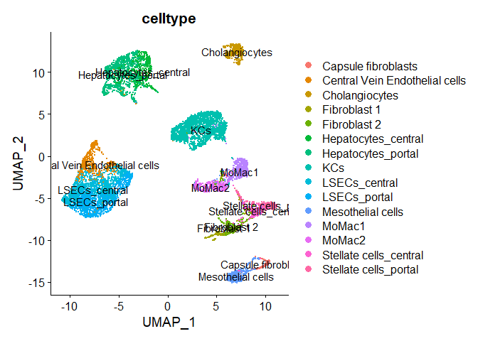
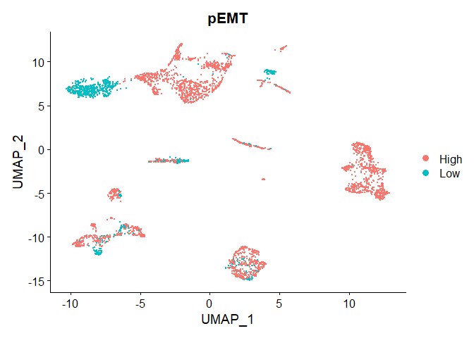
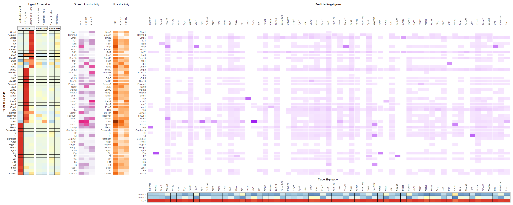
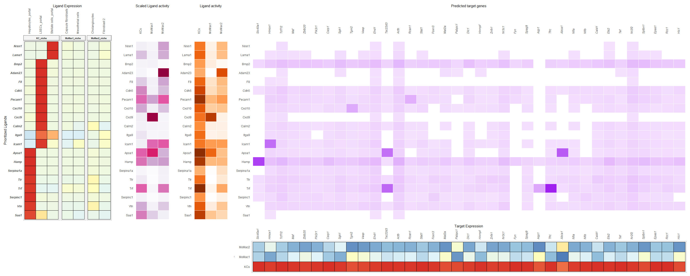
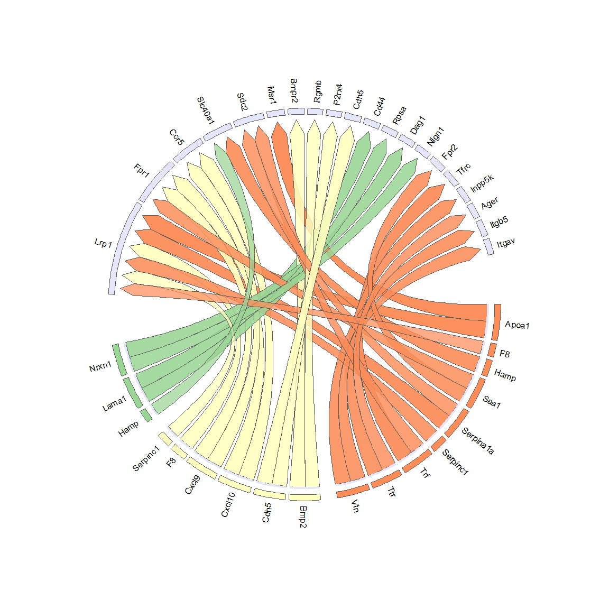
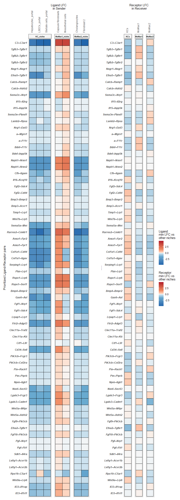
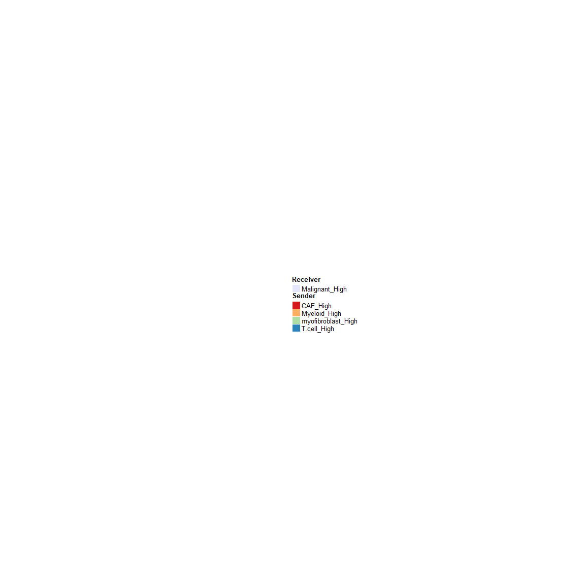

Differential NicheNet
================
Robin Browaeys
2021-05-25

<!-- github markdown built using 
rmarkdown::render("vignettes/differential_nichenet.Rmd", output_format = "github_document")
-->

Remark: this is a beta version of a new extension of NicheNet, namely
Differential NicheNet. Short-term improvements will include scalability,
visualization and documentation of this vignette and the underlying
functions (end of May 2021).

The goal of Differential NicheNet is to predict ligand-receptors pairs
that are both differentially expressed and active between different
niches of interest.

This vignette guides you in detail through all the steps of a
Differential NicheNet analysis. As example expression data of
interacting cells, we will use data from Puram et al. to explore
intercellular communication in the tumor microenvironment in head and
neck squamous cell carcinoma (HNSCC) (Puram et al. 2017). More
specifically, we will look at cell-cell communication differences
between pEMT-high and pEMT-low tumors (pEMT = partial
epithelial-mesenschymal transition). In this data, we thus have 2
niches, but this pipeline is also usable for more niches.

The used ligand-receptor network and ligand-target matrix can be
downloaded from Zenodo
[](https://doi.org/10.5281/zenodo.3260758).
The Seurat object containing expression data of interacting cells in
HNSCC can also be downloaded from Zenodo
[](https://doi.org/10.5281/zenodo.4675430).

# 0. Read in the expression data of interest, and the NicheNet ligand-receptor network and ligand-target matrix

## Load in packages

``` r
library(circlize)
library(nichenetr)
library(RColorBrewer)
library(tidyverse)
library(Seurat) # please update to Seurat V4
source("../R/differential_nichenet.R")
source("../R/differential_nichenet_plotting.R")
```

## Read in the expression data

In this case study, we want to study differences in cell-cell
communication patterns between pEMT-high and pEMT-low tumors. The meta
data columns that indicate the pEMT status of tumors are ‘pEMT,’ and the
cell type is indicated in the ‘celltype’ column.

``` r
seurat_obj = readRDS(url("https://zenodo.org/record/4675430/files/seurat_obj_hnscc.rds"))
DimPlot(seurat_obj, group.by = "celltype") # user adaptation required on own dataset
```

<!-- -->

``` r
DimPlot(seurat_obj, group.by = "pEMT") # user adaptation required on own dataset
```

<!-- -->

We will now also check the number of cells per cell type condition
combination

``` r
table(seurat_obj@meta.data$celltype, seurat_obj@meta.data$pEMT) # cell types vs conditions # user adaptation required on own dataset
##                
##                 High  Low
##   CAF            396  104
##   Endothelial    105   53
##   Malignant     1093  549
##   Myeloid         92    7
##   myofibroblast  382   61
##   T.cell         689    3
```

For the Differential NicheNet, we need to compare at least 2 niches or
conditions to each other. In this case, the 2 niches are the
pEMT-high-niche and the pEMT-low-niche. We will adapt the names of the
cell types based on their niche of origin.

``` r
seurat_obj@meta.data$celltype_aggregate = paste(seurat_obj@meta.data$celltype, seurat_obj@meta.data$pEMT,sep = "_") # user adaptation required on own dataset
DimPlot(seurat_obj, group.by = "celltype_aggregate")
```

<!-- -->

``` r
seurat_obj@meta.data$celltype_aggregate %>% table() %>% sort(decreasing = TRUE)
## .
##     Malignant_High        T.cell_High      Malignant_Low           CAF_High myofibroblast_High   Endothelial_High            CAF_Low       Myeloid_High  myofibroblast_Low    Endothelial_Low        Myeloid_Low         T.cell_Low 
##               1093                689                549                396                382                105                104                 92                 61                 53                  7                  3
```

``` r
celltype_id = "celltype_aggregate" # metadata column name of the cell type of interest
seurat_obj = SetIdent(seurat_obj, value = seurat_obj[[celltype_id]])
```

## Read in the NicheNet ligand-receptor network and ligand-target matrix

``` r
ligand_target_matrix = readRDS(url("https://zenodo.org/record/3260758/files/ligand_target_matrix.rds"))
ligand_target_matrix[1:5,1:5] # target genes in rows, ligands in columns
##                 CXCL1        CXCL2        CXCL3        CXCL5         PPBP
## A1BG     3.534343e-04 4.041324e-04 3.729920e-04 3.080640e-04 2.628388e-04
## A1BG-AS1 1.650894e-04 1.509213e-04 1.583594e-04 1.317253e-04 1.231819e-04
## A1CF     5.787175e-04 4.596295e-04 3.895907e-04 3.293275e-04 3.211944e-04
## A2M      6.027058e-04 5.996617e-04 5.164365e-04 4.517236e-04 4.590521e-04
## A2M-AS1  8.898724e-05 8.243341e-05 7.484018e-05 4.912514e-05 5.120439e-05
```

``` r
lr_network = readRDS(url("https://zenodo.org/record/3260758/files/lr_network.rds"))
lr_network = lr_network %>% mutate(bonafide = ! database %in% c("ppi_prediction","ppi_prediction_go"))
lr_network = lr_network %>% dplyr::rename(ligand = from, receptor = to) %>% distinct(ligand, receptor, bonafide)

head(lr_network)
## # A tibble: 6 x 3
##   ligand receptor bonafide
##   <chr>  <chr>    <lgl>   
## 1 CXCL1  CXCR2    TRUE    
## 2 CXCL2  CXCR2    TRUE    
## 3 CXCL3  CXCR2    TRUE    
## 4 CXCL5  CXCR2    TRUE    
## 5 PPBP   CXCR2    TRUE    
## 6 CXCL6  CXCR2    TRUE
```

Note: if your data is of mouse origin: convert human gene symbols to
their one-to-one orthologs

``` r
organism = "human" # user adaptation required on own dataset
```

``` r
if(organism == "mouse"){
  lr_network = lr_network %>% mutate(ligand = convert_human_to_mouse_symbols(ligand), receptor = convert_human_to_mouse_symbols(receptor)) %>% drop_na()

  colnames(ligand_target_matrix) = ligand_target_matrix %>% colnames() %>% convert_human_to_mouse_symbols()
  rownames(ligand_target_matrix) = ligand_target_matrix %>% rownames() %>% convert_human_to_mouse_symbols()
  ligand_target_matrix = ligand_target_matrix %>% .[!is.na(rownames(ligand_target_matrix)), !is.na(colnames(ligand_target_matrix))]
}
```

# 1. Define the niches/microenvironments of interest

Each niche should have at least one “sender/niche” cell population and
one “receiver/target” cell population (present in your expression data)

In this case study, we are interested to find differences in cell-cell
interactions to malignant cells between pEMT high and pEMT low tumors.
The receiver cell population in the pEMT-High niche is thus the
“Malignant\_High” cell type, and in the pEMT-Low niche this is
“Malignant\_Low.” The sender cell populations of interest are
myofibroblasts, Endothelial, CAF, T.cell, and Myeloid. Importantly, we
only include T.Cell and Myeloid in the pEMT-High niche, because there
are too few cells of these populations present in the pEMT-low niche.
Hereby, we demonstrate the possibility to include a condition-specific
cell type in the analysis - which is possible because we calculate DE
compared to all sender cells of the other niche, and not only to the
pEMT-low group of cells of the same cell type.

``` r
niches = list(
  "pEMT_High_niche" = list(
    "sender" = c("myofibroblast_High", "Endothelial_High", "CAF_High", "T.cell_High", "Myeloid_High"),
    "receiver" = c("Malignant_High")),
  "pEMT_Low_niche" = list(
    "sender" = c("myofibroblast_Low",  "Endothelial_Low", "CAF_Low"),
    "receiver" = c("Malignant_Low"))
  ) # user adaptation required on own dataset
```

# 2. Calculate differential expression between the niches

In this step, we will determine DE between the different niches for both
senders and receivers to define the DE of L-R pairs.

### Calculate DE

The method to calculate the differential expression is here the standard
Seurat Wilcoxon test, but this can be replaced if wanted by the user
(only requirement: output tables `DE_sender_processed` and
`DE_receiver_processed` should be in the same format as shown here).

DE will be calculated for each pairwise sender (or receiver) cell type
comparision between the niches (so across niches, not within niche). In
our case study, this means that DE of myofibroblast\_High ligands will
be calculated by DE analysis of myofibroblast\_High vs
myofibroblast\_Low; myofibroblast\_High vs Endothelial\_Low; and
myofibroblast\_High vs CAF\_Low. We split the cells per cell type
instead of merging all cells from the other niche to avoid that the DE
analysis will be driven by the most abundant cell types.

The DE analysis between the receiver cell types can take much time to
run since logFC and p-values will be calculated for all genes (5-15
minutes).

``` r
assay_oi = "SCT" # other possibilities: RNA,...
DE_sender = calculate_niche_de(seurat_obj = seurat_obj %>% subset(features = lr_network$ligand %>% unique()), niches = niches, type = "sender", assay_oi = assay_oi) # only ligands important for sender cell types
## [1] "Calculate Sender DE between: myofibroblast_High and myofibroblast_Low" "Calculate Sender DE between: myofibroblast_High and Endothelial_Low"   "Calculate Sender DE between: myofibroblast_High and CAF_Low"          
## [1] "Calculate Sender DE between: Endothelial_High and myofibroblast_Low" "Calculate Sender DE between: Endothelial_High and Endothelial_Low"   "Calculate Sender DE between: Endothelial_High and CAF_Low"          
## [1] "Calculate Sender DE between: CAF_High and myofibroblast_Low" "Calculate Sender DE between: CAF_High and Endothelial_Low"   "Calculate Sender DE between: CAF_High and CAF_Low"          
## [1] "Calculate Sender DE between: T.cell_High and myofibroblast_Low" "Calculate Sender DE between: T.cell_High and Endothelial_Low"   "Calculate Sender DE between: T.cell_High and CAF_Low"          
## [1] "Calculate Sender DE between: Myeloid_High and myofibroblast_Low" "Calculate Sender DE between: Myeloid_High and Endothelial_Low"   "Calculate Sender DE between: Myeloid_High and CAF_Low"          
## [1] "Calculate Sender DE between: myofibroblast_Low and myofibroblast_High" "Calculate Sender DE between: myofibroblast_Low and Endothelial_High"   "Calculate Sender DE between: myofibroblast_Low and CAF_High"           "Calculate Sender DE between: myofibroblast_Low and T.cell_High"       
## [5] "Calculate Sender DE between: myofibroblast_Low and Myeloid_High"      
## [1] "Calculate Sender DE between: Endothelial_Low and myofibroblast_High" "Calculate Sender DE between: Endothelial_Low and Endothelial_High"   "Calculate Sender DE between: Endothelial_Low and CAF_High"           "Calculate Sender DE between: Endothelial_Low and T.cell_High"       
## [5] "Calculate Sender DE between: Endothelial_Low and Myeloid_High"      
## [1] "Calculate Sender DE between: CAF_Low and myofibroblast_High" "Calculate Sender DE between: CAF_Low and Endothelial_High"   "Calculate Sender DE between: CAF_Low and CAF_High"           "Calculate Sender DE between: CAF_Low and T.cell_High"       
## [5] "Calculate Sender DE between: CAF_Low and Myeloid_High"
DE_receiver = calculate_niche_de(seurat_obj = seurat_obj, niches = niches, type = "receiver", assay_oi = assay_oi) # all genes important, because we want logFC values of receptors, but also infer DE targets
## [1] "Calculate Receiver DE between: Malignant_High and Malignant_Low"
## [1] "Calculate Receiver DE between: Malignant_Low and Malignant_High"
```

### Process DE results:

``` r
expression_pct = 0.10
DE_sender_processed = process_niche_de(DE_table = DE_sender, niches = niches, expression_pct = expression_pct, type = "sender")
DE_receiver_processed = process_niche_de(DE_table = DE_receiver, niches = niches, expression_pct = expression_pct, type = "receiver")
```

### Combine sender-receiver DE based on L-R pairs:

As mentioned above, DE of ligands from one sender cell type is
determined be calculating DE between that cell type, and all the sender
cell types of the other niche. To summarize the DE of ligands of that
cell type we have several options: we could take the average LFC, but
also the minimum LFC compared to the other niche. We recommend using the
minimum LFC, because this is the strongest specificity measure of ligand
expression, because a high min LFC means that a ligand is more strongly
expressed in the cell type of niche 1 compared to all cell types of
niche 2 (in contrast to a high average LFC, which does not exclude that
one or more cell types in niche 2 also strongly express that ligand).

``` r
specificity_score_LR_pairs = "min_lfc"
DE_sender_receiver = combine_sender_receiver_de(DE_sender_processed, DE_receiver_processed, lr_network, specificity_score = specificity_score_LR_pairs)
```

# 3. Optional: Calculate differential expression between the different spatial regions

To improve the cell-cell interaction predictions, you can consider
spatial information if possible and applicable. Spatial information can
come from microscopy data, or from spatial transcriptomics data such as
Visium.

There are several ways to incorporate spatial information in the
Differential NicheNet pipeline. First, you can only consider cell types
as belonging to the same niche if they are in the same spatial location.
Another way is including spatial differential expression of
ligand-receptor pairs within one cell type in the prioritization
framework.

For example: We have a cell type X, located in regions A and B, and we
want to study cell-cell communication in region A. We first add only
celltypeX of regionA in the niche definition, and then calculate DE
between celltypeX-regionA and celltypeX-regionB to give higher
prioritization weight to regionA-specific ligands.

In this case study, our region of interest is the tumor leading edge,
since Puram et al defined this region as important regarding the pEMT
process. Puram et al also defined CAFs as the fibroblasts that are close
to leading edge, whereas the other fibroblasts (myofibroblasts) were not
preferentially located in the tumor leading edge. We can thus now
prioritize fibroblast ligands further by looking at ligands that are DE
between leading-edge fibroblasts (=CAFs) and non-leading-edge
fibroblasts (myofibroblasts).

We do this as follows, by first defining a ‘spatial info’ dataframe. If
no spatial information in your data: set the following two parameters to
FALSE, and make a mock ‘spatial\_info’ data frame.

``` r
include_spatial_info_sender = TRUE # if not spatial info to include: put this to false # user adaptation required on own dataset
include_spatial_info_receiver = FALSE # if spatial info to include: put this to true # user adaptation required on own dataset
```

``` r
spatial_info = tibble(celltype_region_oi = "CAF_High", celltype_other_region = "myofibroblast_High", niche =  "pEMT_High_niche", celltype_type = "sender") # user adaptation required on own dataset
specificity_score_spatial = "lfc"
```

``` r
# this is how this should be defined if you don't have spatial info
# mock spatial info
if(include_spatial_info_sender == FALSE & include_spatial_info_receiver == FALSE){
    spatial_info = tibble(celltype_region_oi = NA, celltype_other_region = NA) %>% mutate(niche =  niches %>% names() %>% head(1), celltype_type = "sender")
} 
```

!!!! also possible to only look at ligands for senders!! !!! receptors
for receivers

``` r
if(include_spatial_info_sender == TRUE){
  sender_spatial_DE = calculate_spatial_DE(seurat_obj = seurat_obj %>% subset(features = lr_network$ligand %>% unique()), spatial_info = spatial_info %>% filter(celltype_type == "sender"))
  sender_spatial_DE_processed = process_spatial_de(DE_table = sender_spatial_DE, type = "sender", lr_network = lr_network, expression_pct = expression_pct, specificity_score = specificity_score_spatial)

  # add a neutral zonation score for sender celltypes in which the zonation is not known / not of importance
  sender_spatial_DE_others = get_non_spatial_de(niches = niches, spatial_info = spatial_info, type = "sender", lr_network = lr_network)
  sender_spatial_DE_processed = sender_spatial_DE_processed %>% bind_rows(sender_spatial_DE_others)

  sender_spatial_DE_processed = sender_spatial_DE_processed %>% mutate(scaled_ligand_score_zonation = scale_quantile_adapted(ligand_score_zonation))

} else {
  # # add a neutral zonation score for all sender celltypes (for none of them, zonation is relevant in this case)
  sender_spatial_DE_processed = get_non_spatial_de(niches = niches, spatial_info = spatial_info, type = "sender", lr_network = lr_network)
  sender_spatial_DE_processed = sender_spatial_DE_processed %>% mutate(scaled_ligand_score_zonation = scale_quantile_adapted(ligand_score_zonation))  

}
## [1] "Calculate Spatial DE between: CAF_High and myofibroblast_High"
```

``` r
if(include_spatial_info_receiver == TRUE){
  receiver_spatial_DE = calculate_spatial_DE(seurat_obj = seurat_obj %>% subset(features = lr_network$receptor %>% unique()), spatial_info = spatial_info %>% filter(celltype_type == "receiver"))
  receiver_spatial_DE_processed = process_spatial_de(DE_table = receiver_spatial_DE, type = "receiver", lr_network = lr_network, expression_pct = expression_pct, specificity_score = specificity_score_spatial)

  # add a neutral zonation score for receiver celltypes in which the zonation is not known / not of importance
  receiver_spatial_DE_others = get_non_spatial_de(niches = niches, spatial_info = spatial_info, type = "receiver", lr_network = lr_network)
  receiver_spatial_DE_processed = receiver_spatial_DE_processed %>% bind_rows(receiver_spatial_DE_others)

  receiver_spatial_DE_processed = receiver_spatial_DE_processed %>% mutate(scaled_receptor_score_zonation = scale_quantile_adapted(receptor_score_zonation))

} else {
    # # add a neutral zonation score for all receiver celltypes (for none of them, zonation is relevant in this case)
  receiver_spatial_DE_processed = get_non_spatial_de(niches = niches, spatial_info = spatial_info, type = "receiver", lr_network = lr_network)
  receiver_spatial_DE_processed = receiver_spatial_DE_processed %>% mutate(scaled_receptor_score_zonation = scale_quantile_adapted(receptor_score_zonation))
}
```

# 4. Calculate ligand activities and infer active ligand-target links

In this step, we will predict ligand activities of each ligand for each
of the receiver cell types across the different niches. This is similar
to the ligand activity analysis done in the normal NicheNet pipeline.

To calculate ligand activities, we first need to define a geneset of
interest for each niche. In this case study, the geneset of interest for
the pEMT-high niche are the genes upregulated in pEMT-high tumors
compared to pEMT-low tumors, and vice versa.

Note that you can also define these geneset of interest in a different
way! (eg pathway-based geneset etc)

Ligand-target links are inferred in the same way as described in the
basic NicheNet vignettes.

``` r
lfc_cutoff = 0.15 # recommended for 10x as min_lfc cutoff. 

specificity_score_targets = "min_lfc"

DE_receiver_processed_targets = process_receiver_target_de(DE_receiver_targets = DE_receiver, niches = niches, expression_pct = expression_pct, specificity_score = specificity_score_targets)
  
background = DE_receiver_processed_targets  %>% pull(target) %>% unique()
geneset_niche1 = DE_receiver_processed_targets %>% filter(receiver == niches[[1]]$receiver & target_score >= lfc_cutoff & target_significant == 1 & target_present == 1) %>% pull(target) %>% unique()
geneset_niche2 = DE_receiver_processed_targets %>% filter(receiver == niches[[2]]$receiver & target_score >= lfc_cutoff & target_significant == 1 & target_present == 1) %>% pull(target) %>% unique()
  
# Good idea to check which genes will be left out of the ligand activity analysis (=when not present in the rownames of the ligand-target matrix).
# If many genes are left out, this might point to some issue in the gene naming (eg gene aliases and old gene symbols, bad human-mouse mapping)
geneset_niche1 %>% setdiff(rownames(ligand_target_matrix))
##  [1] "ANXA8L2"       "PRKCDBP"       "IL8"           "PTRF"          "SEPP1"         "C1orf186"      "CCDC109B"      "C10orf54"      "LEPREL1"       "ZNF812"        "LOC645638"     "LOC401397"     "LINC00162"     "DFNA5"         "PLK1S1"        "ZMYM6NB"       "C19orf10"      "CTSL1"        
## [19] "SQRDL"         "LOC375295"     "WBP5"          "LOC100505633"  "AIM1"          "C1orf63"       "LOC100507463"  "GPR115"        "VIMP"          "SEP15"         "C1orf172"      "NAPRT1"        "LHFP"          "KRT16P1"       "C7orf10"       "PTPLA"         "GRAMD3"        "CPSF3L"       
## [37] "MESDC2"        "C10orf10"      "KIAA1609"      "CCDC53"        "TXLNG2P"       "NGFRAP1"       "ERO1L"         "FAM134A"       "LSMD1"         "TCEB2"         "B3GALTL"       "HN1L"          "LOC550643"     "KIAA0922"      "GLT25D1"       "FAM127A"       "C1orf151-NBL1" "SEPW1"        
## [55] "GPR126"        "LOC100505806"  "LINC00478"     "TCEB1"         "GRAMD2"        "GNB2L1"        "KIRREL"
geneset_niche2 %>% setdiff(rownames(ligand_target_matrix))
##   [1] "LOC344887"    "AGPAT9"       "C1orf110"     "KIAA1467"     "LOC100292680" "EPT1"         "CT45A4"       "LOC654433"    "UPK3BL"       "LINC00340"    "LOC100128338" "FAM60A"       "CCDC144C"     "LOC401109"    "LOC286467"    "LEPREL4"      "LOC731275"    "LOC642236"    "LINC00516"   
##  [20] "LOC101101776" "SC5DL"        "PVRL4"        "LOC100130093" "LINC00338"    "LOC100132891" "PPAP2C"       "C6orf1"       "C2orf47"      "WHSC1L1"      "LOC100289019" "SETD8"        "KDM5B-AS1"    "SPG20"        "CXCR7"        "LOC100216479" "LOC100505761" "MGC57346"     "LPHN3"       
##  [39] "CENPC1"       "C11orf93"     "C14orf169"    "LOC100506060" "FLJ31485"     "LOC440905"    "MLF1IP"       "TMEM194A"     "RRP7B"        "REXO1L1"      "LOC100129269" "KIAA1715"     "CTAGE5"       "LOC202781"    "LOC100506714" "LOC401164"    "UTS2D"        "LOC146880"    "KIAA1804"    
##  [58] "C5orf55"      "C21orf119"    "PRUNE"        "LRRC16A"      "LOC339240"    "FLJ35024"     "C5orf28"      "LOC100505876" "MGC21881"     "LOC100133985" "PPAPDC2"      "FRG1B"        "CECR5"        "LOC100129361" "CCBL1"        "PTPLAD1"      "MST4"         "LOC550112"    "LOC389791"   
##  [77] "CCDC90A"      "KIAA0195"     "LOC100506469" "LOC100133161" "LOC646719"    "LOC728819"    "BRE"          "LOC284581"    "LOC441081"    "LOC728377"    "LOC100134229" "C3orf65"      "SMEK2"        "KIAA1737"     "C17orf70"     "PLEKHM1P"     "LOC338758"    "PCNXL2"       "LOC91948"    
##  [96] "C17orf89"     "LOC100505783" "SMCR7L"       "C8orf4"       "GPR56"        "ATHL1"        "LOC339535"    "PPAPDC1B"     "DAK"          "LOC100507173" "CRHR1-IT1"    "PPAP2B"       "ADCK4"        "KIAA0146"     "GYLTL1B"      "LOC100272216" "LOC400027"    "WHSC1"        "LOC100130855"
## [115] "C7orf55"      "C19orf40"     "ADCK3"        "C9orf142"     "SGOL1"        "LOC90834"     "PTPLAD2"      "KIAA1967"     "LOC100132352" "LOC100630918" "ADRBK2"       "LINC00263"    "FAM64A"       "LOC401074"    "FAM179B"      "RP1-177G6.2"  "METTL21D"     "ERO1LB"       "FLJ45445"    
## [134] "NADKD1"       "LOC100506233" "LOC100652772" "FAM175A"      "LINC00630"    "C11orf82"     "SETD5-AS1"    "SGK196"       "FLJ14186"     "CCDC104"      "FAM63A"       "NARG2"        "MTERFD1"      "CCDC74B-AS1"  "LOC286186"    "WDR67"        "C12orf52"     "FLJ30403"     "KIAA2018"    
## [153] "GCN1L1"       "FLJ43681"     "LOC152217"    "FONG"         "C18orf8"      "ALG1L9P"      "GTDC2"        "LOC100507217" "NBPF24"       "WBSCR27"      "C14orf1"      "LOC284889"    "KIAA0317"     "FAM65A"       "PMS2L2"       "LUST"         "C15orf52"     "FAM195A"      "LOC399744"   
## [172] "PYCRL"        "LOC338799"    "LOC100506190" "C9orf91"      "FLJ45340"     "LOC349196"    "LOC100128881" "TOMM70A"      "ALS2CR8"      "LDOC1L"       "HDGFRP3"      "ZNF767"       "LOC728558"    "LOC283693"    "LEPREL2"      "QTRTD1"       "SELM"         "C6orf25"      "C1orf86"     
## [191] "HNRPLL"       "LOC145820"    "LOC100289341" "C17orf85"     "C3orf72"      "C14orf64"     "C9orf9"       "LOC100506394"

length(geneset_niche1)
## [1] 1668
length(geneset_niche2)
## [1] 2889
```

It is always useful to check the number of genes in the geneset before
doing the ligand activity analysis. We recommend having between 20 and
1000 genes in the geneset of interest, and a background of at least 5000
genes for a proper ligand activity analysis. If you retrieve too many DE
genes, it is recommended to use a higher `lfc_cutoff` threshold. We
recommend using a cutoff of 0.15 if you have &gt; 2 receiver
cells/niches to compare and use the min\_lfc as specificity score. If
you have only 2 receivers/niche, we recommend using a higher threshold
(such as using 0.25). If you have single-cell data like Smart-seq2 with
high sequencing depth, we recommend to also use higher threshold.

As we see here, we have Smart-seq2 data and only 2 niches to compare, so
we will use a stronger LFC threshold to keep less DE genes, but more
trustworthy ones.

``` r
lfc_cutoff = 0.75 

specificity_score_targets = "min_lfc"

DE_receiver_processed_targets = process_receiver_target_de(DE_receiver_targets = DE_receiver, niches = niches, expression_pct = expression_pct, specificity_score = specificity_score_targets)
  
background = DE_receiver_processed_targets  %>% pull(target) %>% unique()
geneset_niche1 = DE_receiver_processed_targets %>% filter(receiver == niches[[1]]$receiver & target_score >= lfc_cutoff & target_significant == 1 & target_present == 1) %>% pull(target) %>% unique()
geneset_niche2 = DE_receiver_processed_targets %>% filter(receiver == niches[[2]]$receiver & target_score >= lfc_cutoff & target_significant == 1 & target_present == 1) %>% pull(target) %>% unique()
  
# Good idea to check which genes will be left out of the ligand activity analysis (=when not present in the rownames of the ligand-target matrix).
# If many genes are left out, this might point to some issue in the gene naming (eg gene aliases and old gene symbols, bad human-mouse mapping)
geneset_niche1 %>% setdiff(rownames(ligand_target_matrix))
## [1] "ANXA8L2"  "PRKCDBP"  "IL8"      "PTRF"     "SEPP1"    "C1orf186"
geneset_niche2 %>% setdiff(rownames(ligand_target_matrix))
## [1] "LOC344887"    "AGPAT9"       "C1orf110"     "KIAA1467"     "LOC100292680" "EPT1"         "CT45A4"

length(geneset_niche1)
## [1] 169
length(geneset_niche2)
## [1] 136
```

``` r
top_n_target = 250

niche_geneset_list = list(
  "pEMT_High_niche" = list(
    "receiver" = niches[[1]]$receiver,
    "geneset" = geneset_niche1,
    "background" = background),
  "pEMT_Low_niche" = list(
    "receiver" = niches[[2]]$receiver,
    "geneset" = geneset_niche2 ,
    "background" = background)
  )
  
ligand_activities_targets = get_ligand_activities_targets(niche_geneset_list = niche_geneset_list, ligand_target_matrix = ligand_target_matrix, top_n_target = top_n_target)
## [1] "Calculate Ligand activities for: Malignant_High"
## [1] "Calculate Ligand activities for: Malignant_Low"
```

# 5. Calculate (scaled) expression of ligands, receptors and targets across cell types of interest (log expression values and expression fractions)

In this step, we will calculate average (scaled) expression, and
fraction of expression, of ligands, receptors, and target genes across
all cell types of interest. Now this is here demonstrated via the
DotPlot function of Seurat, but this can also be done via other ways of
course.

``` r
features_oi = union(lr_network$ligand, lr_network$receptor) %>% union(ligand_activities_targets$target)
  
dotplot = suppressWarnings(Seurat::DotPlot(seurat_obj %>% subset(idents = niches %>% unlist() %>% unique()), features = features_oi, assay = assay_oi))
exprs_tbl = dotplot$data %>% as_tibble()
exprs_tbl = exprs_tbl %>% rename(celltype = id, gene = features.plot, expression = avg.exp, expression_scaled = avg.exp.scaled, fraction = pct.exp) %>%
    mutate(fraction = fraction/100) %>% as_tibble() %>% select(celltype, gene, expression, expression_scaled, fraction) %>% distinct() %>% arrange(gene) %>% mutate(gene = as.character(gene))
  
exprs_tbl_ligand = exprs_tbl %>% filter(gene %in% lr_network$ligand) %>% rename(sender = celltype, ligand = gene, ligand_expression = expression, ligand_expression_scaled = expression_scaled, ligand_fraction = fraction) 
exprs_tbl_receptor = exprs_tbl %>% filter(gene %in% lr_network$receptor) %>% rename(receiver = celltype, receptor = gene, receptor_expression = expression, receptor_expression_scaled = expression_scaled, receptor_fraction = fraction)
exprs_tbl_target = exprs_tbl %>% filter(gene %in% ligand_activities_targets$target) %>% rename(receiver = celltype, target = gene, target_expression = expression, target_expression_scaled = expression_scaled, target_fraction = fraction)
```

``` r
exprs_tbl_ligand = exprs_tbl_ligand %>%  mutate(scaled_ligand_expression_scaled = scale_quantile_adapted(ligand_expression_scaled)) %>% mutate(ligand_fraction_adapted = ligand_fraction) %>% mutate_cond(ligand_fraction >= expression_pct, ligand_fraction_adapted = expression_pct)  %>% mutate(scaled_ligand_fraction_adapted = scale_quantile_adapted(ligand_fraction_adapted))

exprs_tbl_receptor = exprs_tbl_receptor %>% mutate(scaled_receptor_expression_scaled = scale_quantile_adapted(receptor_expression_scaled))  %>% mutate(receptor_fraction_adapted = receptor_fraction) %>% mutate_cond(receptor_fraction >= expression_pct, receptor_fraction_adapted = expression_pct)  %>% mutate(scaled_receptor_fraction_adapted = scale_quantile_adapted(receptor_fraction_adapted))
```

# 6. Expression fraction and receptor

In this step, we will score ligand-receptor interactions based on
expression strength of the receptor, in such a way that we give higher
scores to the most strongly expressed receptor of a certain ligand, in a
certain celltype. This will not effect the rank of individual ligands
later on, but will help in prioritizing the most important receptors per
ligand (next to other factors regarding the receptor - see later).

``` r
exprs_sender_receiver = lr_network %>% 
  inner_join(exprs_tbl_ligand, by = c("ligand")) %>% 
  inner_join(exprs_tbl_receptor, by = c("receptor")) %>% inner_join(DE_sender_receiver %>% distinct(niche, sender, receiver))
  
ligand_scaled_receptor_expression_fraction_df = exprs_sender_receiver %>% group_by(ligand, receiver) %>% mutate(rank_receptor_expression = dense_rank(receptor_expression), rank_receptor_fraction  = dense_rank(receptor_fraction)) %>% mutate(ligand_scaled_receptor_expression_fraction = 0.5*( (rank_receptor_fraction / max(rank_receptor_fraction)) + ((rank_receptor_expression / max(rank_receptor_expression))) ) )  %>% distinct(ligand, receptor, receiver, ligand_scaled_receptor_expression_fraction, bonafide) %>% distinct() %>% ungroup() 
```

# 7. Prioritization of ligand-receptor and ligand-target links

In this step, we will combine all the above calculated information to
prioritize ligand-receptor-target links. We scale every property of
interest between 0 and 1, and the final prioritization score is a
weighted sum of the scaled scores of all the properties of interest.

We provide the user the option to consider the following properties for
prioritization (of which the weights are defined in
`prioritizing_weights`) :

-   Ligand DE score: niche-specific expression of the ligand: by
    default, this the minimum logFC between the sender of interest and
    all the senders of the other niche(s). The higher the min logFC, the
    higher the niche-specificity of the ligand. Therefore we recommend
    to give this factor a very high weight. `prioritizing_weights`
    argument: `"scaled_ligand_score"`. Recommended weight: 5 (at least
    1, max 5).

-   Scaled ligand expression: scaled expression of a ligand in one
    sender compared to the other cell types in the dataset. This might
    be useful to rescue potentially interesting ligands that have a high
    scaled expression value, but a relatively small min logFC compared
    to the other niche. One reason why this logFC might be small occurs
    when (some) genes are not picked up efficiently by the used
    sequencing technology (or other reasons for low RNA expression of
    ligands). For example, we have observed that many ligands from the
    Tgf-beta/BMP family are not picked up efficiently with single-nuclei
    RNA sequencing compared to single-cell sequencing.
    `prioritizing_weights` argument:
    `"scaled_ligand_expression_scaled"`. Recommended weight: 1 (unless
    technical reason for lower gene detection such as while using
    Nuc-seq: then recommended to use a higher weight: 2).

-   Ligand expression fraction: Ligands that are expressed in a smaller
    fraction of cells of a cell type than defined by
    `exprs_cutoff`(default: 0.10) will get a lower ranking, proportional
    to their fraction (eg ligand expressed in 9% of cells will be ranked
    higher than ligand expressed in 0.5% of cells). We opted for this
    weighting based on fraction, instead of removing ligands that are
    not expressed in more cells than this cutoff, because some
    interesting ligands could be removed that way. Fraction of
    expression is not taken into account for the prioritization if it is
    already higher than the cutoff. `prioritizing_weights` argument:
    `"ligand_fraction"`. Recommended weight: 1.

-   Ligand spatial DE score: spatial expression specificity of the
    ligand. If the niche of interest is at a specific tissue location,
    but some of the sender cell types of that niche are also present in
    other locations, it can be very informative to further prioritize
    ligands of that sender by looking how they are DE between the
    spatial location of interest compared to the other locations.
    `prioritizing_weights` argument: `"scaled_ligand_score_zonation"`.
    Recommended weight: 2 (or 0 if not applicable).

-   Receptor DE score: niche-specific expression of the receptor: by
    default, this the minimum logFC between the receiver of interest and
    all the receiver of the other niche(s). The higher the min logFC,
    the higher the niche-specificity of the receptor. Based on our
    experience, we don’t suggest to give this as high importance as the
    ligand DE, but this might depend on the specific case study.
    `prioritizing_weights` argument: `"scaled_receptor_score"`.
    Recommended weight: 0.5 (at least 0.5, and lower than
    `"scaled_ligand_score"`).

-   Scaled receptor expression: scaled expression of a receptor in one
    receiver compared to the other cell types in the dataset. This might
    be useful to rescue potentially interesting receptors that have a
    high scaled expression value, but a relatively small min logFC
    compared to the other niche. One reason why this logFC might be
    small occurs when (some) genes are not picked up efficiently by the
    used sequencing technology. `prioritizing_weights` argument:
    `"scaled_receptor_expression_scaled"`. Recommended weight: 0.5.

-   Receptor expression fraction: Receptors that are expressed in a
    smaller fraction of cells of a cell type than defined by
    `exprs_cutoff`(default: 0.10) will get a lower ranking, proportional
    to their fraction (eg receptor expressed in 9% of cells will be
    ranked higher than receptor expressed in 0.5% of cells). We opted
    for this weighting based on fraction, instead of removing receptors
    that are not expressed in more cells than this cutoff, because some
    interesting receptors could be removed that way. Fraction of
    expression is not taken into account for the prioritization if it is
    already higher than the cutoff. `prioritizing_weights` argument:
    `"receptor_fraction"`. Recommended weight: 1.

-   Receptor expression strength: this factor let us give higher weights
    to the most highly expressed receptor of a ligand in the receiver.
    This let us rank higher one member of a receptor family if it higher
    expressed than the other members. `prioritizing_weights` argument:
    `"ligand_scaled_receptor_expression_fraction"`. Recommended value: 1
    (minimum: 0.5).

-   Receptor spatial DE score: spatial expression specificity of the
    receptor. If the niche of interest is at a specific tissue location,
    but the receiver cell type of that niche is also present in other
    locations, it can be very informative to further prioritize
    receptors of that receiver by looking how they are DE between the
    spatial location of interest compared to the other locations.
    `prioritizing_weights` argument: `"scaled_receptor_score_zonation"`.
    Recommended weight: 1 (or 0 if not applicable).

-   Absolute ligand activity: to further prioritize ligand-receptor
    pairs based on their predicted effect of the ligand-receptor
    interaction on the gene expression in the receiver cell type -
    absolute ligand activity accords to ‘absolute’ enrichment of target
    genes of a ligand within the affected receiver genes.
    `prioritizing_weights` argument: `"scaled_activity"`. Recommended
    weight: 0, unless absolute enrichment of target genes is of specific
    interest.

-   Normalized ligand activity: to further prioritize ligand-receptor
    pairs based on their predicted effect of the ligand-receptor
    interaction on the gene expression in the receiver cell type -
    normalization of activity is done because we found that some
    datasets/conditions/niches have higher baseline activity values than
    others - normalized ligand activity accords to ‘relative’ enrichment
    of target genes of a ligand within the affected receiver genes.
    `prioritizing_weights` argument: `"scaled_activity_normalized"`.
    Recommended weight: at least 1.

-   Prior knowledge quality of the L-R interaction: the NicheNet LR
    network consists of two types of interactions: L-R pairs documented
    in curated databases, and L-R pairs predicted based on gene
    annotation and PPIs. The former are categorized as ‘bona fide’
    interactions. To rank bona fide interactions higher, but not exlude
    potentially interesting non-bona-fide ones, we give bona fide
    interactions a score of 1, and non-bona-fide interactions a score
    fof 0.5. `prioritizing_weights` argument: `"bona_fide"` Recommend
    weight: at least 1.

``` r
prioritizing_weights = c("scaled_ligand_score" = 5,
                         "scaled_ligand_expression_scaled" = 1,
                         "ligand_fraction" = 1,
                         "scaled_ligand_score_zonation" = 2, 
                         "scaled_receptor_score" = 0.5,
                         "scaled_receptor_expression_scaled" = 0.5,
                          "receptor_fraction" = 1, 
                         "ligand_scaled_receptor_expression_fraction" = 1,
                         "scaled_receptor_score_zonation" = 0,
                         "scaled_activity" = 0,
                         "scaled_activity_normalized" = 1,
                         "bona_fide" = 1)
```

``` r
output = list(DE_sender_receiver = DE_sender_receiver, ligand_scaled_receptor_expression_fraction_df = ligand_scaled_receptor_expression_fraction_df, sender_spatial_DE_processed = sender_spatial_DE_processed, receiver_spatial_DE_processed = receiver_spatial_DE_processed,
         ligand_activities_targets = ligand_activities_targets, DE_receiver_processed_targets = DE_receiver_processed_targets, exprs_tbl_ligand = exprs_tbl_ligand,  exprs_tbl_receptor = exprs_tbl_receptor, exprs_tbl_target = exprs_tbl_target)
prioritization_tables = get_prioritization_tables(output, prioritizing_weights)

prioritization_tables$prioritization_tbl_ligand_receptor %>% filter(receiver == niches[[1]]$receiver) %>% head(10)
## # A tibble: 10 x 37
##    niche receiver sender ligand_receptor ligand receptor bonafide ligand_score ligand_signific~ ligand_present ligand_expressi~ ligand_expressi~ ligand_fraction ligand_score_zo~ receptor_score receptor_signif~ receptor_present receptor_expres~ receptor_expres~ receptor_fracti~ receptor_score_~
##    <chr> <chr>    <chr>  <chr>           <chr>  <chr>    <lgl>           <dbl>            <dbl>          <dbl>            <dbl>            <dbl>           <dbl>            <dbl>          <dbl>            <dbl>            <dbl>            <dbl>            <dbl>            <dbl>            <dbl>
##  1 pEMT~ Maligna~ T.cel~ PTPRC--MET      PTPRC  MET      FALSE            3.22                1              1             9.32             2.5            0.939                0         0.463                 1                1            1.02             1.76             0.526                0
##  2 pEMT~ Maligna~ T.cel~ PTPRC--EGFR     PTPRC  EGFR     FALSE            3.22                1              1             9.32             2.5            0.939                0         0.454                 1                1            1.21             1.21             0.581                0
##  3 pEMT~ Maligna~ T.cel~ PTPRC--CD44     PTPRC  CD44     FALSE            3.22                1              1             9.32             2.5            0.939                0         0.104                 1                1            3.27             0.327            0.905                0
##  4 pEMT~ Maligna~ T.cel~ PTPRC--ERBB2    PTPRC  ERBB2    FALSE            3.22                1              1             9.32             2.5            0.939                0        -0.0286                0                1            0.629            1.16             0.345                0
##  5 pEMT~ Maligna~ T.cel~ PTPRC--IFNAR1   PTPRC  IFNAR1   FALSE            3.22                1              1             9.32             2.5            0.939                0         0.248                 0                1            0.765           -0.658            0.446                0
##  6 pEMT~ Maligna~ T.cel~ TNF--TNFRSF21   TNF    TNFRSF21 TRUE             1.74                1              1             2.34             2.35           0.251                0         1.14                  1                1            2.51             2.14             0.759                0
##  7 pEMT~ Maligna~ Myelo~ SERPINA1--LRP1  SERPI~ LRP1     TRUE             2.52                1              1             4.83             2.5            0.761                0        -0.159                 1                1            0.312           -0.526            0.234                0
##  8 pEMT~ Maligna~ Myelo~ IL1B--IL1RAP    IL1B   IL1RAP   TRUE             1.50                1              1             1.93             2.5            0.272                0         0.582                 1                1            1.01             2.46             0.494                0
##  9 pEMT~ Maligna~ Myelo~ IL1RN--IL1R2    IL1RN  IL1R2    TRUE             1.62                1              1             2.07             2.35           0.380                0         0.259                 0                1            0.476            0.436            0.120                0
## 10 pEMT~ Maligna~ T.cel~ PTPRC--INSR     PTPRC  INSR     FALSE            3.22                1              1             9.32             2.5            0.939                0        -0.0722                0                1            0.582           -0.719            0.252                0
## # ... with 16 more variables: ligand_scaled_receptor_expression_fraction <dbl>, avg_score_ligand_receptor <dbl>, activity <dbl>, activity_normalized <dbl>, scaled_ligand_score <dbl>, scaled_ligand_expression_scaled <dbl>, scaled_receptor_score <dbl>, scaled_receptor_expression_scaled <dbl>,
## #   scaled_avg_score_ligand_receptor <dbl>, scaled_ligand_score_zonation <dbl>, scaled_receptor_score_zonation <dbl>, scaled_ligand_fraction_adapted <dbl>, scaled_receptor_fraction_adapted <dbl>, scaled_activity <dbl>, scaled_activity_normalized <dbl>, prioritization_score <dbl>
prioritization_tables$prioritization_tbl_ligand_target %>% filter(receiver == niches[[1]]$receiver) %>% head(10)
## # A tibble: 10 x 20
##    niche        receiver     sender     ligand_receptor ligand receptor bonafide target   target_score target_significant target_present target_expressi~ target_expression_s~ target_fraction ligand_target_wei~ activity activity_normali~ scaled_activity scaled_activity_norma~ prioritization_sc~
##    <chr>        <chr>        <chr>      <chr>           <chr>  <chr>    <lgl>    <chr>           <dbl>              <dbl>          <dbl>            <dbl>                <dbl>           <dbl>              <dbl>    <dbl>             <dbl>           <dbl>                  <dbl>              <dbl>
##  1 pEMT_High_n~ Malignant_H~ T.cell_Hi~ PTPRC--MET      PTPRC  MET      FALSE    EHF             1.04                   1              1             1.88                2.5             0.678            0.00126   0.0595           -0.0571           0.543                  0.413              0.957
##  2 pEMT_High_n~ Malignant_H~ T.cell_Hi~ PTPRC--MET      PTPRC  MET      FALSE    GADD45B         0.836                  1              1             2.42               -0.971           0.638            0.00154   0.0595           -0.0571           0.543                  0.413              0.957
##  3 pEMT_High_n~ Malignant_H~ T.cell_Hi~ PTPRC--MET      PTPRC  MET      FALSE    SERPINE1        0.889                  1              1             1.79                0.290           0.603            0.00133   0.0595           -0.0571           0.543                  0.413              0.957
##  4 pEMT_High_n~ Malignant_H~ T.cell_Hi~ PTPRC--EGFR     PTPRC  EGFR     FALSE    EHF             1.04                   1              1             1.88                2.5             0.678            0.00126   0.0595           -0.0571           0.543                  0.413              0.956
##  5 pEMT_High_n~ Malignant_H~ T.cell_Hi~ PTPRC--EGFR     PTPRC  EGFR     FALSE    GADD45B         0.836                  1              1             2.42               -0.971           0.638            0.00154   0.0595           -0.0571           0.543                  0.413              0.956
##  6 pEMT_High_n~ Malignant_H~ T.cell_Hi~ PTPRC--EGFR     PTPRC  EGFR     FALSE    SERPINE1        0.889                  1              1             1.79                0.290           0.603            0.00133   0.0595           -0.0571           0.543                  0.413              0.956
##  7 pEMT_High_n~ Malignant_H~ T.cell_Hi~ PTPRC--CD44     PTPRC  CD44     FALSE    EHF             1.04                   1              1             1.88                2.5             0.678            0.00126   0.0595           -0.0571           0.543                  0.413              0.948
##  8 pEMT_High_n~ Malignant_H~ T.cell_Hi~ PTPRC--CD44     PTPRC  CD44     FALSE    GADD45B         0.836                  1              1             2.42               -0.971           0.638            0.00154   0.0595           -0.0571           0.543                  0.413              0.948
##  9 pEMT_High_n~ Malignant_H~ T.cell_Hi~ PTPRC--CD44     PTPRC  CD44     FALSE    SERPINE1        0.889                  1              1             1.79                0.290           0.603            0.00133   0.0595           -0.0571           0.543                  0.413              0.948
## 10 pEMT_High_n~ Malignant_H~ T.cell_Hi~ PTPRC--ERBB2    PTPRC  ERBB2    FALSE    EHF             1.04                   1              1             1.88                2.5             0.678            0.00126   0.0595           -0.0571           0.543                  0.413              0.937

prioritization_tables$prioritization_tbl_ligand_receptor %>% filter(receiver == niches[[2]]$receiver) %>% head(10)
## # A tibble: 10 x 37
##    niche receiver sender ligand_receptor ligand receptor bonafide ligand_score ligand_signific~ ligand_present ligand_expressi~ ligand_expressi~ ligand_fraction ligand_score_zo~ receptor_score receptor_signif~ receptor_present receptor_expres~ receptor_expres~ receptor_fracti~ receptor_score_~
##    <chr> <chr>    <chr>  <chr>           <chr>  <chr>    <lgl>           <dbl>            <dbl>          <dbl>            <dbl>            <dbl>           <dbl>            <dbl>          <dbl>            <dbl>            <dbl>            <dbl>            <dbl>            <dbl>            <dbl>
##  1 pEMT~ Maligna~ Endot~ F8--LRP1        F8     LRP1     TRUE            0.952              1                1            2.17              2.5            0.528                0         0.159                 1                1            0.464          -0.404             0.346                0
##  2 pEMT~ Maligna~ Endot~ PLAT--LRP1      PLAT   LRP1     TRUE            0.913              1                1            2.70              2.12           0.509                0         0.159                 1                1            0.464          -0.404             0.346                0
##  3 pEMT~ Maligna~ CAF_L~ FGF10--FGFR2    FGF10  FGFR2    TRUE            0.385              0.8              1            1.07              2.46           0.25                 0         0.154                 1                1            0.585           2.22              0.328                0
##  4 pEMT~ Maligna~ CAF_L~ NLGN2--NRXN3    NLGN2  NRXN3    TRUE            0.140              0.2              1            0.269             2.20           0.163                0         0.361                 1                1            0.297           2.5               0.230                0
##  5 pEMT~ Maligna~ CAF_L~ RSPO3--LGR6     RSPO3  LGR6     TRUE            0.557              0.8              1            1.27              2.5            0.240                0         0.435                 1                1            0.384           2.39              0.164                0
##  6 pEMT~ Maligna~ CAF_L~ COMP--SDC1      COMP   SDC1     TRUE            0.290              0.8              1            1.27              2.31           0.202                0         0.0498                0                1            3.47            1.92              0.918                0
##  7 pEMT~ Maligna~ CAF_L~ SEMA3C--NRP2    SEMA3C NRP2     TRUE            0.652              1                1            1.73              2.07           0.423                0        -0.0634                0                1            0.565          -0.0958            0.293                0
##  8 pEMT~ Maligna~ CAF_L~ SLIT2--SDC1     SLIT2  SDC1     TRUE            0.494              1                1            0.846             2.5            0.288                0         0.0498                0                1            3.47            1.92              0.918                0
##  9 pEMT~ Maligna~ Endot~ IL33--IL1RAP    IL33   IL1RAP   FALSE           1.34               1                1            2.75              2.5            0.585                0        -0.582                 1                1            0.341           0.178             0.195                0
## 10 pEMT~ Maligna~ CAF_L~ C3--LRP1        C3     LRP1     TRUE            0.480              1                1            4.79              2.32           0.721                0         0.159                 1                1            0.464          -0.404             0.346                0
## # ... with 16 more variables: ligand_scaled_receptor_expression_fraction <dbl>, avg_score_ligand_receptor <dbl>, activity <dbl>, activity_normalized <dbl>, scaled_ligand_score <dbl>, scaled_ligand_expression_scaled <dbl>, scaled_receptor_score <dbl>, scaled_receptor_expression_scaled <dbl>,
## #   scaled_avg_score_ligand_receptor <dbl>, scaled_ligand_score_zonation <dbl>, scaled_receptor_score_zonation <dbl>, scaled_ligand_fraction_adapted <dbl>, scaled_receptor_fraction_adapted <dbl>, scaled_activity <dbl>, scaled_activity_normalized <dbl>, prioritization_score <dbl>
prioritization_tables$prioritization_tbl_ligand_target %>% filter(receiver == niches[[2]]$receiver) %>% head(10)
## # A tibble: 10 x 20
##    niche       receiver     sender       ligand_receptor ligand receptor bonafide target target_score target_significant target_present target_expression target_expression_s~ target_fraction ligand_target_wei~ activity activity_normali~ scaled_activity scaled_activity_norma~ prioritization_sc~
##    <chr>       <chr>        <chr>        <chr>           <chr>  <chr>    <lgl>    <chr>         <dbl>              <dbl>          <dbl>             <dbl>                <dbl>           <dbl>              <dbl>    <dbl>             <dbl>           <dbl>                  <dbl>              <dbl>
##  1 pEMT_Low_n~ Malignant_L~ Endothelial~ F8--LRP1        F8     LRP1     TRUE     ETV4          0.771                  1              1             1.00                2.5              0.421           0.000816   0.0209            0.0839           0.236                  0.430              0.841
##  2 pEMT_Low_n~ Malignant_L~ Endothelial~ PLAT--LRP1      PLAT   LRP1     TRUE     CLDN7         0.835                  1              1             2.30                2.5              0.743           0.00121    0.0192           -0.0745           0.223                  0.411              0.831
##  3 pEMT_Low_n~ Malignant_L~ Endothelial~ PLAT--LRP1      PLAT   LRP1     TRUE     ETV4          0.771                  1              1             1.00                2.5              0.421           0.00124    0.0192           -0.0745           0.223                  0.411              0.831
##  4 pEMT_Low_n~ Malignant_L~ CAF_Low      FGF10--FGFR2    FGF10  FGFR2    TRUE     ETV4          0.771                  1              1             1.00                2.5              0.421           0.00230    0.0211            0.104            0.238                  0.433              0.827
##  5 pEMT_Low_n~ Malignant_L~ CAF_Low      FGF10--FGFR2    FGF10  FGFR2    TRUE     WNT5A         1.40                   1              1             2.01                2.17             0.803           0.000876   0.0211            0.104            0.238                  0.433              0.827
##  6 pEMT_Low_n~ Malignant_L~ CAF_Low      NLGN2--NRXN3    NLGN2  NRXN3    TRUE     CLDN5         0.979                  1              1             0.991              -0.0201           0.273           0.000856   0.0259            0.574            0.276                  0.491              0.817
##  7 pEMT_Low_n~ Malignant_L~ CAF_Low      NLGN2--NRXN3    NLGN2  NRXN3    TRUE     ETV4          0.771                  1              1             1.00                2.5              0.421           0.000854   0.0259            0.574            0.276                  0.491              0.817
##  8 pEMT_Low_n~ Malignant_L~ CAF_Low      RSPO3--LGR6     RSPO3  LGR6     TRUE     DDC           0.832                  1              1             0.785               2.5              0.304           0.00118    0.0145           -0.527            0.186                  0.354              0.816
##  9 pEMT_Low_n~ Malignant_L~ CAF_Low      RSPO3--LGR6     RSPO3  LGR6     TRUE     EGFL7         0.763                  1              1             1.09                0.116            0.472           0.00133    0.0145           -0.527            0.186                  0.354              0.816
## 10 pEMT_Low_n~ Malignant_L~ CAF_Low      COMP--SDC1      COMP   SDC1     TRUE     CLDN7         0.835                  1              1             2.30                2.5              0.743           0.000989   0.0211            0.109            0.238                  0.434              0.814
```

# 8. Visualization of the Differential NicheNet output

## Differential expression of ligand and expression

Visualization: minimum LFC compared to other niches

``` r
receiver_oi = "Malignant_High" # user adaptation required on own dataset
prioritized_tbl_oi = prioritization_tables$prioritization_tbl_ligand_receptor %>% select(niche, sender, receiver, ligand, prioritization_score) %>% distinct() %>% group_by(ligand, receiver) %>% top_n(1, prioritization_score) %>% filter(receiver == receiver_oi) %>% group_by(sender) %>% top_n(20, prioritization_score) # top20 per sender
prioritized_tbl_oi2 = prioritization_tables$prioritization_tbl_ligand_receptor %>% select(niche, sender, receiver, ligand, prioritization_score) %>% distinct() %>% group_by(ligand, receiver) %>% top_n(1, prioritization_score) %>% filter(receiver == receiver_oi) %>% ungroup() %>% top_n(75, prioritization_score) # top75 in total
prioritized_tbl_oi = prioritized_tbl_oi %>% bind_rows(prioritized_tbl_oi2) %>% distinct()

filtered_ligands = prioritized_tbl_oi %>% pull(ligand) %>% unique()

prioritized_tbl_lr_oi = prioritization_tables$prioritization_tbl_ligand_receptor %>% filter(ligand %in% filtered_ligands) %>% select(niche, sender, receiver, ligand, ligand_receptor, prioritization_score) %>% distinct() %>% group_by(ligand) %>% filter(receiver == receiver_oi) %>% top_n(1, prioritization_score) %>% ungroup() 
prioritized_tbl_oi = prioritization_tables$prioritization_tbl_ligand_receptor %>% filter(ligand %in% filtered_ligands) %>% select(niche, sender, receiver, ligand,  receptor, ligand_receptor, prioritization_score) %>% distinct() %>% group_by(ligand) %>% filter(receiver == receiver_oi) %>% top_n(2, prioritization_score) %>% ungroup()  %>% filter(prioritization_score > prioritized_tbl_lr_oi$prioritization_score %>% min())

lfc_plot = make_ligand_receptor_lfc_plot(receiver_oi, prioritized_tbl_oi, prioritization_tables$prioritization_tbl_ligand_receptor, prioritization_tables$prioritization_tbl_ligand_receptor, plot_legend = FALSE, heights = NULL, widths = NULL)
lfc_plot
```

<!-- -->

Show the spatialDE as additional information

``` r
lfc_plot = make_ligand_receptor_lfc_zonation_plot(receiver_oi, prioritized_tbl_oi, prioritization_tables$prioritization_tbl_ligand_receptor, prioritization_tables$prioritization_tbl_ligand_receptor, plot_legend = FALSE, heights = NULL, widths = NULL)
lfc_plot
```

<!-- -->

## Ligand expression, activity and target genes

Active target gene inference - cf Default NicheNet

Now: visualization of ligand activity and ligand-target links

``` r
prioritized_tbl_oi =  prioritization_tables$prioritization_tbl_ligand_receptor %>% select(niche, sender, receiver, ligand, prioritization_score) %>% distinct() %>% group_by(ligand, receiver) %>% top_n(1, prioritization_score) %>% filter(receiver == receiver_oi) %>% group_by(sender) %>% top_n(5, prioritization_score) 
prioritized_tbl_oi2 =  prioritization_tables$prioritization_tbl_ligand_receptor %>% select(niche, sender, receiver, ligand, prioritization_score) %>% distinct() %>% group_by(ligand, receiver) %>% top_n(1, prioritization_score) %>% filter(receiver == receiver_oi) %>% ungroup() %>% top_n(30, prioritization_score) 
prioritized_tbl_oi = prioritized_tbl_oi %>% bind_rows(prioritized_tbl_oi2) %>% distinct()

exprs_plot = make_ligand_activity_target_exprs_plot(receiver_oi, prioritized_tbl_oi,  prioritization_tables$prioritization_tbl_ligand_receptor,  prioritization_tables$prioritization_tbl_ligand_target, output$exprs_tbl_ligand,  output$exprs_tbl_target, lfc_cutoff, plot_legend = FALSE, heights = NULL, widths = NULL)
exprs_plot$combined_plot
```

<!-- -->
Based on this plot, we can infer many hypotheses such as the following:
“Interestingly, IL1 family ligands seem to have activity in inducing the
DE genes between high pEMT and low pEMT malignant cells; and they are
mainly expressed by myeloid cells, a cell type unique for pEMT-high
tumors.”

## Circos plot of prioritized ligand-receptor pairs

``` r
prioritized_tbl_all = prioritization_tables$prioritization_tbl_ligand_receptor %>% filter(receiver == receiver_oi) %>% group_by(ligand) %>% top_n(1, prioritization_score)  %>% ungroup() %>% top_n(30, prioritization_score)
prioritized_tbl_all_extended = prioritization_tables$prioritization_tbl_ligand_receptor %>% filter(receiver == receiver_oi) %>% filter(ligand %in% prioritized_tbl_all$ligand) %>% filter(prioritization_score >= min(prioritized_tbl_all$prioritization_score)) %>% group_by(ligand) %>% top_n(3, prioritization_score) %>% ungroup()

prioritized_tbl_oi = prioritized_tbl_all_extended %>% distinct()
prioritized_tbl_oi = prioritized_tbl_oi %>% inner_join(prioritization_tables$prioritization_tbl_ligand_receptor %>% distinct(sender, receiver, niche) )  %>% arrange(sender, prioritization_score) 

colors_sender = brewer.pal(n = prioritized_tbl_oi$sender %>% unique() %>% sort() %>% length(), name = 'Spectral') %>% magrittr::set_names(prioritized_tbl_oi$sender %>% unique() %>% sort())
colors_receiver = c("lavender")  %>% magrittr::set_names(prioritized_tbl_oi$receiver %>% unique() %>% sort())

circos_output = make_circos_lr(prioritized_tbl_oi, colors_sender, colors_receiver, cutoff = 0, scale = FALSE, transparency = NULL, circos_type = "normal", border = TRUE)
```

<!-- --><!-- -->

``` r
# circos_output$p_circos
```

## Interpretation of these results

Most top-ranked differential L-R pairs seem to come from the cell types
that are only present in the pEMT-high tumors. This might be partially
due to biology (unique cell types in one condition, are likely to be
very important), but might also be due to the way of prioritizing and
the fact that those unique cell types don’t have a ‘counterpart’ in the
other niche(s).

Because myeloid cells and T cells are very different from the other
cells in the tumor microenvironment, their ligands will show strong
differential expression. This differential expression (myeloid/tcell vs
myofibroblasts/CAFs/Endothelial cells in low-pEMT) is likely to be more
pronounced compared to differential expression between cells from the
same cell type but different niche/condition (CAF in pEMT-high vs CAF in
pEMT-low). So conclusion: it is an advantage of Differential NicheNet
that it can cope with condition-specifc cell types, but the user should
be aware that the final general score might be biased towards
condition-specific sender cell types. Therefore we suggest to also have
a look at the top LR pairs per sender cell type (as we did here for the
first figures) if you have a case study in which some sender cell types
are condition-specific.

# Notes, limitations, and comparison to default NicheNet.

In the default NicheNet pipeline, expressed ligand-receptor pairs are
prioritized based on their ligand activity alone. Here, in the
Differential NicheNet pipeline, we also draw information based on
differential expression of the L-R pairs compared to other niches (and
if applicable: other spatial locations.) Because we here focus on
differential expression of ligand-receptor pairs, and by using the
default prioritizations weights more on DE than activity, we tend to
find many different hits than with the default NicheNet pipeline. With
Differential NicheNet, we tend to find more high-DE, low-activity hits,
whereas with default NicheNet we find more low-DE, high-activity hits.
It should be noted that some of the high-DE, low-activity hits might be
really important because they just have low NicheNet activities due to
limitations in the NicheNet activity prediction (eg improper/incomplete
prior knowledge within NicheNet for that ligand), but some of them might
also be high in DE but not in activity because they don’t have strong
signaling effects (eg ligands involved in cell adhesion only). For the
opposite pairs with low-DE and high-activity that are not strongly
prioritized by Differential NicheNet, the following should be
considered: 1) some ligands are regulated post-transcriptionally, and
that the high predicted activities might still reflect true signaling;
2) high predicted activity values might be due to limitations of
NicheNet (inaccurate prior knowledge) and these lowDE ligands are not
important in the biological process of interest (although a highDE
family member of this ligand may! since signaling between family members
tends to be very similar); 3) high activity in one condition might be
due to downregulation in the other condition, leading to high activity
but low DE. Currently, ligand activities are automatically calculated on
upregulated genes per condition, but downregulated genes could also be a
sign of ligand activity. We will adapt the pipeline in the future to
also enable users to incorporate downregulated genes for the activity
calculation.

# References

<div id="refs" class="references csl-bib-body hanging-indent">

<div id="ref-puram_single-cell_2017" class="csl-entry">

Puram, Sidharth V., Itay Tirosh, Anuraag S. Parikh, Anoop P. Patel,
Keren Yizhak, Shawn Gillespie, Christopher Rodman, et al. 2017.
“Single-Cell Transcriptomic Analysis of Primary and Metastatic Tumor
Ecosystems in Head and Neck Cancer.” *Cell* 171 (7): 1611–1624.e24.
<https://doi.org/10.1016/j.cell.2017.10.044>.

</div>

</div>
