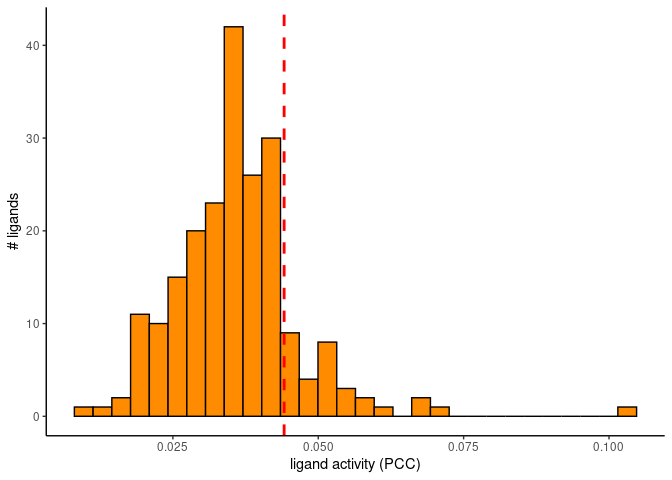
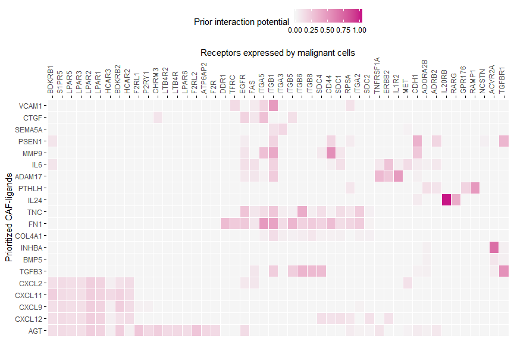
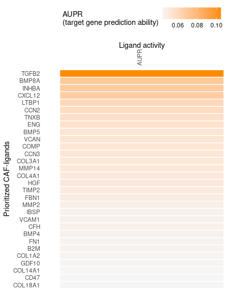
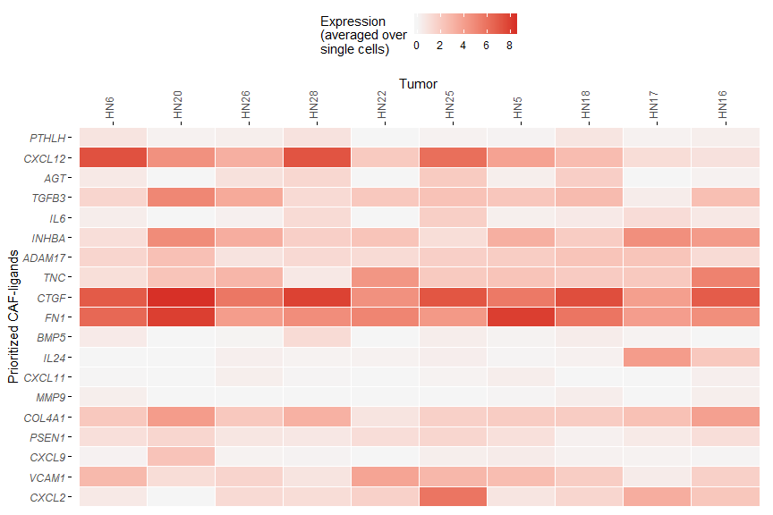

NicheNet’s ligand activity analysis on a gene set of interest: predict
active ligands and their target genes
================
Robin Browaeys
2019-01-17

<!-- github markdown built using 
rmarkdown::render("vignettes/ligand_activity_geneset.Rmd", output_format = "github_document")
-->

This vignette follows the steps described in [Perform NicheNet analysis
starting from a Seurat object: step-by-step analysis](seurat_steps.md)
with two major differences: a predefined gene set of interest is given,
and a different definition of expressed genes.

Here, we use explore intercellular communication in the tumor
microenvironment of head and neck squamous cell carcinoma (HNSCC) (Puram
et al. 2017). More specifically, we will look at which ligands expressed
by cancer-associated fibroblasts (CAFs) can induce a specific gene
program in neighboring malignant cells. The original authors of the
study have linked this partial epithelial-mesenschymal transition
(p-EMT) program to metastasis.

The used [ligand-target matrix](https://doi.org/10.5281/zenodo.7074290)
and example [expression data](https://doi.org/10.5281/zenodo.3260758) of
interacting cells can be downloaded from Zenodo.

# Prepare NicheNet analysis

### Load packages

``` r
library(nichenetr)
library(tidyverse)
```

### Read in NicheNet’s networks

The ligand-target prior model, ligand-receptor network, and weighted
integrated networks are needed for this vignette. The ligand-target
prior model is a matrix describing the potential that a ligand may
regulate a target gene, and it is used to run the ligand activity
analysis. The ligand-receptor network contains information on potential
ligand-receptor bindings, and it is used to identify potential ligands.
Finally, the weighted ligand-receptor network contains weights
representing the potential that a ligand will bind to a receptor, and it
is used for visualization.

``` r
organism <- "human"

if(organism == "human"){
  lr_network <- readRDS(url("https://zenodo.org/record/7074291/files/lr_network_human_21122021.rds"))
  ligand_target_matrix <- readRDS(url("https://zenodo.org/record/7074291/files/ligand_target_matrix_nsga2r_final.rds"))
  weighted_networks <- readRDS(url("https://zenodo.org/record/7074291/files/weighted_networks_nsga2r_final.rds"))
} else if(organism == "mouse"){
  lr_network <- readRDS(url("https://zenodo.org/record/7074291/files/lr_network_mouse_21122021.rds"))
  ligand_target_matrix <- readRDS(url("https://zenodo.org/record/7074291/files/ligand_target_matrix_nsga2r_final_mouse.rds"))
  weighted_networks <- readRDS(url("https://zenodo.org/record/7074291/files/weighted_networks_nsga2r_final_mouse.rds"))

}

lr_network <- lr_network %>% distinct(from, to)
head(lr_network)
## # A tibble: 6 × 2
##   from  to    
##   <chr> <chr> 
## 1 A2M   MMP2  
## 2 A2M   MMP9  
## 3 A2M   LRP1  
## 4 A2M   KLK3  
## 5 AANAT MTNR1A
## 6 AANAT MTNR1B
ligand_target_matrix[1:5,1:5] # target genes in rows, ligands in columns
##                     A2M        AANAT        ABCA1          ACE        ACE2
## A-GAMMA3'E 0.0000000000 0.0000000000 0.0000000000 0.0000000000 0.000000000
## A1BG       0.0018503922 0.0011108718 0.0014225077 0.0028594037 0.001139013
## A1BG-AS1   0.0007400797 0.0004677614 0.0005193137 0.0007836698 0.000375007
## A1CF       0.0024799266 0.0013026348 0.0020420890 0.0047921048 0.003273375
## A2M        0.0084693452 0.0040689323 0.0064256379 0.0105191365 0.005719199

head(weighted_networks$lr_sig) # interactions and their weights in the ligand-receptor + signaling network
## # A tibble: 6 × 3
##   from       to         weight
##   <chr>      <chr>       <dbl>
## 1 A-GAMMA3'E ACTG1P11   0.100 
## 2 A-GAMMA3'E AXIN2      0.0869
## 3 A-GAMMA3'E BUB1B-PAK6 0.0932
## 4 A-GAMMA3'E CEACAM7    0.0793
## 5 A-GAMMA3'E CHRNA1     0.0901
## 6 A-GAMMA3'E DTX2P1     0.0976
head(weighted_networks$gr) # interactions and their weights in the gene regulatory network
## # A tibble: 6 × 3
##   from  to     weight
##   <chr> <chr>   <dbl>
## 1 A1BG  A2M    0.165 
## 2 AAAS  GFAP   0.0906
## 3 AADAC CTAG1B 0.104 
## 4 AADAC CYP3A4 0.177 
## 5 AADAC DIRAS3 0.0936
## 6 AADAC IRF8   0.0892
```

### Read in the expression data of interacting cells

This is publicly available single-cell data from CAF and malignant cells
from HNSCC tumors.

``` r
hnscc_expression <- readRDS(url("https://zenodo.org/record/3260758/files/hnscc_expression.rds"))
expression <- hnscc_expression$expression
sample_info <- hnscc_expression$sample_info # contains meta-information about the cells
```

Because the NicheNet v2 networks are in the most recent version of the
official gene symbols, we will make sure that the gene symbols used in
the expression data are also updated (= converted from their “aliases”
to official gene symbols).

``` r
# If this is not done, there will be 35 genes fewer in lr_network_expressed!
colnames(expression) <- convert_alias_to_symbols(colnames(expression), "human", verbose = FALSE)
```

## 1. Define a set of potential ligands

Our research question is to prioritize which ligands expressed by CAFs
can induce p-EMT in neighboring malignant cells. Hence, we will only use
on the **sender-focused** approach, with CAFs as senders and malignant
cells as receivers.

The set of potential ligands is defined as ligands that are expressed in
sender cells whose cognate receptors are also expressed in receiver
cells.

So first, we will determine which genes are expressed in the sender
cells (CAFs) and receiver cells (malignant cells). We will only consider
samples from high quality primary tumors and also remove samples from
lymph node metastases. We will use the definition of expressed genes by
the original authors, that is, the aggregate expression of each gene $i$
across the $k$ cells, calculated as
$E_a(i) = log_{2}(average(TPM(i)1…k)+1)$, should be \>= 4.

We recommend users to define expressed genes in the way that they
consider to be most appropriate for their dataset. For single-cell data
generated by the 10x platform in our lab, we consider genes to be
expressed in a cell type when they have non-zero values in a certain
fraction of the cells from that cell type (usually 10%). This is used in
the vignette [Perform NicheNet analysis starting from a Seurat object:
step-by-step analysis](seurat_steps.md).

``` r
tumors_remove <- c("HN10","HN","HN12", "HN13", "HN24", "HN7", "HN8","HN23")

CAF_ids <- sample_info %>%
  filter(`Lymph node` == 0 & !(tumor %in% tumors_remove) &
           `non-cancer cell type` == "CAF") %>% pull(cell)
malignant_ids <- sample_info %>% filter(`Lymph node` == 0 &
                                          !(tumor %in% tumors_remove) &
                                          `classified  as cancer cell` == 1) %>% pull(cell)

expressed_genes_sender <- expression[CAF_ids,] %>%
  apply(2,function(x){10*(2**x - 1)}) %>%
  apply(2,function(x){log2(mean(x) + 1)}) %>% .[. >= 4] %>% 
  names()

expressed_genes_receiver <- expression[malignant_ids,] %>%
  apply(2,function(x){10*(2**x - 1)}) %>%
  apply(2,function(x){log2(mean(x) + 1)}) %>% .[. >= 4] %>%
  names()

length(expressed_genes_sender)
## [1] 6706
length(expressed_genes_receiver)
## [1] 6351
```

Now, we can filter the expressed ligands and receptors to only those
that putatively bind together. This information is stored in NicheNet’s
ligand-receptor network by gathering various data sources.

``` r
ligands <- lr_network %>% pull(from) %>% unique()
expressed_ligands <- intersect(ligands,expressed_genes_sender)

receptors <- lr_network %>% pull(to) %>% unique()
expressed_receptors <- intersect(receptors,expressed_genes_receiver)

potential_ligands <-  lr_network %>% filter(from %in% expressed_ligands & to %in% expressed_receptors) %>% 
  pull(from) %>% unique()

head(potential_ligands)
## [1] "A2M"    "ADAM10" "ADAM12" "ADAM15" "ADAM17" "ADAM9"
```

## 2. Define the gene set of interest and a background of genes

The gene set of interest consists of genes for which the expression is
possibly affected due to communication with other cells. The definition
of this gene set depends on your research question and is a crucial step
in the use of NicheNet.

Here, we will use the p-EMT gene set defined by the original authors as
gene set of interest to investigate how CAFs can induce p-EMT in
malignant cells.

``` r
# Only consider genes also present in the NicheNet model - this excludes genes from the gene list for which the official HGNC symbol was not used by Puram et al.
geneset_oi <- readr::read_tsv(url("https://zenodo.org/record/3260758/files/pemt_signature.txt"),
                              col_names = "gene") %>%
  pull(gene) %>% .[. %in% rownames(ligand_target_matrix)] 

length(geneset_oi)
## [1] 96
```

## 3. Define background genes

We will all genes expressed in malignant cells as the background set.

``` r
background_expressed_genes <- expressed_genes_receiver %>% .[. %in% rownames(ligand_target_matrix)]

length(background_expressed_genes)
## [1] 6288
```

## 4. Perform NicheNet ligand activity analysis

With the ligand activity analysis, we assess how well each CAF-ligand
can predict the p-EMT gene set compared to the background of expressed
genes.

``` r
ligand_activities <- predict_ligand_activities(geneset = geneset_oi,
                                               background_expressed_genes = background_expressed_genes,
                                               ligand_target_matrix = ligand_target_matrix,
                                               potential_ligands = potential_ligands)
```

Ligands are ranked based on the area under the precision-recall curve
(AUPR) between a ligand’s target predictions and the observed
transcriptional response. Although other metrics like the AUROC and
pearson correlation coefficient are also computed, we demonstrated in
our validation study that the AUPR was the most informative measure to
define ligand activity (this was the Pearson correlation for v1). The
vignette on how we performed the validation can be found at [Evaluation
of NicheNet’s ligand-target predictions](model_evaluation.md).

``` r
(ligand_activities <- ligand_activities %>% arrange(-aupr_corrected) %>%
  mutate(rank = rank(desc(aupr_corrected))))
## # A tibble: 212 × 6
##    test_ligand auroc   aupr aupr_corrected pearson  rank
##    <chr>       <dbl>  <dbl>          <dbl>   <dbl> <dbl>
##  1 TGFB2       0.772 0.120          0.105    0.195     1
##  2 BMP8A       0.774 0.0852         0.0699   0.175     2
##  3 INHBA       0.777 0.0837         0.0685   0.122     3
##  4 CXCL12      0.714 0.0829         0.0676   0.141     4
##  5 LTBP1       0.727 0.0762         0.0609   0.160     5
##  6 CCN2        0.736 0.0734         0.0581   0.141     6
##  7 TNXB        0.719 0.0717         0.0564   0.157     7
##  8 ENG         0.764 0.0703         0.0551   0.145     8
##  9 BMP5        0.750 0.0691         0.0538   0.148     9
## 10 VCAN        0.720 0.0687         0.0534   0.140    10
## # ℹ 202 more rows

best_upstream_ligands <- ligand_activities %>% top_n(30, aupr_corrected) %>%
  arrange(-aupr_corrected) %>% pull(test_ligand)

best_upstream_ligands
##  [1] "TGFB2"   "BMP8A"   "INHBA"   "CXCL12"  "LTBP1"   "CCN2"    "TNXB"    "ENG"     "BMP5"    "VCAN"    "COMP"    "CCN3"    "COL3A1"  "MMP14"  
## [15] "COL4A1"  "HGF"     "TIMP2"   "FBN1"    "MMP2"    "IBSP"    "VCAM1"   "CFH"     "BMP4"    "FN1"     "B2M"     "COL1A2"  "GDF10"   "COL14A1"
## [29] "CD47"    "COL18A1"
```

We will use the top 30 ligands to predict active target genes and
construct an active ligand-receptor network.

## 5. Infer target genes and receptors of top-ranked ligands

Active target genes are defined as genes in the gene set of interest
that have the highest regulatory potential for each top-ranked ligand.
These top targets of each ligand are based on the prior model.
Specifically, the function get_weighted_ligand_target_links will return
genes that are in the gene set of interest and are the top `n` targets
of a ligand (default: `n = 200`).

``` r
active_ligand_target_links_df <- best_upstream_ligands %>%
  lapply(get_weighted_ligand_target_links,
         geneset = geneset_oi,
         ligand_target_matrix = ligand_target_matrix,
         n = 200) %>% bind_rows()

active_ligand_target_links <- prepare_ligand_target_visualization(
  ligand_target_df = active_ligand_target_links_df,
  ligand_target_matrix = ligand_target_matrix,
  cutoff = 0.25)

order_ligands <- intersect(best_upstream_ligands, colnames(active_ligand_target_links)) %>% rev()
order_targets <- active_ligand_target_links_df$target %>% unique() %>% intersect(rownames(active_ligand_target_links))

vis_ligand_target <- t(active_ligand_target_links[order_targets,order_ligands])

p_ligand_target_network <- make_heatmap_ggplot(vis_ligand_target, "Prioritized CAF-ligands", "p-EMT genes in malignant cells",
                    color = "purple", legend_title = "Regulatory potential") +
  scale_fill_gradient2(low = "whitesmoke",  high = "purple")

p_ligand_target_network
```

<!-- -->

We can also look at which receptors of the receiver cell population
(malignant cells) can potentially bind to the prioritized ligands from
the sender cell population (CAFs).

``` r

ligand_receptor_links_df <- get_weighted_ligand_receptor_links(
  best_upstream_ligands, expressed_receptors,
  lr_network, weighted_networks$lr_sig) 

vis_ligand_receptor_network <- prepare_ligand_receptor_visualization(
  ligand_receptor_links_df,
  best_upstream_ligands,
  order_hclust = "both") 

(make_heatmap_ggplot(t(vis_ligand_receptor_network), 
                     y_name = "Prioritized CAF-ligands", x_name = "Receptors expressed by malignant cells",  
                     color = "mediumvioletred", legend_title = "Prior interaction potential"))
```

<!-- -->

## 6. Summary visualizations of the NicheNet analysis

### Load additional packages required for the visualization

``` r
library(RColorBrewer)
library(cowplot)
library(ggpubr)
```

### Prepare the ligand activity matrix

``` r
vis_ligand_aupr <- ligand_activities %>% filter(test_ligand %in% best_upstream_ligands) %>%
  column_to_rownames("test_ligand") %>% select(aupr_corrected) %>% arrange(aupr_corrected) %>% as.matrix(ncol = 1)
```

``` r
p_ligand_aupr <- make_heatmap_ggplot(vis_ligand_aupr,
                                     "Prioritized CAF-ligands", "Ligand activity",
                                     color = "darkorange", legend_title = "AUPR") + 
    theme(axis.text.x.top = element_blank())
p_ligand_aupr
```

<!-- -->

#### Prepare expression of ligands in fibroblast per tumor

Because the single-cell data was collected from multiple tumors, we will
show here the average expression of the ligands per tumor.

``` r
expression_df_CAF <- expression[CAF_ids, best_upstream_ligands] %>% data.frame() %>%
  rownames_to_column("cell") %>% as_tibble() %>%
  inner_join(sample_info %>% select(cell,tumor), by =  "cell")

aggregated_expression_CAF <- expression_df_CAF %>% group_by(tumor) %>%
  select(-cell) %>% summarise_all(mean)

aggregated_expression_df_CAF <- aggregated_expression_CAF %>% select(-tumor) %>% t() %>%
  magrittr::set_colnames(aggregated_expression_CAF$tumor) %>%
  data.frame() %>% rownames_to_column("ligand") %>% as_tibble() 

aggregated_expression_matrix_CAF <- aggregated_expression_df_CAF %>% select(-ligand) %>% as.matrix() %>%
  magrittr::set_rownames(aggregated_expression_df_CAF$ligand)

# This order was determined based on the paper from Puram et al. Tumors are ordered according to p-EMT score.
order_tumors <- c("HN6","HN20","HN26","HN28","HN22","HN25","HN5","HN18","HN17","HN16") 
vis_ligand_tumor_expression <- aggregated_expression_matrix_CAF[rev(best_upstream_ligands), order_tumors]
```

``` r
color <- colorRampPalette(rev(brewer.pal(n = 7, name ="RdYlBu")))(100)
p_ligand_tumor_expression <- make_heatmap_ggplot(vis_ligand_tumor_expression,
                                                 "Prioritized CAF-ligands", "Tumor",
                                                 color = color[100],
                                                 legend_title = "Expression\n(averaged over\nsingle cells)")
p_ligand_tumor_expression
```

<!-- -->

#### Prepare expression of target genes in malignant cells per tumor

``` r
expression_df_target <- expression[malignant_ids,geneset_oi] %>% data.frame() %>%
  rownames_to_column("cell") %>% as_tibble() %>%
  inner_join(sample_info %>% select(cell,tumor), by =  "cell") 

aggregated_expression_target <- expression_df_target %>% group_by(tumor) %>%
  select(-cell) %>% summarise_all(mean)

aggregated_expression_df_target <- aggregated_expression_target %>% select(-tumor) %>% t() %>%
  magrittr::set_colnames(aggregated_expression_target$tumor) %>%
  data.frame() %>% rownames_to_column("target") %>% as_tibble() 

aggregated_expression_matrix_target <- aggregated_expression_df_target %>% select(-target) %>%as.matrix() %>%
  magrittr::set_rownames(aggregated_expression_df_target$target)

vis_target_tumor_expression_scaled <- aggregated_expression_matrix_target %>% t() %>% scale_quantile() %>%
  .[order_tumors, order_targets]
```

``` r
p_target_tumor_scaled_expression <- make_threecolor_heatmap_ggplot(vis_target_tumor_expression_scaled,
                                                                   "Tumor", "Target",
                                                                   low_color = color[1], mid_color = color[50], mid = 0.5,
                                                                   high_color = color[100],
                                                                   legend_title = "Scaled expression\n(averaged over\nsingle cells)")
p_target_tumor_scaled_expression
```

<!-- -->

#### Combine the different heatmaps in one overview figure

``` r

figures_without_legend = plot_grid(
  p_ligand_aupr + theme(legend.position = "none"),
  p_ligand_tumor_expression + theme(legend.position = "none",
                                    axis.title.y = element_blank()),
  p_ligand_target_network + theme(legend.position = "none",
                                  axis.ticks = element_blank(),
                                  axis.title.y = element_blank()), 
  NULL,
  NULL,
  p_target_tumor_scaled_expression + theme(legend.position = "none",
                                           axis.title.x = element_blank()), 
  align = "hv",
  nrow = 2,
  rel_widths = c(ncol(vis_ligand_aupr)+6, ncol(vis_ligand_tumor_expression), ncol(vis_ligand_target))-2,
  rel_heights = c(nrow(vis_ligand_aupr), nrow(vis_target_tumor_expression_scaled)+3)) 

legends = plot_grid(
  as_ggplot(get_legend(p_ligand_aupr)),
  as_ggplot(get_legend(p_ligand_tumor_expression)),
  as_ggplot(get_legend(p_ligand_target_network)),
  as_ggplot(get_legend(p_target_tumor_scaled_expression)),
  nrow = 2,
  align = "h")

plot_grid(figures_without_legend, 
          legends, 
          rel_heights = c(10,2), nrow = 2, align = "hv")
```

<!-- -->

``` r
sessionInfo()
## R version 4.3.2 (2023-10-31)
## Platform: x86_64-redhat-linux-gnu (64-bit)
## Running under: CentOS Stream 8
## 
## Matrix products: default
## BLAS/LAPACK: /usr/lib64/libopenblaso-r0.3.15.so;  LAPACK version 3.9.0
## 
## locale:
##  [1] LC_CTYPE=en_US.UTF-8       LC_NUMERIC=C               LC_TIME=en_US.UTF-8        LC_COLLATE=en_US.UTF-8     LC_MONETARY=en_US.UTF-8   
##  [6] LC_MESSAGES=en_US.UTF-8    LC_PAPER=en_US.UTF-8       LC_NAME=C                  LC_ADDRESS=C               LC_TELEPHONE=C            
## [11] LC_MEASUREMENT=en_US.UTF-8 LC_IDENTIFICATION=C       
## 
## time zone: Asia/Bangkok
## tzcode source: system (glibc)
## 
## attached base packages:
## [1] stats     graphics  grDevices utils     datasets  methods   base     
## 
## other attached packages:
##  [1] ggpubr_0.6.0       cowplot_1.1.2      RColorBrewer_1.1-3 forcats_1.0.0      stringr_1.5.0      dplyr_1.1.4        purrr_1.0.2       
##  [8] readr_2.1.2        tidyr_1.3.0        tibble_3.2.1       ggplot2_3.4.4      tidyverse_1.3.1    nichenetr_2.0.4    testthat_3.2.1    
## 
## loaded via a namespace (and not attached):
##   [1] fs_1.6.3               matrixStats_1.2.0      spatstat.sparse_3.0-3  bitops_1.0-7           devtools_2.4.3         lubridate_1.9.3       
##   [7] doParallel_1.0.17      httr_1.4.7             tools_4.3.2            sctransform_0.4.0      backports_1.4.1        utf8_1.2.4            
##  [13] R6_2.5.1               lazyeval_0.2.2         uwot_0.1.16            GetoptLong_1.0.5       withr_2.5.2            sp_2.1-2              
##  [19] gridExtra_2.3          fdrtool_1.2.17         progressr_0.14.0       cli_3.6.2              DiceKriging_1.6.0      spatstat.explore_3.2-1
##  [25] labeling_0.4.3         Seurat_4.4.0           spatstat.data_3.0-3    randomForest_4.7-1.1   proxy_0.4-27           ggridges_0.5.5        
##  [31] pbapply_1.7-2          foreign_0.8-85         smoof_1.6.0.3          parallelly_1.36.0      sessioninfo_1.2.2      limma_3.56.2          
##  [37] readxl_1.4.3           rstudioapi_0.15.0      shape_1.4.6            visNetwork_2.1.2       generics_0.1.3         vroom_1.6.5           
##  [43] ica_1.0-3              spatstat.random_3.2-2  car_3.1-2              Matrix_1.6-4           S4Vectors_0.38.1       fansi_1.0.6           
##  [49] abind_1.4-5            lifecycle_1.0.4        yaml_2.3.8             carData_3.0-5          recipes_1.0.7          Rtsne_0.17            
##  [55] grid_4.3.2             promises_1.2.1         crayon_1.5.2           miniUI_0.1.1.1         lattice_0.21-9         haven_2.4.3           
##  [61] ComplexHeatmap_2.16.0  mlr_2.19.1             pillar_1.9.0           knitr_1.45             rjson_0.2.21           future.apply_1.11.0   
##  [67] codetools_0.2-19       fastmatch_1.1-4        leiden_0.3.9           glue_1.6.2             ParamHelpers_1.14.1    data.table_1.14.10    
##  [73] remotes_2.4.2          vctrs_0.6.5            png_0.1-8              spam_2.10-0            cellranger_1.1.0       gtable_0.3.4          
##  [79] assertthat_0.2.1       cachem_1.0.8           gower_1.0.1            xfun_0.41              mime_0.12              prodlim_2023.08.28    
##  [85] survival_3.5-7         timeDate_4032.109      iterators_1.0.14       hardhat_1.3.0          lava_1.7.3             DiagrammeR_1.0.10     
##  [91] ellipsis_0.3.2         fitdistrplus_1.1-11    ROCR_1.0-11            ipred_0.9-14           nlme_3.1-163           usethis_2.2.2         
##  [97] bit64_4.0.5            RcppAnnoy_0.0.21       rprojroot_2.0.4        irlba_2.3.5.1          KernSmooth_2.23-22     rpart_4.1.21          
## [103] BiocGenerics_0.46.0    colorspace_2.1-0       DBI_1.1.3              Hmisc_5.1-0            nnet_7.3-19            tidyselect_1.2.0      
## [109] bit_4.0.5              compiler_4.3.2         parallelMap_1.5.1      rvest_1.0.2            htmlTable_2.4.1        xml2_1.3.6            
## [115] desc_1.4.3             plotly_4.10.0          shadowtext_0.1.2       checkmate_2.3.1        scales_1.3.0           caTools_1.18.2        
## [121] lmtest_0.9-40          digest_0.6.33          goftest_1.2-3          spatstat.utils_3.0-4   rmarkdown_2.11         htmltools_0.5.7       
## [127] pkgconfig_2.0.3        base64enc_0.1-3        lhs_1.1.6              highr_0.10             dbplyr_2.1.1           fastmap_1.1.1         
## [133] GlobalOptions_0.1.2    rlang_1.1.2            htmlwidgets_1.6.2      shiny_1.7.1            BBmisc_1.13            farver_2.1.1          
## [139] zoo_1.8-12             jsonlite_1.8.8         mlrMBO_1.1.5.1         ModelMetrics_1.2.2.2   magrittr_2.0.3         Formula_1.2-5         
## [145] dotCall64_1.1-1        patchwork_1.1.3        munsell_0.5.0          Rcpp_1.0.11            ggnewscale_0.4.9       reticulate_1.34.0     
## [151] stringi_1.7.6          pROC_1.18.5            brio_1.1.4             MASS_7.3-60            plyr_1.8.9             pkgbuild_1.4.3        
## [157] parallel_4.3.2         listenv_0.9.0          ggrepel_0.9.4          deldir_2.0-2           splines_4.3.2          tensor_1.5            
## [163] circlize_0.4.15        hms_1.1.3              igraph_1.2.11          spatstat.geom_3.2-7    ggsignif_0.6.4         reshape2_1.4.4        
## [169] stats4_4.3.2           pkgload_1.3.3          reprex_2.0.1           evaluate_0.23          SeuratObject_5.0.1     modelr_0.1.8          
## [175] tweenr_2.0.2           tzdb_0.4.0             foreach_1.5.2          httpuv_1.6.13          RANN_2.6.1             polyclip_1.10-6       
## [181] clue_0.3-64            future_1.33.0          scattermore_1.2        ggforce_0.4.1          broom_0.7.12           xtable_1.8-4          
## [187] emoa_0.5-0.2           e1071_1.7-14           rstatix_0.7.2          later_1.3.2            viridisLite_0.4.2      class_7.3-22          
## [193] IRanges_2.34.1         memoise_2.0.1          cluster_2.1.4          timechange_0.2.0       globals_0.16.2         caret_6.0-94
```

## References

<div id="refs" class="references csl-bib-body hanging-indent">

<div id="ref-puram_single-cell_2017" class="csl-entry">

Puram, Sidharth V., Itay Tirosh, Anuraag S. Parikh, Anoop P. Patel,
Keren Yizhak, Shawn Gillespie, Christopher Rodman, et al. 2017.
“Single-Cell Transcriptomic Analysis of Primary and Metastatic Tumor
Ecosystems in Head and Neck Cancer.” *Cell* 171 (7): 1611–1624.e24.
<https://doi.org/10.1016/j.cell.2017.10.044>.

</div>

</div>
