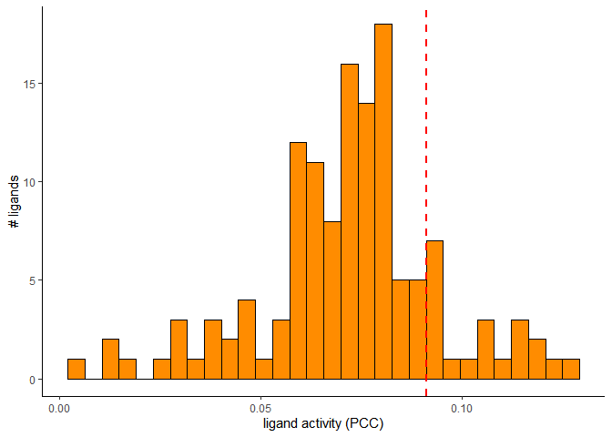
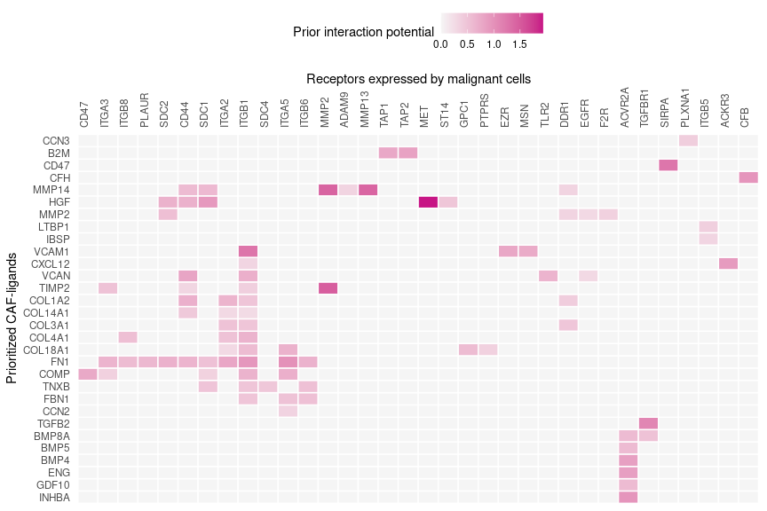

NicheNet’s ligand activity analysis on a gene set of interest
================
Robin Browaeys
2019-01-17

<!-- github markdown built using 
rmarkdown::render("vignettes/ligand_activity_geneset.Rmd", output_format = "github_document")
-->

This vignette shows how NicheNet can be used to predict which ligands
might regulate a given set of genes. For this analysis, you need to
define:

  - a set of genes of which expression in a “receiver cell” is possibly
    affected by extracellular protein signals (ligands) (e.g. genes
    differentially expressed upon cell-cell interaction )
  - a set of potentially active ligands (e.g. ligands expressed by
    interacting “sender cells”)

Therefore, you often first need to process expression data of
interacting cells to define both.

In this example, we will use data from Puram et al. to explore
intercellular communication in the tumor microenvironment in head and
neck squamous cell carcinoma (HNSCC) (See Puram et al. 2017). More
specifically, we will look at which ligands expressed by fibroblasts can
induce a specific gene program in neighboring malignant cells. This
program, a partial epithelial-mesenschymal transition (p-EMT) program,
could be linked by Puram et al. to metastasis.

For this analysis, we will assess the ligand activity of each ligand, or
in other words, we will assess how well each fibroblast ligand can
predict the p-EMT gene set compared to the background of expressed
genes. This allows us to prioritize p-EMT-regulating ligands. In a final
step, we will then infer target genes of these top ligands.

The used ligand-target matrix and example expression data of interacting
cells can be downloaded from Zenodo.
[](https://doi.org/10.5281/zenodo.3260758)

### Load packages required for this vignette

``` r
library(nichenetr)
library(tidyverse)
```

### Read in expression data of interacting cells

First, we will read in the publicly available single-cell data from
fibroblast and malignant cells from HNSCC
tumors.

``` r
hnscc_expression = readRDS(url("https://zenodo.org/record/3260758/files/hnscc_expression.rds"))
expression = hnscc_expression$expression
sample_info = hnscc_expression$sample_info # contains meta-information about the cells
```

Secondly, we will determine which genes are expressed in fibroblasts and
malignant cells from high quality primary tumors. Therefore, we wil not
consider cells from tumor samples of less quality or from lymph node
metastases. To determine expressed genes, we use the definition used by
of Puram et
al.

``` r
tumors_remove = c("HN10","HN","HN12", "HN13", "HN24", "HN7", "HN8","HN23")

fibroblast_ids = sample_info %>% filter(`Lymph node` == 0 & !(tumor %in% tumors_remove) & `non-cancer cell type` == "Fibroblast") %>% pull(cell)
malignant_ids = sample_info %>% filter(`Lymph node` == 0 & !(tumor %in% tumors_remove) & `classified  as cancer cell` == 1) %>% pull(cell)

expressed_genes_fibroblasts = expression[fibroblast_ids,] %>% apply(2,function(x){10*(2**x - 1)}) %>% apply(2,function(x){log2(mean(x) + 1)}) %>% .[. >= 4] %>% names()
expressed_genes_malignant = expression[malignant_ids,] %>% apply(2,function(x){10*(2**x - 1)}) %>% apply(2,function(x){log2(mean(x) + 1)}) %>% .[. >= 4] %>% names()
```

### Load the ligand-target model we want to use

``` r
ligand_target_matrix = readRDS(url("https://zenodo.org/record/3260758/files/ligand_target_matrix.rds"))
ligand_target_matrix[1:5,1:5] # target genes in rows, ligands in columns
##                 CXCL1        CXCL2        CXCL3        CXCL5         PPBP
## A1BG     3.534343e-04 4.041324e-04 3.729920e-04 3.080640e-04 2.628388e-04
## A1BG-AS1 1.650894e-04 1.509213e-04 1.583594e-04 1.317253e-04 1.231819e-04
## A1CF     5.787175e-04 4.596295e-04 3.895907e-04 3.293275e-04 3.211944e-04
## A2M      6.027058e-04 5.996617e-04 5.164365e-04 4.517236e-04 4.590521e-04
## A2M-AS1  8.898724e-05 8.243341e-05 7.484018e-05 4.912514e-05 5.120439e-05
```

### Load the gene set of interest and background of genes

As gene set of interest, we consider the genes of which the expression
is possibly affected due to communication with other cells.

Because we here want to investigate how fibroblasts regulate the
expression of p-EMT genes in malignant cells, we will use the p-EMT gene
set defined by Puram et al. as gene set of interset and use all genes
expressed in malignant cells as background of
genes.

``` r
pemt_geneset = readr::read_tsv(url("https://zenodo.org/record/3260758/files/pemt_signature.txt"), col_names = "gene") %>% pull(gene) %>% .[. %in% rownames(ligand_target_matrix)] # only consider genes also present in the NicheNet model - this excludes genes from the gene list for which the official HGNC symbol was not used by Puram et al.
head(pemt_geneset)
## [1] "SERPINE1" "TGFBI"    "MMP10"    "LAMC2"    "P4HA2"    "PDPN"

background_expressed_genes = expressed_genes_malignant %>% .[. %in% rownames(ligand_target_matrix)]
head(background_expressed_genes)
## [1] "RPS11"   "ELMO2"   "PNMA1"   "MMP2"    "TMEM216" "ERCC5"
```

### Perform NicheNet’s ligand activity analysis on the gene set of interest

In a first step, we will define a set of potentially active ligands. As
potentially active ligands, we will use ligands that are 1) expressed by
fibroblasts and 2) can bind a (putative) receptor expressed by malignant
cells. Putative ligand-receptor links were gathered from NicheNet’s
ligand-receptor data
sources.

``` r
lr_network = readRDS(url("https://zenodo.org/record/3260758/files/lr_network.rds"))

ligands = lr_network %>% pull(from) %>% unique()
expressed_ligands = intersect(ligands,expressed_genes_fibroblasts)

receptors = lr_network %>% pull(to) %>% unique()
expressed_receptors = intersect(receptors,expressed_genes_malignant)

potential_ligands = lr_network %>% filter(from %in% expressed_ligands & to %in% expressed_receptors) %>% pull(from) %>% unique()
head(potential_ligands)
## [1] "IL15"   "CD99"   "COL1A1" "FN1"    "TNC"    "IBSP"
```

Now perform the ligand activity analysis: infer how well NicheNet’s
ligand-target potential scores can predict whether a gene belongs to the
p-EMT program or
not.

``` r
ligand_activities = predict_ligand_activities(geneset = pemt_geneset, background_expressed_genes = background_expressed_genes, ligand_target_matrix = ligand_target_matrix, potential_ligands = potential_ligands)
```

Now, we want to rank the ligands based on their ligand activity. In our
validation study, we showed that the pearson correlation between a
ligand’s target predictions and the observed transcriptional response
was the most informative measure to define ligand activity. Therefore,
we will rank the ligands based on their pearson correlation coefficient.

``` r
ligand_activities %>% arrange(-pearson) 
## # A tibble: 99 x 4
##    test_ligand auroc   aupr pearson
##    <chr>       <dbl>  <dbl>   <dbl>
##  1 CXCL12      0.680 0.0507  0.123 
##  2 AGT         0.676 0.0581  0.120 
##  3 IL6         0.693 0.0510  0.115 
##  4 ADAM17      0.672 0.0526  0.113 
##  5 TNC         0.700 0.0444  0.109 
##  6 CTGF        0.680 0.0473  0.108 
##  7 FN1         0.679 0.0505  0.108 
##  8 LEFTY2      0.689 0.0427  0.104 
##  9 COL4A1      0.690 0.0376  0.0942
## 10 PSEN1       0.662 0.0432  0.0923
## # ... with 89 more rows
best_upstream_ligands = ligand_activities %>% top_n(20, pearson) %>% arrange(-pearson) %>% pull(test_ligand)
head(best_upstream_ligands)
## [1] "CXCL12" "AGT"    "IL6"    "ADAM17" "TNC"    "CTGF"
```

We see here that the top-ranked ligands can predict the p-EMT genes
reasonably, this implies that ranking of the ligands might be accurate
as shown in our study. However, it is possible that for some gene sets,
the target gene prediction performance of the top-ranked ligands would
not be much better than random prediction. In that case, prioritization
of ligands will be less trustworthy.

### Infer target genes of top-ranked ligands and visualize in a heatmap

Now we will show how you can look at the regulatory potential scores
between ligands and target genes of interest. In this case, we will look
at links between top-ranked p-EMT regulating ligands and p-EMT genes. In
the ligand-target heatmaps, we showed regulatory potential scores for
interactions between the 20 top-ranked ligands and following target
genes: genes that belong to the gene set of interest and to the 250 most
strongly predicted targets of at least one of the 20 top-ranked ligands.
For visualization purposes, we adapted the ligand-target regulatory
potential matrix as follows. Regulatory potential scores were set as 0
if their score was below a predefined threshold, which was here the 0.25
quantile of scores of interactions between the 20 top-ranked ligands and
each of their respective 250 top
targets.

``` r
active_ligand_target_links_df = best_upstream_ligands %>% lapply(get_weighted_ligand_target_links,geneset = pemt_geneset, ligand_target_matrix = ligand_target_matrix, n = 250) %>% bind_rows()

active_ligand_target_links = prepare_ligand_target_visualization(ligand_target_df = active_ligand_target_links_df, ligand_target_matrix = ligand_target_matrix, cutoff = 0.25)
```

The putatively active ligand-target links will be visualized in a
heatmap.

``` r
p_ligand_target_network = active_ligand_target_links %>% t() %>% make_heatmap_ggplot("Prioritized fibroblast ligands","p-EMT genes in malignant cells", color = "purple",legend_position = "top", x_axis_position = "top") + scale_fill_gradient2(low = "whitesmoke",  high = "purple", breaks = c(0,0.005,0.01))

p_ligand_target_network
```

<!-- -->

### Show the predicted ligand-receptor interactions of the top-ranked ligands and visualize in a heatmap

``` r
# get the ligand-receptor network of the top-ranked ligands
lr_network_top = lr_network %>% filter(from %in% best_upstream_ligands & to %in% expressed_receptors) %>% distinct(from,to)
best_upstream_receptors = lr_network_top %>% pull(to) %>% unique()

# get the weights of the ligand-receptor interactions as used in the NicheNet model
weighted_networks = readRDS(url("https://zenodo.org/record/3260758/files/weighted_networks.rds"))
lr_network_top_df = weighted_networks$lr_sig %>% filter(from %in% best_upstream_ligands & to %in% best_upstream_receptors)

# convert to a matrix
lr_network_top_df = lr_network_top_df %>% spread("from","weight",fill = 0)
lr_network_top_matrix = lr_network_top_df %>% select(-to) %>% as.matrix() %>% magrittr::set_rownames(lr_network_top_df$to)

# perform hierarchical clustering to order the ligands and receptors
distoi = dist(lr_network_top_matrix, method = "binary")
hclust_obj = hclust(distoi, method = "ward.D2")
order_receptors = hclust_obj$labels[hclust_obj$order]

distoi_targets = dist(lr_network_top_matrix %>% t(), method = "binary")
hclust_obj = hclust(distoi_targets, method = "ward.D2")
order_ligands_receptor = hclust_obj$labels[hclust_obj$order]
```

Show a heatmap of the ligand-receptor
interactions

``` r
vis_ligand_receptor_network = lr_network_top_matrix[order_receptors, order_ligands_receptor]
p_ligand_receptor_network = vis_ligand_receptor_network %>% t() %>% make_heatmap_ggplot("Prioritized fibroblast ligands","Receptors expressed by malignant cells", color = "mediumvioletred", x_axis_position = "top")
p_ligand_receptor_network
```

<!-- -->

### Follow-up analyses

As follow-up analysis, you can infer possible signaling paths between
ligands and targets of interest. You can read how to do this in the
following vignette [Inferring ligand-to-target signaling
paths](ligand_target_signaling_path.md):`vignette("ligand_target_signaling_path",
package="nichenetr")`.

Another follow-up analysis is getting a “tangible” measure of how well
top-ranked ligands predict the gene set of interest and assess which
genes of the gene set can be predicted well. You can read how to do this
in the following vignette [Assess how well top-ranked ligands can
predict a gene set of
interest](target_prediction_evaluation_geneset.md):`vignette("target_prediction_evaluation_geneset",
package="nichenetr")`.

In case you want to visualize ligand-target links between multiple
interacting cells, you can make an appealing circos plot as shown in
vignette [Circos plot visualization to show active ligand-target links
between interacting cells](circos.md):`vignette("circos",
package="nichenetr")`.

### References

<div id="refs" class="references">

<div id="ref-puram_single-cell_2017">

Puram, Sidharth V., Itay Tirosh, Anuraag S. Parikh, Anoop P. Patel,
Keren Yizhak, Shawn Gillespie, Christopher Rodman, et al. 2017.
“Single-Cell Transcriptomic Analysis of Primary and Metastatic Tumor
Ecosystems in Head and Neck Cancer.” *Cell* 171 (7): 1611–1624.e24.
<https://doi.org/10.1016/j.cell.2017.10.044>.

</div>

</div>
