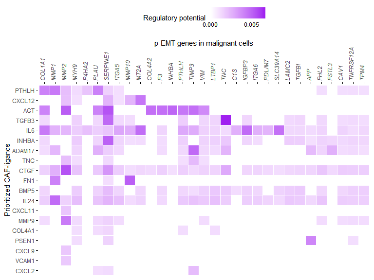

NicheNet’s ligand activity analysis on a gene set of interest: predict
active ligands and their target genes
================
Robin Browaeys
2019-01-17

<!-- github markdown built using 
rmarkdown::render("vignettes/ligand_activity_geneset.Rmd", output_format = "github_document")
-->

In this vignette, you can learn how to perform a basic NicheNet
analysis. A NicheNet analysis can help you to generate hypotheses about
an intercellular communication process of interest for which you have
bulk or single-cell gene expression data. Specifically, NicheNet can
predict 1) which ligands from one cell population (“sender/niche”) are
most likely to affect target gene expression in an interacting cell
population (“receiver/target”) and 2) which specific target genes are
affected by which of these predicted ligands. The pipeline of a basic
NicheNet analysis consist mainly of the following steps:

  - 1.  Define a “sender/niche” cell population and a “receiver/target”
        cell population present in your expression data and determine
        which genes are expressed in both populations

  - 2.  Define a gene set of interest: these are the genes in the
        “receiver/target” cell population that are potentially
        affected by ligands expressed by interacting cells (e.g. genes
        differentially expressed upon cell-cell interaction)

  - 3.  Define a set of potential ligands: these are ligands that are
        expressed by the “sender/niche” cell population and bind a
        (putative) receptor expressed by the “receiver/target”
        population

  - 4)  Perform NicheNet ligand activity analysis: rank the potential
        ligands based on the presence of their target genes in the gene
        set of interest (compared to the background set of genes)

  - 5)  Infer top-predicted target genes of ligands that are top-ranked
        in the ligand activity analysis

This vignette guides you in detail through all these steps. As example
expression data of interacting cells, we will use data from Puram et
al. to explore intercellular communication in the tumor
microenvironment in head and neck squamous cell carcinoma (HNSCC) (See
Puram et al. 2017). More specifically, we will look at which ligands
expressed by cancer-associated fibroblasts (CAFs) can induce a specific
gene program in neighboring malignant cells. This program, a partial
epithelial-mesenschymal transition (p-EMT) program, could be linked to
metastasis by Puram et al. 

For this analysis, we will assess the ligand activity of each ligand, or
in other words, we will assess how well each CAF-ligand can predict the
p-EMT gene set compared to the background of expressed genes. This
allows us to prioritize p-EMT-regulating ligands. In a final step, we
will then infer target genes of these top ligands.

The used ligand-target matrix and example expression data of interacting
cells can be downloaded from Zenodo.
[](https://doi.org/10.5281/zenodo.3260758)

## Step 0: Load required packages, NicheNet ligand-target prior model and processed expression data of interacting cells

Packages:

``` r
library(nichenetr)
library(tidyverse)
```

Ligand-target
model:

``` r
ligand_target_matrix = readRDS(url("https://zenodo.org/record/3260758/files/ligand_target_matrix.rds"))
## dim
## dimnames
ligand_target_matrix[1:5,1:5] # target genes in rows, ligands in columns
##                 CXCL1        CXCL2        CXCL3        CXCL5         PPBP
## A1BG     3.534343e-04 4.041324e-04 3.729920e-04 3.080640e-04 2.628388e-04
## A1BG-AS1 1.650894e-04 1.509213e-04 1.583594e-04 1.317253e-04 1.231819e-04
## A1CF     5.787175e-04 4.596295e-04 3.895907e-04 3.293275e-04 3.211944e-04
## A2M      6.027058e-04 5.996617e-04 5.164365e-04 4.517236e-04 4.590521e-04
## A2M-AS1  8.898724e-05 8.243341e-05 7.484018e-05 4.912514e-05 5.120439e-05
```

Expression data of interacting cells: publicly available single-cell
data from CAF and malignant cells from HNSCC
tumors:

``` r
hnscc_expression = readRDS(url("https://zenodo.org/record/3260758/files/hnscc_expression.rds"))
##   [1]
##   [2]
## [1]
## [2]
## [3]
## [4]
## [5]
## [6]
## [7]
##   [3]
## names
expression = hnscc_expression$expression
sample_info = hnscc_expression$sample_info # contains meta-information about the cells
```

## Step 1: Define expressed genes in sender and receiver cell populations

Our research question is to prioritize which ligands expressed by CAFs
can induce p-EMT in neighboring malignant cells. Therefore, CAFs are the
sender cells in this example and malignant cells are the receiver cells.

Now, we will determine which genes are expressed in the sender cells
(CAFs) and receiver cells (malignant cells) from high quality primary
tumors. Therefore, we wil not consider cells from tumor samples of less
quality or from lymph node metastases.

To determine expressed genes in this case study, we use the definition
used by Puram et al. (the authors of this dataset), which is: Ea, the
aggregate expression of each gene i across the k cells, calculated as
Ea(i) = log2(average(TPM(i)1…k)+1), should be \>= 4. We recommend users
to define expressed genes in the way that they consider to be most
appropriate for their
dataset.

``` r
tumors_remove = c("HN10","HN","HN12", "HN13", "HN24", "HN7", "HN8","HN23")

CAF_ids = sample_info %>% filter(`Lymph node` == 0 & !(tumor %in% tumors_remove) & `non-cancer cell type` == "CAF") %>% pull(cell)
malignant_ids = sample_info %>% filter(`Lymph node` == 0 & !(tumor %in% tumors_remove) & `classified  as cancer cell` == 1) %>% pull(cell)

expressed_genes_sender = expression[CAF_ids,] %>% apply(2,function(x){10*(2**x - 1)}) %>% apply(2,function(x){log2(mean(x) + 1)}) %>% .[. >= 4] %>% names()
expressed_genes_receiver = expression[malignant_ids,] %>% apply(2,function(x){10*(2**x - 1)}) %>% apply(2,function(x){log2(mean(x) + 1)}) %>% .[. >= 4] %>% names()
```

## Step 2: Define the gene set of interest and a background of genes

As gene set of interest, we consider the genes of which the expression
is possibly affected due to communication with other cells. The
definition of this gene set depends on your research question and is a
crucial step in the use of NicheNet.

Because we here want to investigate how CAFs regulate the expression of
p-EMT genes in malignant cells, we will use the p-EMT gene set defined
by Puram et al. as gene set of interest and use all genes expressed in
malignant cells as background of
genes.

``` r
geneset_oi = readr::read_tsv(url("https://zenodo.org/record/3260758/files/pemt_signature.txt"), col_names = "gene") %>% pull(gene) %>% .[. %in% rownames(ligand_target_matrix)] # only consider genes also present in the NicheNet model - this excludes genes from the gene list for which the official HGNC symbol was not used by Puram et al.
head(geneset_oi)
## [1] "SERPINE1" "TGFBI"    "MMP10"    "LAMC2"    "P4HA2"    "PDPN"

background_expressed_genes = expressed_genes_receiver %>% .[. %in% rownames(ligand_target_matrix)]
head(background_expressed_genes)
## [1] "RPS11"   "ELMO2"   "PNMA1"   "MMP2"    "TMEM216" "ERCC5"
```

## Step 3: Define a set of potential ligands

As potentially active ligands, we will use ligands that are 1) expressed
by CAFs and 2) can bind a (putative) receptor expressed by malignant
cells. Putative ligand-receptor links were gathered from NicheNet’s
ligand-receptor data
sources.

``` r
lr_network = readRDS(url("https://zenodo.org/record/3260758/files/lr_network.rds"))
##   [1]
##   [2]
##   [3]
##   [4]
## row.names
## class
## names

# If wanted, users can remove ligand-receptor interactions that were predicted based on protein-protein interactions and only keep ligand-receptor interactions that are described in curated databases. To do this: uncomment following line of code:
# lr_network = lr_network %>% filter(database != "ppi_prediction_go" & database != "ppi_prediction")

ligands = lr_network %>% pull(from) %>% unique()
expressed_ligands = intersect(ligands,expressed_genes_sender)

receptors = lr_network %>% pull(to) %>% unique()
expressed_receptors = intersect(receptors,expressed_genes_receiver)

potential_ligands = lr_network %>% filter(from %in% expressed_ligands & to %in% expressed_receptors) %>% pull(from) %>% unique()
head(potential_ligands)
## [1] "HGF"     "TNFSF10" "TGFB2"   "TGFB3"   "INHBA"   "CD99"
```

## Step 4: Perform NicheNet’s ligand activity analysis on the gene set of interest

Now perform the ligand activity analysis: infer how well NicheNet’s
ligand-target potential scores can predict whether a gene belongs to the
p-EMT program or
not.

``` r
ligand_activities = predict_ligand_activities(geneset = geneset_oi, background_expressed_genes = background_expressed_genes, ligand_target_matrix = ligand_target_matrix, potential_ligands = potential_ligands)
```

Now, we want to rank the ligands based on their ligand activity. In our
validation study, we showed that the pearson correlation coefficient
(PCC) between a ligand’s target predictions and the observed
transcriptional response was the most informative measure to define
ligand activity. Therefore, we will rank the ligands based on their
pearson correlation coefficient.

``` r
ligand_activities %>% arrange(-pearson) 
## # A tibble: 131 x 4
##    test_ligand auroc   aupr pearson
##    <chr>       <dbl>  <dbl>   <dbl>
##  1 PTHLH       0.667 0.0720   0.128
##  2 CXCL12      0.680 0.0507   0.123
##  3 AGT         0.676 0.0581   0.120
##  4 TGFB3       0.689 0.0454   0.117
##  5 IL6         0.693 0.0510   0.115
##  6 INHBA       0.695 0.0502   0.113
##  7 ADAM17      0.672 0.0526   0.113
##  8 TNC         0.700 0.0444   0.109
##  9 CTGF        0.680 0.0473   0.108
## 10 FN1         0.679 0.0505   0.108
## # ... with 121 more rows
best_upstream_ligands = ligand_activities %>% top_n(20, pearson) %>% arrange(-pearson) %>% pull(test_ligand)
head(best_upstream_ligands)
## [1] "PTHLH"  "CXCL12" "AGT"    "TGFB3"  "IL6"    "INHBA"
```

We see here that the performance metrics indicate that the 20 top-ranked
ligands can predict the p-EMT genes reasonably, this implies that
ranking of the ligands might be accurate as shown in our study. However,
it is possible that for some gene sets, the target gene prediction
performance of the top-ranked ligands would not be much better than
random prediction. In that case, prioritization of ligands will be less
trustworthy.

Additional note: we looked at the top 20 ligands here and will continue
the analysis by inferring p-EMT target genes of these 20 ligands.
However, the choice of looking only at the 20 top-ranked ligands for
further biological interpretation is based on biological intuition and
is quite arbitrary. Therefore, users can decide to continue the analysis
with a different number of ligands. We recommend to check the selected
cutoff by looking at the distribution of the ligand activity values.
Here, we show the ligand activity histogram (the score for the 20th
ligand is indicated via the dashed line).

``` r
# show histogram of ligand activity scores
p_hist_lig_activity = ggplot(ligand_activities, aes(x=pearson)) + 
  geom_histogram(color="black", fill="darkorange")  + 
  # geom_density(alpha=.1, fill="orange") +
  geom_vline(aes(xintercept=min(ligand_activities %>% top_n(20, pearson) %>% pull(pearson))), color="red", linetype="dashed", size=1) + 
  labs(x="ligand activity (PCC)", y = "# ligands") +
  theme_classic()
##   [1]
## [1]
## [2]
## [3]
## [4]
## [5]
##   [2]
##   [3]
## [1]
##   [4]
##   [5]
## names
##   [1]
## [1]
## [2]
## [3]
## [4]
## [5]
##   [2]
##   [3]
## [1]
##   [4]
##   [5]
## names
##   [1]
## [1]
## [2]
## [3]
## [4]
## [5]
## [6]
## [7]
## [8]
##   [2]
##   [3]
## [1]
##   [4]
##   [5]
## names
##   [1]
## [1]
## [2]
## [3]
## [4]
## [5]
##   [2]
##   [3]
## [1]
##   [4]
##   [5]
## names
##   <environment: namespace:ggplot2>
## mapping
##   <environment: namespace:ggplot2>
## object
## plot
## object_name
##   <environment: namespace:ggplot2>
## p
## labels
##   <environment: namespace:ggplot2>
## e1
## e2
##   <environment: namespace:ggplot2>
## base_size
## base_family
## base_line_size
## base_rect_size
##   <environment: namespace:ggplot2>
## base_size
## base_family
## base_line_size
## base_rect_size
##   <environment: namespace:ggplot2>
## line
## rect
## text
## title
## aspect.ratio
## axis.title
## axis.title.x
## axis.title.x.top
## axis.title.x.bottom
## axis.title.y
## axis.title.y.left
## axis.title.y.right
## axis.text
## axis.text.x
## axis.text.x.top
## axis.text.x.bottom
## axis.text.y
## axis.text.y.left
## axis.text.y.right
## axis.ticks
## axis.ticks.x
## axis.ticks.x.top
## axis.ticks.x.bottom
## axis.ticks.y
## axis.ticks.y.left
## axis.ticks.y.right
## axis.ticks.length
## axis.line
## axis.line.x
## axis.line.x.top
## axis.line.x.bottom
## axis.line.y
## axis.line.y.left
## axis.line.y.right
## legend.background
## legend.margin
## legend.spacing
## legend.spacing.x
## legend.spacing.y
## legend.key
## legend.key.size
## legend.key.height
## legend.key.width
## legend.text
## legend.text.align
## legend.title
## legend.title.align
## legend.position
## legend.direction
## legend.justification
## legend.box
## legend.box.just
## legend.box.margin
## legend.box.background
## legend.box.spacing
## panel.background
## panel.border
## panel.spacing
## panel.spacing.x
## panel.spacing.y
## panel.grid
## panel.grid.major
## panel.grid.minor
## panel.grid.major.x
## panel.grid.major.y
## panel.grid.minor.x
## panel.grid.minor.y
## panel.ontop
## plot.background
## plot.title
## plot.subtitle
## plot.caption
## plot.tag
## plot.tag.position
## plot.margin
## strip.background
## strip.background.x
## strip.background.y
## strip.placement
## strip.text
## strip.text.x
## strip.text.y
## strip.switch.pad.grid
## strip.switch.pad.wrap
## ...
## complete
## validate
## [1]
## [2]
## [3]
##   <environment: namespace:ggplot2>
## ...
##   <environment: namespace:ggplot2>
## colour
## size
## linetype
## lineend
## color
## arrow
## inherit.blank
##   <environment: namespace:ggplot2>
## fill
## colour
## size
## linetype
## color
## inherit.blank
##   <environment: namespace:ggplot2>
## family
## face
## colour
## size
## hjust
## vjust
## angle
## lineheight
## color
## margin
## debug
## inherit.blank
##   <environment: namespace:ggplot2>
## t
## r
## b
## l
## unit
##   <environment: namespace:ggplot2>
## x
##   <environment: namespace:ggplot2>
##   <environment: namespace:ggplot2>
## x
##   <environment: namespace:ggplot2>
## x
##   <environment: namespace:ggplot2>
## el
## elname
##   <environment: namespace:ggplot2>
## object
## plot
## object_name
##   <environment: namespace:ggplot2>
## oldtheme
## newtheme
p_hist_lig_activity
```

<!-- -->

    ##   <environment: namespace:ggplot2>
    ## ...
    ##   <environment: namespace:ggplot2>
    ## x_range
    ## bins
    ## center
    ## boundary
    ## closed
    ##   <environment: namespace:ggplot2>
    ## x_range
    ## width
    ## center
    ## boundary
    ## closed
    ##   <environment: namespace:ggplot2>
    ## breaks
    ## closed
    ##   <environment: namespace:ggplot2>
    ## breaks
    ## closed
    ## fuzz
    ##   <environment: namespace:ggplot2>
    ## x
    ## bins
    ## weight
    ## pad
    ##   <environment: namespace:ggplot2>
    ## x
    ##   <environment: namespace:base>
    ## x
    ## breaks
    ## labels
    ## include.lowest
    ## right
    ## dig.lab
    ## ordered_result
    ## ...
    ##   <environment: namespace:base>
    ## x
    ## start
    ## stop
    ## value
    ##   <environment: namespace:base>
    ## x
    ## breaks
    ## right
    ## include.lowest
    ##   <environment: namespace:ggplot2>
    ## count
    ## x
    ## width
    ## xmin
    ## xmax
    ##   <environment: namespace:ggplot2>
    ## x
    ##   <environment: namespace:ggplot2>
    ## a
    ## b
    ##   <environment: namespace:ggplot2>
    ## data
    ##   <environment: namespace:ggplot2>
    ## data
    ## width
    ## name
    ## strategy
    ## ...
    ## check.width
    ## reverse
    ##   <environment: namespace:ggplot2>
    ## data
    ## width
    ## name
    ## strategy
    ## check.width
    ## reverse
    ##   <environment: namespace:base>
    ## x
    ## center
    ## scale
    ##   <environment: namespace:base>
    ## x
    ## center
    ## scale
    ## [1]
    ## [2]
    ## [3]
    ##   <environment: namespace:ggplot2>
    ## df
    ## width
    ## vjust
    ## fill
    ##   <environment: namespace:plyr>
    ## dfs
    ## nrows
    ##   <environment: namespace:plyr>
    ## example
    ## nrows
    ## dfs
    ## var
    ## [1]
    ## [2]
    ## [3]
    ## [1]
    ## [2]
    ## [3]
    ## [1]
    ## [2]
    ## [3]
    ## [1]
    ## [2]
    ## [3]
    ## [1]
    ## [2]
    ## [3]
    ## [1]
    ## [2]
    ## [3]
    ## [1]
    ## [2]
    ## [3]
    ## [1]
    ## [2]
    ## [3]
    ## [1]
    ## [2]
    ## [3]
    ##   <environment: namespace:plyr>
    ## ndims
    ##   <environment: namespace:base>
    ## x
    ## ...
    ## value
    ##   [1]
    ## [1]
    ## [2]
    ## [3]
    ## [4]
    ## [5]
    ## [6]
    ##   [2]
    ##   [3]
    ## [1]
    ##   [4]
    ##   [5]
    ## names
    ##   <environment: namespace:grid>
    ## x0
    ## y0
    ## x1
    ## y1
    ## default.units
    ## arrow
    ## name
    ## gp
    ## vp
    ##   <environment: namespace:grid>
    ## x
    ##   <environment: namespace:grid>
    ## x
    ## recording

## Step 5: Infer target genes of top-ranked ligands and visualize in a heatmap

Now we will show how you can look at the regulatory potential scores
between ligands and target genes of interest. In this case, we will look
at links between top-ranked p-EMT regulating ligands and p-EMT genes. In
the ligand-target heatmaps, we showed regulatory potential scores for
interactions between the 20 top-ranked ligands and following target
genes: genes that belong to the gene set of interest and to the 250 most
strongly predicted targets of at least one of the 20 top-ranked ligands
(the top 250 targets according to the general prior model, so not the
top 250 targets for this dataset). For visualization purposes, we
adapted the ligand-target regulatory potential matrix as follows.
Regulatory potential scores were set as 0 if their score was below a
predefined threshold, which was here the 0.25 quantile of scores of
interactions between the 20 top-ranked ligands and each of their
respective 250 top
targets.

``` r
active_ligand_target_links_df = best_upstream_ligands %>% lapply(get_weighted_ligand_target_links,geneset = geneset_oi, ligand_target_matrix = ligand_target_matrix, n = 250) %>% bind_rows()

active_ligand_target_links = prepare_ligand_target_visualization(ligand_target_df = active_ligand_target_links_df, ligand_target_matrix = ligand_target_matrix, cutoff = 0.25)
##   <environment: namespace:nichenetr>
## ligand_target_df
## ligand_target_matrix
## cutoff
```

The putatively active ligand-target links will be visualized in a
heatmap.

``` r
p_ligand_target_network = active_ligand_target_links %>% t() %>% make_heatmap_ggplot("Prioritized CAF-ligands","p-EMT genes in malignant cells", color = "purple",legend_position = "top", x_axis_position = "top") + scale_fill_gradient2(low = "whitesmoke",  high = "purple", breaks = c(0,0.005,0.01))
##   <environment: namespace:nichenetr>
## matrix
## y_name
## x_name
## y_axis
## x_axis
## x_axis_position
## legend_position
## color
## legend_title
## ...
##   <environment: namespace:tidyr>
## data
## key
## value
## ...
## na.rm
## convert
## factor_key
##   <environment: namespace:tidyr>
## arg
##   <environment: namespace:tidyr>
## data
## measure.ind
## [1]
## [2]
## [3]
## [1]
## [2]
## [3]
##   <environment: namespace:tidyr>
## xs
##   <environment: namespace:tidyr>
## data
## id_ind
## measure_ind
## variable_name
## value_name
## attrTemplate
## factorsAsStrings
## valueAsFactor
## variableAsFactor
##   <environment: namespace:ggplot2>
## mapping
## data
## stat
## position
## ...
## na.rm
## show.legend
## inherit.aes
##   [1]
## [1]
## [2]
## [3]
## [4]
## [5]
## [6]
##   [2]
##   [3]
## [1]
##   [4]
##   [5]
## names
##   <environment: namespace:ggplot2>
## ...
## low
## high
## space
## na.value
## guide
## aesthetics
##   <environment: namespace:scales>
## low
## high
## space
##   <environment: namespace:scales>
## colours
## values
## space
## [1]
## [2]
## [3]
##   <environment: namespace:scales>
## colors
## na.color
## alpha
## [1]
## [2]
## [3]
##   <environment: namespace:ggplot2>
## object
## plot
## object_name
##   <environment: namespace:ggplot2>
## base_size
## base_family
## base_line_size
## base_rect_size
##   <environment: namespace:ggplot2>
## t1
## t2
## t2name
##   <environment: namespace:ggplot2>
## new
## old
##   <environment: namespace:ggplot2>
## ...
## expand
## position
##   <environment: namespace:ggplot2>
## aesthetics
## scale_name
## palette
## name
## breaks
## labels
## limits
## expand
## na.translate
## na.value
## drop
## guide
## position
## super
##   <environment: namespace:ggplot2>
##   [1]
## [1]
## [2]
##   [2]
##   [3]
## [1]
##   [4]
##   [5]
## names
##   [1]
## [1]
## [2]
## [3]
## [4]
## [5]
## [6]
## [7]
## [8]
## [9]
##   [2]
##   [3]
## [1]
##   [4]
##   [5]
## names
##   <environment: namespace:ggplot2>
## label
##   <environment: namespace:ggplot2>
## label
##   <environment: namespace:scales>
## low
## mid
## high
## space
##   <environment: namespace:ggplot2>
## mid
## [1]
## [2]
## [3]

p_ligand_target_network
```

<!-- -->

    ##   <environment: namespace:ggplot2>
    ## x
    ##   <environment: namespace:ggplot2>
    ## ...
    ## expand
    ## position
    ##   <environment: namespace:scales>
    ## new
    ## existing
    ## drop
    ## na.rm
    ##   <environment: namespace:scales>
    ## x
    ##   <environment: namespace:scales>
    ## old
    ## new
    ## drop
    ## na.rm
    ##   <environment: namespace:scales>
    ## x
    ## drop
    ## na.rm
    ##   <environment: namespace:ggplot2>
    ## x
    ## zero
    ##   <environment: namespace:ggplot2>
    ## scales
    ## df
    ## drop
    ## [1]
    ## [2]
    ## [3]
    ##   <environment: namespace:ggplot2>
    ## scales
    ## df
    ## [1]
    ## [2]
    ## [3]
    ##   <environment: namespace:scales>
    ## x
    ## to
    ## from
    ## mid
    ## ...
    ##   <environment: namespace:scales>
    ## colors
    ## x
    ## alpha
    ## naColor
    ##   <environment: namespace:ggplot2>
    ## xmin
    ## xmax
    ## ymin
    ## ymax
    ##   <environment: namespace:ggplot2>
    ## guide
    ##   <environment: namespace:ggplot2>
    ## title
    ## title.position
    ## title.theme
    ## title.hjust
    ## title.vjust
    ## label
    ## label.position
    ## label.theme
    ## label.hjust
    ## label.vjust
    ## barwidth
    ## barheight
    ## nbin
    ## raster
    ## frame.colour
    ## frame.linewidth
    ## frame.linetype
    ## ticks
    ## ticks.colour
    ## ticks.linewidth
    ## draw.ulim
    ## draw.llim
    ## direction
    ## default.unit
    ## reverse
    ## order
    ## available_aes
    ## ...
    ##   <environment: namespace:ggplot2>
    ## guide
    ## scale
    ## aesthetic
    ##   <environment: namespace:base>
    ## data
    ## expr
    ## ...
    ##   <environment: namespace:digest>
    ## object
    ## algo
    ## serialize
    ## file
    ## length
    ## skip
    ## ascii
    ## raw
    ## seed
    ## errormode
    ## serializeVersion
    ## [1]
    ## [2]
    ## [3]
    ##   <environment: namespace:base>
    ## object
    ## connection
    ## ascii
    ## xdr
    ## version
    ## refhook
    ##   <environment: namespace:digest>
    ##   <environment: namespace:ggplot2>
    ## gdefs
    ## [1]
    ## [2]
    ## [3]
    ## [1]
    ## [2]
    ## [3]
    ## [1]
    ## [2]
    ## [3]
    ##   <environment: namespace:ggplot2>
    ## gdefs
    ## layers
    ## default_mapping
    ##   <environment: namespace:ggplot2>
    ## guide
    ## layers
    ## default_mapping
    ## [1]
    ## [2]
    ## [3]
    ##   <environment: namespace:ggplot2>
    ## layer
    ## guide
    ## defaults
    ##   <environment: namespace:ggplot2>
    ## gdefs
    ## theme
    ## [1]
    ## [2]
    ## [3]
    ##   <environment: namespace:ggplot2>
    ## guide
    ## theme
    ## [1]
    ## [2]
    ## [3]
    ##   <environment: namespace:ggplot2>
    ## x
    ##   <environment: namespace:grid>
    ## x
    ## unitTo
    ## valueOnly
    ##   <environment: namespace:grid>
    ## x
    ## unitTo
    ## axisFrom
    ## typeFrom
    ## axisTo
    ## typeTo
    ## valueOnly
    ##   <environment: namespace:ggplot2>
    ## x
    ##   <environment: namespace:grid>
    ## x
    ## unitTo
    ## valueOnly
    ##   <environment: namespace:grid>
    ## image
    ## x
    ## y
    ## width
    ## height
    ## just
    ## hjust
    ## vjust
    ## interpolate
    ## default.units
    ## name
    ## gp
    ## vp
    ##   <environment: namespace:grDevices>
    ## x
    ## max
    ## ...
    ##   <environment: namespace:grid>
    ## x
    ##   <environment: namespace:grDevices>
    ## x
    ##   <environment: namespace:ggplot2>
    ## direction
    ## position
    ##   <environment: namespace:ggplot2>
    ## grobs
    ## x
    ## y
    ## hjust
    ## vjust
    ## int_angle
    ## debug
    ##   <environment: namespace:grid>
    ## just
    ##   <environment: namespace:ggplot2>
    ## ggrobs
    ## theme
    ## [1]
    ## [2]
    ## [3]
    ## [1]
    ## [2]
    ## [3]
    ##   <environment: namespace:gtable>
    ## x
    ##   <environment: namespace:grid>
    ## unit
    ##   <environment: namespace:grid>
    ## unit
    ##   <environment: namespace:grid>
    ## unit
    ##   <environment: namespace:grid>
    ## unit
    ##   <environment: namespace:grid>
    ## x
    ## specs
    ##   <environment: namespace:gtable>
    ## x
    ## width
    ##   <environment: namespace:gtable>
    ## x
    ##   <environment: namespace:grid>
    ## x
    ## recording
    ##   <environment: namespace:grid>
    ## x

Note that the choice of these cutoffs for visualization is quite
arbitrary. We recommend users to test several cutoff values.

If you would consider more than the top 250 targets based on prior
information, you will infer more, but less confident, ligand-target
links; by considering less than 250 targets, you will be more stringent.

If you would change the quantile cutoff that is used to set scores to 0
(for visualization purposes), lowering this cutoff will result in a more
dense heatmap, whereas highering this cutoff will result in a more
sparse
heatmap.

## Follow-up analysis 1: Ligand-receptor network inference for top-ranked ligands

One type of follow-up analysis is looking at which receptors of the
receiver cell population (here: malignant cells) can potentially bind to
the prioritized ligands from the sender cell population (here: CAFs).

So, we will now infer the predicted ligand-receptor interactions of the
top-ranked ligands and visualize these in a heatmap.

``` r
# get the ligand-receptor network of the top-ranked ligands
lr_network_top = lr_network %>% filter(from %in% best_upstream_ligands & to %in% expressed_receptors) %>% distinct(from,to)
best_upstream_receptors = lr_network_top %>% pull(to) %>% unique()

# get the weights of the ligand-receptor interactions as used in the NicheNet model
weighted_networks = readRDS(url("https://zenodo.org/record/3260758/files/weighted_networks.rds"))
##   [1]
## [1]
## [2]
## [3]
##   [2]
## [1]
## [2]
## [3]
## names
lr_network_top_df = weighted_networks$lr_sig %>% filter(from %in% best_upstream_ligands & to %in% best_upstream_receptors)

# convert to a matrix
lr_network_top_df = lr_network_top_df %>% spread("from","weight",fill = 0)
lr_network_top_matrix = lr_network_top_df %>% select(-to) %>% as.matrix() %>% magrittr::set_rownames(lr_network_top_df$to)

# perform hierarchical clustering to order the ligands and receptors
dist_receptors = dist(lr_network_top_matrix, method = "binary")
hclust_receptors = hclust(dist_receptors, method = "ward.D2")
order_receptors = hclust_receptors$labels[hclust_receptors$order]

dist_ligands = dist(lr_network_top_matrix %>% t(), method = "binary")
hclust_ligands = hclust(dist_ligands, method = "ward.D2")
order_ligands_receptor = hclust_ligands$labels[hclust_ligands$order]
```

Show a heatmap of the ligand-receptor
interactions

``` r
vis_ligand_receptor_network = lr_network_top_matrix[order_receptors, order_ligands_receptor]
p_ligand_receptor_network = vis_ligand_receptor_network %>% t() %>% make_heatmap_ggplot("Prioritized CAF-ligands","Receptors expressed by malignant cells", color = "mediumvioletred", x_axis_position = "top")
p_ligand_receptor_network
```

<!-- -->

## Other follow-up analyses:

As another follow-up analysis, you can infer possible signaling paths
between ligands and targets of interest. You can read how to do this in
the following vignette [Inferring ligand-to-target signaling
paths](ligand_target_signaling_path.md):`vignette("ligand_target_signaling_path",
package="nichenetr")`.

Another follow-up analysis is getting a “tangible” measure of how well
top-ranked ligands predict the gene set of interest and assess which
genes of the gene set can be predicted well. You can read how to do this
in the following vignette [Assess how well top-ranked ligands can
predict a gene set of
interest](target_prediction_evaluation_geneset.md):`vignette("target_prediction_evaluation_geneset",
package="nichenetr")`.

In case you want to visualize ligand-target links between multiple
interacting cells, you can make an appealing circos plot as shown in
vignette [Circos plot visualization to show active ligand-target links
between interacting cells](circos.md):`vignette("circos",
package="nichenetr")`.

## References

<div id="refs" class="references">

<div id="ref-puram_single-cell_2017">

Puram, Sidharth V., Itay Tirosh, Anuraag S. Parikh, Anoop P. Patel,
Keren Yizhak, Shawn Gillespie, Christopher Rodman, et al. 2017.
“Single-Cell Transcriptomic Analysis of Primary and Metastatic Tumor
Ecosystems in Head and Neck Cancer.” *Cell* 171 (7): 1611–1624.e24.
<https://doi.org/10.1016/j.cell.2017.10.044>.

</div>

</div>
