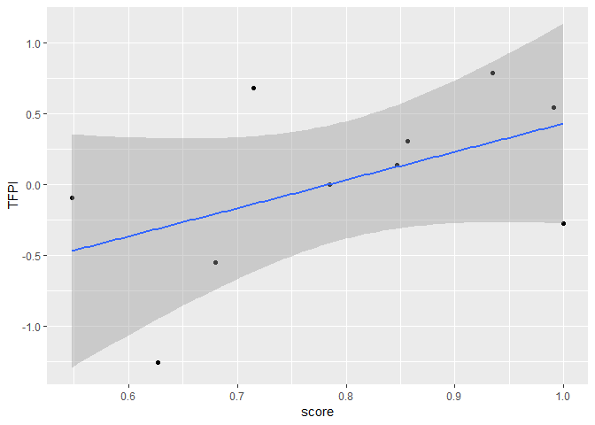

Single-cell NicheNet’s ligand activity analysis
================
Robin Browaeys
2018-11-12

<!-- github markdown built using 
rmarkdown::render("vignettes/ligand_activity_single_cell.Rmd", output_format = "github_document")
-->

This vignette shows how NicheNet can be used to predict which ligands
might be active in single-cells. If a ligand has a high activity in a
cell, this means that target genes of that ligand are stronger expressed
in that cell than in other cells. In this example, we will use data from
Puram et al. to explore intercellular communication in the tumor
microenvironment in head and neck squamous cell carcinoma (HNSCC) (See
Puram et al. 2017). More specifically, we will assess the activity of
cancer-associated fibroblast (CAF) ligands in malignant cells. The used
ligand-target matrix and example expression data of interacting cells
can be downloaded from Zenodo
[](https://doi.org/10.5281/zenodo.3260758).

In order to prioritize ligands regulating a process of interest, you can
perform a regression/correlation analysis between ligand activities in
cells, and scores of a cell corresponding to the process of interest.
For example, in this case study we were interested in finding ligands
regulating p-EMT. Therefore we correlated ligand activities to the p-EMT
scores of cells.

The purpose of this single-cell ligand activity analysis is to offer a
complementary way to prioritize ligands driving the process of interest
and to better analyze heterogeneity in ligand activity between different
cells.

### Load nichenetr and tidyverse

``` r
library(nichenetr)
library(tidyverse)
```

### Read in expression data of interacting cells

First, we will read in the single-cell data from CAF and malignant cells
from HNSCC tumors (See Puram et al.
2017).

``` r
hnscc_expression = readRDS(url("https://zenodo.org/record/3260758/files/hnscc_expression.rds"))
##   [1]
##   [2]
## [1]
## [2]
## [3]
## [4]
## [5]
## [6]
## [7]
##   [3]
## names
expression = hnscc_expression$expression
sample_info = hnscc_expression$sample_info # contains meta-information about the cells
```

Secondly, we will determine which genes are expressed in CAFs and
malignant cells from high quality primary tumors. Therefore, we wil not
consider cells from tumor samples of less quality or from lymph node
metastases. To determine expressed genes, we use the definition used by
of Puram et
al.

``` r
tumors_remove = c("HN10","HN","HN12", "HN13", "HN24", "HN7", "HN8","HN23")

CAF_ids = sample_info %>% filter(`Lymph node` == 0) %>% filter((tumor %in% tumors_remove == FALSE)) %>% filter(`non-cancer cell type` == "CAF") %>% .$cell
malignant_ids = sample_info %>% filter(`Lymph node` == 0) %>% filter(`classified  as cancer cell` == 1) %>% filter((tumor %in% tumors_remove == FALSE)) %>% .$cell

expressed_genes_CAFs = expression[CAF_ids,] %>% apply(2,function(x){10*(2**x - 1)}) %>% apply(2,function(x){log2(mean(x) + 1)}) %>% .[. >= 4] %>% names()
expressed_genes_malignant = expression[malignant_ids,] %>% apply(2,function(x){10*(2**x - 1)}) %>% apply(2,function(x){log2(mean(x) + 1)}) %>% .[. >= 4] %>% names()
```

### Load the ligand-target model we want to use

``` r
ligand_target_matrix = readRDS(url("https://zenodo.org/record/3260758/files/ligand_target_matrix.rds"))
## dim
## dimnames
ligand_target_matrix[1:5,1:5] # target genes in rows, ligands in columns
##                 CXCL1        CXCL2        CXCL3        CXCL5         PPBP
## A1BG     3.534343e-04 4.041324e-04 3.729920e-04 3.080640e-04 2.628388e-04
## A1BG-AS1 1.650894e-04 1.509213e-04 1.583594e-04 1.317253e-04 1.231819e-04
## A1CF     5.787175e-04 4.596295e-04 3.895907e-04 3.293275e-04 3.211944e-04
## A2M      6.027058e-04 5.996617e-04 5.164365e-04 4.517236e-04 4.590521e-04
## A2M-AS1  8.898724e-05 8.243341e-05 7.484018e-05 4.912514e-05 5.120439e-05
```

### Perform NicheNet’s single-cell ligand activity analysis

In a first step, we will define a set of potentially active ligands. As
potentially active ligands, we will use ligands that are 1) expressed by
CAFs and 2) can bind a (putative) receptor expressed by malignant cells.
Putative ligand-receptor links were gathered from NicheNet’s
ligand-receptor data
sources.

``` r
lr_network = readRDS(url("https://zenodo.org/record/3260758/files/lr_network.rds"))
##   [1]
##   [2]
##   [3]
##   [4]
## row.names
## class
## names
ligands = lr_network$from %>% unique()
expressed_ligands = intersect(ligands,expressed_genes_CAFs)
receptors = lr_network$to %>% unique()
expressed_receptors = intersect(receptors,expressed_genes_malignant)

potential_ligands = lr_network %>% filter(from %in% expressed_ligands & to %in% expressed_receptors) %>% .$from %>% unique()
head(potential_ligands)
## [1] "HGF"     "TNFSF10" "TGFB2"   "TGFB3"   "INHBA"   "CD99"
```

In a second step, we will scale the single-cell expression data
(including only expressed
genes).

``` r
background_expressed_genes = expressed_genes_malignant %>% .[. %in% rownames(ligand_target_matrix)]
expression_scaled = expression %>% .[malignant_ids,background_expressed_genes] %>% scale_quantile()
##   <environment: namespace:nichenetr>
## x
## outlier_cutoff
##   <environment: namespace:nichenetr>
## x
## addend
## multiplier
##   <environment: namespace:nichenetr>
## x
## addend
## multiplier
```

Now perform the ligand activity analysis: infer how well NicheNet’s
ligand-target potential scores can predict whether a gene belongs to
most strongly expressed genes in a cell compared to other cells. To
reduce the running time for this vignette, we will perform the analysis
only on 10 example cells from the HN5 tumor. This vignette’s only
purpose is to illustrate the analysis.

In practice, ligand activity analysis for several cells can be better
run in parallel (via
e.g. parallel::mclapply)\!

``` r
malignant_hn5_ids = sample_info %>% filter(tumor == "HN5") %>% filter(`Lymph node` == 0) %>% filter(`classified  as cancer cell` == 1)  %>% .$cell %>% head(10)

ligand_activities = predict_single_cell_ligand_activities(cell_ids = malignant_hn5_ids, expression_scaled = expression_scaled, ligand_target_matrix = ligand_target_matrix, potential_ligands = potential_ligands)
##   <environment: namespace:nichenetr>
## cell_ids
## expression_scaled
## ligand_target_matrix
## potential_ligands
## single
## ...
##   <environment: namespace:nichenetr>
## cell_id
## expression_matrix
## setting_name
## setting_from
## regression
```

### Ligand prioritization by regression analysis

Furthermore, we will also show how you can perform additional analyses
by linking the ligand activity in cells to other properties of cells in
order to prioritize ligands. As toy example, we will score malignant
cells here on the extent to which they express the core p-EMT gene
“TGFBI”.

``` r
cell_scores_tbl = tibble(cell = malignant_hn5_ids, score = expression_scaled[malignant_hn5_ids,"TGFBI"])
```

Then, we will determine the correlation between these p-EMT scores and
ligand activities over all cells to prioritize p-EMT-inducing ligands.
We hypothesize that ligands might be potential regulators of the p-EMT
program if higher ligand activities are associated with higher p-EMT
scores. Based on this correlation, we obtained a ranking of potential
p-EMT-inducing ligands.

To do so, we frist need to process and normalize the ligand activities
(i.e. pearson correlation values) to make different cells comparable.
Here we use modified z-score
normalization.

``` r
normalized_ligand_activities = normalize_single_cell_ligand_activities(ligand_activities)
##   <environment: namespace:nichenetr>
## ligand_activities
##   <environment: namespace:nichenetr>
## x
##   <environment: namespace:stats>
## x
## center
## constant
## na.rm
## low
## high
##   <environment: namespace:stats>
## x
## na.rm
## ...
##   <environment: namespace:tibble>
## j
## names
##   <environment: namespace:tidyr>
## data
## key
## value
## fill
## convert
## drop
## sep
## [1]
## [2]
## [3]
##   <environment: namespace:tidyr>
## .variables
## drop
##   <environment: namespace:tidyr>
## x
## drop
##   <environment: namespace:tidyr>
## df
## id
## drop
##   <environment: namespace:tibble>
## x
## value
##   <environment: namespace:purrr>
## .x
## .f
## ...
##   <environment: namespace:tidyr>
## x
## sep
##   <environment: namespace:rlang>
## x
##   <environment: namespace:tidyr>
## x
##   <environment: namespace:tidyr>
## x
## y
## after
## remove
##   <environment: namespace:tidyr>
## input
## output
## ungrouped_vars
##   <environment: namespace:base>
## x
##   <environment: namespace:base>
## x
## value
##   <environment: namespace:tibble>
## .data
## var
##   <environment: namespace:rlang>
## x
## name
##   <environment: namespace:tibble>
## .data
## ...
## .before
## .after
##   <environment: namespace:tibble>
## before
## after
## names
##   <environment: namespace:tibble>
## j
## x
##   <environment: namespace:rlang>
## x
## n
## encoding
##   <environment: namespace:tibble>
## before
## after
## len
##   <environment: namespace:tibble>
## pos
## len
```

Then, we combine the ligand activities and cell property scores and
perform correlation and regression analysis. We can prioritize ligands
by ranking them based on the pearson correlation between activity scores
and property
scores.

``` r
output_correlation_analysis = single_ligand_activity_score_regression(normalized_ligand_activities,cell_scores_tbl)
##   <environment: namespace:nichenetr>
## ligand_activities
## scores_tbl
## [1]
## [2]
## [3]
##   <environment: namespace:dplyr>
## by
## x
## y
##   <environment: namespace:rlang>
## message
## .subclass
## ...
## call
## msg
## type
##   <environment: namespace:rlang>
## msg
## type
## call
## env
##   <environment: namespace:dplyr>
## by
##   <environment: namespace:rlang>
## .subclass
## ...
## message
##   <environment: namespace:nichenetr>
## prediction
## response
##   <environment: namespace:stats>
## formula
## data
## subset
## weights
## na.action
## method
## model
## x
## y
## qr
## singular.ok
## contrasts
## offset
## ...
##   <environment: namespace:stats>
## formula
## data
## subset
## na.action
## drop.unused.levels
## xlev
## ...
##   <environment: namespace:stats>
## object
## env
##   <environment: namespace:stats>
## x
## specials
## abb
## data
## neg.out
## keep.order
## simplify
## ...
## allowDotAsName
## [1]
## [2]
## [3]
##   <environment: namespace:stats>
## x
##   <environment: namespace:stats>
## var
## call
##   <environment: namespace:stats>
## object
## ...
##   <environment: namespace:stats>
## x
##   <environment: namespace:stats>
## data
## type
##   <environment: namespace:stats>
## x
##   <environment: namespace:stats>
## x
##   <environment: namespace:stats>
## x
##   <environment: namespace:stats>
## x
## ...
##   <environment: namespace:stats>
## object
## data
## contrasts.arg
## xlev
## ...
## [1]
## [2]
## [3]
##   <environment: namespace:stats>
## x
## y
## offset
## method
## tol
## singular.ok
## ...
##   <environment: namespace:stats>
## Terms
## m
## [1]
## [2]
## [3]
##   <environment: namespace:stats>
## object
## correlation
## symbolic.cor
## ...
##   <environment: namespace:stats>
## x
## ...
##   <environment: namespace:stats>
## object
## ...
## k
## [1]
## [2]
## [3]
##   <environment: namespace:stats>
## object
## REML
## ...
##   <environment: namespace:stats>
## object
## ...
## [1]
## [2]
## [3]
## [1]
## [2]
## [3]
## [1]
## [2]
## [3]
##   <environment: namespace:nichenetr>
## error
output_correlation_analysis %>% arrange(-pearson_regression) %>% select(pearson_regression, ligand)
## # A tibble: 131 x 2
##    pearson_regression ligand  
##                 <dbl> <chr>   
##  1              0.525 TNC     
##  2              0.497 TFPI    
##  3              0.491 SEMA5A  
##  4              0.488 ANXA1   
##  5              0.473 TNFSF13B
##  6              0.462 IBSP    
##  7              0.449 HDGF    
##  8              0.443 HSP90B1 
##  9              0.431 CALM3   
## 10              0.428 CXCL11  
## # ... with 121 more rows
```

Visualize the relation between ligand activity
and

``` r
inner_join(cell_scores_tbl,normalized_ligand_activities) %>% ggplot(aes(score,TFPI)) + geom_point() + geom_smooth(method = "lm")
##   <environment: namespace:ggplot2>
## data
## mapping
## ...
## environment
##   <environment: namespace:rlang>
## call
## frame_env
## capture_arg
## capture_dots
## named
## ignore_empty
## unquote_names
## homonyms
## check_assign
## [1]
## [2]
## [3]
##   <environment: namespace:rlang>
## x
##   <environment: namespace:rlang>
## x
##   <environment: namespace:rlang>
## x
## predicate
##   <environment: namespace:ggplot2>
## x
## env
##   <environment: namespace:ggplot2>
## x
## env
##   <environment: namespace:rlang>
## quo
##   <environment: namespace:ggplot2>
## x
##   <environment: namespace:ggplot2>
## x
##   <environment: namespace:plyr>
## x
## replace
## warn_missing
##   <environment: namespace:plyr>
## x
## from
## to
## warn_missing
##   [1]
## [1]
## [2]
## [3]
## [4]
##   [2]
##   [3]
##   [4]
##   [5]
## names
##   <environment: namespace:ggplot2>
## model
## data
## ...
##   <environment: namespace:ggplot2>
##   <environment: namespace:ggplot2>
## `_class`
## `_inherit`
## ...
## [1]
## [2]
## [3]
##   [1]
## [1]
## [2]
## [3]
## [4]
## [5]
## [6]
## [7]
## [8]
## [9]
##   [2]
##   [3]
## [1]
##   [4]
##   [5]
## names
##   <environment: namespace:ggplot2>
## x
##   <environment: namespace:ggplot2>
## xlim
## ylim
## expand
## default
## clip
##   [1]
## [1]
## [2]
## [3]
## [4]
## [5]
## [6]
## [7]
## [8]
##   [2]
##   [3]
## [1]
##   [4]
##   [5]
## names
##   <environment: namespace:ggplot2>
## shrink
##   [1]
## [1]
## [2]
## [3]
## [4]
## [5]
##   [2]
##   [3]
## [1]
##   [4]
##   [5]
## names
##   <environment: namespace:ggplot2>
## mapping
## [1]
## [2]
## [3]
##   <environment: namespace:rlang>
## expr
## width
## nlines
##   <environment: namespace:ggplot2>
## expr
##   <environment: namespace:stats>
## x
## i
##   <environment: namespace:rlang>
## sym
##   <environment: namespace:rlang>
## str
##   <environment: namespace:ggplot2>
## value
##   [1]
## <environment: 0x000001dd09ae0818>
##   [2]
## <environment: 0x000001dd09ae0818>
## names
##   <environment: namespace:ggplot2>
## geom
## stat
## data
## mapping
## position
## params
## inherit.aes
## check.aes
## check.param
## show.legend
##   [1]
## [1]
## [2]
## [3]
## [4]
## [5]
## [6]
##   [2]
##   [3]
## [1]
##   [4]
##   [5]
## names
##   <environment: namespace:ggplot2>
## model
## data
## ...
##   <environment: namespace:ggplot2>
##   <environment: namespace:ggplot2>
## x
## subclass
## argname
## env
##   <environment: namespace:ggplot2>
## x
## first
##   <environment: namespace:ggplot2>
## s
##   <environment: namespace:ggplot2>
## name
## env
## mode
##   [1]
## [1]
## [2]
##   [2]
##   [3]
## [1]
##   [4]
##   [5]
## names
##   [1]
## [1]
## [2]
##   [2]
##   [3]
## [1]
##   [4]
##   [5]
## names
##   <environment: namespace:ggplot2>
## x
## name
##   <environment: namespace:ggplot2>
## x
## name
##   <environment: namespace:ggplot2>
## self
## f
## [1]
## [2]
## [3]
## [1]
## [2]
## [3]
##   <environment: namespace:ggplot2>
## x
##   <environment: namespace:ggplot2>
## x
##   [1]
## [1]
## [2]
## [3]
## [4]
## [5]
## [6]
## [7]
## [8]
## [9]
## [10]
## [11]
## [12]
## [13]
## [14]
## [15]
## [16]
## [17]
## [18]
## [19]
##   [2]
##   [3]
## [1]
##   [4]
##   [5]
## names
##   <environment: namespace:ggplot2>
## e1
## e2
##   <environment: namespace:ggplot2>
## x
##   <environment: namespace:ggplot2>
## x
##   <environment: namespace:ggplot2>
## p
## object
## objectname
##   <environment: namespace:ggplot2>
## plot
##   <environment: namespace:ggplot2>
## object
## plot
## object_name
##   <environment: namespace:plyr>
## x
## y
##   [1]
## [1]
## [2]
## [3]
## [4]
## [5]
## [6]
## [7]
##   [2]
##   [3]
## [1]
##   [4]
##   [5]
## names
##   [1]
## [1]
## [2]
## [3]
## [4]
##   [2]
##   [3]
## [1]
##   [4]
##   [5]
## names
##   <environment: namespace:ggplot2>
## x
## newpage
## vp
## ...
##   <environment: namespace:grid>
## recording
```

<!-- -->

    ##   <environment: namespace:grid>
    ##   <environment: namespace:grid>
    ## x
    ## y
    ## width
    ## height
    ## default.units
    ## just
    ## gp
    ## clip
    ## xscale
    ## yscale
    ## angle
    ## layout
    ## layout.pos.row
    ## layout.pos.col
    ## name
    ##   <environment: namespace:grid>
    ## x
    ## y
    ## width
    ## height
    ## just
    ## gp
    ## clip
    ## xscale
    ## yscale
    ## angle
    ## layout
    ## layout.pos.row
    ## layout.pos.col
    ## name
    ##   <environment: namespace:grid>
    ## x
    ##   <environment: namespace:grid>
    ## x
    ##   <environment: namespace:grid>
    ## vp
    ##   <environment: namespace:grDevices>
    ##   <environment: namespace:grDevices>
    ## expr
    ## list
    ## env
    ##   <environment: namespace:ggplot2>
    ## plot
    ## [1]
    ## [2]
    ## [3]
    ## [1]
    ## [2]
    ## [3]
    ## [1]
    ## [2]
    ## [3]
    ## [1]
    ## [2]
    ## [3]
    ## [1]
    ## [2]
    ## [3]
    ## [1]
    ## [2]
    ## [3]
    ## [1]
    ## [2]
    ## [3]
    ## [1]
    ## [2]
    ## [3]
    ## [1]
    ## [2]
    ## [3]
    ## [1]
    ## [2]
    ## [3]
    ## [1]
    ## [2]
    ## [3]
    ##   <environment: namespace:ggplot2>
    ## x
    ##   <environment: namespace:ggplot2>
    ## facet
    ## coord
    ##   [1]
    ## [1]
    ## [2]
    ## [3]
    ## [4]
    ## [5]
    ## [6]
    ## [7]
    ## [8]
    ## [9]
    ## [10]
    ## [11]
    ## [12]
    ## [13]
    ## [14]
    ## [15]
    ## [16]
    ## [17]
    ## [18]
    ## [19]
    ##   [2]
    ##   [3]
    ## [1]
    ##   [4]
    ##   [5]
    ## names
    ##   <environment: namespace:ggplot2>
    ##   <environment: namespace:ggplot2>
    ## x
    ##   <environment: namespace:ggplot2>
    ## df
    ##   <environment: namespace:base>
    ## x
    ## ...
    ##   <environment: namespace:ggplot2>
    ## x
    ## i
    ## ...
    ##   <environment: namespace:ggplot2>
    ## aesthetics
    ##   <environment: namespace:ggplot2>
    ## x
    ##   <environment: namespace:ggplot2>
    ## x
    ##   <environment: namespace:ggplot2>
    ## scales
    ## data
    ## aesthetics
    ## env
    ##   <environment: namespace:ggplot2>
    ## var
    ##   <environment: namespace:ggplot2>
    ## x
    ##   <environment: namespace:ggplot2>
    ## aes
    ## x
    ## env
    ##   <environment: namespace:ggplot2>
    ## x
    ##   <environment: namespace:ggplot2>
    ## name
    ## breaks
    ## minor_breaks
    ## labels
    ## limits
    ## expand
    ## oob
    ## na.value
    ## trans
    ## position
    ## sec.axis
    ##   <environment: namespace:ggplot2>
    ## aesthetics
    ## scale_name
    ## palette
    ## name
    ## breaks
    ## minor_breaks
    ## labels
    ## limits
    ## rescaler
    ## oob
    ## expand
    ## na.value
    ## trans
    ## guide
    ## position
    ## super
    ##   <environment: namespace:ggplot2>
    ## breaks
    ## labels
    ##   <environment: namespace:scales>
    ## x
    ##   <environment: namespace:scales>
    ## x
    ##   <environment: namespace:scales>
    ##   <environment: namespace:scales>
    ## name
    ## transform
    ## inverse
    ## breaks
    ## minor_breaks
    ## format
    ## domain
    ##   <environment: namespace:scales>
    ## ...
    ##   <environment: namespace:scales>
    ## n
    ## ...
    ## [1]
    ## [2]
    ## [3]
    ##   <environment: namespace:scales>
    ## reverse
    ## [1]
    ## [2]
    ## [3]
    ##   <environment: namespace:scales>
    ## ...
    ## [1]
    ## [2]
    ## [3]
    ##   <environment: namespace:ggplot2>
    ##   [1]
    ## [1]
    ## [2]
    ##   [2]
    ##   [3]
    ## [1]
    ##   [4]
    ##   [5]
    ## names
    ##   <environment: namespace:scales>
    ## x
    ## range
    ## only.finite
    ##   [1]
    ## [1]
    ## [2]
    ## [3]
    ## [4]
    ## [5]
    ## [6]
    ##   [2]
    ##   [3]
    ## [1]
    ##   [4]
    ##   [5]
    ## names
    ##   <environment: namespace:ggplot2>
    ## sec.axis
    ## scale
    ##   <environment: namespace:ggplot2>
    ## name
    ## breaks
    ## minor_breaks
    ## labels
    ## limits
    ## expand
    ## oob
    ## na.value
    ## trans
    ## position
    ## sec.axis
    ##   <environment: namespace:ggplot2>
    ## x
    ## n
    ##   <environment: namespace:ggplot2>
    ## x
    ##   <environment: namespace:ggplot2>
    ## x
    ##   <environment: namespace:ggplot2>
    ## x
    ##   <environment: namespace:ggplot2>
    ## data
    ##   <environment: namespace:ggplot2>
    ## x
    ##   <environment: namespace:ggplot2>
    ## x
    ## name
    ##   <environment: namespace:ggplot2>
    ## scales
    ## df
    ## [1]
    ## [2]
    ## [3]
    ##   <environment: namespace:plyr>
    ## list
    ##   <environment: namespace:plyr>
    ## x
    ## prefix
    ##   <environment: namespace:plyr>
    ## .n
    ## .expr
    ## .progress
    ##   <environment: namespace:plyr>
    ## .n
    ## .progress
    ## .expr_wrap
    ## .print
    ## .discard
    ## [1]
    ## [2]
    ## [3]
    ## [1]
    ## [2]
    ## [3]
    ##   <environment: namespace:plyr>
    ## name
    ## ...
    ##   <environment: namespace:plyr>
    ## [1]
    ## [2]
    ## [3]
    ## [1]
    ## [2]
    ## [3]
    ##   <environment: namespace:plyr>
    ## .expr_wrap
    ##   <environment: namespace:ggplot2>
    ## data
    ## vars
    ## method
    ## scale_id
    ## scales
    ## [1]
    ## [2]
    ## [3]
    ##   <environment: namespace:plyr>
    ## group
    ## n
    ##   <environment: namespace:scales>
    ## new
    ## existing
    ##   <environment: namespace:base>
    ## ...
    ## na.rm
    ## finite
    ##   <environment: namespace:ggplot2>
    ## required
    ## present
    ## name
    ##   <environment: namespace:ggplot2>
    ## df
    ## na.rm
    ## vars
    ## name
    ## finite
    ##   <environment: namespace:ggplot2>
    ## x
    ##   <environment: namespace:ggplot2>
    ## x
    ##   <environment: namespace:ggplot2>
    ## x
    ## fun
    ##   <environment: namespace:ggplot2>
    ## x
    ##   <environment: namespace:plyr>
    ## df
    ##   <environment: namespace:plyr>
    ## x
    ## env
    ## [1]
    ## [2]
    ## [3]
    ##   <environment: namespace:plyr>
    ## data
    ## .variables
    ## drop
    ##   <environment: namespace:plyr>
    ## x
    ##   <environment: namespace:plyr>
    ## exprs
    ## envir
    ## enclos
    ## try
    ##   <environment: namespace:plyr>
    ## x
    ## [1]
    ## [2]
    ## [3]
    ##   <environment: namespace:plyr>
    ## .variables
    ## drop
    ##   <environment: namespace:plyr>
    ## x
    ## drop
    ##   <environment: namespace:base>
    ## x
    ##   <environment: namespace:plyr>
    ## splits
    ## drop
    ## id
    ## [1]
    ## [2]
    ## [3]
    ##   <environment: namespace:plyr>
    ## data
    ## index
    ## vars
    ##   <environment: namespace:plyr>
    ## .data
    ## .fun
    ## ...
    ## .progress
    ## .inform
    ## .parallel
    ## .paropts
    ## .id
    ##   <environment: namespace:plyr>
    ## .data
    ## .fun
    ## ...
    ## .progress
    ## .inform
    ## .parallel
    ## .paropts
    ## [1]
    ## [2]
    ## [3]
    ##   <environment: namespace:plyr>
    ## x
    ##   <environment: namespace:plyr>
    ## n
    ## f
    ## env
    ##   <environment: namespace:plyr>
    ## x
    ## i
    ##   <environment: namespace:plyr>
    ## x
    ## i
    ##   <environment: namespace:plyr>
    ## df
    ## i
    ## j
    ##   <environment: namespace:stats>
    ## x
    ## y
    ## w
    ## offset
    ## method
    ## tol
    ## singular.ok
    ## ...
    ##   <environment: namespace:ggplot2>
    ## model
    ## xseq
    ## se
    ## level
    ##   <environment: namespace:stats>
    ## object
    ## newdata
    ## se.fit
    ## scale
    ## df
    ## interval
    ## level
    ## type
    ## terms
    ## na.action
    ## pred.var
    ## weights
    ## ...
    ##   <environment: namespace:stats>
    ## x
    ## ...
    ##   <environment: namespace:stats>
    ## termobj
    ##   <environment: namespace:stats>
    ## object
    ## ...
    ##   <environment: namespace:stats>
    ## cl
    ## m
    ## ordNotOK
    ##   <environment: namespace:base>
    ## a
    ## b
    ## tol
    ##   <environment: namespace:base>
    ## x
    ##   <environment: namespace:base>
    ## x
    ## as.factor
    ##   <environment: namespace:base>
    ## x
    ## as.factor
    ##   <environment: namespace:base>
    ## x
    ## tol
    ## LAPACK
    ## ...
    ##   <environment: namespace:stats>
    ## p
    ## df
    ## ncp
    ## lower.tail
    ## log.p
    ##   <environment: namespace:base>
    ## X
    ## Y
    ##   <environment: namespace:base>
    ## X
    ## Y
    ## FUN
    ## ...
    ##   <environment: namespace:base>
    ## x
    ## row.names
    ## ...
    ##   <environment: namespace:ggplot2>
    ## df
    ## [1]
    ## [2]
    ## [3]
    ##   <environment: namespace:plyr>
    ## ...
    ## [1]
    ## [2]
    ## [3]
    ##   <environment: namespace:plyr>
    ## l
    ##   <environment: namespace:base>
    ## f
    ## [1]
    ## [2]
    ## [3]
    ##   <environment: namespace:plyr>
    ## x
    ##   <environment: namespace:plyr>
    ## res
    ## labels
    ## id_name
    ## id_as_factor
    ##   <environment: namespace:plyr>
    ## x
    ##   <environment: namespace:ggplot2>
    ## plot
    ## aesthetics
    ## env
    ##   [1]
    ## [1]
    ## [2]
    ##   [2]
    ##   [3]
    ## [1]
    ##   [4]
    ##   [5]
    ## names
    ##   <environment: namespace:ggplot2>
    ## scale
    ## limits
    ## expand
    ##   <environment: namespace:ggplot2>
    ## scale
    ## discrete
    ## continuous
    ##   <environment: namespace:ggplot2>
    ## a
    ## b
    ##   <environment: namespace:ggplot2>
    ## limits
    ## expand
    ##   <environment: namespace:scales>
    ## range
    ## mul
    ## add
    ## zero_width
    ##   <environment: namespace:scales>
    ## x
    ## tol
    ##   <environment: namespace:ggplot2>
    ## parent
    ## self
    ##   <environment: namespace:ggplot2>
    ## x
    ## name
    ##   [1]
    ##   [2]
    ## [1]
    ## [2]
    ## [3]
    ## [4]
    ##   [3]
    ##   [4]
    ##   [5]
    ##   [6]
    ##   [7]
    ##   [8]
    ## names
    ## class
    ##   [1]
    ##   [2]
    ##   [3]
    ##   [4]
    ##   [5]
    ##   [6]
    ##   [7]
    ##   [8]
    ##   [9]
    ##   [10]
    ##   [11]
    ## names
    ##   [1]
    ##   [2]
    ## [1]
    ## [2]
    ## [3]
    ## [4]
    ##   [3]
    ##   [4]
    ##   [5]
    ##   [6]
    ##   [7]
    ##   [8]
    ## names
    ## class
    ##   [1]
    ## names
    ##   [1]
    ## [1]
    ## [2]
    ## [3]
    ## [4]
    ## [5]
    ## [6]
    ## [7]
    ## [8]
    ## [9]
    ## [10]
    ## [11]
    ## [12]
    ## [13]
    ## [14]
    ## [15]
    ## [16]
    ## [17]
    ## [18]
    ## [19]
    ## [20]
    ## [21]
    ## [22]
    ## [23]
    ##   [2]
    ## [1]
    ## [2]
    ## [3]
    ## [4]
    ##   [3]
    ## names
    ##   <environment: namespace:labeling>
    ## dmin
    ## dmax
    ## m
    ## Q
    ## only.loose
    ## w
    ##   <environment: namespace:labeling>
    ## q
    ## Q
    ## j
    ##   <environment: namespace:labeling>
    ## k
    ## m
    ##   <environment: namespace:labeling>
    ## dmin
    ## dmax
    ## span
    ##   <environment: namespace:labeling>
    ## q
    ## Q
    ## j
    ## lmin
    ## lmax
    ## lstep
    ##   <environment: namespace:labeling>
    ## dmin
    ## dmax
    ## lmin
    ## lmax
    ##   <environment: namespace:labeling>
    ## k
    ## m
    ## dmin
    ## dmax
    ## lmin
    ## lmax
    ##   <environment: namespace:labeling>
    ## lmin
    ## lmax
    ## lstep
    ##   <environment: namespace:scales>
    ## x
    ## range
    ##   <environment: namespace:scales>
    ## x
    ## to
    ## from
    ## ...
    ##   <environment: namespace:ggplot2>
    ## data
    ## [1]
    ## [2]
    ## [3]
    ##   <environment: namespace:ggplot2>
    ## x
    ## default
    ##   <environment: namespace:ggplot2>
    ## x
    ##   <environment: namespace:ggplot2>
    ##   <environment: namespace:ggplot2>
    ## x
    ##   <environment: namespace:plyr>
    ## .data
    ## .variables
    ## .fun
    ## ...
    ## .progress
    ## .inform
    ## .drop
    ## .parallel
    ## .paropts
    ##   <environment: namespace:base>
    ## x
    ## ifany
    ##   <environment: namespace:plyr>
    ## x
    ##   <environment: namespace:ggplot2>
    ## df
    ## trans_x
    ## trans_y
    ## ...
    ##   <environment: namespace:scales>
    ## x
    ## range
    ##   <environment: namespace:ggplot2>
    ## prefix
    ## grob
    ##   <environment: namespace:grid>
    ## grob
    ## prefix
    ##   <environment: namespace:grid>
    ## x
    ## y
    ## pch
    ## size
    ## default.units
    ## name
    ## gp
    ## vp
    ##   <environment: namespace:scales>
    ## colour
    ## alpha
    ##   <environment: namespace:grDevices>
    ## red
    ## green
    ## blue
    ## alpha
    ## names
    ## maxColorValue
    ##   <environment: namespace:grid>
    ## x
    ##   <environment: namespace:grid>
    ## pch
    ##   <environment: namespace:grid>
    ## x
    ##   <environment: namespace:base>
    ## `_data`
    ## ...
    ##   <environment: namespace:grid>
    ## ...
    ##   [1]
    ## [1]
    ## [2]
    ## [3]
    ## [4]
    ## [5]
    ## [6]
    ##   [2]
    ##   [3]
    ## [1]
    ##   [4]
    ##   [5]
    ## names
    ##   <environment: namespace:base>
    ## x
    ## incomparables
    ## fromLast
    ## ...
    ##   <environment: namespace:base>
    ## x
    ## incomparables
    ## fromLast
    ## ...
    ##   <environment: namespace:plyr>
    ## .data
    ## ...
    ##   <environment: namespace:ggplot2>
    ## coord
    ## data
    ## range
    ## segment_length
    ##   <environment: namespace:grid>
    ## x
    ## y
    ## id
    ## id.lengths
    ## default.units
    ## name
    ## gp
    ## vp
    ##   <environment: namespace:grid>
    ## x
    ##   <environment: namespace:stats>
    ## x
    ## ...
    ## FUN
    ##   <environment: namespace:base>
    ## ...
    ## drop
    ## sep
    ## lex.order
    ##   <environment: namespace:base>
    ## x
    ## f
    ## drop
    ## ...
    ## value
    ##   <environment: namespace:base>
    ## x
    ## f
    ## drop
    ## ...
    ## value
    ##   <environment: namespace:grid>
    ## x
    ## y
    ## id
    ## id.lengths
    ## default.units
    ## arrow
    ## name
    ## gp
    ## vp
    ##   <environment: namespace:grid>
    ## x
    ##   <environment: namespace:grid>
    ## x
    ##   <environment: namespace:grid>
    ## ...
    ## name
    ## gp
    ## vp
    ## children
    ## childrenvp
    ## cl
    ##   <environment: namespace:grid>
    ## x
    ## childrenvp
    ## ...
    ##   <environment: namespace:grid>
    ## x
    ##   <environment: namespace:grid>
    ## x
    ## children
    ##   <environment: namespace:grid>
    ## x
    ##   <environment: namespace:grid>
    ## x
    ##   <environment: namespace:grid>
    ## x
    ## index
    ## ...
    ##   <environment: namespace:grid>
    ## x
    ##   <environment: namespace:ggplot2>
    ##   [1]
    ##   [2]
    ##   [3]
    ## names
    ## class
    ##   <environment: namespace:ggplot2>
    ## theme
    ## element
    ## ...
    ## name
    ##   <environment: namespace:ggplot2>
    ## element
    ## theme
    ## verbose
    ##   <environment: namespace:ggplot2>
    ## element
    ## ...
    ##   <environment: namespace:ggplot2>
    ## theme
    ## x.minor
    ## x.major
    ## y.minor
    ## y.major
    ##   <environment: namespace:grid>
    ## ...
    ## name
    ## gp
    ## vp
    ## childrenvp
    ## cl
    ##   <environment: namespace:ggplot2>
    ## e1
    ## e2
    ##   <environment: namespace:ggplot2>
    ## x
    ##   <environment: namespace:ggplot2>
    ## element
    ## x
    ## y
    ## width
    ## height
    ## fill
    ## colour
    ## size
    ## linetype
    ## ...
    ##   <environment: namespace:ggplot2>
    ## x
    ##   <environment: namespace:grid>
    ## x
    ## y
    ## width
    ## height
    ## just
    ## hjust
    ## vjust
    ## default.units
    ## name
    ## gp
    ## vp
    ##   <environment: namespace:grid>
    ## x
    ##   <environment: namespace:ggplot2>
    ## element
    ## x
    ## y
    ## colour
    ## size
    ## linetype
    ## lineend
    ## default.units
    ## id.lengths
    ## ...
    ##   <environment: namespace:ggplot2>
    ## a
    ## b
    ##   <environment: namespace:ggplot2>
    ## panel_params
    ## axis
    ## scale
    ## position
    ## theme
    ##   <environment: namespace:ggplot2>
    ## at
    ## labels
    ## position
    ## theme
    ##   <environment: namespace:grid>
    ## e1
    ## e2
    ##   <environment: namespace:grid>
    ## func.name
    ## arg1
    ## arg2
    ##   <environment: namespace:ggplot2>
    ## element
    ## label
    ## x
    ## y
    ## family
    ## face
    ## colour
    ## size
    ## hjust
    ## vjust
    ## angle
    ## lineheight
    ## margin
    ## margin_x
    ## margin_y
    ## ...
    ##   <environment: namespace:ggplot2>
    ## label
    ## x
    ## y
    ## hjust
    ## vjust
    ## angle
    ## gp
    ## margin
    ## margin_x
    ## margin_y
    ## debug
    ##   <environment: namespace:ggplot2>
    ## label
    ## x
    ## y
    ## hjust
    ## vjust
    ## angle
    ## gp
    ## debug
    ##   <environment: namespace:ggplot2>
    ## angle
    ## hjust
    ## vjust
    ##   <environment: namespace:grid>
    ## grob
    ## gPath
    ## ...
    ## strict
    ## grep
    ## global
    ## warn
    ##   <environment: namespace:grid>
    ## grob
    ## specs
    ##   <environment: namespace:grid>
    ## x
    ## specs
    ##   <environment: namespace:grid>
    ## x
    ##   <environment: namespace:grid>
    ## fnname
    ## ...
    ##   <environment: namespace:base>
    ## x
    ##   <environment: namespace:grDevices>
    ## x
    ##   <environment: namespace:ggplot2>
    ## grob
    ## height
    ## width
    ## margin
    ## gp
    ## margin_x
    ## margin_y
    ##   <environment: namespace:grid>
    ## ...
    ## [1]
    ## [2]
    ## [3]
    ## [1]
    ## [2]
    ## [3]
    ## [1]
    ## [2]
    ## [3]
    ##   <environment: namespace:grid>
    ## x
    ## index
    ## top
    ## ...
    ##   <environment: namespace:grid>
    ## x
    ##   <environment: namespace:grid>
    ## unit
    ## [1]
    ## [2]
    ## [3]
    ##   <environment: namespace:grid>
    ## x
    ##   <environment: namespace:grid>
    ## x
    ##   <environment: namespace:grid>
    ## x
    ## index
    ## top
    ## ...
    ## [1]
    ## [2]
    ## [3]
    ##   <environment: namespace:grid>
    ## nrow
    ## ncol
    ## widths
    ## heights
    ## default.units
    ## respect
    ## just
    ##   <environment: namespace:grid>
    ## nrow
    ## ncol
    ## widths
    ## heights
    ## respect
    ## just
    ##   <environment: namespace:grid>
    ## l
    ## [1]
    ## [2]
    ## [3]
    ## [4]
    ## [5]
    ##   <environment: 0x000001dd002d4db8>
    ##   <environment: namespace:grid>
    ## parent
    ## children
    ##   <environment: namespace:grid>
    ## x
    ##   <environment: namespace:grid>
    ## vp
    ##   <environment: namespace:grid>
    ## ...
    ##   <environment: namespace:grid>
    ## vps
    ##   <environment: namespace:grid>
    ## vp
    ##   <environment: namespace:grid>
    ## x
    ## times
    ## length.out
    ## each
    ## ...
    ##   <environment: namespace:grid>
    ## x
    ##   <environment: namespace:grid>
    ## x
    ## index
    ## top
    ## ...
    ##   <environment: namespace:gtable>
    ## name
    ## grobs
    ## width
    ## heights
    ## z
    ## vp
    ##   <environment: namespace:gtable>
    ## a
    ## b
    ##   <environment: namespace:grid>
    ## x
    ##   <environment: namespace:gtable>
    ## widths
    ## heights
    ## respect
    ## name
    ## rownames
    ## colnames
    ## vp
    ##   <environment: namespace:gtable>
    ## x
    ## n
    ##   <environment: namespace:gtable>
    ## x
    ## grobs
    ## t
    ## l
    ## b
    ## r
    ## z
    ## clip
    ## name
    ##   <environment: namespace:gtable>
    ## x
    ##   <environment: namespace:gtable>
    ## x
    ## n
    ##   <environment: namespace:gtable>
    ## x
    ## max
    ##   <environment: namespace:gtable>
    ## x
    ##   <environment: namespace:grid>
    ## ...
    ## na.rm
    ##   <environment: namespace:ggplot2>
    ## grob
    ## width
    ## height
    ## xmin
    ## ymin
    ## vp
    ##   <environment: namespace:gtable>
    ## x
    ##   <environment: namespace:gtable>
    ## name
    ## grobs
    ## height
    ## widths
    ## z
    ## vp
    ##   <environment: namespace:grid>
    ## x
    ##   <environment: namespace:ggplot2>
    ## x
    ##   <environment: namespace:ggplot2>
    ## x
    ##   <environment: namespace:ggplot2>
    ## x
    ##   <environment: namespace:ggplot2>
    ## x
    ##   <environment: namespace:gtable>
    ## name
    ## grobs
    ## widths
    ## heights
    ## z
    ## respect
    ## clip
    ## vp
    ##   <environment: namespace:ggplot2>
    ## x
    ##   <environment: namespace:ggplot2>
    ## table
    ##   <environment: namespace:gtable>
    ## x
    ## heights
    ## pos
    ##   <environment: namespace:gtable>
    ## x
    ## values
    ## after
    ##   <environment: namespace:gtable>
    ## x
    ## widths
    ## pos
    ##   <environment: namespace:ggplot2>
    ## scales
    ## layers
    ## default_mapping
    ## position
    ## theme
    ## guides
    ## labels
    ##   <environment: namespace:ggplot2>
    ## position
    ##   <environment: namespace:ggplot2>
    ## scales
    ## theme
    ## guides
    ## labels
    ##   <environment: namespace:ggplot2>
    ## x
    ##   <environment: namespace:grid>
    ## x
    ## recording
    ##   <environment: namespace:grid>
    ## x
    ##   <environment: namespace:grid>
    ## x
    ##   <environment: namespace:gtable>
    ## x
    ##   <environment: namespace:gtable>
    ## x
    ##   <environment: namespace:grid>
    ## fnname
    ## ...
    ##   <environment: namespace:grid>
    ## x
    ##   <environment: namespace:grid>
    ## vp
    ##   <environment: namespace:grid>
    ## ...
    ## recording
    ##   <environment: namespace:grid>
    ## vp
    ## recording
    ##   <environment: namespace:grid>
    ## gp
    ## engineDL
    ##   <environment: namespace:grid>
    ## x
    ##   <environment: namespace:grid>
    ## x
    ##   <environment: namespace:grid>
    ## vp
    ## recording
    ##   <environment: namespace:grid>
    ## x
    ##   <environment: namespace:grid>
    ## x
    ##   <environment: namespace:grid>
    ## x
    ##   <environment: namespace:grid>
    ## just
    ## hjust
    ##   <environment: namespace:grid>
    ## just
    ## vjust
    ##   <environment: namespace:grid>
    ## x
    ##   <environment: namespace:grid>
    ## x
    ##   <environment: namespace:grid>
    ## vp
    ## recording
    ## [1]
    ## [2]
    ## [3]
    ##   <environment: namespace:ggplot2>
    ## x
    ##   <environment: namespace:grid>
    ## vp
    ##   <environment: namespace:grid>
    ## n
    ## recording
    ##   <environment: namespace:grid>
    ## x
    ## ...
    ##   <environment: namespace:grid>
    ## x
    ## ...
    ##   <environment: namespace:grid>
    ##   <environment: namespace:grid>
    ## pvp
    ##   <environment: namespace:grid>
    ## names
    ##   <environment: namespace:grid>
    ## x
    ## index
    ## ...
    ##   <environment: namespace:grid>
    ## x
    ## ...
    ##   <environment: namespace:grid>
    ## x
    ## ...
    ##   <environment: namespace:grid>
    ## x
    ##   <environment: namespace:grid>
    ## x
    ##   <environment: namespace:ggplot2>
    ## x
    ##   <environment: namespace:gtable>
    ## x
    ##   <environment: namespace:gtable>
    ## vp_name
    ## t
    ## r
    ## b
    ## l
    ## clip
    ##   <environment: namespace:gtable>
    ## row
    ##   <environment: namespace:gtable>
    ## grob
    ## vp
    ##   <environment: namespace:grid>
    ## x
    ## recording
    ##   <environment: namespace:grid>
    ## x
    ## recording
    ##   <environment: namespace:grid>
    ## x
    ##   <environment: namespace:gtable>
    ## x
    ##   <environment: namespace:grid>
    ## x
    ##   <environment: namespace:grid>
    ## x
    ## recording
    ##   <environment: namespace:grid>
    ## x
    ## recording
    ##   <environment: namespace:ggplot2>
    ## x
    ## recording
    ##   <environment: namespace:grid>
    ## x
    ## recording
    ##   <environment: namespace:grid>
    ## x
    ## recording
    ##   <environment: namespace:ggplot2>
    ## x
    ## recording
    ##   <environment: namespace:grid>
    ## ...
    ##   <environment: namespace:grid>
    ## vp
    ## recording
    ##   <environment: namespace:grid>
    ## x
    ## recording
    ##   <environment: namespace:grid>
    ## x
    ## ...
    ##   <environment: namespace:grid>
    ## x
    ##   <environment: namespace:grid>

### References

<div id="refs" class="references">

<div id="ref-puram_single-cell_2017">

Puram, Sidharth V., Itay Tirosh, Anuraag S. Parikh, Anoop P. Patel,
Keren Yizhak, Shawn Gillespie, Christopher Rodman, et al. 2017.
“Single-Cell Transcriptomic Analysis of Primary and Metastatic Tumor
Ecosystems in Head and Neck Cancer.” *Cell* 171 (7): 1611–1624.e24.
<https://doi.org/10.1016/j.cell.2017.10.044>.

</div>

</div>
