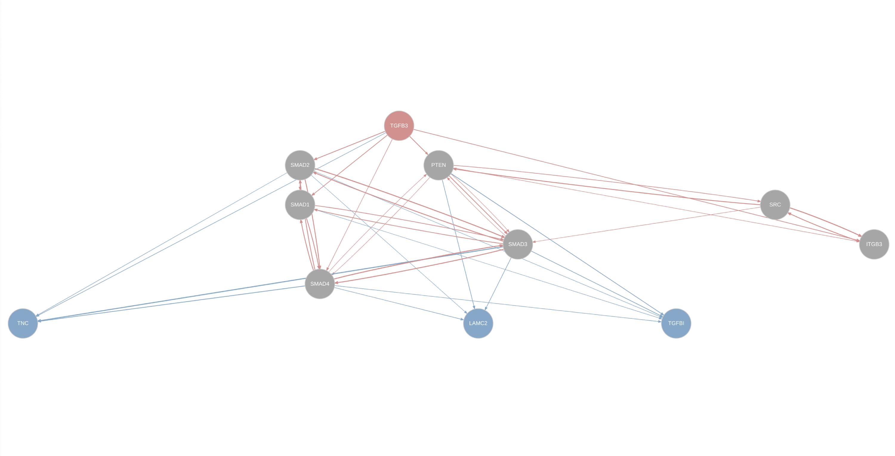

Inferring ligand-to-target signaling paths
================
Robin Browaeys
2019-01-17

<!-- github markdown built using 
rmarkdown::render("vignettes/ligand_target_signaling_path.Rmd", output_format = "github_document")
-->

### Infer signaling paths beween ligand(s) and target(s) of interest

To determine signaling paths between a ligand and target of interest, we
look at which transcription factors are best regulating the target genes
and are most closely downstream of the ligand (based on the weights of
the edges in the integrated ligand-signaling and gene regulatory
networks). Then, the shortest paths between these transcription factors
and the ligand of interests are determined and genes forming part in
this path are considered as important signaling mediators. Finally, we
look in our collected data source networks for all interactions between
the ligand, signaling mediators, transcription factors and target genes.
This allows to both prioritize signaling mediators and check which of
all collected data sources support the ligand-target predictions of
interest.

For this analysis, you need to define:

  - one or more ligands of interest
  - one or more target genes of interest

In this vignette, we will demonstrate how to infer signaling paths
between a CAF-ligand (CAF = cancer-associated fibroblast) of interest
and some of its top-predicted p-EMT target genes. The output of this
analysis can be easily imported into Cytoscape for exploration of the
networks.

First, we will load the necessary packages and networks to infer
signaling paths between ligand and target genes of interest.

``` r
library(nichenetr)
library(tidyverse)

weighted_networks = readRDS(url("https://zenodo.org/record/3260758/files/weighted_networks.rds"))
ligand_tf_matrix = readRDS(url("https://zenodo.org/record/3260758/files/ligand_tf_matrix.rds"))

lr_network = readRDS(url("https://zenodo.org/record/3260758/files/lr_network.rds"))
sig_network = readRDS(url("https://zenodo.org/record/3260758/files/signaling_network.rds"))
gr_network = readRDS(url("https://zenodo.org/record/3260758/files/gr_network.rds"))
```

As example, we will infer signaling paths between the CAF-ligand TGFB3
and its top-predicted p-EMT target genes TGFBI, LAMC2 and
TNC.

``` r
ligands_all = "TGFB3" # this can be a list of multiple ligands if required
targets_all = c("TGFBI","LAMC2","TNC")

active_signaling_network = get_ligand_signaling_path(ligand_tf_matrix = ligand_tf_matrix, ligands_all = ligands_all, targets_all = targets_all, weighted_networks = weighted_networks)

# For better visualization of edge weigths: normalize edge weights to make them comparable between signaling and gene regulatory interactions
active_signaling_network_min_max = active_signaling_network
active_signaling_network_min_max$sig = active_signaling_network_min_max$sig %>% mutate(weight = ((weight-min(weight))/(max(weight)-min(weight))) + 0.75)
active_signaling_network_min_max$gr = active_signaling_network_min_max$gr %>% mutate(weight = ((weight-min(weight))/(max(weight)-min(weight))) + 0.75)

graph_min_max = diagrammer_format_signaling_graph(signaling_graph_list = active_signaling_network_min_max, ligands_all = ligands_all, targets_all = targets_all, sig_color = "indianred", gr_color = "steelblue")

# To render the graph: uncomment following line of code
# DiagrammeR::render_graph(graph_min_max, layout = "tree")
```



We will now look which of the collected data sources support the
interactions in this
network.

``` r
data_source_network = infer_supporting_datasources(signaling_graph_list = active_signaling_network,lr_network = lr_network, sig_network = sig_network, gr_network = gr_network)
head(data_source_network) 
## # A tibble: 6 x 5
##   from  to    source            database       layer     
##   <chr> <chr> <chr>             <chr>          <chr>     
## 1 SMAD1 TGFBI regnetwork_source regnetwork     regulatory
## 2 SMAD1 TGFBI Remap_5           Remap          regulatory
## 3 SMAD2 LAMC2 harmonizome_CHEA  harmonizome_gr regulatory
## 4 SMAD2 TGFBI harmonizome_CHEA  harmonizome_gr regulatory
## 5 SMAD2 TNC   harmonizome_CHEA  harmonizome_gr regulatory
## 6 SMAD2 TNC   regnetwork_source regnetwork     regulatory
```

For information of all mentioned data sources in the source column (link
to the website of the database, etc), see [Data source
information](data_sources.xlsx)

### Export to Cytoscape

Export the following to e.g. Cytoscape for exploration of the networks

``` r
output_path = ""
write_output = FALSE # change to TRUE for writing output

# weighted networks ('import network' in Cytoscape)
if(write_output){
  bind_rows(active_signaling_network$sig %>% mutate(layer = "signaling"), active_signaling_network$gr %>% mutate(layer = "regulatory")) %>% write_tsv(paste0(output_path,"weighted_signaling_network.txt")) 
}

# networks with information of supporting data sources ('import network' in Cytoscape)
if(write_output){
data_source_network %>% write_tsv(paste0(output_path,"data_source_network.txt"))
}

# Node annotation table ('import table' in Cytoscape)
specific_annotation_tbl = bind_rows(
  tibble(gene = ligands_all, annotation = "ligand"),
  tibble(gene = targets_all, annotation = "target"),
  tibble(gene = c(data_source_network$from, data_source_network$to) %>% unique() %>% setdiff(c(targets_all,ligands_all)) %>% intersect(lr_network$to %>% unique()), annotation = "receptor"),
  tibble(gene = c(data_source_network$from, data_source_network$to) %>% unique() %>% setdiff(c(targets_all,ligands_all)) %>% intersect(gr_network$from %>% unique()) %>% setdiff(c(data_source_network$from, data_source_network$to) %>% unique() %>% intersect(lr_network$to %>% unique())),annotation = "transcriptional regulator")
)
non_specific_annotation_tbl = tibble(gene = c(data_source_network$from, data_source_network$to) %>% unique() %>% setdiff(specific_annotation_tbl$gene), annotation = "signaling mediator")

if(write_output){
bind_rows(specific_annotation_tbl,non_specific_annotation_tbl) %>% write_tsv(paste0(output_path,"annotation_table.txt"))
}
```
