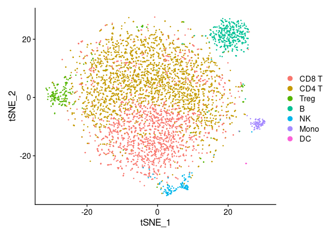
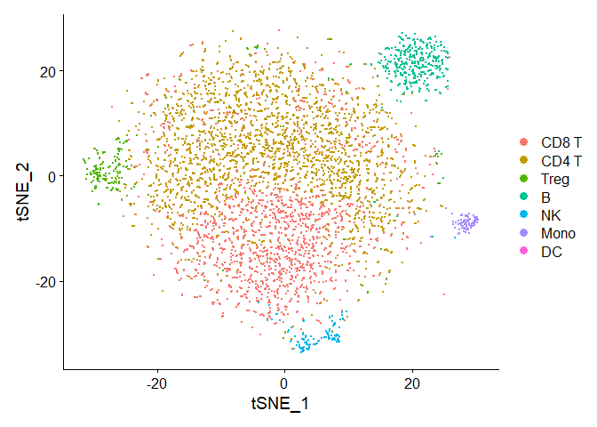
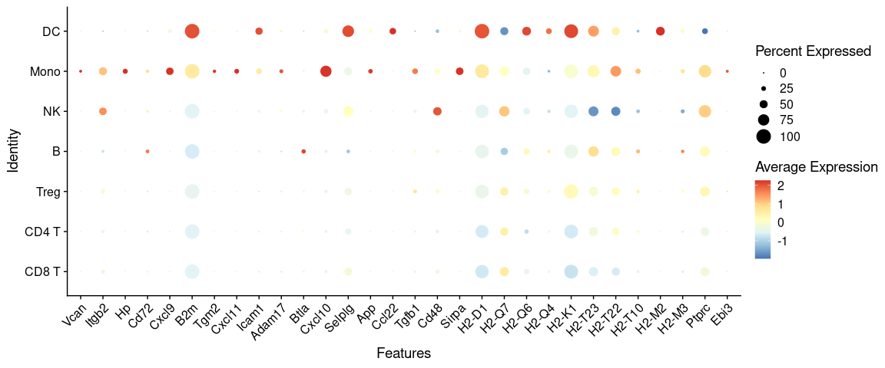
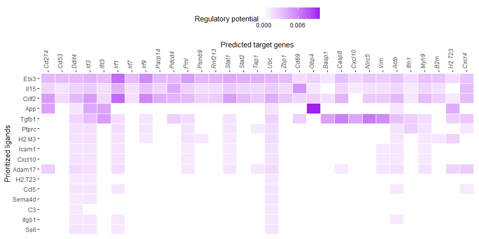
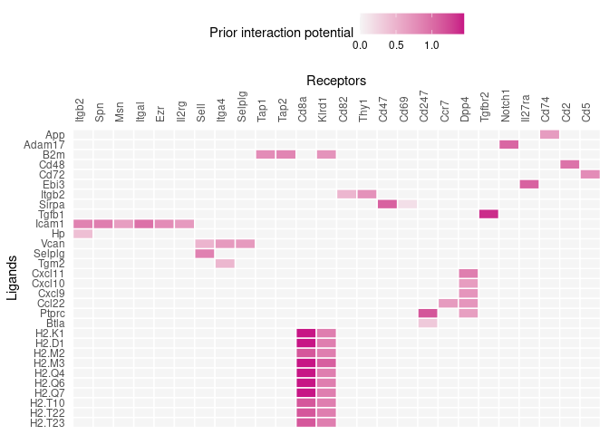
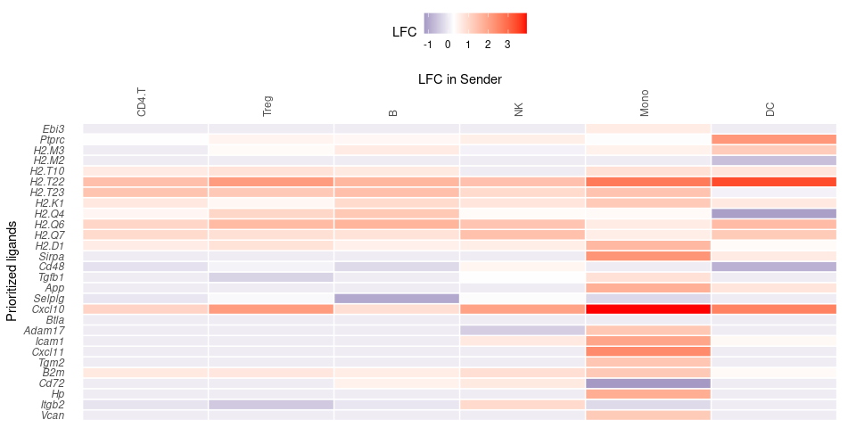
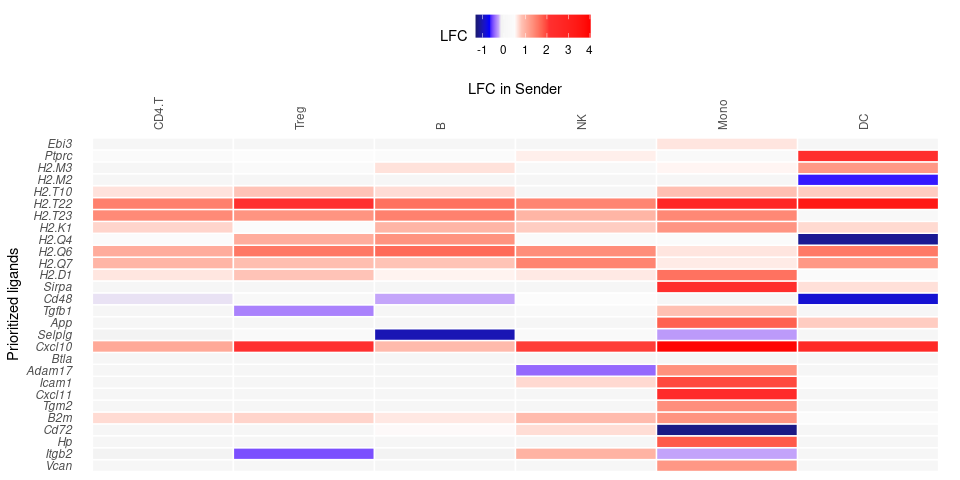
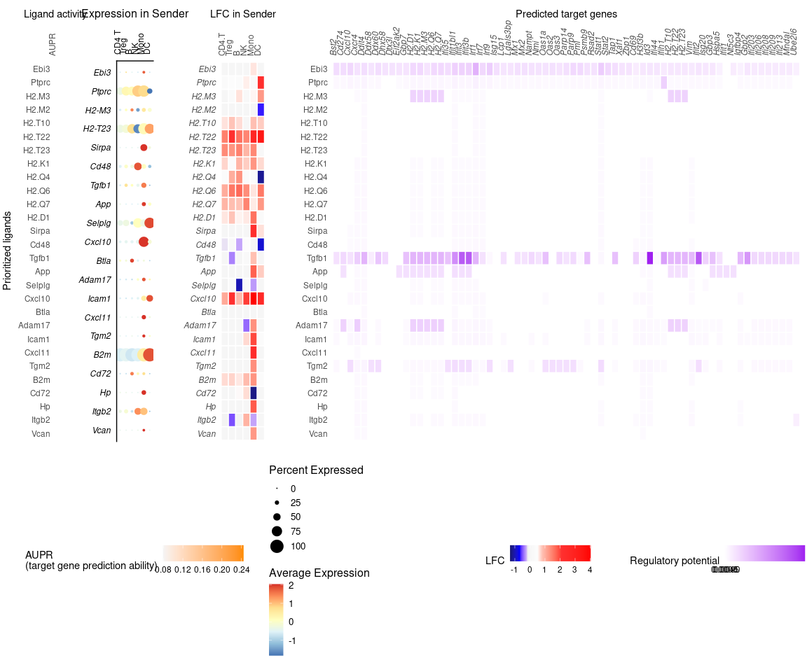

Perform NicheNet analysis starting from a Seurat object: step-by-step
analysis
================
Robin Browaeys
2023-10-02

<!-- github markdown built using 
rmarkdown::render("vignettes/seurat_steps.Rmd", output_format = "github_document")
-->

In this vignette, you can learn how to perform a basic NicheNet analysis
on a Seurat v3/v4 object. Such a NicheNet analysis can help you to
generate hypotheses about an intercellular communication process of
interest for which you have single-cell gene expression data as a Seurat
object. Specifically, NicheNet can predict 1) which ligands from one or
more cell population(s) (“sender/niche”) are most likely to affect
target gene expression in an interacting cell population
(“receiver/target”) and 2) which specific target genes are affected by
which of these predicted ligands.

Because NicheNet studies how ligands affect gene expression in
putatively neighboring/interacting cells, you need to have data about
this effect in gene expression you want to study. So, there need to be
‘some kind of’ differential expression in a receiver cell population,
caused by ligands from one of more interacting sender cell populations.

In this vignette, we demonstrate the use of NicheNet on a Seurat Object.
The steps of the analysis we show here are also discussed in detail in
the main, basis, NicheNet vignette [NicheNet’s ligand activity analysis
on a gene set of interest: predict active ligands and their target
genes](ligand_activity_geneset.md):`vignette("ligand_activity_geneset", package="nichenetr")`.
Make sure you understand the different steps in a NicheNet analysis that
are described in that vignette before proceeding with this vignette and
performing a real NicheNet analysis on your data. This vignette
describes the different steps behind the wrapper functions that are
shown in [Perform NicheNet analysis starting from a Seurat
object](seurat_wrapper.md):`vignette("seurat_wrapper", package="nichenetr")`.
Following this vignette has the advantage that it allows users to adapt
specific steps of the pipeline to make them more appropriate for their
data.

As example expression data of interacting cells, we will use mouse
NICHE-seq data from Medaglia et al. to explore intercellular
communication in the T cell area in the inguinal lymph node before and
72 hours after lymphocytic choriomeningitis virus (LCMV) infection
(Medaglia et al. 2017). We will NicheNet to explore immune cell
crosstalk in response to this LCMV infection.

In this dataset, differential expression is observed between CD8 T cells
in steady-state and CD8 T cells after LCMV infection. NicheNet can be
applied to look at how several immune cell populations in the lymph node
(i.e., monocytes, dendritic cells, NK cells, B cells, CD4 T cells) can
regulate and induce these observed gene expression changes. NicheNet
will specifically prioritize ligands from these immune cells and their
target genes that change in expression upon LCMV infection.

The used [ligand-target matrix](https://doi.org/10.5281/zenodo.7074290)
and the [Seurat object of the processed NICHE-seq single-cell
data](https://doi.org/10.5281/zenodo.3531889) can be downloaded from
Zenodo.

# Prepare NicheNet analysis

## Load required packages, read in the Seurat object with processed expression data of interacting cells and NicheNet’s ligand-target prior model, ligand-receptor network and weighted integrated networks.

The NicheNet ligand-receptor network and weighted networks are necessary
to define and show possible ligand-receptor interactions between two
cell populations. The ligand-target matrix denotes the prior potential
that particular ligands might regulate the expression of particular
target genes. This matrix is necessary to prioritize possible
ligand-receptor interactions based on observed gene expression effects
(i.e. NicheNet’s ligand activity analysis) and infer affected target
genes of these prioritized ligands.

### Load Packages:

``` r
library(nichenetr)
library(Seurat)
library(SeuratObject)
library(tidyverse)
```

If you would use and load other packages, we recommend to load these 3
packages after the others.

### Read in the expression data of interacting cells:

The dataset used here is publicly available single-cell data from immune
cells in the T cell area of the inguinal lymph node. The data was
processed and aggregated by applying the Seurat alignment pipeline. The
Seurat object contains this aggregated data. Note that this should be a
Seurat v3/v4 object and that gene should be named by their official
mouse/human gene symbol.

``` r
seuratObj = readRDS(url("https://zenodo.org/record/3531889/files/seuratObj.rds"))

seuratObj@meta.data %>% head()
##         nGene nUMI orig.ident aggregate res.0.6 celltype nCount_RNA nFeature_RNA
## W380370   880 1611      LN_SS        SS       1    CD8 T       1607          876
## W380372   541  891      LN_SS        SS       0    CD4 T        885          536
## W380374   742 1229      LN_SS        SS       0    CD4 T       1223          737
## W380378   847 1546      LN_SS        SS       1    CD8 T       1537          838
## W380379   839 1606      LN_SS        SS       0    CD4 T       1603          836
## W380381   517  844      LN_SS        SS       0    CD4 T        840          513

# For newer Seurat versions, you may need to run the following
seuratObj <- UpdateSeuratObject(seuratObj)
```

Visualize which cell populations are present: CD4 T cells (including
regulatory T cells), CD8 T cells, B cells, NK cells, dendritic cells
(DCs) and inflammatory monocytes

``` r
seuratObj@meta.data$celltype %>% table() # note that the number of cells of some cell types is very low and should preferably be higher for a real application
## .
##     B CD4 T CD8 T    DC  Mono    NK  Treg 
##   382  2562  1645    18    90   131   199
DimPlot(seuratObj, reduction = "tsne")
```

<!-- -->

Visualize the data to see to which condition cells belong. The metadata
dataframe column that denotes the condition (steady-state or after LCMV
infection) is here called ‘aggregate’.

``` r
seuratObj@meta.data$aggregate %>% table()
## .
## LCMV   SS 
## 3886 1141
DimPlot(seuratObj, reduction = "tsne", group.by = "aggregate")
```

<!-- -->

### Read in NicheNet’s ligand-target prior model, ligand-receptor network and weighted integrated networks:

``` r

organism = "mouse"

if(organism == "human"){
  lr_network = readRDS(url("https://zenodo.org/record/7074291/files/lr_network_human_21122021.rds"))
  ligand_target_matrix = readRDS(url("https://zenodo.org/record/7074291/files/ligand_target_matrix_nsga2r_final.rds"))
  weighted_networks = readRDS(url("https://zenodo.org/record/7074291/files/weighted_networks_nsga2r_final.rds"))
} else if(organism == "mouse"){
  lr_network = readRDS(url("https://zenodo.org/record/7074291/files/lr_network_mouse_21122021.rds"))
  ligand_target_matrix = readRDS(url("https://zenodo.org/record/7074291/files/ligand_target_matrix_nsga2r_final_mouse.rds"))
  weighted_networks = readRDS(url("https://zenodo.org/record/7074291/files/weighted_networks_nsga2r_final_mouse.rds"))

}

lr_network = lr_network %>% distinct(from, to)
head(lr_network)
## # A tibble: 6 × 2
##   from          to   
##   <chr>         <chr>
## 1 2300002M23Rik Ddr1 
## 2 2610528A11Rik Gpr15
## 3 9530003J23Rik Itgal
## 4 a             Atrn 
## 5 a             F11r 
## 6 a             Mc1r
ligand_target_matrix[1:5,1:5] # target genes in rows, ligands in columns
##               2300002M23Rik 2610528A11Rik 9530003J23Rik            a          A2m
## 0610005C13Rik  0.000000e+00  0.000000e+00  1.311297e-05 0.000000e+00 1.390053e-05
## 0610009B22Rik  0.000000e+00  0.000000e+00  1.269301e-05 0.000000e+00 1.345536e-05
## 0610009L18Rik  8.872902e-05  4.977197e-05  2.581909e-04 7.570125e-05 9.802264e-05
## 0610010F05Rik  2.194046e-03  1.111556e-03  3.142374e-03 1.631658e-03 2.585820e-03
## 0610010K14Rik  2.271606e-03  9.360769e-04  3.546140e-03 1.697713e-03 2.632082e-03

weighted_networks_lr = weighted_networks$lr_sig %>% inner_join(lr_network, by = c("from","to"))
head(weighted_networks$lr_sig) # interactions and their weights in the ligand-receptor + signaling network
## # A tibble: 6 × 3
##   from          to     weight
##   <chr>         <chr>   <dbl>
## 1 0610010F05Rik App    0.110 
## 2 0610010F05Rik Cat    0.0673
## 3 0610010F05Rik H1f2   0.0660
## 4 0610010F05Rik Lrrc49 0.0829
## 5 0610010F05Rik Nicn1  0.0864
## 6 0610010F05Rik Srpk1  0.123
head(weighted_networks$gr) # interactions and their weights in the gene regulatory network
## # A tibble: 6 × 3
##   from          to            weight
##   <chr>         <chr>          <dbl>
## 1 0610010K14Rik 0610010K14Rik 0.121 
## 2 0610010K14Rik 2510039O18Rik 0.121 
## 3 0610010K14Rik 2610021A01Rik 0.0256
## 4 0610010K14Rik 9130401M01Rik 0.0263
## 5 0610010K14Rik Alg1          0.127 
## 6 0610010K14Rik Alox12        0.128
```

If your expression data has the older gene symbols, you may want to use
our alias conversion function to avoid the loss of gene names.

``` r
seuratObj = alias_to_symbol_seurat(seuratObj, "mouse")
```

# Perform the NicheNet analysis

In this case study, we want to apply NicheNet to predict which ligands
expressed by all immune cells in the T cell area of the lymph node are
most likely to have induced the differential expression in CD8 T cells
after LCMV infection.

As described in the main vignette, the pipeline of a basic NicheNet
analysis consist of the following steps:

## 1. Define a “sender/niche” cell population and a “receiver/target” cell population present in your expression data and determine which genes are expressed in both populations

In this case study, the receiver cell population is the ‘CD8 T’ cell
population, whereas the sender cell populations are ‘CD4 T’, ‘Treg’,
‘Mono’, ‘NK’, ‘B’ and ‘DC’. We will consider a gene to be expressed when
it is expressed in at least 10% of cells in one cluster.

``` r
## receiver
receiver = "CD8 T"
expressed_genes_receiver = get_expressed_genes(receiver, seuratObj, pct = 0.10)

background_expressed_genes = expressed_genes_receiver %>% .[. %in% rownames(ligand_target_matrix)]
```

``` r
## sender
sender_celltypes = c("CD4 T","Treg", "Mono", "NK", "B", "DC")

list_expressed_genes_sender = sender_celltypes %>% unique() %>% lapply(get_expressed_genes, seuratObj, 0.10) # lapply to get the expressed genes of every sender cell type separately here
expressed_genes_sender = list_expressed_genes_sender %>% unlist() %>% unique()
```

## 2. Define a gene set of interest: these are the genes in the “receiver/target” cell population that are potentially affected by ligands expressed by interacting cells (e.g. genes differentially expressed upon cell-cell interaction)

Here, the gene set of interest are the genes differentially expressed in
CD8 T cells after LCMV infection. The condition of interest is thus
‘LCMV’, whereas the reference/steady-state condition is ‘SS’. The notion
of conditions can be extracted from the metadata column ‘aggregate’. The
method to calculate the differential expression is here the standard
Seurat Wilcoxon test, but this can be changed if necessary.

``` r
seurat_obj_receiver= subset(seuratObj, idents = receiver)
seurat_obj_receiver = SetIdent(seurat_obj_receiver, value = seurat_obj_receiver[["aggregate", drop=TRUE]])

condition_oi = "LCMV"
condition_reference = "SS" 
  
DE_table_receiver = FindMarkers(object = seurat_obj_receiver, ident.1 = condition_oi, ident.2 = condition_reference, min.pct = 0.10) %>% rownames_to_column("gene")

geneset_oi = DE_table_receiver %>% filter(p_val_adj <= 0.05 & abs(avg_log2FC) >= 0.25) %>% pull(gene)
geneset_oi = geneset_oi %>% .[. %in% rownames(ligand_target_matrix)]
```

## 3. Define a set of potential ligands: these are ligands that are expressed by the “sender/niche” cell population and bind a (putative) receptor expressed by the “receiver/target” population

Because we combined the expressed genes of each sender cell type, in
this example, we will perform one NicheNet analysis by pooling all
ligands from all cell types together. Later on during the interpretation
of the output, we will check which sender cell type expresses which
ligand.

``` r
ligands = lr_network %>% pull(from) %>% unique()
receptors = lr_network %>% pull(to) %>% unique()

expressed_ligands = intersect(ligands,expressed_genes_sender)
expressed_receptors = intersect(receptors,expressed_genes_receiver)

potential_ligands = lr_network %>% filter(from %in% expressed_ligands & to %in% expressed_receptors) %>% pull(from) %>% unique()
```

## 4) Perform NicheNet ligand activity analysis: rank the potential ligands based on the presence of their target genes in the gene set of interest (compared to the background set of genes)

``` r
ligand_activities = predict_ligand_activities(geneset = geneset_oi, background_expressed_genes = background_expressed_genes, ligand_target_matrix = ligand_target_matrix, potential_ligands = potential_ligands)

ligand_activities = ligand_activities %>% arrange(-aupr_corrected) %>% mutate(rank = rank(desc(aupr_corrected)))
ligand_activities
## # A tibble: 73 × 6
##    test_ligand auroc  aupr aupr_corrected pearson  rank
##    <chr>       <dbl> <dbl>          <dbl>   <dbl> <dbl>
##  1 Ebi3        0.663 0.390          0.244   0.301     1
##  2 Ptprc       0.642 0.310          0.165   0.167     2
##  3 H2-M3       0.608 0.292          0.146   0.179     3
##  4 H2-M2       0.611 0.279          0.133   0.153     5
##  5 H2-T10      0.611 0.279          0.133   0.153     5
##  6 H2-T22      0.611 0.279          0.133   0.153     5
##  7 H2-T23      0.611 0.278          0.132   0.153     7
##  8 H2-K1       0.605 0.268          0.122   0.142     8
##  9 H2-Q4       0.605 0.268          0.122   0.141    10
## 10 H2-Q6       0.605 0.268          0.122   0.141    10
## # ℹ 63 more rows
```

The different ligand activity measures (auroc, aupr, pearson correlation
coefficient) are a measure for how well a ligand can predict the
observed differentially expressed genes compared to the background of
expressed genes. In our validation study, we showed that the area under
the precision-recall curve (AUPR) between a ligand’s target predictions
and the observed transcriptional response was the most informative
measure to define ligand activity (this was the Pearson correlation for
v1). Therefore, NicheNet ranks the ligands based on their AUPR. This
allows us to prioritize ligands inducing the antiviral response in CD8 T
cells.

The number of top-ranked ligands that are further used to predict active
target genes and construct an active ligand-receptor network is here 30.

``` r
best_upstream_ligands = ligand_activities %>% top_n(30, aupr_corrected) %>% arrange(-aupr_corrected) %>% pull(test_ligand) %>% unique()
```

These ligands are expressed by one or more of the input sender cells. To
see which cell population expresses which of these top-ranked ligands,
you can run the following:

``` r
DotPlot(seuratObj, features = best_upstream_ligands %>% rev(), cols = "RdYlBu") + RotatedAxis()
```

<!-- -->

As you can see, most op the top-ranked ligands seem to be mainly
expressed by dendritic cells and monocytes.

## 5) Infer receptors and top-predicted target genes of ligands that are top-ranked in the ligand activity analysis

### Active target gene inference

``` r
active_ligand_target_links_df = best_upstream_ligands %>% lapply(get_weighted_ligand_target_links,geneset = geneset_oi, ligand_target_matrix = ligand_target_matrix, n = 200) %>% bind_rows() %>% drop_na()

active_ligand_target_links = prepare_ligand_target_visualization(ligand_target_df = active_ligand_target_links_df, ligand_target_matrix = ligand_target_matrix, cutoff = 0.33)

order_ligands = intersect(best_upstream_ligands, colnames(active_ligand_target_links)) %>% rev() %>% make.names()
order_targets = active_ligand_target_links_df$target %>% unique() %>% intersect(rownames(active_ligand_target_links)) %>% make.names()
rownames(active_ligand_target_links) = rownames(active_ligand_target_links) %>% make.names() # make.names() for heatmap visualization of genes like H2-T23
colnames(active_ligand_target_links) = colnames(active_ligand_target_links) %>% make.names() # make.names() for heatmap visualization of genes like H2-T23

vis_ligand_target = active_ligand_target_links[order_targets,order_ligands] %>% t()
```

``` r
p_ligand_target_network = vis_ligand_target %>% make_heatmap_ggplot("Prioritized ligands","Predicted target genes", color = "purple",legend_position = "top", x_axis_position = "top",legend_title = "Regulatory potential")  + theme(axis.text.x = element_text(face = "italic")) + scale_fill_gradient2(low = "whitesmoke",  high = "purple", breaks = c(0,0.0045,0.0090))
p_ligand_target_network
```

<!-- -->

Note that not all ligands from the top 30 are present in this
ligand-target heatmap. The left-out ligands are ligands that don’t have
target genes with high enough regulatory potential scores. Therefore,
they did not survive the used cutoffs. To include them, you can be less
stringent in the used cutoffs.

### Receptors of top-ranked ligands

``` r
lr_network_top = lr_network %>% filter(from %in% best_upstream_ligands & to %in% expressed_receptors) %>% distinct(from,to)
best_upstream_receptors = lr_network_top %>% pull(to) %>% unique()

lr_network_top_df_large = weighted_networks_lr %>% filter(from %in% best_upstream_ligands & to %in% best_upstream_receptors)

lr_network_top_df = lr_network_top_df_large %>% spread("from","weight",fill = 0)
lr_network_top_matrix = lr_network_top_df %>% select(-to) %>% as.matrix() %>% magrittr::set_rownames(lr_network_top_df$to)

dist_receptors = dist(lr_network_top_matrix, method = "binary")
hclust_receptors = hclust(dist_receptors, method = "ward.D2")
order_receptors = hclust_receptors$labels[hclust_receptors$order]
    
dist_ligands = dist(lr_network_top_matrix %>% t(), method = "binary")
hclust_ligands = hclust(dist_ligands, method = "ward.D2")
order_ligands_receptor = hclust_ligands$labels[hclust_ligands$order]

order_receptors = order_receptors %>% intersect(rownames(lr_network_top_matrix))
order_ligands_receptor = order_ligands_receptor %>% intersect(colnames(lr_network_top_matrix))

vis_ligand_receptor_network = lr_network_top_matrix[order_receptors, order_ligands_receptor]
rownames(vis_ligand_receptor_network) = order_receptors %>% make.names()
colnames(vis_ligand_receptor_network) = order_ligands_receptor %>% make.names()
```

``` r
p_ligand_receptor_network = vis_ligand_receptor_network %>% t() %>% make_heatmap_ggplot("Ligands","Receptors", color = "mediumvioletred", x_axis_position = "top",legend_title = "Prior interaction potential")
p_ligand_receptor_network
```

<!-- -->

## 6) Add log fold change information of ligands from sender cells

In some cases, it might be possible to also check upregulation of
ligands in sender cells. This can add a useful extra layer of
information next to the ligand activities defined by NicheNet, because
you can assume that some of the ligands inducing DE in receiver cells,
will be DE themselves in the sender cells.

Here this is possible: we will define the log fold change between LCMV
and steady-state in all sender cell types and visualize this as extra
information.

``` r
# DE analysis for each sender cell type
# this uses a new nichenetr function - reinstall nichenetr if necessary!
DE_table_all = Idents(seuratObj) %>% levels() %>% intersect(sender_celltypes) %>% lapply(get_lfc_celltype, seurat_obj = seuratObj, condition_colname = "aggregate", condition_oi = condition_oi, condition_reference = condition_reference, min.pct = 0.10, celltype_col = NULL) %>% reduce(full_join) # use this if cell type labels are the identities of your Seurat object -- if not: indicate the celltype_col properly
DE_table_all[is.na(DE_table_all)] = 0

# Combine ligand activities with DE information
ligand_activities_de = ligand_activities %>% select(test_ligand, pearson) %>% rename(ligand = test_ligand) %>% left_join(DE_table_all %>% rename(ligand = gene))
ligand_activities_de[is.na(ligand_activities_de)] = 0

# make LFC heatmap
lfc_matrix = ligand_activities_de  %>% select(-ligand, -pearson) %>% as.matrix() %>% magrittr::set_rownames(ligand_activities_de$ligand)
rownames(lfc_matrix) = rownames(lfc_matrix) %>% make.names()

order_ligands = order_ligands[order_ligands %in% rownames(lfc_matrix)]
vis_ligand_lfc = lfc_matrix[order_ligands,]

colnames(vis_ligand_lfc) = vis_ligand_lfc %>% colnames() %>% make.names()

p_ligand_lfc = vis_ligand_lfc %>% make_threecolor_heatmap_ggplot("Prioritized ligands","LFC in Sender", low_color = "midnightblue",mid_color = "white", mid = median(vis_ligand_lfc), high_color = "red",legend_position = "top", x_axis_position = "top", legend_title = "LFC") + theme(axis.text.y = element_text(face = "italic"))
p_ligand_lfc
```

<!-- -->

``` r

# change colors a bit to make them more stand out
p_ligand_lfc = p_ligand_lfc + scale_fill_gradientn(colors = c("midnightblue","blue", "grey95", "grey99","firebrick1","red"),values = c(0,0.1,0.2,0.25, 0.40, 0.7,1), limits = c(vis_ligand_lfc %>% min() - 0.1, vis_ligand_lfc %>% max() + 0.1))
p_ligand_lfc
```

<!-- -->

## 7) Summary visualizations of the NicheNet analysis

For example, you can make a combined heatmap of ligand activities,
ligand expression, ligand log fold change and the target genes of the
top-ranked ligands. The plots for the log fold change and target genes
were already made. Let’s now make the heatmap for ligand activities and
for expression.

``` r
# ligand activity heatmap
ligand_aupr_matrix = ligand_activities %>% select(aupr_corrected) %>% as.matrix() %>% magrittr::set_rownames(ligand_activities$test_ligand)

rownames(ligand_aupr_matrix) = rownames(ligand_aupr_matrix) %>% make.names()
colnames(ligand_aupr_matrix) = colnames(ligand_aupr_matrix) %>% make.names()

vis_ligand_aupr = ligand_aupr_matrix[order_ligands, ] %>% as.matrix(ncol = 1) %>% magrittr::set_colnames("AUPR")
p_ligand_aupr = vis_ligand_aupr %>% make_heatmap_ggplot("Prioritized ligands","Ligand activity", color = "darkorange",legend_position = "top", x_axis_position = "top", legend_title = "AUPR\n(target gene prediction ability)") + theme(legend.text = element_text(size = 9))
```

``` r
# ligand expression Seurat dotplot
order_ligands_adapted <- str_replace_all(order_ligands, "\\.", "-")
rotated_dotplot = DotPlot(seuratObj %>% subset(celltype %in% sender_celltypes), features = order_ligands_adapted, cols = "RdYlBu") + coord_flip() + theme(legend.text = element_text(size = 10), legend.title = element_text(size = 12)) # flip of coordinates necessary because we want to show ligands in the rows when combining all plots
```

``` r

figures_without_legend = cowplot::plot_grid(
  p_ligand_aupr + theme(legend.position = "none", axis.ticks = element_blank()) + theme(axis.title.x = element_text()),
  rotated_dotplot + theme(legend.position = "none", axis.ticks = element_blank(), axis.title.x = element_text(size = 12), axis.text.y = element_text(face = "italic", size = 9), axis.text.x = element_text(size = 9,  angle = 90,hjust = 0)) + ylab("Expression in Sender") + xlab("") + scale_y_discrete(position = "right"),
  p_ligand_lfc + theme(legend.position = "none", axis.ticks = element_blank()) + theme(axis.title.x = element_text()) + ylab(""),
  p_ligand_target_network + theme(legend.position = "none", axis.ticks = element_blank()) + ylab(""),
  align = "hv",
  nrow = 1,
  rel_widths = c(ncol(vis_ligand_aupr)+6, ncol(vis_ligand_lfc) + 7, ncol(vis_ligand_lfc) + 8, ncol(vis_ligand_target)))

legends = cowplot::plot_grid(
    ggpubr::as_ggplot(ggpubr::get_legend(p_ligand_aupr)),
    ggpubr::as_ggplot(ggpubr::get_legend(rotated_dotplot)),
    ggpubr::as_ggplot(ggpubr::get_legend(p_ligand_lfc)),
    ggpubr::as_ggplot(ggpubr::get_legend(p_ligand_target_network)),
    nrow = 1,
    align = "h", rel_widths = c(1.5, 1, 1, 1))

combined_plot = cowplot::plot_grid(figures_without_legend, legends, rel_heights = c(10,5), nrow = 2, align = "hv")
combined_plot
```

<!-- -->

# Remarks

Top-ranked ligands and target genes shown here differ from the
predictions shown in the respective case study in the NicheNet paper
because 1) a different definition of expressed genes was used, and 2) we
have updated the ligand-target matrix to include more data sources.

``` r
sessionInfo()
## R version 4.3.1 (2023-06-16)
## Platform: x86_64-redhat-linux-gnu (64-bit)
## Running under: CentOS Stream 8
## 
## Matrix products: default
## BLAS/LAPACK: /usr/lib64/libopenblaso-r0.3.15.so;  LAPACK version 3.9.0
## 
## locale:
##  [1] LC_CTYPE=en_US.UTF-8       LC_NUMERIC=C               LC_TIME=en_US.UTF-8        LC_COLLATE=en_US.UTF-8     LC_MONETARY=en_US.UTF-8    LC_MESSAGES=en_US.UTF-8    LC_PAPER=en_US.UTF-8       LC_NAME=C                 
##  [9] LC_ADDRESS=C               LC_TELEPHONE=C             LC_MEASUREMENT=en_US.UTF-8 LC_IDENTIFICATION=C       
## 
## time zone: Europe/Brussels
## tzcode source: system (glibc)
## 
## attached base packages:
## [1] stats     graphics  grDevices utils     datasets  methods   base     
## 
## other attached packages:
##  [1] forcats_0.5.1      stringr_1.5.0      dplyr_1.1.2        purrr_1.0.2        readr_2.1.2        tidyr_1.3.0        tibble_3.2.1       ggplot2_3.4.3      tidyverse_1.3.1    Seurat_4.4.0       nichenetr_2.0.3    testthat_3.1.2    
## [13] SeuratObject_4.1.4 sp_2.0-0          
## 
## loaded via a namespace (and not attached):
##   [1] fs_1.5.2               matrixStats_1.0.0      spatstat.sparse_3.0-2  bitops_1.0-7           devtools_2.4.3         lubridate_1.8.0        httr_1.4.2             RColorBrewer_1.1-2     doParallel_1.0.17     
##  [10] tools_4.3.1            sctransform_0.4.0      backports_1.4.1        utf8_1.2.2             R6_2.5.1               lazyeval_0.2.2         uwot_0.1.16            GetoptLong_1.0.5       withr_2.5.0           
##  [19] prettyunits_1.1.1      gridExtra_2.3          fdrtool_1.2.17         progressr_0.14.0       cli_3.6.1              DiceKriging_1.6.0      spatstat.explore_3.2-1 labeling_0.4.2         spatstat.data_3.0-1   
##  [28] randomForest_4.7-1.1   proxy_0.4-27           ggridges_0.5.3         pbapply_1.5-0          foreign_0.8-84         smoof_1.6.0.3          parallelly_1.30.0      sessioninfo_1.2.2      limma_3.56.2          
##  [37] readxl_1.3.1           rstudioapi_0.13        visNetwork_2.1.2       generics_0.1.2         shape_1.4.6            ica_1.0-2              spatstat.random_3.1-5  car_3.1-2              Matrix_1.6-1          
##  [46] S4Vectors_0.38.1       fansi_1.0.2            abind_1.4-5            lifecycle_1.0.3        yaml_2.2.2             carData_3.0-5          recipes_1.0.7          Rtsne_0.15             grid_4.3.1            
##  [55] promises_1.2.0.1       crayon_1.5.0           miniUI_0.1.1.1         lattice_0.21-8         haven_2.4.3            cowplot_1.1.1          mlr_2.19.1             pillar_1.9.0           knitr_1.37            
##  [64] ComplexHeatmap_2.16.0  rjson_0.2.21           future.apply_1.8.1     codetools_0.2-19       fastmatch_1.1-3        leiden_0.3.9           glue_1.6.2             ParamHelpers_1.14.1    data.table_1.14.2     
##  [73] remotes_2.4.2          vctrs_0.6.3            png_0.1-7              cellranger_1.1.0       gtable_0.3.0           assertthat_0.2.1       cachem_1.0.6           gower_1.0.1            xfun_0.40             
##  [82] mime_0.12              prodlim_2023.03.31     survival_3.5-5         timeDate_4022.108      iterators_1.0.14       hardhat_1.3.0          lava_1.7.2.1           DiagrammeR_1.0.10      ellipsis_0.3.2        
##  [91] fitdistrplus_1.1-6     ROCR_1.0-11            ipred_0.9-14           nlme_3.1-162           usethis_2.2.2          RcppAnnoy_0.0.19       rprojroot_2.0.2        irlba_2.3.5            KernSmooth_2.23-21    
## [100] rpart_4.1.19           DBI_1.1.2              BiocGenerics_0.46.0    colorspace_2.0-2       Hmisc_5.1-0            nnet_7.3-19            tidyselect_1.2.0       processx_3.5.2         compiler_4.3.1        
## [109] parallelMap_1.5.1      rvest_1.0.2            htmlTable_2.4.1        xml2_1.3.3             desc_1.4.2             plotly_4.10.0          shadowtext_0.1.2       checkmate_2.2.0        scales_1.2.1          
## [118] caTools_1.18.2         lmtest_0.9-39          callr_3.7.0            digest_0.6.29          goftest_1.2-3          spatstat.utils_3.0-3   rmarkdown_2.11         htmltools_0.5.6        pkgconfig_2.0.3       
## [127] base64enc_0.1-3        lhs_1.1.6              highr_0.9              dbplyr_2.1.1           fastmap_1.1.0          rlang_1.1.1            GlobalOptions_0.1.2    htmlwidgets_1.6.2      shiny_1.7.1           
## [136] BBmisc_1.13            farver_2.1.0           zoo_1.8-9              jsonlite_1.7.3         mlrMBO_1.1.5.1         ModelMetrics_1.2.2.2   magrittr_2.0.2         Formula_1.2-5          patchwork_1.1.1       
## [145] munsell_0.5.0          Rcpp_1.0.11            ggnewscale_0.4.9       reticulate_1.24        stringi_1.7.6          pROC_1.18.4            brio_1.1.3             MASS_7.3-60            plyr_1.8.6            
## [154] pkgbuild_1.3.1         parallel_4.3.1         listenv_0.8.0          ggrepel_0.9.3          deldir_1.0-6           splines_4.3.1          tensor_1.5             hms_1.1.1              circlize_0.4.15       
## [163] ps_1.6.0               igraph_1.5.1           ggpubr_0.6.0           spatstat.geom_3.2-4    ggsignif_0.6.4         reshape2_1.4.4         stats4_4.3.1           pkgload_1.2.4          reprex_2.0.1          
## [172] evaluate_0.14          modelr_0.1.8           tweenr_2.0.2           tzdb_0.4.0             foreach_1.5.2          httpuv_1.6.5           RANN_2.6.1             polyclip_1.10-0        clue_0.3-64           
## [181] future_1.23.0          scattermore_1.2        ggforce_0.4.1          broom_0.7.12           xtable_1.8-4           emoa_0.5-0.2           e1071_1.7-13           rstatix_0.7.2          later_1.3.0           
## [190] viridisLite_0.4.0      class_7.3-22           IRanges_2.34.1         memoise_2.0.1          cluster_2.1.4          globals_0.14.0         caret_6.0-94
```

# References

<div id="refs" class="references csl-bib-body hanging-indent">

<div id="ref-medaglia_spatial_2017" class="csl-entry">

Medaglia, Chiara, Amir Giladi, Liat Stoler-Barak, Marco De Giovanni,
Tomer Meir Salame, Adi Biram, Eyal David, et al. 2017. “Spatial
Reconstruction of Immune Niches by Combining Photoactivatable Reporters
and <span class="nocase">scRNA</span>-Seq.” *Science*, December,
eaao4277. <https://doi.org/10.1126/science.aao4277>.

</div>

</div>
