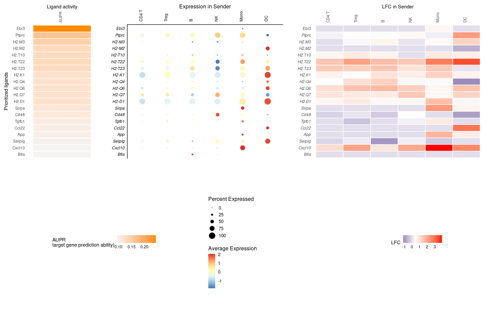
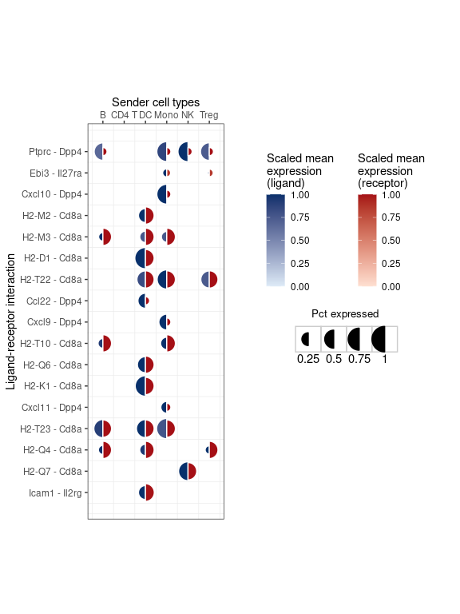
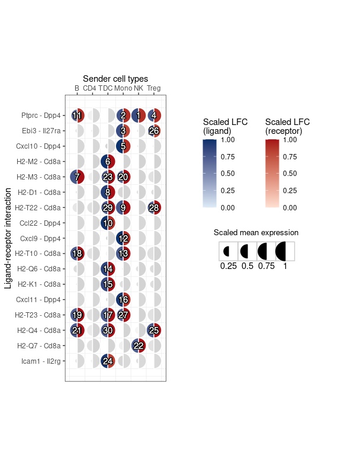
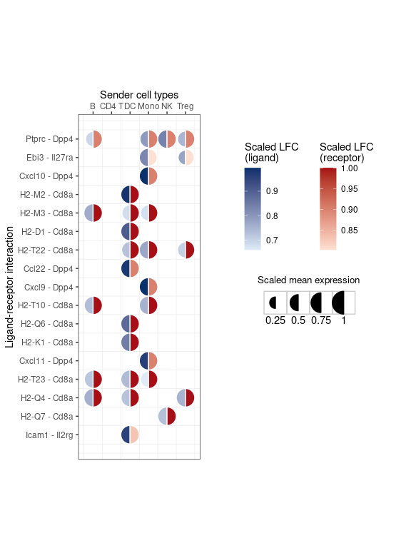

Perform NicheNet analysis with prioritization
================
Robin Browaeys & Chananchida Sang-aram
2023-10-02

<!-- github markdown built using 
rmarkdown::render("vignettes/seurat_steps_prioritization.Rmd", output_format = "github_document")
-->

``` r
### Load Packages
library(nichenetr) # Please update to v2.0.4
library(Seurat)
library(SeuratObject)
library(tidyverse)

### Read in Seurat object
seuratObj = readRDS(url("https://zenodo.org/record/3531889/files/seuratObj.rds"))

# For newer Seurat versions, you may need to run the following
seuratObj <- UpdateSeuratObject(seuratObj)
```

In this vignette, we will extend the basic NicheNet analysis analysis
from [Perform NicheNet analysis starting from a Seurat object:
step-by-step analysis](seurat_steps.md) by incorporating gene expression
as part of the prioritization This is a generalization of the
[Differential NicheNet](differential_nichenet.md) and
[MultiNicheNet](https://github.com/saeyslab/multinichenetr) approach.
While the original NicheNet only ranks ligands based on the ligand
activity analysis, it is now also possible to prioritize ligands based
on upregulation of the ligand/receptor, and the cell-type and condition
specificity of hte ligand and receptor.

Make sure you understand the different steps in a NicheNet analysis that
are described in that vignette before proceeding with this vignette and
performing a real NicheNet analysis on your data.

We will again make use of mouse NICHE-seq data from Medaglia et al. to
explore intercellular communication in the T cell area in the inguinal
lymph node before and 72 hours after lymphocytic choriomeningitis virus
(LCMV) infection (Medaglia et al. 2017). We will NicheNet to explore
immune cell crosstalk in response to this LCMV infection. In this
dataset, differential expression is observed between CD8 T cells in
steady-state and CD8 T cells after LCMV infection. NicheNet can be
applied to look at how several immune cell populations in the lymph node
(i.e., monocytes, dendritic cells, NK cells, B cells, CD4 T cells) can
regulate and induce these observed gene expression changes. NicheNet
will specifically prioritize ligands from these immune cells and their
target genes that change in expression upon LCMV infection.

Hence, we have to make some additional calculations, including DE of the
ligand/receptor in a sender/receiver cell type, and the average
expression of each ligand/receptor in each sender/receiver cell type.
The DE analysis boils down to computing pairwise tests between the cell
type of interest and other cell types in the dataset. We will subset the
data to only the condition of interest, “LCMV”. For this analysis we
will consider all cell types as both sender and receiver, as we want the
ligand/receptor to be specific.

The used [ligand-target matrix](https://doi.org/10.5281/zenodo.7074290)
and the [Seurat object of the processed NICHE-seq single-cell
data](https://doi.org/10.5281/zenodo.3531889) can be downloaded from
Zenodo.

## Load required packages, read in the Seurat object with processed expression data of interacting cells and NicheNet’s ligand-target prior model, ligand-receptor network and weighted integrated networks.

The NicheNet ligand-receptor network and weighted networks are necessary
to define and show possible ligand-receptor interactions between two
cell populations. The ligand-target matrix denotes the prior potential
that particular ligands might regulate the expression of particular
target genes. This matrix is necessary to prioritize possible
ligand-receptor interactions based on observed gene expression effects
(i.e. NicheNet’s ligand activity analysis) and infer affected target
genes of these prioritized ligands.

``` r
lr_network = readRDS(url("https://zenodo.org/record/7074291/files/lr_network_mouse_21122021.rds"))
ligand_target_matrix = readRDS(url("https://zenodo.org/record/7074291/files/ligand_target_matrix_nsga2r_final_mouse.rds"))
weighted_networks = readRDS(url("https://zenodo.org/record/7074291/files/weighted_networks_nsga2r_final_mouse.rds"))

lr_network = lr_network %>% distinct(from, to)
head(lr_network)
## # A tibble: 6 × 2
##   from          to   
##   <chr>         <chr>
## 1 2300002M23Rik Ddr1 
## 2 2610528A11Rik Gpr15
## 3 9530003J23Rik Itgal
## 4 a             Atrn 
## 5 a             F11r 
## 6 a             Mc1r
ligand_target_matrix[1:5,1:5] # target genes in rows, ligands in columns
##               2300002M23Rik 2610528A11Rik 9530003J23Rik            a          A2m
## 0610005C13Rik  0.000000e+00  0.000000e+00  1.311297e-05 0.000000e+00 1.390053e-05
## 0610009B22Rik  0.000000e+00  0.000000e+00  1.269301e-05 0.000000e+00 1.345536e-05
## 0610009L18Rik  8.872902e-05  4.977197e-05  2.581909e-04 7.570125e-05 9.802264e-05
## 0610010F05Rik  2.194046e-03  1.111556e-03  3.142374e-03 1.631658e-03 2.585820e-03
## 0610010K14Rik  2.271606e-03  9.360769e-04  3.546140e-03 1.697713e-03 2.632082e-03

weighted_networks_lr = weighted_networks$lr_sig %>% inner_join(lr_network, by = c("from","to"))
head(weighted_networks$lr_sig) # interactions and their weights in the ligand-receptor + signaling network
## # A tibble: 6 × 3
##   from          to     weight
##   <chr>         <chr>   <dbl>
## 1 0610010F05Rik App    0.110 
## 2 0610010F05Rik Cat    0.0673
## 3 0610010F05Rik H1f2   0.0660
## 4 0610010F05Rik Lrrc49 0.0829
## 5 0610010F05Rik Nicn1  0.0864
## 6 0610010F05Rik Srpk1  0.123
head(weighted_networks$gr) # interactions and their weights in the gene regulatory network
## # A tibble: 6 × 3
##   from          to            weight
##   <chr>         <chr>          <dbl>
## 1 0610010K14Rik 0610010K14Rik 0.121 
## 2 0610010K14Rik 2510039O18Rik 0.121 
## 3 0610010K14Rik 2610021A01Rik 0.0256
## 4 0610010K14Rik 9130401M01Rik 0.0263
## 5 0610010K14Rik Alg1          0.127 
## 6 0610010K14Rik Alox12        0.128

seuratObj = alias_to_symbol_seurat(seuratObj, "mouse")
```

# Perform the NicheNet analysis

In this case study, we want to apply NicheNet to predict which ligands
expressed by all immune cells in the T cell area of the lymph node are
most likely to have induced the differential expression in CD8 T cells
after LCMV infection.

As described in the main vignette, the pipeline of a basic NicheNet
analysis consist of the following steps:

In this case study, the receiver cell population is the ‘CD8 T’ cell
population, whereas the sender cell populations are ‘CD4 T’, ‘Treg’,
‘Mono’, ‘NK’, ‘B’ and ‘DC’. We will consider a gene to be expressed when
it is expressed in at least 10% of cells in one cluster.

``` r
# 1. Define a “sender/niche” cell population and a “receiver/target” cell population present in your expression data and determine which genes are expressed in both populations
## receiver
receiver = "CD8 T"
expressed_genes_receiver = get_expressed_genes(receiver, seuratObj, pct = 0.10)
background_expressed_genes = expressed_genes_receiver %>% .[. %in% rownames(ligand_target_matrix)]

## sender
sender_celltypes = c("CD4 T","Treg", "Mono", "NK", "B", "DC")

list_expressed_genes_sender = sender_celltypes %>% unique() %>% lapply(get_expressed_genes, seuratObj, 0.10) # lapply to get the expressed genes of every sender cell type separately here
expressed_genes_sender = list_expressed_genes_sender %>% unlist() %>% unique()

# 2. Define a gene set of interest: these are the genes in the “receiver/target” cell population that are potentially affected by ligands expressed by interacting cells (e.g. genes differentially expressed upon cell-cell interaction)

seurat_obj_receiver= subset(seuratObj, idents = receiver)
seurat_obj_receiver = SetIdent(seurat_obj_receiver, value = seurat_obj_receiver[["aggregate", drop=TRUE]])

condition_oi = "LCMV"
condition_reference = "SS" 
  
DE_table_receiver = FindMarkers(object = seurat_obj_receiver, ident.1 = condition_oi, ident.2 = condition_reference, min.pct = 0.10) %>% rownames_to_column("gene")

geneset_oi = DE_table_receiver %>% filter(p_val_adj <= 0.05 & abs(avg_log2FC) >= 0.25) %>% pull(gene)
geneset_oi = geneset_oi %>% .[. %in% rownames(ligand_target_matrix)]

# 3. Define a set of potential ligands
ligands = lr_network %>% pull(from) %>% unique()
receptors = lr_network %>% pull(to) %>% unique()

expressed_ligands = intersect(ligands,expressed_genes_sender)
expressed_receptors = intersect(receptors,expressed_genes_receiver)

potential_ligands = lr_network %>% filter(from %in% expressed_ligands & to %in% expressed_receptors) %>% pull(from) %>% unique()

# 4. Perform NicheNet ligand activity analysis
ligand_activities = predict_ligand_activities(geneset = geneset_oi, background_expressed_genes = background_expressed_genes, ligand_target_matrix = ligand_target_matrix, potential_ligands = potential_ligands)

ligand_activities = ligand_activities %>% arrange(-aupr_corrected) %>% mutate(rank = rank(desc(aupr_corrected)))
ligand_activities
## # A tibble: 73 × 6
##    test_ligand auroc  aupr aupr_corrected pearson  rank
##    <chr>       <dbl> <dbl>          <dbl>   <dbl> <dbl>
##  1 Ebi3        0.663 0.390          0.244   0.301     1
##  2 Ptprc       0.642 0.310          0.165   0.167     2
##  3 H2-M3       0.608 0.292          0.146   0.179     3
##  4 H2-M2       0.611 0.279          0.133   0.153     5
##  5 H2-T10      0.611 0.279          0.133   0.153     5
##  6 H2-T22      0.611 0.279          0.133   0.153     5
##  7 H2-T23      0.611 0.278          0.132   0.153     7
##  8 H2-K1       0.605 0.268          0.122   0.142     8
##  9 H2-Q4       0.605 0.268          0.122   0.141    10
## 10 H2-Q6       0.605 0.268          0.122   0.141    10
## # ℹ 63 more rows
```

## Perform prioritization of ligand-receptor pairs

In addition to the NicheNet ligand activity (`activity_scaled`), you can
prioritize based on:

- Upregulation of the ligand in a sender cell type compared to other
  cell types: `de_ligand`
- Upregulation of the receptor in a receiver cell type: `de_receptor`
- Average expression of the ligand in the sender cell type:
  `exprs_ligand`
- Average expression of the receptor in the receiver cell type:
  `exprs_receptor`
- Condition-specificity of the ligand across all cell types:
  `ligand_condition_specificity`
- Condition-specificity of the receptor across all cell types:
  `receptor_condition_specificity`

Note that the first four criteria are calculated only in the condition
of interest.

``` r
# By default, ligand_condition_specificty and receptor_condition_specificty are 0
prioritizing_weights = c("de_ligand" = 1,
                          "de_receptor" = 1,
                          "activity_scaled" = 2,
                          "exprs_ligand" = 1,
                          "exprs_receptor" = 1,
                         "ligand_condition_specificity" = 0.5,
                         "receptor_condition_specificity" = 0.5)
```

We provide helper functions to calculate these values, including
`calculate_de` and `get_exprs_avg`. `process_table_to_ic` transforms
these different dataframes so they are compatible with the
`generate_prioritization_tables` function.

``` r
lr_network_renamed <- lr_network %>% rename(ligand=from, receptor=to)

# Only calculate DE for LCMV condition, with genes that are in the ligand-receptor network
DE_table <- calculate_de(seuratObj, celltype_colname = "celltype",
                         condition_colname = "aggregate", condition_oi = condition_oi,
                         features = union(expressed_ligands, expressed_receptors))

# Average expression information - only for LCMV condition
expression_info <- get_exprs_avg(seuratObj, "celltype", condition_colname = "aggregate", condition_oi = condition_oi)

# Calculate condition specificity - only for datasets with two conditions!
condition_markers <- FindMarkers(object = seuratObj, ident.1 = condition_oi, ident.2 = condition_reference,
                                 group.by = "aggregate", min.pct = 0, logfc.threshold = 0,
                                 features = union(expressed_ligands, expressed_receptors)) %>% rownames_to_column("gene")

# Combine DE of senders and receivers -> used for prioritization
processed_DE_table <- process_table_to_ic(DE_table, table_type = "celltype_DE", lr_network_renamed,
                                         senders_oi = sender_celltypes, receivers_oi = receiver)
  
processed_expr_table <- process_table_to_ic(expression_info, table_type = "expression", lr_network_renamed)

processed_condition_markers <- process_table_to_ic(condition_markers, table_type = "group_DE", lr_network_renamed)
```

Finally we generate the prioritization table. The `lfc_ligand` and
`lfc_receptor` columns are based on the differences between cell types
within your condition of interest. This is equivalent to subsetting your
Seurat object to only the condition of interest and running
`Seurat::FindAllMarkers`.

The columns that refer to differential expression between conditions are
those with the \_group suffix, e.g., `lfc_ligand_group` and
`lfc_receptor_group.` These are celltype agnostic: they are calculated
by using `Seurat::FindMarkers` between two conditions across all cell
types.

``` r
prior_table <- generate_prioritization_tables(processed_expr_table,
                               processed_DE_table,
                               ligand_activities,
                               processed_condition_markers,
                               prioritizing_weights = prioritizing_weights)

prior_table 
## # A tibble: 858 × 51
##    sender receiver ligand receptor lfc_ligand lfc_receptor ligand_receptor_lfc_avg p_val_ligand p_adj_ligand p_val_receptor p_adj_receptor pct_expressed_sender pct_expressed_receiver avg_ligand avg_receptor ligand_receptor_prod
##    <chr>  <chr>    <chr>  <chr>         <dbl>        <dbl>                   <dbl>        <dbl>        <dbl>          <dbl>          <dbl>                <dbl>                  <dbl>      <dbl>        <dbl>                <dbl>
##  1 NK     CD8 T    Ptprc  Dpp4          0.596       0.164                    0.380    2.18e-  7    2.96e-  3      6.63e-  4      1   e+  0                0.894                  0.148     16.6           1.35               22.5  
##  2 Mono   CD8 T    Ptprc  Dpp4          0.438       0.164                    0.301    3.52e-  5    4.77e-  1      6.63e-  4      1   e+  0                0.867                  0.148     14.9           1.35               20.1  
##  3 Mono   CD8 T    Ebi3   Il27ra        0.580       0.0609                   0.320    9.77e- 49    1.32e- 44      8.28e-  4      1   e+  0                0.147                  0.131      0.546         1.13                0.619
##  4 Treg   CD8 T    Ptprc  Dpp4          0.282       0.164                    0.223    1.44e-  2    1   e+  0      6.63e-  4      1   e+  0                0.685                  0.148     13.2           1.35               17.9  
##  5 Mono   CD8 T    Cxcl10 Dpp4          4.27        0.164                    2.22     2.53e- 79    3.43e- 75      6.63e-  4      1   e+  0                0.867                  0.148     54.8           1.35               74.1  
##  6 DC     CD8 T    H2-M2  Cd8a          3.42        1.94                     2.68     1.02e-272    1.38e-268      5.25e-206      7.11e-202                0.429                  0.659      9.73         10.7               104.   
##  7 B      CD8 T    H2-M3  Cd8a          0.312       1.94                     1.13     2.42e-  2    1   e+  0      5.25e-206      7.11e-202                0.16                   0.659      1.59         10.7                17.0  
##  8 DC     CD8 T    H2-D1  Cd8a          1.15        1.94                     1.55     2.60e-  7    3.52e-  3      5.25e-206      7.11e-202                1                      0.659     60.7          10.7               651.   
##  9 Mono   CD8 T    H2-T22 Cd8a          0.362       1.94                     1.15     7.36e-  4    1   e+  0      5.25e-206      7.11e-202                0.813                  0.659     10.4          10.7               111.   
## 10 DC     CD8 T    Ccl22  Dpp4          2.87        0.164                    1.52     1.59e-296    2.15e-292      6.63e-  4      1   e+  0                0.5                    0.148      6.37          1.35                8.61 
## # ℹ 848 more rows
## # ℹ 35 more variables: lfc_pval_ligand <dbl>, p_val_ligand_adapted <dbl>, scaled_lfc_ligand <dbl>, scaled_p_val_ligand <dbl>, scaled_lfc_pval_ligand <dbl>, scaled_p_val_ligand_adapted <dbl>, activity <dbl>, rank <dbl>,
## #   activity_zscore <dbl>, scaled_activity <dbl>, lfc_pval_receptor <dbl>, p_val_receptor_adapted <dbl>, scaled_lfc_receptor <dbl>, scaled_p_val_receptor <dbl>, scaled_lfc_pval_receptor <dbl>, scaled_p_val_receptor_adapted <dbl>,
## #   scaled_avg_exprs_ligand <dbl>, scaled_avg_exprs_receptor <dbl>, lfc_ligand_group <dbl>, p_val_ligand_group <dbl>, lfc_pval_ligand_group <dbl>, p_val_ligand_adapted_group <dbl>, scaled_lfc_ligand_group <dbl>,
## #   scaled_p_val_ligand_group <dbl>, scaled_lfc_pval_ligand_group <dbl>, scaled_p_val_ligand_adapted_group <dbl>, lfc_receptor_group <dbl>, p_val_receptor_group <dbl>, lfc_pval_receptor_group <dbl>,
## #   p_val_receptor_adapted_group <dbl>, scaled_lfc_receptor_group <dbl>, scaled_p_val_receptor_group <dbl>, scaled_lfc_pval_receptor_group <dbl>, scaled_p_val_receptor_adapted_group <dbl>, prioritization_score <dbl>
```

As you can see, the resulting table now show the rankings for
*ligand-receptor interactions of a sender-receiver cell type pair*,
instead of just the prioritized ligands. We included all columns here,
but if you just want relevant columns that were used to calculate the
ranking:

``` r
prior_table %>% select(c('sender', 'receiver', 'ligand', 'receptor', 'scaled_lfc_ligand', 'scaled_lfc_receptor', 'scaled_p_val_ligand_adapted', 'scaled_p_val_receptor_adapted', 'scaled_avg_exprs_ligand', 'scaled_avg_exprs_receptor', 'scaled_lfc_ligand_group', 'scaled_lfc_receptor_group', 'scaled_activity'))
## # A tibble: 858 × 13
##    sender receiver ligand receptor scaled_lfc_ligand scaled_lfc_receptor scaled_p_val_ligand_adapted scaled_p_val_receptor_a…¹ scaled_avg_exprs_lig…² scaled_avg_exprs_rec…³ scaled_lfc_ligand_gr…⁴ scaled_lfc_receptor_…⁵ scaled_activity
##    <chr>  <chr>    <chr>  <chr>                <dbl>               <dbl>                       <dbl>                     <dbl>                  <dbl>                  <dbl>                  <dbl>                  <dbl>           <dbl>
##  1 NK     CD8 T    Ptprc  Dpp4                 0.837               0.901                       0.845                     0.887                  1.00                   1.00                   0.779                 0.831            0.862
##  2 Mono   CD8 T    Ptprc  Dpp4                 0.793               0.901                       0.817                     0.887                  0.867                  1.00                   0.779                 0.831            0.862
##  3 Mono   CD8 T    Ebi3   Il27ra               0.827               0.803                       0.933                     0.873                  1.00                   0.859                  0.538                 0.0986           1.00 
##  4 Treg   CD8 T    Ptprc  Dpp4                 0.747               0.901                       0.736                     0.887                  0.741                  1.00                   0.779                 0.831            0.862
##  5 Mono   CD8 T    Cxcl10 Dpp4                 0.994               0.901                       0.952                     0.887                  1.00                   1.00                   0.990                 0.831            0.431
##  6 DC     CD8 T    H2-M2  Cd8a                 0.984               1                           0.994                     1                      1.00                   1.00                   0.308                 0.0845           0.664
##  7 B      CD8 T    H2-M3  Cd8a                 0.763               1                           0.721                     1                      1.00                   1.00                   0.846                 0.0845           0.748
##  8 DC     CD8 T    H2-D1  Cd8a                 0.907               1                           0.841                     1                      1.00                   1.00                   0.885                 0.0845           0.593
##  9 Mono   CD8 T    H2-T22 Cd8a                 0.772               1                           0.785                     1                      1.00                   1.00                   0.981                 0.0845           0.664
## 10 DC     CD8 T    Ccl22  Dpp4                 0.979               0.901                       0.998                     0.887                  1.00                   1.00                   0.490                 0.831            0.491
## # ℹ 848 more rows
## # ℹ abbreviated names: ¹​scaled_p_val_receptor_adapted, ²​scaled_avg_exprs_ligand, ³​scaled_avg_exprs_receptor, ⁴​scaled_lfc_ligand_group, ⁵​scaled_lfc_receptor_group
```

Cxcl10 now went up in the rankings due to both the high expression of
its potential receptor Dpp4 and its high celltype specificity
(`scaled_lfc_ligand`). You can also see this in the dotplot and heatmap
below.

``` r
best_upstream_ligands = ligand_activities %>% top_n(20, aupr_corrected) %>% arrange(desc(aupr_corrected)) %>% pull(test_ligand) %>% unique()

# DE analysis for each sender cell type
DE_table_all = Idents(seuratObj) %>% levels() %>% intersect(sender_celltypes) %>%
  lapply(get_lfc_celltype, seurat_obj = seuratObj, condition_colname = "aggregate", condition_oi = condition_oi, condition_reference = condition_reference,
         expression_pct = 0.10, celltype_col = NULL) %>% reduce(full_join) 
DE_table_all[is.na(DE_table_all)] = 0

order_ligands <- make.names(best_upstream_ligands) %>% rev()

# ligand activity heatmap
ligand_aupr_matrix <- ligand_activities %>% select(aupr_corrected) %>% as.matrix() %>% magrittr::set_rownames(ligand_activities$test_ligand) %>%
   `rownames<-`(make.names(rownames(.))) %>% `colnames<-`(make.names(colnames(.)))

vis_ligand_aupr <- as.matrix(ligand_aupr_matrix[order_ligands, ], ncol=1) %>% magrittr::set_colnames("AUPR")
p_ligand_aupr <- make_heatmap_ggplot(vis_ligand_aupr, "Prioritized ligands","Ligand activity",
                                        color = "darkorange",legend_position = "top", x_axis_position = "top",
                                        legend_title = "AUPR\ntarget gene prediction ability)") +
  theme(legend.text = element_text(size = 9))
  
  
# LFC heatmap
# First combine ligand activities with DE information and make 
ligand_activities_de <- ligand_activities %>% select(test_ligand, aupr_corrected) %>% rename(ligand = test_ligand) %>% left_join(DE_table_all %>% rename(ligand = gene))
ligand_activities_de[is.na(ligand_activities_de)] <- 0
lfc_matrix <- ligand_activities_de  %>% select(-ligand, -aupr_corrected) %>% as.matrix() %>% magrittr::set_rownames(ligand_activities_de$ligand) %>%
  `rownames<-`(make.names(rownames(.))) %>% `colnames<-`(make.names(colnames(.)))
vis_ligand_lfc <- lfc_matrix[order_ligands,]

p_ligand_lfc <- make_threecolor_heatmap_ggplot(vis_ligand_lfc, "Prioritized ligands","LFC in Sender",
                                               low_color = "midnightblue", mid_color = "white", mid = median(vis_ligand_lfc), high_color = "red",
                                               legend_position = "top", x_axis_position = "top", legend_title = "LFC") +
  theme(axis.text.y = element_text(face = "italic"))


# ligand expression Seurat dotplot
order_ligands_adapted <- str_replace_all(order_ligands, "\\.", "-")
rotated_dotplot <- DotPlot(seuratObj %>% subset(celltype %in% sender_celltypes), features = order_ligands_adapted, cols = "RdYlBu") +
  # flip of coordinates necessary because we want to show ligands in the rows when combining all plots
  coord_flip() + theme(legend.text = element_text(size = 10), legend.title = element_text(size = 12))
  
# Combine figures and legend separately
figures_without_legend <- cowplot::plot_grid(
  p_ligand_aupr + theme(legend.position = "none", axis.ticks = element_blank()) + theme(axis.title.x = element_text()),
  rotated_dotplot + theme(legend.position = "none", axis.ticks = element_blank(), axis.title.x = element_text(size = 12),
                          axis.text.y = element_text(face = "italic", size = 9), axis.text.x = element_text(size = 9,  angle = 90,hjust = 0)) +
    ylab("Expression in Sender") + xlab("") + scale_y_discrete(position = "right"),
  p_ligand_lfc + theme(legend.position = "none", axis.ticks = element_blank()) + theme(axis.title.x = element_text()) + ylab(""),
  align = "hv",
  nrow = 1,
  rel_widths = c(ncol(vis_ligand_aupr)+6, ncol(vis_ligand_lfc) + 7, ncol(vis_ligand_lfc) + 8))

legends <- cowplot::plot_grid(
    ggpubr::as_ggplot(ggpubr::get_legend(p_ligand_aupr)),
    ggpubr::as_ggplot(ggpubr::get_legend(rotated_dotplot)),
    ggpubr::as_ggplot(ggpubr::get_legend(p_ligand_lfc)),
    nrow = 1,
    align = "h", rel_widths = c(1.5, 1, 1))

combined_plot <- cowplot::plot_grid(figures_without_legend, legends, nrow = 2, align = "hv")
print(combined_plot)
```

<!-- -->

### Extra visualization of ligand-receptor pairs

We provide the function `make_mushroom_plot` which allows you to display
expression of ligand-receptor pairs in semicircles. By default, the fill
gradient shows the LFC between cell types, while the size of the
semicircle corresponds to the scaled mean expression.

``` r
make_mushroom_plot(prior_table, top_n = 30)
```

<!-- -->

We provide multiple ways to customize this plot, including changing the
“size” and “fill” values to certain columns from the prioritization
table (but without the `_ligand` or `_receptor` suffix). In addition,
you can also choose to show the rankings of each ligand-receptor-sender
pair, as well as show all data points for context.

``` r
print(paste0("Column names that you can use are: ", paste0(prior_table %>% select(ends_with(c("_ligand", "_receptor", "_sender", "_receiver"))) %>% colnames() %>%
  str_remove("_ligand|_receptor|_sender|_receiver") %>% unique, collapse = ", ")))
## [1] "Column names that you can use are: lfc, p_val, p_adj, avg, lfc_pval, scaled_lfc, scaled_p_val, scaled_lfc_pval, scaled_avg_exprs, pct_expressed"

# Change size and color columns
make_mushroom_plot(prior_table, top_n = 30, size = "pct_expressed", color = "scaled_avg_exprs")
```

<!-- -->

``` r

# Show rankings and other datapoints
make_mushroom_plot(prior_table, top_n = 30, show_rankings = TRUE, show_all_datapoints = TRUE)
```

<!-- -->

``` r

# Show true limits instead of having it from 0 to 1
make_mushroom_plot(prior_table, top_n = 30, true_color_range = TRUE)
```

<!-- -->

``` r
sessionInfo()
## R version 4.3.1 (2023-06-16)
## Platform: x86_64-redhat-linux-gnu (64-bit)
## Running under: CentOS Stream 8
## 
## Matrix products: default
## BLAS/LAPACK: /usr/lib64/libopenblaso-r0.3.15.so;  LAPACK version 3.9.0
## 
## locale:
##  [1] LC_CTYPE=en_US.UTF-8       LC_NUMERIC=C               LC_TIME=en_US.UTF-8        LC_COLLATE=en_US.UTF-8     LC_MONETARY=en_US.UTF-8    LC_MESSAGES=en_US.UTF-8    LC_PAPER=en_US.UTF-8       LC_NAME=C                 
##  [9] LC_ADDRESS=C               LC_TELEPHONE=C             LC_MEASUREMENT=en_US.UTF-8 LC_IDENTIFICATION=C       
## 
## time zone: Europe/Brussels
## tzcode source: system (glibc)
## 
## attached base packages:
## [1] stats     graphics  grDevices utils     datasets  methods   base     
## 
## other attached packages:
##  [1] forcats_0.5.1      stringr_1.5.0      dplyr_1.1.2        purrr_1.0.2        readr_2.1.2        tidyr_1.3.0        tibble_3.2.1       ggplot2_3.4.3      tidyverse_1.3.1    SeuratObject_4.1.4 Seurat_4.4.0       nichenetr_2.0.3   
## [13] testthat_3.1.2    
## 
## loaded via a namespace (and not attached):
##   [1] fs_1.5.2               matrixStats_1.0.0      spatstat.sparse_3.0-2  bitops_1.0-7           devtools_2.4.3         lubridate_1.8.0        httr_1.4.2             RColorBrewer_1.1-2     doParallel_1.0.17     
##  [10] tools_4.3.1            sctransform_0.4.0      backports_1.4.1        utf8_1.2.2             R6_2.5.1               lazyeval_0.2.2         uwot_0.1.16            GetoptLong_1.0.5       withr_2.5.0           
##  [19] sp_2.0-0               prettyunits_1.1.1      gridExtra_2.3          fdrtool_1.2.17         progressr_0.14.0       cli_3.6.1              DiceKriging_1.6.0      spatstat.explore_3.2-1 labeling_0.4.2        
##  [28] spatstat.data_3.0-1    randomForest_4.7-1.1   proxy_0.4-27           ggridges_0.5.3         pbapply_1.5-0          foreign_0.8-84         R.utils_2.11.0         smoof_1.6.0.3          parallelly_1.30.0     
##  [37] sessioninfo_1.2.2      limma_3.56.2           readxl_1.3.1           rstudioapi_0.13        visNetwork_2.1.2       generics_0.1.2         shape_1.4.6            ica_1.0-2              spatstat.random_3.1-5 
##  [46] car_3.1-2              Matrix_1.6-1           S4Vectors_0.38.1       fansi_1.0.2            abind_1.4-5            R.methodsS3_1.8.1      lifecycle_1.0.3        yaml_2.2.2             carData_3.0-5         
##  [55] recipes_1.0.7          Rtsne_0.15             grid_4.3.1             promises_1.2.0.1       crayon_1.5.0           miniUI_0.1.1.1         lattice_0.21-8         haven_2.4.3            cowplot_1.1.1         
##  [64] mlr_2.19.1             pillar_1.9.0           knitr_1.37             ComplexHeatmap_2.16.0  rjson_0.2.21           future.apply_1.8.1     codetools_0.2-19       fastmatch_1.1-3        leiden_0.3.9          
##  [73] glue_1.6.2             ParamHelpers_1.14.1    data.table_1.14.2      remotes_2.4.2          vctrs_0.6.3            png_0.1-7              cellranger_1.1.0       gtable_0.3.0           assertthat_0.2.1      
##  [82] cachem_1.0.6           gower_1.0.1            xfun_0.40              mime_0.12              prodlim_2023.03.31     survival_3.5-5         timeDate_4022.108      iterators_1.0.14       hardhat_1.3.0         
##  [91] lava_1.7.2.1           DiagrammeR_1.0.10      ellipsis_0.3.2         fitdistrplus_1.1-6     ROCR_1.0-11            ipred_0.9-14           nlme_3.1-162           usethis_2.2.2          RcppAnnoy_0.0.19      
## [100] rprojroot_2.0.2        irlba_2.3.5            KernSmooth_2.23-21     rpart_4.1.19           DBI_1.1.2              BiocGenerics_0.46.0    colorspace_2.0-2       Hmisc_5.1-0            nnet_7.3-19           
## [109] tidyselect_1.2.0       processx_3.5.2         compiler_4.3.1         parallelMap_1.5.1      rvest_1.0.2            htmlTable_2.4.1        xml2_1.3.3             desc_1.4.2             plotly_4.10.0         
## [118] shadowtext_0.1.2       checkmate_2.2.0        scales_1.2.1           caTools_1.18.2         lmtest_0.9-39          callr_3.7.0            digest_0.6.29          goftest_1.2-3          spatstat.utils_3.0-3  
## [127] rmarkdown_2.11         htmltools_0.5.6        pkgconfig_2.0.3        base64enc_0.1-3        lhs_1.1.6              highr_0.9              dbplyr_2.1.1           fastmap_1.1.0          rlang_1.1.1           
## [136] GlobalOptions_0.1.2    htmlwidgets_1.6.2      shiny_1.7.1            BBmisc_1.13            farver_2.1.0           zoo_1.8-9              jsonlite_1.7.3         mlrMBO_1.1.5.1         R.oo_1.24.0           
## [145] ModelMetrics_1.2.2.2   magrittr_2.0.2         Formula_1.2-5          patchwork_1.1.1        munsell_0.5.0          Rcpp_1.0.11            ggnewscale_0.4.9       reticulate_1.24        stringi_1.7.6         
## [154] pROC_1.18.4            brio_1.1.3             MASS_7.3-60            plyr_1.8.6             pkgbuild_1.3.1         parallel_4.3.1         listenv_0.8.0          ggrepel_0.9.3          deldir_1.0-6          
## [163] splines_4.3.1          tensor_1.5             hms_1.1.1              circlize_0.4.15        ps_1.6.0               igraph_1.5.1           ggpubr_0.6.0           spatstat.geom_3.2-4    ggsignif_0.6.4        
## [172] reshape2_1.4.4         stats4_4.3.1           pkgload_1.2.4          reprex_2.0.1           evaluate_0.14          modelr_0.1.8           tweenr_2.0.2           tzdb_0.4.0             foreach_1.5.2         
## [181] httpuv_1.6.5           RANN_2.6.1             polyclip_1.10-0        clue_0.3-64            future_1.23.0          scattermore_1.2        ggforce_0.4.1          broom_0.7.12           xtable_1.8-4          
## [190] emoa_0.5-0.2           e1071_1.7-13           rstatix_0.7.2          later_1.3.0            viridisLite_0.4.0      class_7.3-22           memoise_2.0.1          IRanges_2.34.1         cluster_2.1.4         
## [199] globals_0.14.0         caret_6.0-94
```

### References

<div id="refs" class="references csl-bib-body hanging-indent">

<div id="ref-medaglia_spatial_2017" class="csl-entry">

Medaglia, Chiara, Amir Giladi, Liat Stoler-Barak, Marco De Giovanni,
Tomer Meir Salame, Adi Biram, Eyal David, et al. 2017. “Spatial
Reconstruction of Immune Niches by Combining Photoactivatable Reporters
and <span class="nocase">scRNA</span>-Seq.” *Science*, December,
eaao4277. <https://doi.org/10.1126/science.aao4277>.

</div>

</div>
