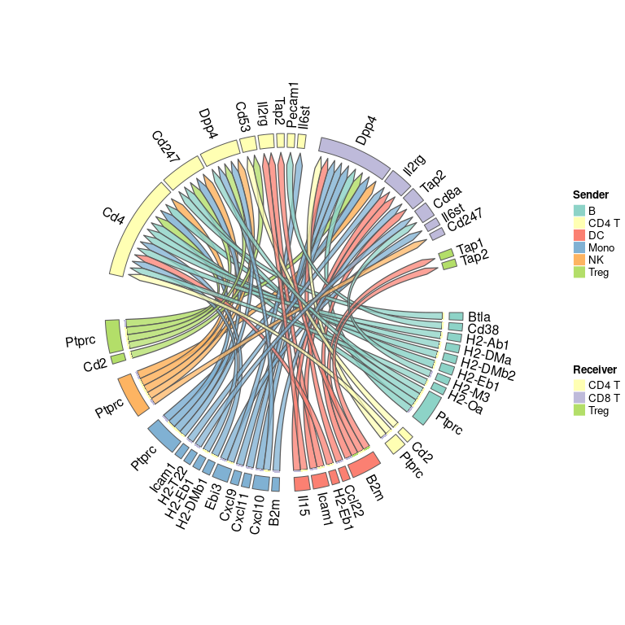

Prioritization of ligands based on expression values
================
Robin Browaeys & Chananchida Sang-aram
2023-10-02

<!-- github markdown built using 
rmarkdown::render("vignettes/seurat_steps_prioritization.Rmd", output_format = "github_document")
-->

In this vignette, we will extend the basic NicheNet analysis analysis
from [Perform NicheNet analysis starting from a Seurat object:
step-by-step analysis](seurat_steps.md) by incorporating gene expression
as part of the prioritization This is a generalization of the
[Differential NicheNet](differential_nichenet.md) and
[MultiNicheNet](https://github.com/saeyslab/multinichenetr) approach.
While the original NicheNet only ranks ligands based on the ligand
activity analysis, it is now also possible to prioritize ligands based
on cell type and condition specificity of the ligand and receptor.

We will again make use of mouse NICHE-seq data to explore intercellular
communication in the T cell area in the inguinal lymph node before and
72 hours after lymphocytic choriomeningitis virus (LCMV) infection
(Medaglia et al. 2017). The used [ligand-target
matrix](https://doi.org/10.5281/zenodo.7074290) and the [Seurat object
of the processed NICHE-seq single-cell
data](https://doi.org/10.5281/zenodo.3531889) can be downloaded from
Zenodo.

Make sure you understand the different steps in a NicheNet analysis that
are described in the basic vignette before proceeding with this
vignette.

# Prepare NicheNet analysis

Load required packages, read in the Seurat object with processed
expression data of interacting cells and NicheNet’s ligand-target prior
model, ligand-receptor network and weighted integrated networks.

``` r
library(nichenetr) # Please update to v2.0.6
library(Seurat)
library(SeuratObject)
library(tidyverse)
```

``` r
# Read Seurat object
seuratObj <- readRDS(url("https://zenodo.org/record/3531889/files/seuratObj.rds"))
seuratObj <- UpdateSeuratObject(seuratObj)
seuratObj <- alias_to_symbol_seurat(seuratObj, "mouse")

# Load in networks
lr_network <- readRDS(url("https://zenodo.org/record/7074291/files/lr_network_mouse_21122021.rds"))
ligand_target_matrix <- readRDS(url("https://zenodo.org/record/7074291/files/ligand_target_matrix_nsga2r_final_mouse.rds"))
weighted_networks <- readRDS(url("https://zenodo.org/record/7074291/files/weighted_networks_nsga2r_final_mouse.rds"))

lr_network <- lr_network %>% distinct(from, to)
```

# Perform the NicheNet analysis

We will use the sender-focused approach here.

``` r
# 1. Define set of potential ligands
receiver <- "CD8 T"
expressed_genes_receiver <- get_expressed_genes(receiver, seuratObj, pct = 0.05)

sender_celltypes <- c("CD4 T", "Treg", "Mono", "NK", "B", "DC")
list_expressed_genes_sender <- sender_celltypes %>% unique() %>% lapply(get_expressed_genes, seuratObj, 0.05)
expressed_genes_sender <- list_expressed_genes_sender %>% unlist() %>% unique()

all_ligands <- unique(lr_network$from)
all_receptors <- unique(lr_network$to)

expressed_ligands <- intersect(all_ligands, expressed_genes_sender)
expressed_receptors <- intersect(all_receptors, expressed_genes_receiver)

potential_ligands <- lr_network %>% filter(from %in% expressed_ligands & to %in% expressed_receptors) %>%
  pull(from) %>% unique()


# 2. Define the gene set of interest
condition_oi <-  "LCMV"
condition_reference <- "SS"

seurat_obj_receiver <- subset(seuratObj, idents = receiver)

DE_table_receiver <-  FindMarkers(object = seurat_obj_receiver,
                                  ident.1 = condition_oi, ident.2 = condition_reference,
                                  group.by = "aggregate", 
                                  min.pct = 0.05) %>% rownames_to_column("gene")

geneset_oi <- DE_table_receiver %>% filter(p_val_adj <= 0.05 & abs(avg_log2FC) >= 0.25) %>% pull(gene)
geneset_oi <- geneset_oi %>% .[. %in% rownames(ligand_target_matrix)]

# 3. Define background genes
background_expressed_genes <- expressed_genes_receiver %>% .[. %in% rownames(ligand_target_matrix)]

# 4. Perform NicheNet ligand activity analysis
ligand_activities <- predict_ligand_activities(geneset = geneset_oi,
                                               background_expressed_genes = background_expressed_genes,
                                               ligand_target_matrix = ligand_target_matrix,
                                               potential_ligands = potential_ligands)

ligand_activities <- ligand_activities %>% arrange(-aupr_corrected) %>%
  mutate(rank = rank(desc(aupr_corrected)))
```

# Perform prioritization of ligand-receptor pairs

We will prioritize ligand-receptor pairs based on the following criteria
(with their corresponding weight names):

- Upregulation of the ligand in a sender cell type compared to other
  cell types: `de_ligand`
- Upregulation of the receptor in a receiver cell type: `de_receptor`
- Average expression of the ligand in the sender cell type:
  `exprs_ligand`
- Average expression of the receptor in the receiver cell type:
  `exprs_receptor`
- Condition-specificity of the ligand across all cell types:
  `ligand_condition_specificity`
- Condition-specificity of the receptor across all cell types:
  `receptor_condition_specificity`

This means that we will have to calculate:

- Differential expression of the ligand/receptor in a sender/receiver
  cell type
- The average expression of each ligand/receptor in each sender/receiver
  cell type
- Differential expression of the ligand/receptor between the two
  conditions

We provide a wrapper function `generate_info_tables` that will calculate
all these values for you. This function returns a list with three
dataframes:

- `sender_receiver_de`: differential expression of the ligand and
  receptor in the sender-receiver cell type pair. These were first
  calculated separately (i.e., DE of ligand in sender cell type, DE of
  receptor in receiver cell type based on FindAllMarkers) and then
  combined based on possible interactions from the lr_network.
- `sender_receiver_info`: the average expression of the ligand and
  receptor in sender-receiver cell type pairs
- `lr_condition_de`: differential expression of the ligand and receptor
  between the two conditions across all cell types.

Note that cell type specificity (i.e., the first four conditions) is
calculated only in the condition of interest.

The “scenario” argument can be either “case_control” or “one_condition”.
In “case_control” scenario, condition specificity is calculated.

``` r
lr_network_filtered <-  lr_network %>% filter(from %in% expressed_ligands & to %in% expressed_receptors)

info_tables <- generate_info_tables(seuratObj,
                                    celltype_colname = "celltype",
                                    senders_oi = sender_celltypes,
                                    receivers_oi = receiver,
                                    lr_network = lr_network_filtered,
                                    condition_colname = "aggregate",
                                    condition_oi = condition_oi,
                                    condition_reference = condition_reference,
                                    scenario = "case_control")

names(info_tables)
## [1] "sender_receiver_de"   "sender_receiver_info" "lr_condition_de"
```

``` r
info_tables$sender_receiver_de %>% head()
##   sender receiver ligand receptor lfc_ligand lfc_receptor ligand_receptor_lfc_avg  p_val_ligand  p_adj_ligand p_val_receptor p_adj_receptor pct_expressed_sender pct_expressed_receiver
## 1     DC    CD8 T  H2-M2     Cd8a  11.002412    2.3838066                6.693109 1.017174e-272 1.377355e-268  5.250531e-206  7.109745e-202                0.429                  0.659
## 2     DC    CD8 T  H2-M2    Klrd1  11.002412    0.9199196                5.961166 1.017174e-272 1.377355e-268   6.104465e-17   8.266056e-13                0.429                  0.185
## 3     DC    CD8 T  Ccl22     Dpp4   9.920608    0.2991720                5.109890 1.590801e-296 2.154103e-292   6.628900e-04   1.000000e+00                0.500                  0.148
## 4     DC    CD8 T Vsig10    Il6st  10.070530    0.1411494                5.105840 2.637179e-194 3.571005e-190   1.470347e-02   1.000000e+00                0.286                  0.090
## 5     DC    CD8 T  Ccl22     Ccr7   9.920608    0.1468652                5.033737 1.590801e-296 2.154103e-292   5.070025e-05   6.865321e-01                0.500                  0.320
## 6     DC    CD8 T Cxcl16    Cxcr6   8.101436    1.8384579                4.969947 1.138617e-243 1.541801e-239   5.987787e-21   8.108063e-17                0.929                  0.089
```

``` r
info_tables$sender_receiver_info %>% head()
## # A tibble: 6 × 7
##   sender receiver ligand receptor avg_ligand avg_receptor ligand_receptor_prod
##   <chr>  <chr>    <chr>  <chr>         <dbl>        <dbl>                <dbl>
## 1 DC     Mono     B2m    Tap1           216.         8.59                1856.
## 2 DC     NK       B2m    Klrd1          216.         7.43                1607.
## 3 DC     B        B2m    Tap1           216.         7.35                1588.
## 4 DC     Treg     B2m    Tap1           216.         7.18                1552.
## 5 Mono   Mono     B2m    Tap1           158.         8.59                1353.
## 6 DC     DC       B2m    Tap1           216.         5.91                1277.
```

``` r
info_tables$lr_condition_de %>% head()
##    ligand receptor lfc_ligand lfc_receptor ligand_receptor_lfc_avg p_val_ligand p_adj_ligand p_val_receptor p_adj_receptor
## 1  Cxcl11     Dpp4   7.197344    0.7345098                3.965927 0.0001621364            1   1.170731e-06   1.585287e-02
## 2 Sirpb1c     Cd47   6.236414    0.7474147                3.491914 0.0006820290            1   8.720485e-23   1.180841e-18
## 3  Cxcl11    Cxcr3   7.197344   -1.1317386                3.032803 0.0001621364            1   1.918372e-06   2.597667e-02
## 4   Ccl22     Dpp4   5.075469    0.7345098                2.904989 0.0863610523            1   1.170731e-06   1.585287e-02
## 5   F13a1    Itga4   5.436884    0.1228459                2.779865 0.0299628836            1   6.837926e-02   1.000000e+00
## 6    Vcan     Sell   5.234169    0.3254999                2.779835 0.0423593686            1   7.148719e-07   9.680080e-03
```

Next, we generate the prioritization table. This table contains the
rankings of ligand-receptor pairs based on the different criteria. We
provide two scenarios: `case_control` and `one_condition`. In the
“case_control” scenario, all weights are set to 1. If “one_condition”,
the weights are set to 0 for condition specificity and 1 for the
remaining criteria. Users can also provide their own weights using the
`prioritizing_weights` argument.

``` r
prior_table <- generate_prioritization_tables(info_tables$sender_receiver_info,
                                              info_tables$sender_receiver_de,
                                              ligand_activities,
                                              info_tables$lr_condition_de,
                                              scenario = "case_control")

prior_table %>% head
## # A tibble: 6 × 52
##   sender receiver ligand receptor lfc_ligand lfc_receptor ligand_receptor_lfc_avg p_val_ligand p_adj_ligand p_val_receptor p_adj_receptor pct_expressed_sender pct_expressed_receiver avg_ligand
##   <chr>  <chr>    <chr>  <chr>         <dbl>        <dbl>                   <dbl>        <dbl>        <dbl>          <dbl>          <dbl>                <dbl>                  <dbl>      <dbl>
## 1 NK     CD8 T    Ptprc  Dpp4          0.642        0.299                   0.471    2.18e-  7    2.96e-  3       0.000663              1                0.894                  0.148      16.6 
## 2 Mono   CD8 T    Ptprc  Dpp4          0.474        0.299                   0.386    3.52e-  5    4.77e-  1       0.000663              1                0.867                  0.148      14.9 
## 3 Mono   CD8 T    Cxcl10 Dpp4          4.86         0.299                   2.58     2.53e- 79    3.43e- 75       0.000663              1                0.867                  0.148      54.8 
## 4 Mono   CD8 T    Cxcl9  Dpp4          6.68         0.299                   3.49     3.83e-124    5.19e-120       0.000663              1                0.547                  0.148      23.8 
## 5 Treg   CD8 T    Ptprc  Dpp4          0.307        0.299                   0.303    1.44e-  2    1   e+  0       0.000663              1                0.685                  0.148      13.2 
## 6 Mono   CD8 T    Cxcl11 Dpp4          6.60         0.299                   3.45     9.28e-121    1.26e-116       0.000663              1                0.307                  0.148       4.37
## # ℹ 38 more variables: avg_receptor <dbl>, ligand_receptor_prod <dbl>, lfc_pval_ligand <dbl>, p_val_adapted_ligand <dbl>, scaled_lfc_ligand <dbl>, scaled_p_val_ligand <dbl>,
## #   scaled_lfc_pval_ligand <dbl>, scaled_p_val_adapted_ligand <dbl>, activity <dbl>, rank <dbl>, activity_zscore <dbl>, scaled_activity <dbl>, lfc_pval_receptor <dbl>,
## #   p_val_adapted_receptor <dbl>, scaled_lfc_receptor <dbl>, scaled_p_val_receptor <dbl>, scaled_lfc_pval_receptor <dbl>, scaled_p_val_adapted_receptor <dbl>, scaled_avg_exprs_ligand <dbl>,
## #   scaled_avg_exprs_receptor <dbl>, lfc_ligand_group <dbl>, p_val_ligand_group <dbl>, lfc_pval_ligand_group <dbl>, p_val_adapted_ligand_group <dbl>, scaled_lfc_ligand_group <dbl>,
## #   scaled_p_val_ligand_group <dbl>, scaled_lfc_pval_ligand_group <dbl>, scaled_p_val_adapted_ligand_group <dbl>, lfc_receptor_group <dbl>, p_val_receptor_group <dbl>,
## #   lfc_pval_receptor_group <dbl>, p_val_adapted_receptor_group <dbl>, scaled_lfc_receptor_group <dbl>, scaled_p_val_receptor_group <dbl>, scaled_lfc_pval_receptor_group <dbl>,
## #   scaled_p_val_adapted_receptor_group <dbl>, prioritization_score <dbl>, prioritization_rank <dbl>
```

As you can see, the resulting table now show the rankings for
*ligand-receptor interactions of a sender-receiver cell type pair*,
instead of just the prioritized ligands. Cxcl10 now went up in the
rankings due to both the high expression of its potential receptor Dpp4
and its high celltype specificity (`scaled_lfc_ligand`). You can also
see this in the visualizations further below.

We included all columns here, but if you just want relevant columns that
were used to calculate the ranking:

``` r
prior_table %>% select(c('sender', 'receiver', 'ligand', 'receptor', 'scaled_p_val_adapted_ligand', 'scaled_p_val_adapted_receptor', 'scaled_avg_exprs_ligand', 'scaled_avg_exprs_receptor', 'scaled_p_val_adapted_ligand_group', 'scaled_p_val_adapted_receptor_group', 'scaled_activity'))
## # A tibble: 1,212 × 11
##    sender receiver ligand receptor scaled_p_val_adapted_ligand scaled_p_val_adapted_re…¹ scaled_avg_exprs_lig…² scaled_avg_exprs_rec…³ scaled_p_val_adapted…⁴ scaled_p_val_adapted…⁵ scaled_activity
##    <chr>  <chr>    <chr>  <chr>                          <dbl>                     <dbl>                  <dbl>                  <dbl>                  <dbl>                  <dbl>           <dbl>
##  1 NK     CD8 T    Ptprc  Dpp4                           0.871                     0.846                  1.00                   1.00                   0.844                  0.833           0.660
##  2 Mono   CD8 T    Ptprc  Dpp4                           0.841                     0.846                  0.867                  1.00                   0.844                  0.833           0.660
##  3 Mono   CD8 T    Cxcl10 Dpp4                           0.958                     0.846                  1.00                   1.00                   0.926                  0.833           0.309
##  4 Mono   CD8 T    Cxcl9  Dpp4                           0.974                     0.846                  1.00                   1.00                   0.779                  0.833           0.263
##  5 Treg   CD8 T    Ptprc  Dpp4                           0.754                     0.846                  0.741                  1.00                   0.844                  0.833           0.660
##  6 Mono   CD8 T    Cxcl11 Dpp4                           0.972                     0.846                  1.00                   1.00                   0.721                  0.833           0.273
##  7 B      CD8 T    Ptprc  Dpp4                           0.747                     0.846                  0.666                  1.00                   0.844                  0.833           0.660
##  8 DC     CD8 T    Ccl22  Dpp4                           0.997                     0.846                  1.00                   1.00                   0.545                  0.833           0.361
##  9 DC     CD8 T    Icam1  Il2rg                          0.878                     0.723                  1.00                   0.995                  0.713                  0.985           0.273
## 10 DC     CD8 T    Il15   Il2rg                          0.964                     0.723                  1.00                   0.995                  0.598                  0.985           0.214
## # ℹ 1,202 more rows
## # ℹ abbreviated names: ¹​scaled_p_val_adapted_receptor, ²​scaled_avg_exprs_ligand, ³​scaled_avg_exprs_receptor, ⁴​scaled_p_val_adapted_ligand_group, ⁵​scaled_p_val_adapted_receptor_group
```

Note that we appended the suffix ’\_group’ to columns that refer to
differential expression between conditions, e.g., `lfc_ligand_group` and
`lfc_receptor_group.`

## Step-by-step prioritization

`generate_info_tables` is a wrapper function that calculates all the
information needed for the prioritization. However, in some cases you
may need more flexibility on how these values are calculated (but note
that you can pass extra arguments to `generate_info_tables` that will
get passed on to `FindMarkers`, `FindAllMarkers`, and
`AverageExpression`). Below, we show how we use helper functions
`calculate_de` and `get_exprs_avg` to calculate the DE and get the
average expression used for cell type specificity. `process_table_to_ic`
transforms these different dataframes so they are compatible with the
`generate_prioritization_tables` function.

``` r
# Only calculate DE for LCMV condition, with genes that are in the ligand-receptor network
DE_table <- FindAllMarkers(subset(seuratObj, subset = aggregate == "LCMV"),
                           min.pct = 0, logfc.threshold = 0, return.thresh = 1,
                           features = unique(unlist(lr_network_filtered))) 

# Average expression information - only for LCMV condition
expression_info <- get_exprs_avg(seuratObj, "celltype", condition_colname = "aggregate", condition_oi = condition_oi,
                                 features = unique(unlist(lr_network_filtered)))

# Calculate condition specificity - only for datasets with two conditions!
condition_markers <- FindMarkers(object = seuratObj, ident.1 = condition_oi, ident.2 = condition_reference,
                                 group.by = "aggregate", min.pct = 0, logfc.threshold = 0,
                                 features = unique(unlist(lr_network_filtered))) %>% rownames_to_column("gene")

# Combine DE of senders and receivers -> used for prioritization
processed_DE_table <- process_table_to_ic(DE_table, table_type = "celltype_DE", lr_network_filtered,
                                         senders_oi = sender_celltypes, receivers_oi = receiver)
  
processed_expr_table <- process_table_to_ic(expression_info, table_type = "expression", lr_network_filtered)

processed_condition_markers <- process_table_to_ic(condition_markers, table_type = "group_DE", lr_network_filtered)
```

And here is how you can define custom weights:

``` r
prioritizing_weights = c("de_ligand" = 1,
                          "de_receptor" = 1,
                          "activity_scaled" = 1,
                          "exprs_ligand" = 1,
                          "exprs_receptor" = 1,
                         "ligand_condition_specificity" = 1,
                         "receptor_condition_specificity" = 1)
```

``` r
prior_table <- generate_prioritization_tables(processed_expr_table,
                                              processed_DE_table,
                                              ligand_activities,
                                              processed_condition_markers,
                                              prioritizing_weights)

prior_table %>% head
## # A tibble: 6 × 52
##   sender receiver ligand receptor lfc_ligand lfc_receptor ligand_receptor_lfc_avg p_val_ligand p_adj_ligand p_val_receptor p_adj_receptor pct_expressed_sender pct_expressed_receiver avg_ligand
##   <chr>  <chr>    <chr>  <chr>         <dbl>        <dbl>                   <dbl>        <dbl>        <dbl>          <dbl>          <dbl>                <dbl>                  <dbl>      <dbl>
## 1 NK     CD8 T    Ptprc  Dpp4          0.642        0.299                   0.471    2.18e-  7    2.96e-  3       0.000663              1                0.894                  0.148      16.6 
## 2 Mono   CD8 T    Ptprc  Dpp4          0.474        0.299                   0.386    3.52e-  5    4.77e-  1       0.000663              1                0.867                  0.148      14.9 
## 3 Mono   CD8 T    Cxcl10 Dpp4          4.86         0.299                   2.58     2.53e- 79    3.43e- 75       0.000663              1                0.867                  0.148      54.8 
## 4 Mono   CD8 T    Cxcl9  Dpp4          6.68         0.299                   3.49     3.83e-124    5.19e-120       0.000663              1                0.547                  0.148      23.8 
## 5 Treg   CD8 T    Ptprc  Dpp4          0.307        0.299                   0.303    1.44e-  2    1   e+  0       0.000663              1                0.685                  0.148      13.2 
## 6 Mono   CD8 T    Cxcl11 Dpp4          6.60         0.299                   3.45     9.28e-121    1.26e-116       0.000663              1                0.307                  0.148       4.37
## # ℹ 38 more variables: avg_receptor <dbl>, ligand_receptor_prod <dbl>, lfc_pval_ligand <dbl>, p_val_adapted_ligand <dbl>, scaled_lfc_ligand <dbl>, scaled_p_val_ligand <dbl>,
## #   scaled_lfc_pval_ligand <dbl>, scaled_p_val_adapted_ligand <dbl>, activity <dbl>, rank <dbl>, activity_zscore <dbl>, scaled_activity <dbl>, lfc_pval_receptor <dbl>,
## #   p_val_adapted_receptor <dbl>, scaled_lfc_receptor <dbl>, scaled_p_val_receptor <dbl>, scaled_lfc_pval_receptor <dbl>, scaled_p_val_adapted_receptor <dbl>, scaled_avg_exprs_ligand <dbl>,
## #   scaled_avg_exprs_receptor <dbl>, lfc_ligand_group <dbl>, p_val_ligand_group <dbl>, lfc_pval_ligand_group <dbl>, p_val_adapted_ligand_group <dbl>, scaled_lfc_ligand_group <dbl>,
## #   scaled_p_val_ligand_group <dbl>, scaled_lfc_pval_ligand_group <dbl>, scaled_p_val_adapted_ligand_group <dbl>, lfc_receptor_group <dbl>, p_val_receptor_group <dbl>,
## #   lfc_pval_receptor_group <dbl>, p_val_adapted_receptor_group <dbl>, scaled_lfc_receptor_group <dbl>, scaled_p_val_receptor_group <dbl>, scaled_lfc_pval_receptor_group <dbl>,
## #   scaled_p_val_adapted_receptor_group <dbl>, prioritization_score <dbl>, prioritization_rank <dbl>
```

# Prioritizing across multiple receivers

As NicheNet is a receiver-based pipeline, to prioritize ligand-receptor
pairs across multiple receivers, we need to perform the NicheNet
analysis for each receiver separately. Let’s suppose we want to
prioritize ligand-receptor pairs across all T cells (CD4, CD8, and
Tregs). The CD8 T analysis has already been performed above. We will use
the wrapper function to perform a basic NicheNet analysis on the other
two:

``` r
nichenet_outputs <- lapply(c("CD8 T", "CD4 T", "Treg"), function(receiver_ct){
  output <- nichenet_seuratobj_aggregate(receiver = receiver_ct,
                             seurat_obj = seuratObj,
                             condition_colname = "aggregate",
                             condition_oi = condition_oi,
                             condition_reference = condition_reference,
                             sender = sender_celltypes,
                             ligand_target_matrix = ligand_target_matrix,
                             lr_network = lr_network,
                             weighted_networks = weighted_networks,
                             expression_pct = 0.05)
  
  # Add receiver cell type in ligand activity table
  output$ligand_activities$receiver <- receiver_ct 
  return(output)
})
## [1] "The RNA assay will be used for the analysis."
## [1] "Read in and process NicheNet's networks"
## [1] "Define expressed ligands and receptors in receiver and sender cells"
## [1] "Perform DE analysis in receiver cell"
## [1] "Perform NicheNet ligand activity analysis"
## [1] "Infer active target genes of the prioritized ligands"
## [1] "Infer receptors of the prioritized ligands"
## [1] "Perform DE analysis in sender cells"
## [1] "The RNA assay will be used for the analysis."
## [1] "Read in and process NicheNet's networks"
## [1] "Define expressed ligands and receptors in receiver and sender cells"
## [1] "Perform DE analysis in receiver cell"
## [1] "Perform NicheNet ligand activity analysis"
## [1] "Infer active target genes of the prioritized ligands"
## [1] "Infer receptors of the prioritized ligands"
## [1] "Perform DE analysis in sender cells"
## [1] "The RNA assay will be used for the analysis."
## [1] "Read in and process NicheNet's networks"
## [1] "Define expressed ligands and receptors in receiver and sender cells"
## [1] "Perform DE analysis in receiver cell"
## [1] "Perform NicheNet ligand activity analysis"
## [1] "Infer active target genes of the prioritized ligands"
## [1] "Infer receptors of the prioritized ligands"
## [1] "Perform DE analysis in sender cells"
```

To generate the dataframes used for prioritization, we will simply
change the `lr_network_filtered` argument to only calculate DE and
expression values for ligand-receptor pairs of interest.

``` r
# Calculate prioritization criteria for each receiver cell type
info_tables <- lapply(nichenet_outputs, function(output) {
  lr_network_filtered <-  lr_network %>% select(from, to) %>% 
                            filter(from %in% output$ligand_activities$test_ligand & 
                                   to %in% output$background_expressed_genes) 
  
  generate_info_tables(seuratObj, 
                       celltype_colname = "celltype", 
                       senders_oi = sender_celltypes, 
                       receivers_oi = unique(output$ligand_activities$receiver), 
                       lr_network_filtered = lr_network_filtered, 
                       condition_colname = "aggregate", 
                       condition_oi = condition_oi, 
                       condition_reference = condition_reference, 
                       scenario = "case_control") 
})
```

We can then combine the results from `generate_info_tables` using
`bind_rows`, which will concatenate the rows together. Note that for the
average expression table (`sender_receiver_info`) and condition
specificity (`lr_condition_de`), we need to remove duplicate rows.

``` r
# bind rows of each element of info_tables using pmap
info_tables_combined <- purrr::pmap(info_tables, bind_rows)
ligand_activities_combined <- purrr::map_dfr(nichenet_outputs, "ligand_activities")

prior_table_combined <- generate_prioritization_tables(
  sender_receiver_info = info_tables_combined$sender_receiver_info %>% distinct,
  sender_receiver_de = info_tables_combined$sender_receiver_de,
  ligand_activities = ligand_activities_combined,
  lr_condition_de = info_tables_combined$lr_condition_de %>% distinct,
  scenario = "case_control")

head(prior_table_combined)
## # A tibble: 6 × 52
##   sender receiver ligand receptor lfc_ligand lfc_receptor ligand_receptor_lfc_avg p_val_ligand p_adj_ligand p_val_receptor p_adj_receptor pct_expressed_sender pct_expressed_receiver avg_ligand
##   <chr>  <chr>    <chr>  <chr>         <dbl>        <dbl>                   <dbl>        <dbl>        <dbl>          <dbl>          <dbl>                <dbl>                  <dbl>      <dbl>
## 1 NK     CD4 T    Ptprc  Cd4           0.642        1.71                    1.18   0.000000218      0.00296       2.63e-34       3.56e-30                0.894                  0.226       16.6
## 2 NK     CD8 T    Ptprc  Dpp4          0.642        0.299                   0.471  0.000000218      0.00296       6.63e- 4       1   e+ 0                0.894                  0.148       16.6
## 3 B      CD4 T    H2-Eb1 Cd4           5.00         1.71                    3.36   0                0             2.63e-34       3.56e-30                0.93                   0.226       31.0
## 4 Mono   CD4 T    Ptprc  Cd4           0.474        1.71                    1.09   0.0000352        0.477         2.63e-34       3.56e-30                0.867                  0.226       14.9
## 5 Mono   CD8 T    Ptprc  Dpp4          0.474        0.299                   0.386  0.0000352        0.477         6.63e- 4       1   e+ 0                0.867                  0.148       14.9
## 6 NK     CD4 T    Ptprc  Cd247         0.642        0.599                   0.620  0.000000218      0.00296       5.61e- 4       1   e+ 0                0.894                  0.309       16.6
## # ℹ 38 more variables: avg_receptor <dbl>, ligand_receptor_prod <dbl>, lfc_pval_ligand <dbl>, p_val_adapted_ligand <dbl>, scaled_lfc_ligand <dbl>, scaled_p_val_ligand <dbl>,
## #   scaled_lfc_pval_ligand <dbl>, scaled_p_val_adapted_ligand <dbl>, activity <dbl>, rank <dbl>, activity_zscore <dbl>, scaled_activity <dbl>, lfc_pval_receptor <dbl>,
## #   p_val_adapted_receptor <dbl>, scaled_lfc_receptor <dbl>, scaled_p_val_receptor <dbl>, scaled_lfc_pval_receptor <dbl>, scaled_p_val_adapted_receptor <dbl>, scaled_avg_exprs_ligand <dbl>,
## #   scaled_avg_exprs_receptor <dbl>, lfc_ligand_group <dbl>, p_val_ligand_group <dbl>, lfc_pval_ligand_group <dbl>, p_val_adapted_ligand_group <dbl>, scaled_lfc_ligand_group <dbl>,
## #   scaled_p_val_ligand_group <dbl>, scaled_lfc_pval_ligand_group <dbl>, scaled_p_val_adapted_ligand_group <dbl>, lfc_receptor_group <dbl>, p_val_receptor_group <dbl>,
## #   lfc_pval_receptor_group <dbl>, p_val_adapted_receptor_group <dbl>, scaled_lfc_receptor_group <dbl>, scaled_p_val_receptor_group <dbl>, scaled_lfc_pval_receptor_group <dbl>,
## #   scaled_p_val_adapted_receptor_group <dbl>, prioritization_score <dbl>, prioritization_rank <dbl>
```

### Extra visualization of ligand-receptor pairs

In addition to the usual heatmap visualizations, we provide a function
`make_circos_lr` to visualize the ligand-receptor pairs in a circos
plot. This was originally written for the (now deprecated) Differential
NicheNet vignettes. The function takes in a prioritization table and a
named vector for the color of senders and receivers. We first specify
the number of top ligand-receptor pairs to show with `n`.

``` r
# Get top n ligand-receptor pairs
prior_table_oi <- prior_table_combined %>% slice_max(prioritization_score, n = 50)

# Define colors for senders and receivers
senders_receivers <- prior_table_oi %>% select(sender, receiver) %>% unlist %>% unique %>% sort
celltype_colors <- RColorBrewer::brewer.pal(length(senders_receivers), name = 'Set3') %>%
  magrittr::set_names(senders_receivers)

circos_plot <- make_circos_lr(prior_table_oi,
               colors_sender = celltype_colors, colors_receiver = celltype_colors)
```

``` r
circos_plot
```

<!-- -->

Furthermore, we provide the function `make_mushroom_plot` which allows
you to display expression of ligand-receptor pairs in a specific
receiver. By default, the fill gradient shows the LFC between cell
types, while the size of the semicircle corresponds to the scaled mean
expression. You can also choose to show the rankings of each
ligand-receptor-sender pair with `show_rankings`, as well as show all
data points for context (`show_all_datapoints`).
`true_color_range = TRUE` will adjust the limits of the color gradient
to the min-max of the values, instead of the limit being from 0 to 1.
Note that the numbers displayed here are the rankings across all
receiver cell types (in case of multiple receivers), and by default the
`top_n` ligand-receptor pairs are shown despite the absolute ranking. To
show only pairs that have an absolute ranking within top_n across all
receivers, set `use_absolute_rank = TRUE`.

``` r
receiver_oi <- "CD8 T"
legend_adjust <- c(0.7, 0.7)
make_mushroom_plot(prior_table_combined %>% filter(receiver == receiver_oi),
                   top_n = 30, 
                   true_color_range = TRUE,
                   show_rankings = TRUE,
                   show_all_datapoints = TRUE) +
  theme(legend.justification = legend_adjust,
        axis.title.x = element_text(hjust = 0.25))
```

<!-- -->

Furthermore, you can change the “size” and “fill” values to certain
columns from the prioritization table (those with the `_ligand` or
`_receptor` suffix).

``` r
print(paste0("Column names that you can use are: ", paste0(prior_table %>% select(ends_with(c("_ligand", "_receptor", "_sender", "_receiver"))) %>% colnames() %>%
  str_remove("_ligand|_receptor|_sender|_receiver") %>% unique, collapse = ", ")))
## [1] "Column names that you can use are: lfc, p_val, p_adj, avg, lfc_pval, p_val_adapted, scaled_lfc, scaled_p_val, scaled_lfc_pval, scaled_p_val_adapted, scaled_avg_exprs, pct_expressed"
```

``` r

# Change size and color columns
make_mushroom_plot(prior_table, top_n = 30, size = "pct_expressed", color = "scaled_avg_exprs") +
  theme(legend.justification = legend_adjust,
        axis.title.x = element_text(hjust = 0.25))
```

<!-- -->

``` r
sessionInfo()
## R version 4.3.3 (2024-02-29)
## Platform: x86_64-pc-linux-gnu (64-bit)
## Running under: CentOS Stream 8
## 
## Matrix products: default
## BLAS/LAPACK: /usr/lib64/libopenblasp-r0.3.15.so;  LAPACK version 3.9.0
## 
## locale:
##  [1] LC_CTYPE=en_US.UTF-8       LC_NUMERIC=C               LC_TIME=en_US.UTF-8        LC_COLLATE=en_US.UTF-8     LC_MONETARY=en_US.UTF-8    LC_MESSAGES=en_US.UTF-8    LC_PAPER=en_US.UTF-8      
##  [8] LC_NAME=C                  LC_ADDRESS=C               LC_TELEPHONE=C             LC_MEASUREMENT=en_US.UTF-8 LC_IDENTIFICATION=C       
## 
## time zone: Europe/Brussels
## tzcode source: system (glibc)
## 
## attached base packages:
## [1] stats     graphics  grDevices utils     datasets  methods   base     
## 
## other attached packages:
##  [1] lubridate_1.9.3    forcats_1.0.0      stringr_1.5.1      dplyr_1.1.4        purrr_1.0.2        readr_2.1.5        tidyr_1.3.1        tibble_3.2.1       ggplot2_3.5.1      tidyverse_2.0.0   
## [11] Seurat_5.1.0       SeuratObject_5.0.2 sp_2.1-4           nichenetr_2.1.7   
## 
## loaded via a namespace (and not attached):
##   [1] RcppAnnoy_0.0.22       splines_4.3.3          later_1.3.2            bitops_1.0-7           polyclip_1.10-6        hardhat_1.3.1          pROC_1.18.5            rpart_4.1.23          
##   [9] fastDummies_1.7.3      lifecycle_1.0.4        rstatix_0.7.2          doParallel_1.0.17      globals_0.16.3         lattice_0.22-5         MASS_7.3-60.0.1        backports_1.4.1       
##  [17] magrittr_2.0.3         limma_3.58.1           rmarkdown_2.27         Hmisc_5.1-2            plotly_4.10.4          yaml_2.3.8             httpuv_1.6.15          sctransform_0.4.1     
##  [25] spam_2.10-0            spatstat.sparse_3.0-3  reticulate_1.37.0      cowplot_1.1.3          pbapply_1.7-2          RColorBrewer_1.1-3     abind_1.4-5            Rtsne_0.17            
##  [33] presto_1.0.0           BiocGenerics_0.48.1    nnet_7.3-19            tweenr_2.0.3           ipred_0.9-14           circlize_0.4.16        lava_1.8.0             IRanges_2.36.0        
##  [41] S4Vectors_0.40.2       ggrepel_0.9.5          irlba_2.3.5.1          listenv_0.9.1          spatstat.utils_3.0-4   goftest_1.2-3          RSpectra_0.16-1        spatstat.random_3.2-3 
##  [49] fitdistrplus_1.1-11    parallelly_1.37.1      leiden_0.4.3.1         codetools_0.2-19       ggforce_0.4.2          tidyselect_1.2.1       shape_1.4.6.1          farver_2.1.2          
##  [57] matrixStats_1.3.0      stats4_4.3.3           base64enc_0.1-3        spatstat.explore_3.2-7 jsonlite_1.8.8         caret_6.0-94           GetoptLong_1.0.5       e1071_1.7-14          
##  [65] progressr_0.14.0       Formula_1.2-5          ggridges_0.5.6         survival_3.5-8         iterators_1.0.14       foreach_1.5.2          tools_4.3.3            ggnewscale_0.4.10     
##  [73] ica_1.0-3              Rcpp_1.0.12            glue_1.7.0             prodlim_2023.08.28     gridExtra_2.3          xfun_0.44              withr_3.0.0            fastmap_1.2.0         
##  [81] fansi_1.0.6            caTools_1.18.2         digest_0.6.35          gridGraphics_0.5-1     timechange_0.3.0       R6_2.5.1               mime_0.12              colorspace_2.1-0      
##  [89] scattermore_1.2        tensor_1.5             spatstat.data_3.0-4    DiagrammeR_1.0.11      utf8_1.2.4             generics_0.1.3         data.table_1.15.4      recipes_1.0.10        
##  [97] class_7.3-22           httr_1.4.7             htmlwidgets_1.6.4      uwot_0.2.2             ModelMetrics_1.2.2.2   pkgconfig_2.0.3        gtable_0.3.5           timeDate_4032.109     
## [105] ComplexHeatmap_2.18.0  lmtest_0.9-40          shadowtext_0.1.3       htmltools_0.5.8.1      carData_3.0-5          dotCall64_1.1-1        clue_0.3-65            scales_1.3.0          
## [113] png_0.1-8              gower_1.0.1            knitr_1.46             rstudioapi_0.16.0      tzdb_0.4.0             reshape2_1.4.4         rjson_0.2.21           checkmate_2.3.1       
## [121] visNetwork_2.1.2       nlme_3.1-164           proxy_0.4-27           zoo_1.8-12             GlobalOptions_0.1.2    KernSmooth_2.23-22     parallel_4.3.3         miniUI_0.1.1.1        
## [129] foreign_0.8-86         pillar_1.9.0           grid_4.3.3             vctrs_0.6.5            RANN_2.6.1             ggpubr_0.6.0           randomForest_4.7-1.1   promises_1.3.0        
## [137] car_3.1-2              xtable_1.8-4           cluster_2.1.6          htmlTable_2.4.2        evaluate_0.23          cli_3.6.2              compiler_4.3.3         rlang_1.1.3           
## [145] crayon_1.5.2           ggsignif_0.6.4         future.apply_1.11.2    labeling_0.4.3         fdrtool_1.2.17         plyr_1.8.9             stringi_1.8.4          viridisLite_0.4.2     
## [153] deldir_2.0-4           munsell_0.5.1          lazyeval_0.2.2         spatstat.geom_3.2-9    Matrix_1.6-5           RcppHNSW_0.6.0         hms_1.1.3              patchwork_1.2.0       
## [161] future_1.33.2          statmod_1.5.0          shiny_1.8.1.1          highr_0.10             ROCR_1.0-11            broom_1.0.5            igraph_2.0.3
```

### References

<div id="refs" class="references csl-bib-body hanging-indent"
entry-spacing="0">

<div id="ref-medaglia_spatial_2017" class="csl-entry">

Medaglia, Chiara, Amir Giladi, Liat Stoler-Barak, Marco De Giovanni,
Tomer Meir Salame, Adi Biram, Eyal David, et al. 2017. “Spatial
Reconstruction of Immune Niches by Combining Photoactivatable Reporters
and <span class="nocase">scRNA</span>-Seq.” *Science*, December,
eaao4277. <https://doi.org/10.1126/science.aao4277>.

</div>

</div>
