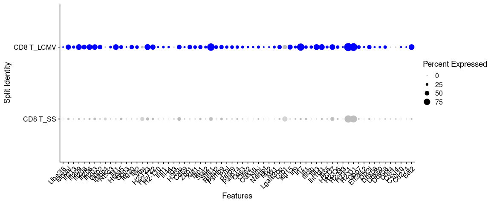
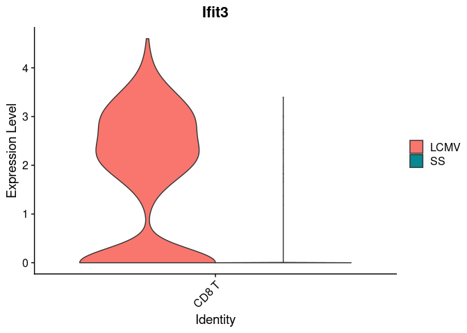
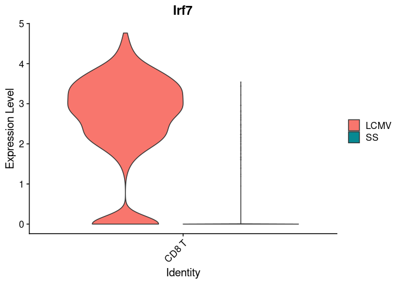
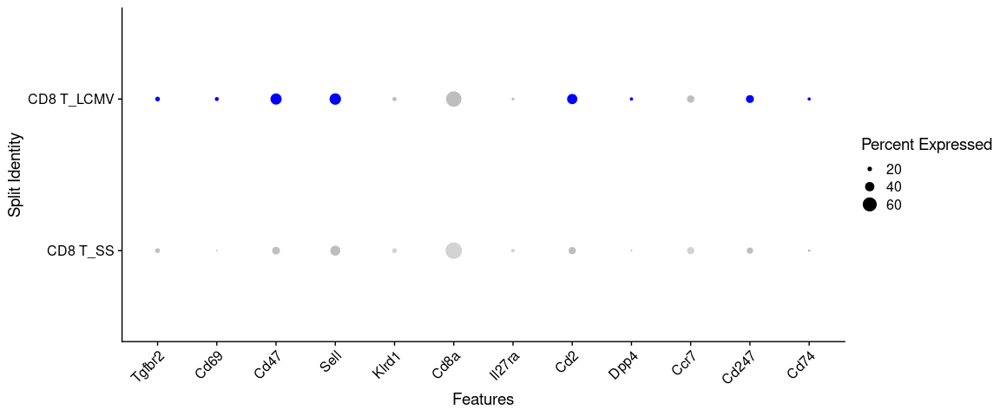
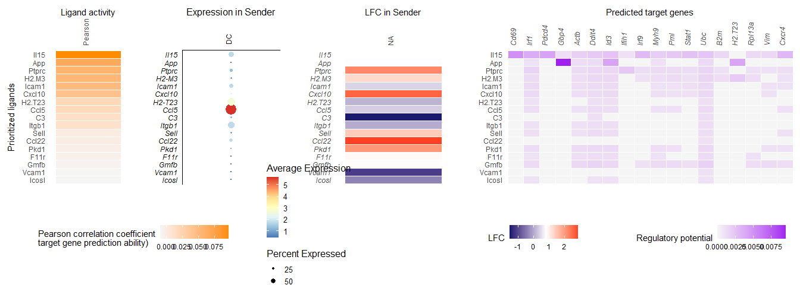
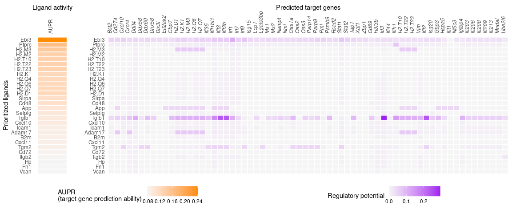
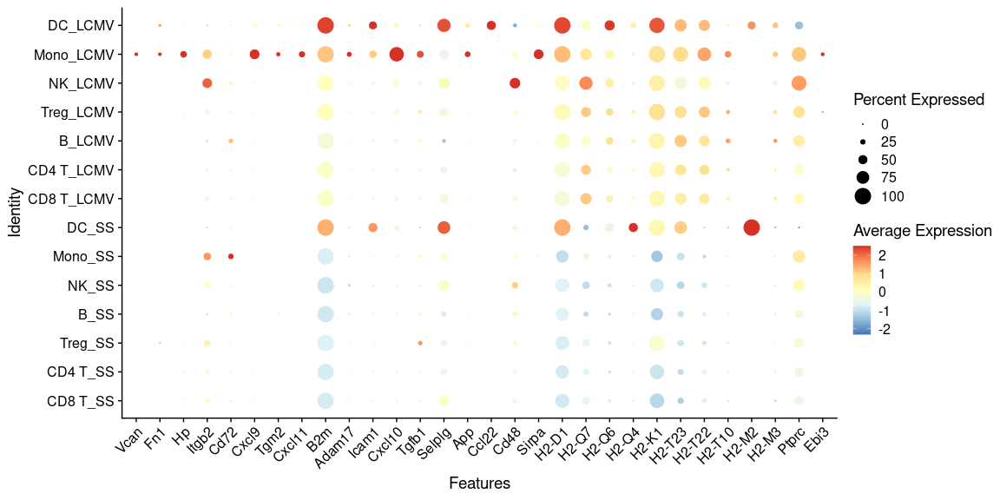

Perform NicheNet analysis starting from a Seurat object
================
Robin Browaeys
2023-10-02

<!-- github markdown built using 
rmarkdown::render("vignettes/seurat_wrapper.Rmd", output_format = "github_document")
-->

In this vignette, you can learn how to perform a basic NicheNet analysis
on a Seurat v3/v4 object. Such a NicheNet analysis can help you to
generate hypotheses about an intercellular communication process of
interest for which you have single-cell gene expression data as a Seurat
object. Specifically, NicheNet can predict 1) which ligands from one or
more cell population(s) (“sender/niche”) are most likely to affect
target gene expression in an interacting cell population
(“receiver/target”) and 2) which specific target genes are affected by
which of these predicted ligands.

Because NicheNet studies how ligands affect gene expression in
putatively neighboring/interacting cells, you need to have data about
this effect in gene expression you want to study. So, there need to be
‘some kind of’ differential expression in a receiver cell population,
caused by ligands from one of more interacting sender cell populations.

In this vignette, we demonstrate the use of NicheNet on a Seurat Object.
The wrapper function we will show consists of the same different steps
that are discussed in detail in the main, basis, NicheNet vignette
[NicheNet’s ligand activity analysis on a gene set of interest: predict
active ligands and their target
genes](ligand_activity_geneset.md):`vignette("ligand_activity_geneset", package="nichenetr")`.
Make sure you understand the different steps in a NicheNet analysis that
are described in that vignette before proceeding with this vignette and
performing a real NicheNet analysis on your data. In another vignette
[Perform NicheNet analysis starting from a Seurat object: step-by-step
analysis](seurat_steps.md):`vignette("seurat_steps", package="nichenetr")`,
we also show the execution of these steps one for one, but in contrast
to the main vignette now specifically for a Seurat Object. This allows
users to adapt specific steps of the pipeline to make them more
appropriate for their data (recommended).

As example expression data of interacting cells, we will use mouse
NICHE-seq data from Medaglia et al. to explore intercellular
communication in the T cell area in the inguinal lymph node before and
72 hours after lymphocytic choriomeningitis virus (LCMV) infection
(Medaglia et al. 2017). We will NicheNet to explore immune cell
crosstalk in response to this LCMV infection.

In this dataset, differential expression is observed between CD8 T cells
in steady-state and CD8 T cells after LCMV infection. NicheNet can be
applied to look at how several immune cell populations in the lymph node
(i.e., monocytes, dendritic cells, NK cells, B cells, CD4 T cells) can
regulate and induce these observed gene expression changes. NicheNet
will specifically prioritize ligands from these immune cells and their
target genes that change in expression upon LCMV infection.

The used [ligand-target matrix](https://doi.org/10.5281/zenodo.7074290)
and the [Seurat object of the processed NICHE-seq single-cell
data](https://doi.org/10.5281/zenodo.3531889) can be downloaded from
Zenodo.

# Prepare NicheNet analysis

## Load required packages, read in the Seurat object with processed expression data of interacting cells and NicheNet’s ligand-target prior model, ligand-receptor network and weighted integrated networks.

The NicheNet ligand-receptor network and weighted networks are necessary
to define and show possible ligand-receptor interactions between two
cell populations. The ligand-target matrix denotes the prior potential
that particular ligands might regulate the expression of particular
target genes. This matrix is necessary to prioritize possible
ligand-receptor interactions based on observed gene expression effects
(i.e. NicheNet’s ligand activity analysis) and infer affected target
genes of these prioritized ligands.

### Load Packages:

``` r
library(nichenetr) # Please update to v2.0.4
library(Seurat)
library(SeuratObject)
library(tidyverse)
```

If you would use and load other packages, we recommend to load these 3
packages after the others.

### Read in NicheNet’s ligand-target prior model, ligand-receptor network and weighted integrated networks:

``` r
organism = "mouse"

if(organism == "human"){
  lr_network = readRDS(url("https://zenodo.org/record/7074291/files/lr_network_human_21122021.rds"))
  ligand_target_matrix = readRDS(url("https://zenodo.org/record/7074291/files/ligand_target_matrix_nsga2r_final.rds"))
  weighted_networks = readRDS(url("https://zenodo.org/record/7074291/files/weighted_networks_nsga2r_final.rds"))
} else if(organism == "mouse"){
  lr_network = readRDS(url("https://zenodo.org/record/7074291/files/lr_network_mouse_21122021.rds"))
  ligand_target_matrix = readRDS(url("https://zenodo.org/record/7074291/files/ligand_target_matrix_nsga2r_final_mouse.rds"))
  weighted_networks = readRDS(url("https://zenodo.org/record/7074291/files/weighted_networks_nsga2r_final_mouse.rds"))

}

lr_network = lr_network %>% distinct(from, to)
head(lr_network)
## # A tibble: 6 × 2
##   from          to   
##   <chr>         <chr>
## 1 2300002M23Rik Ddr1 
## 2 2610528A11Rik Gpr15
## 3 9530003J23Rik Itgal
## 4 a             Atrn 
## 5 a             F11r 
## 6 a             Mc1r
ligand_target_matrix[1:5,1:5] # target genes in rows, ligands in columns
##               2300002M23Rik 2610528A11Rik 9530003J23Rik            a          A2m
## 0610005C13Rik  0.000000e+00  0.000000e+00  1.311297e-05 0.000000e+00 1.390053e-05
## 0610009B22Rik  0.000000e+00  0.000000e+00  1.269301e-05 0.000000e+00 1.345536e-05
## 0610009L18Rik  8.872902e-05  4.977197e-05  2.581909e-04 7.570125e-05 9.802264e-05
## 0610010F05Rik  2.194046e-03  1.111556e-03  3.142374e-03 1.631658e-03 2.585820e-03
## 0610010K14Rik  2.271606e-03  9.360769e-04  3.546140e-03 1.697713e-03 2.632082e-03

weighted_networks_lr = weighted_networks$lr_sig %>% inner_join(lr_network, by = c("from","to"))
head(weighted_networks$lr_sig) # interactions and their weights in the ligand-receptor + signaling network
## # A tibble: 6 × 3
##   from          to     weight
##   <chr>         <chr>   <dbl>
## 1 0610010F05Rik App    0.110 
## 2 0610010F05Rik Cat    0.0673
## 3 0610010F05Rik H1f2   0.0660
## 4 0610010F05Rik Lrrc49 0.0829
## 5 0610010F05Rik Nicn1  0.0864
## 6 0610010F05Rik Srpk1  0.123
head(weighted_networks$gr) # interactions and their weights in the gene regulatory network
## # A tibble: 6 × 3
##   from          to            weight
##   <chr>         <chr>          <dbl>
## 1 0610010K14Rik 0610010K14Rik 0.121 
## 2 0610010K14Rik 2510039O18Rik 0.121 
## 3 0610010K14Rik 2610021A01Rik 0.0256
## 4 0610010K14Rik 9130401M01Rik 0.0263
## 5 0610010K14Rik Alg1          0.127 
## 6 0610010K14Rik Alox12        0.128
```

### Read in the expression data of interacting cells:

The dataset used here is publicly available single-cell data from immune
cells in the T cell area of the inguinal lymph node. The data was
processed and aggregated by applying the Seurat alignment pipeline. The
Seurat object contains this aggregated data. Note that this should be a
Seurat v3/v4 object and that gene should be named by their official
mouse/human gene symbol. If your expression data has the older gene
symbols, you may want to use our alias conversion function to avoid the
loss of gene names.

``` r
seuratObj = readRDS(url("https://zenodo.org/record/3531889/files/seuratObj.rds"))

# For newer Seurat versions, you may need to run the following
seuratObj <- UpdateSeuratObject(seuratObj)

seuratObj = alias_to_symbol_seurat(seuratObj, "mouse") # convert gene names
seuratObj@meta.data %>% head()
##         nGene nUMI orig.ident aggregate res.0.6 celltype nCount_RNA nFeature_RNA
## W380370   880 1611      LN_SS        SS       1    CD8 T       1607          876
## W380372   541  891      LN_SS        SS       0    CD4 T        885          536
## W380374   742 1229      LN_SS        SS       0    CD4 T       1223          737
## W380378   847 1546      LN_SS        SS       1    CD8 T       1537          838
## W380379   839 1606      LN_SS        SS       0    CD4 T       1603          836
## W380381   517  844      LN_SS        SS       0    CD4 T        840          513
```

Visualize which cell populations are present: CD4 T cells (including
regulatory T cells), CD8 T cells, B cells, NK cells, dendritic cells
(DCs) and inflammatory monocytes

``` r
seuratObj@meta.data$celltype %>% table() # note that the number of cells of some cell types is very low and should preferably be higher for a real application
## .
##     B CD4 T CD8 T    DC  Mono    NK  Treg 
##   382  2562  1645    18    90   131   199
DimPlot(seuratObj, reduction = "tsne")
```

<!-- -->

Visualize the data to see to which condition cells belong. The metadata
dataframe column that denotes the condition (steady-state or after LCMV
infection) is here called ‘aggregate’.

``` r
seuratObj@meta.data$aggregate %>% table()
## .
## LCMV   SS 
## 3886 1141
DimPlot(seuratObj, reduction = "tsne", group.by = "aggregate")
```

<!-- -->

# Perform the NicheNet analysis

In this case study, we want to apply NicheNet to predict which ligands
expressed by all immune cells in the T cell area of the lymph node are
most likely to have induced the differential expression in CD8 T cells
after LCMV infection.

As described in the main vignette, the pipeline of a basic NicheNet
analysis consist of the following steps:

- 1.  Define a “sender/niche” cell population and a “receiver/target”
      cell population present in your expression data and determine
      which genes are expressed in both populations

- 2.  Define a gene set of interest: these are the genes in the
      “receiver/target” cell population that are potentially affected by
      ligands expressed by interacting cells (e.g. genes differentially
      expressed upon cell-cell interaction)

- 3.  Define a set of potential ligands: these are ligands that are
      expressed by the “sender/niche” cell population and bind a
      (putative) receptor expressed by the “receiver/target” population

- 4)  Perform NicheNet ligand activity analysis: rank the potential
      ligands based on the presence of their target genes in the gene
      set of interest (compared to the background set of genes)

- 5)  Infer receptors and top-predicted target genes of ligands that are
      top-ranked in the ligand activity analysis

All these steps are contained in one of three following similar single
functions: `nichenet_seuratobj_aggregate`,
`nichenet_seuratobj_cluster_de` and
`nichenet_seuratobj_aggregate_cluster_de`.

In addition to these steps, the function `nichenet_seuratobj_aggregate`
that is used for the analysis when having two conditions will also
calculate differential expression of the ligands in the sender cell
type. Note that this ligand differential expression is not used for
prioritization and ranking of the ligands!

## NicheNet analysis on Seurat object: explain differential expression between two conditions

In this case study, the receiver cell population is the ‘CD8 T’ cell
population, whereas the sender cell populations are ‘CD4 T’, ‘Treg’,
‘Mono’, ‘NK’, ‘B’ and ‘DC’. The above described functions will consider
a gene to be expressed when it is expressed in at least a predefined
fraction of cells in one cluster (default: 10%).

The gene set of interest are the genes differentially expressed in CD8 T
cells after LCMV infection. The condition of interest is thus ‘LCMV’,
whereas the reference/steady-state condition is ‘SS’. The notion of
conditions can be extracted from the metadata column ‘aggregate’, the
method to calculate the differential expression is the standard Seurat
Wilcoxon test.

The number of top-ranked ligands that are further used to predict active
target genes and construct an active ligand-receptor network is 30 by
default.

To perform the NicheNet analysis with these specifications, run the
following:

``` r
# indicated cell types should be cell class identities
# check via: 
# seuratObj %>% Idents() %>% table()
nichenet_output = nichenet_seuratobj_aggregate(
  seurat_obj = seuratObj, 
  receiver = "CD8 T", 
  condition_colname = "aggregate", condition_oi = "LCMV", condition_reference = "SS", 
  sender = c("CD4 T","Treg", "Mono", "NK", "B", "DC"), 
  ligand_target_matrix = ligand_target_matrix,
  lr_network = lr_network,
  weighted_networks = weighted_networks)
## [1] "Read in and process NicheNet's networks"
## [1] "Define expressed ligands and receptors in receiver and sender cells"
## [1] "Perform DE analysis in receiver cell"
## [1] "Perform NicheNet ligand activity analysis"
## [1] "Infer active target genes of the prioritized ligands"
## [1] "Infer receptors of the prioritized ligands"
## [1] "Perform DE analysis in sender cells"
```

### Interpret the NicheNet analysis output

#### Ligand activity analysis results

A first thing NicheNet does, is prioritizing ligands based on predicted
ligand activity. To see the ranking of these ligands, run the following
command:

``` r
nichenet_output$ligand_activities
## # A tibble: 73 × 6
##    test_ligand auroc  aupr aupr_corrected pearson  rank
##    <chr>       <dbl> <dbl>          <dbl>   <dbl> <dbl>
##  1 Ebi3        0.663 0.390          0.244   0.301     1
##  2 Ptprc       0.642 0.310          0.165   0.167     2
##  3 H2-M3       0.608 0.292          0.146   0.179     3
##  4 H2-M2       0.611 0.279          0.133   0.153     5
##  5 H2-T10      0.611 0.279          0.133   0.153     5
##  6 H2-T22      0.611 0.279          0.133   0.153     5
##  7 H2-T23      0.611 0.278          0.132   0.153     7
##  8 H2-K1       0.605 0.268          0.122   0.142     8
##  9 H2-Q4       0.605 0.268          0.122   0.141    10
## 10 H2-Q6       0.605 0.268          0.122   0.141    10
## # ℹ 63 more rows
```

The different ligand activity measures (auroc, aupr, pearson correlation
coefficient) are a measure for how well a ligand can predict the
observed differentially expressed genes compared to the background of
expressed genes. In our validation study, we showed that the area under
the precision-recall curve (AUPR) between a ligand’s target predictions
and the observed transcriptional response was the most informative
measure to define ligand activity (this was the Pearson correlation for
v1). Therefore, NicheNet ranks the ligands based on their AUPR. This
allows us to prioritize ligands inducing the antiviral response in CD8 T
cells.

To get a list of the 30 top-ranked ligands: run the following command

``` r
nichenet_output$top_ligands
##  [1] "Ebi3"   "Ptprc"  "H2-M3"  "H2-M2"  "H2-T10" "H2-T22" "H2-T23" "H2-K1"  "H2-Q4"  "H2-Q6"  "H2-Q7"  "H2-D1"  "Sirpa"  "Cd48"   "Tgfb1"  "Ccl22"  "App"    "Selplg" "Cxcl10" "Btla"   "Adam17" "Icam1"  "Cxcl11" "Tgm2"   "B2m"   
## [26] "Cxcl9"  "Cd72"   "Hp"     "Itgb2"  "Vcan"
```

These ligands are expressed by one or more of the input sender cells. To
see which cell population expresses which of these top-ranked ligands,
you can run the following:

``` r
nichenet_output$ligand_expression_dotplot
```

<!-- -->

As you can see, most op the top-ranked ligands seem to be mainly
expressed by dendritic cells and monocytes.

It could also be interesting to see whether some of these ligands are
differentially expressed after LCMV infection.

``` r
nichenet_output$ligand_differential_expression_heatmap
```

<!-- -->

As you can see, most op the top-ranked ligands seem also to be
upregulated themselves in monocytes after viral infection. This is not a
prerequisite to be top-ranked (cf: ranking only determined based on
enrichment of target genes among DE genes in the receiver, CD8T cells),
but is nice additional “evidence” that these ligands might indeed be
important.

#### Inferred active ligand-target links

NicheNet also infers active target genes of these top-ranked ligands. To
see which top-ranked ligands are predicted to have regulated the
expression of which differentially expressed genes, you can run
following command for a heatmap visualization:

``` r
nichenet_output$ligand_target_heatmap
```

<!-- -->

This is a normal ggplot object that can be adapted likewise. For example
if you want to change the color code to blue instead of purple, change
the axis ticks of the legend, and change the axis labels of the heatmap,
you can do the following:

``` r
nichenet_output$ligand_target_heatmap + scale_fill_gradient2(low = "whitesmoke",  high = "royalblue", breaks = c(0,0.0045,0.009)) + xlab("anti-LCMV response genes in CD8 T cells") + ylab("Prioritized immmune cell ligands")
```

<!-- -->

If you want, you can also extract the ligand-target links and their
regulatory potential scores in matrix or data frame format (e.g. for
visualization in other ways or output to a csv file).

``` r
nichenet_output$ligand_target_matrix %>% .[1:10,1:6]
##               Bst2      Cd274     Cxcl10       Cxcr4       Ddit4      Ddx58
## Vcan   0.000000000 0.00000000 0.00000000 0.007730215 0.008496498 0.00000000
## Itgb2  0.000000000 0.00000000 0.00000000 0.009843522 0.009705963 0.00000000
## Hp     0.000000000 0.00000000 0.00000000 0.008886796 0.010263817 0.00000000
## Cd72   0.000000000 0.00000000 0.00000000 0.008311072 0.009318998 0.00000000
## B2m    0.000000000 0.00000000 0.00000000 0.009044523 0.010623390 0.00000000
## Tgm2   0.010030030 0.00000000 0.04939643 0.014778849 0.015946489 0.04583594
## Cxcl11 0.000000000 0.00000000 0.00000000 0.007855882 0.000000000 0.00000000
## Icam1  0.008581207 0.00000000 0.01196470 0.012707198 0.014780600 0.00000000
## Adam17 0.008167279 0.06549177 0.01109420 0.071842451 0.014236968 0.00000000
## Btla   0.000000000 0.00000000 0.00000000 0.000000000 0.008851392 0.00000000
```

``` r
nichenet_output$ligand_target_df # weight column = regulatory potential
## # A tibble: 510 × 3
##    ligand target  weight
##    <chr>  <chr>    <dbl>
##  1 Ebi3   Bst2    0.0500
##  2 Ebi3   Cd274   0.0504
##  3 Ebi3   Cxcl10  0.0570
##  4 Ebi3   Cxcr4   0.0430
##  5 Ebi3   Ddit4   0.0485
##  6 Ebi3   Ddx58   0.0402
##  7 Ebi3   Ddx60   0.0488
##  8 Ebi3   Dhx58   0.0406
##  9 Ebi3   Dtx3l   0.0405
## 10 Ebi3   Eif2ak2 0.0400
## # ℹ 500 more rows
```

To get a list of the top-predicted target genes of the 30 top-ranked
ligands: run the following command

``` r
nichenet_output$top_targets
##  [1] "Bst2"     "Cd274"    "Cxcl10"   "Cxcr4"    "Ddit4"    "Ddx58"    "Ddx60"    "Dhx58"    "Dtx3l"    "Eif2ak2"  "Gbp7"     "H2-D1"    "H2-K1"    "H2-M3"    "H2-Q6"    "H2-Q7"    "Ifi35"    "Ifit1bl1" "Ifit3"    "Ifit3b"  
## [21] "Irf1"     "Irf7"     "Irf9"     "Isg15"    "Lcp1"     "Lgals3bp" "Mx1"      "Mx2"      "Nampt"    "Nmi"      "Oas1a"    "Oas2"     "Oas3"     "Parp14"   "Parp9"    "Pml"      "Psmb9"    "Rsad2"    "Stat1"    "Stat2"   
## [41] "Tap1"     "Xaf1"     "Zbp1"     "Cd69"     "H3f3b"    "Id3"      "Ifi44"    "Ifih1"    "H2-T10"   "H2-T22"   "H2-T23"   "Vim"      "Ifit2"    "Isg20"    "Gbp3"     "Hspa5"    "Ifit1"    "Nt5c3"    "Igfbp4"   "Gbp2"    
## [61] "Ifi203"   "Ifi206"   "Ifi208"   "Ifi209"   "Ifi213"   "Mndal"    "Ube2l6"
```

You can visualize the expression of these as well. Because we only focus
on CD8 T cells as receiver cells, we will only show expression in these
cells. To emphasize that these target genes are differentially
expressed, we split cells up in steadys-state cells and cells after
response to LCMV infection.

``` r
DotPlot(seuratObj %>% subset(idents = "CD8 T"), features = nichenet_output$top_targets %>% rev(), split.by = "aggregate") + RotatedAxis()
```

<!-- -->

``` r
VlnPlot(seuratObj %>% subset(idents = "CD8 T"), features = c("Zbp1","Ifit3","Irf7"), split.by = "aggregate",    pt.size = 0, combine = FALSE)
## [[1]]
```

<!-- -->

    ## 
    ## [[2]]

<!-- -->

    ## 
    ## [[3]]

<!-- -->

To visualize ligand activities, expression, differential expression and
target genes of ligands, run the following command

``` r
nichenet_output$ligand_activity_target_heatmap
```

<!-- -->

**important: above figure can be considered as one of the most important
summary figures of the NicheNet analysis. Here you can see which
ligand-receptor pairs have both high differential expression and ligand
activity (=target gene enrichment). These are very interesting
predictions as key regulators of your intercellular communication
process of interest ! **

#### Inferred ligand-receptor interactions for top-ranked ligands

NicheNet also infers the receiver cell receptors of these top-ranked
ligands. You can run following command for a heatmap visualization of
the ligand-receptor links:

``` r
nichenet_output$ligand_receptor_heatmap
```

<!-- -->

If you want, you can also extract the ligand-receptor links and their
interaction confidence scores in matrix or data frame format (e.g. for
visualization in other ways or output to a csv file).

``` r
nichenet_output$ligand_receptor_matrix %>% .[1:10,1:6]
##        H2.T23 H2.T22 H2.T10 H2.Q7 H2.Q6 H2.Q4
## Itgb2       0      0      0     0     0     0
## Spn         0      0      0     0     0     0
## Msn         0      0      0     0     0     0
## Itgal       0      0      0     0     0     0
## Ezr         0      0      0     0     0     0
## Il2rg       0      0      0     0     0     0
## Sell        0      0      0     0     0     0
## Itga4       0      0      0     0     0     0
## Selplg      0      0      0     0     0     0
## Tap1        0      0      0     0     0     0
```

``` r
nichenet_output$ligand_receptor_df # weight column accords to number of data sources that document this interaction
## # A tibble: 53 × 3
##    ligand receptor weight
##    <chr>  <chr>     <dbl>
##  1 Adam17 Notch1    1.05 
##  2 App    Cd74      0.670
##  3 B2m    Klrd1     0.733
##  4 B2m    Tap1      0.782
##  5 B2m    Tap2      0.834
##  6 Btla   Cd247     0.333
##  7 Ccl22  Ccr7      0.679
##  8 Ccl22  Dpp4      0.717
##  9 Cd48   Cd2       0.964
## 10 Cd72   Cd5       0.786
## # ℹ 43 more rows
```

To get a list of the receptors of the 20 top-ranked ligands: run the
following command

``` r
nichenet_output$top_receptors
##  [1] "Notch1" "Cd74"   "Klrd1"  "Tap1"   "Tap2"   "Cd247"  "Ccr7"   "Dpp4"   "Cd2"    "Cd5"    "Il27ra" "Cd8a"   "Itgb2"  "Ezr"    "Il2rg"  "Itgal"  "Msn"    "Spn"    "Cd82"   "Thy1"   "Sell"   "Cd47"   "Cd69"   "Tgfbr2" "Itga4" 
## [26] "Selplg"
```

You can visualize the expression of these as well. Because we only focus
on CD8 T cells as receiver cells, we will only show expression in these
cells.

``` r
DotPlot(seuratObj %>% subset(idents = "CD8 T"), features = nichenet_output$top_receptors %>% rev(), split.by = "aggregate") + RotatedAxis()
```

<!-- -->

If you are interested in checking which geneset (and background set of
genes) was used during the ligand activity analysis:

``` r
nichenet_output$geneset_oi
##   [1] "Ifi27l2b"      "Irf7"          "Ly6a"          "Stat1"         "Ly6c2"         "Ifit3"         "Ifit1"         "Ly6c1"         "Bst2"          "B2m"           "Rnf213"        "Ifit1bl1"      "Plac8"         "Slfn1"        
##  [15] "Ifi209"        "Isg15"         "Igtp"          "Ifi206"        "Shisa5"        "Ms4a4c"        "H2-K1"         "Zbp1"          "Oasl2"         "Isg20"         "Samhd1"        "Ifi208"        "Ms4a6b"        "Trim30a"      
##  [29] "Usp18"         "Mndal"         "H2-T23"        "Slfn8"         "Gbp2"          "Ifi203"        "Iigp1"         "Tmsb4x"        "H2-T22"        "Rsad2"         "Ly6e"          "Rtp4"          "Ifit3b"        "Zfas1"        
##  [43] "Ifit2"         "Phf11b"        "Xaf1"          "Smchd1"        "Daxx"          "Alb"           "Samd9l"        "Actb"          "Parp9"         "Gbp4"          "Lgals3bp"      "Mx1"           "Ifi213"        "Irgm1"        
##  [57] "2410006H16Rik" "Gbp7"          "Cmpk2"         "Dtx3l"         "Slfn5"         "H2-D1"         "Oasl1"         "Herc6"         "Ifih1"         "Rpsa"          "P2ry13"        "Irgm2"         "Tapbp"         "Rps8"         
##  [71] "Stat2"         "Ifi44"         "Phf11c"        "Rpl8"          "Psmb8"         "Gm12250"       "Igfbp4"        "Rplp2-ps1"     "Ddx58"         "Rac2"          "Trafd1"        "Sp100"         "Gbp9"          "Pml"          
##  [85] "Oas2"          "Slfn2"         "Psme1"         "Apoe"          "Gas5"          "H2-Q7"         "Basp1"         "Ms4a4b"        "Rps27a"        "Cd52"          "Znfx1"         "Rpl13"         "Oas3"          "Nt5c3"        
##  [99] "Rnf114"        "Tap1"          "Rps28"         "Oas1a"         "Rplp0"         "Ddx60"         "Vim"           "Gbp6"          "Ifi35"         "Itm2b"         "Ctss"          "Tgtp1"         "Pabpc1"        "H2-Q6"        
## [113] "Parp14"        "Hspa8"         "Tor3a"         "Rpl23"         "Mx2"           "Tmbim6"        "Thy1"          "Ncoa7"         "Dhx58"         "Rps10"         "Rps19"         "Psmb9"         "Il2rg"         "Etnk1"        
## [127] "Irf9"          "Rps3a1"        "Gbp10"         "1600014C10Rik" "Parp12"        "Trim30d"       "Eif2ak2"       "Eef1b2"        "Eef2"          "Npc2"          "Rps2"          "Rps3"          "Sp110"         "Ube2l6"       
## [141] "Nmi"           "Uba7"          "Psmb10"        "Cxcl10"        "Rpl13a"        "Trim30c"       "Nhp2"          "Tbrg1"         "Jaml"          "Usp25"         "Tor1aip2"      "Adar"          "Gzma"          "Gm2000"       
## [155] "Rps18-ps5"     "Cd53"          "Phf11"         "Hspa5"         "Cfl1"          "Crip1"         "Slco3a1"       "Tlr7"          "Trim21"        "Gbp8"          "Rpl10"         "Mycbp2"        "Rps16"         "Nlrc5"        
## [169] "Rplp2"         "Acadl"         "Trim12c"       "Rps4x"         "Irf1"          "Psma2"         "Nme2"          "Tut4"          "Apobec3"       "Snord12"       "Phip"          "Ifitm3"        "Sp140"         "Dusp2"        
## [183] "Mrpl30"        "Malat1"        "H2-M3"         "Gbp3"          "Tmsb10"        "Dtx1"          "Eef1g"         "Rbl1"          "Epb41l4aos"    "Xpo1"          "Rgcc"          "Gm9844"        "Rpl35"         "Rps26"        
## [197] "Cxcr4"         "Eif3m"         "Treml2"        "Rpl35a"        "Pdcd4"         "Arrb2"         "Ubc"           "Clic4"         "H2-T10"        "Rpl10a"        "Lcp1"          "Cd274"         "Ddit4"         "Cnn2"         
## [211] "Nampt"         "Ascc3"         "Cd47"          "Snord49b"      "Ilrun"         "Calhm6"        "Psme2b"        "Hcst"          "Myh9"          "Rps27"         "Mov10"         "Gm15772"       "Arf4"          "Arhgdib"      
## [225] "Ppib"          "Ubb"           "Trim25"        "Tspo"          "Id3"           "Snord35a"      "Rnf8"          "Casp8"         "Ptpn7"         "Itk"           "Rps27rt"       "Cd69"          "H3f3b"         "Nop10"        
## [239] "Anxa6"         "Hk1"           "Prkcb"         "Iqgap1"        "Keap1"         "Rpl7"          "Parp10"
nichenet_output$background_expressed_genes %>% length()
## [1] 1662
```

### Rerun the NicheNet analysis with different sender cell definition

Instead of focusing on multiple sender cell types, it is possible that
you are only interested in doing the analyis for one sender cell type,
such as dendritic cells in this case.

``` r
nichenet_output = nichenet_seuratobj_aggregate(seurat_obj = seuratObj, receiver = "CD8 T", condition_colname = "aggregate", condition_oi = "LCMV", condition_reference = "SS", sender = "DC", ligand_target_matrix = ligand_target_matrix, lr_network = lr_network, weighted_networks = weighted_networks)
## [1] "Read in and process NicheNet's networks"
## [1] "Define expressed ligands and receptors in receiver and sender cells"
## [1] "Perform DE analysis in receiver cell"
## [1] "Perform NicheNet ligand activity analysis"
## [1] "Infer active target genes of the prioritized ligands"
## [1] "Infer receptors of the prioritized ligands"
## [1] "Perform DE analysis in sender cells"

nichenet_output$ligand_activity_target_heatmap
```

<!-- -->

Instead of focusing on one or multiple predefined sender cell types, it
is also possible that you want to consider all cell types present as
possible sender cell. This also includes the receiver cell type, making
that you can look at autocrine signaling as well.

``` r
nichenet_output = nichenet_seuratobj_aggregate(seurat_obj = seuratObj, receiver = "CD8 T", condition_colname = "aggregate", condition_oi = "LCMV", condition_reference = "SS", sender = "all", ligand_target_matrix = ligand_target_matrix, lr_network = lr_network, weighted_networks = weighted_networks)
## [1] "Read in and process NicheNet's networks"
## [1] "Define expressed ligands and receptors in receiver and sender cells"
## [1] "Perform DE analysis in receiver cell"
## [1] "Perform NicheNet ligand activity analysis"
## [1] "Infer active target genes of the prioritized ligands"
## [1] "Infer receptors of the prioritized ligands"
## [1] "Perform DE analysis in sender cells"

nichenet_output$ligand_activity_target_heatmap
```

<!-- -->

In some cases, it could be possible that you don’t have data of
potential sender cells. If you still want to predict possible upstream
ligands that could have been responsible for the observed differential
expression in your cell type, you can do this by following command. This
will consider all possible ligands in the NicheNet databases for which a
receptor is expressed by the receiver cell of interest.

``` r
nichenet_output = nichenet_seuratobj_aggregate(seurat_obj = seuratObj, receiver = "CD8 T", condition_colname = "aggregate", condition_oi = "LCMV", condition_reference = "SS", sender = "undefined", ligand_target_matrix = ligand_target_matrix, lr_network = lr_network, weighted_networks = weighted_networks)
## [1] "Read in and process NicheNet's networks"
## [1] "Define expressed ligands and receptors in receiver and sender cells"
## [1] "Perform DE analysis in receiver cell"
## [1] "Perform NicheNet ligand activity analysis"
## [1] "Infer active target genes of the prioritized ligands"
## [1] "Infer receptors of the prioritized ligands"

nichenet_output$ligand_activity_target_heatmap
```

<!-- -->

As you can see in this analysis result, many genes DE in CD8 T cells
after LCMV infection are strongly predicted type I interferon targets.
The presence of a type I interferon signature in the receiver cell type,
but the absence of expression of type I interferons in sender cell
types, might indicate that type I interferons are expressed by a
different, non-profiled cell type, or at a time point before sampling.
The latter could make sense, because there always is a time delay
between expression of a ligand-encoding gene and the effect of the
ligand on a target/receiver cell (i.e. expression of target genes).

### Run multiple NicheNet analyses on different receiver cell populations

In some cases, you might be interested in multiple target/receiver cell
populations. You can decide to run this for every cell type separately,
or in one line of code as demonstrated here (results are the same). As
example, we could have been interested in explaining DE between
steady-state and LCMV infection in both CD8 and CD4 T cells.

``` r
receiver_celltypes_oi = c("CD4 T", "CD8 T")
# receiver_celltypes_oi = seuratObj %>% Idents() %>% unique() # for all celltypes in the dataset: use only when this would make sense biologically

nichenet_output = receiver_celltypes_oi %>% lapply(nichenet_seuratobj_aggregate, seurat_obj = seuratObj, condition_colname = "aggregate", condition_oi = "LCMV", condition_reference = "SS", sender = c("CD4 T","Treg", "Mono", "NK", "B", "DC"), ligand_target_matrix = ligand_target_matrix, lr_network = lr_network, weighted_networks = weighted_networks)
## [1] "Read in and process NicheNet's networks"
## [1] "Define expressed ligands and receptors in receiver and sender cells"
## [1] "Perform DE analysis in receiver cell"
## [1] "Perform NicheNet ligand activity analysis"
## [1] "Infer active target genes of the prioritized ligands"
## [1] "Infer receptors of the prioritized ligands"
## [1] "Perform DE analysis in sender cells"
## [1] "Read in and process NicheNet's networks"
## [1] "Define expressed ligands and receptors in receiver and sender cells"
## [1] "Perform DE analysis in receiver cell"
## [1] "Perform NicheNet ligand activity analysis"
## [1] "Infer active target genes of the prioritized ligands"
## [1] "Infer receptors of the prioritized ligands"
## [1] "Perform DE analysis in sender cells"

names(nichenet_output) = receiver_celltypes_oi
```

Check which ligands were top-ranked for both CD8T and CD4T and which
ligands were more cell-type specific

``` r
common_ligands = intersect(nichenet_output$`CD4 T`$top_ligands, nichenet_output$`CD8 T`$top_ligands)
print("common ligands are: ")
## [1] "common ligands are: "
print(common_ligands)
##  [1] "Ebi3"   "Ptprc"  "H2-M3"  "H2-M2"  "H2-T10" "H2-T22" "H2-T23" "Sirpa"  "H2-K1"  "H2-Q4"  "H2-Q6"  "H2-Q7"  "H2-D1"  "Ccl22"  "Cd48"   "App"    "Tgfb1"  "Selplg" "Icam1"  "Btla"   "Cd72"   "B2m"    "Hp"     "Itgb2"

cd4_ligands = nichenet_output$`CD4 T`$top_ligands %>% setdiff(nichenet_output$`CD8 T`$top_ligands)
cd8_ligands = nichenet_output$`CD8 T`$top_ligands %>% setdiff(nichenet_output$`CD4 T`$top_ligands)

print("Ligands specifically regulating DE in CD4T: ")
## [1] "Ligands specifically regulating DE in CD4T: "
print(cd4_ligands)
## [1] "H2-Eb1"  "H2-Oa"   "Il16"    "Fn1"     "H2-DMb1" "H2-DMb2"

print("Ligands specifically regulating DE in CD8T: ")
## [1] "Ligands specifically regulating DE in CD8T: "
print(cd8_ligands)
## [1] "Cxcl10" "Adam17" "Cxcl11" "Tgm2"   "Cxcl9"  "Vcan"
```

## NicheNet analysis on Seurat object: explain differential expression between two cell populations

Previously, we demonstrated the use of a wrapper function for applying
NicheNet to explain differential expression between two conditions in
one cell type. However, also differential expression between two cell
populations might sometimes be (partially) caused by communication with
cells in the neighborhood. For example, differentiation from a
progenitor cell to the differentiated cell might be induced by niche
cells. A concrete example is discussed in this paper: [Stellate Cells,
Hepatocytes, and Endothelial Cells Imprint the Kupffer Cell Identity on
Monocytes Colonizing the Liver Macrophage
Niche](https://www.cell.com/immunity/fulltext/S1074-7613(19)30368-1).

Therefore, we will now also demonstrate the use of another Seurat
wrapper function that can be used in the case of explaining differential
expression between cell populations. But keep in mind that the
comparison that you make should be biologically relevant. It is possible
to use NicheNet to explain differential expression between any two cell
populations in your dataset, but in most cases, differential expression
between cell populations will be a result of cell-intrinsic properties
(i.e. different cell types have a different gene expression profile) and
not of intercellular communication processes. In such a case, it does
not make any sense to use NicheNet.

For demonstration purposes, we will here first change the seuratObject
of the data described above, such that it can be used in this setting.

``` r
seuratObj@meta.data$celltype = paste(seuratObj@meta.data$celltype,seuratObj@meta.data$aggregate, sep = "_")

seuratObj@meta.data$celltype %>% table()
## .
##     B_LCMV       B_SS CD4 T_LCMV   CD4 T_SS CD8 T_LCMV   CD8 T_SS    DC_LCMV      DC_SS  Mono_LCMV    Mono_SS    NK_LCMV      NK_SS  Treg_LCMV    Treg_SS 
##        344         38       1961        601       1252        393         14          4         75         15         94         37        146         53

seuratObj = SetIdent(seuratObj,value = "celltype")
```

Now perform the NicheNet analysis to explain differential expression
between the ‘affected’ cell population ‘CD8 T cells after LCMV
infection’ and the reference cell population ‘CD8 T cells in
steady-state’ by ligands expressed by monocytes and DCs after LCMV
infection.

``` r
nichenet_output = nichenet_seuratobj_cluster_de(
  seurat_obj = seuratObj, 
  receiver_reference = "CD8 T_SS", receiver_affected = "CD8 T_LCMV", 
  sender = c("DC_LCMV","Mono_LCMV"), 
  ligand_target_matrix = ligand_target_matrix, lr_network = lr_network, weighted_networks = weighted_networks)
## [1] "Read in and process NicheNet's networks"
## [1] "Define expressed ligands and receptors in receiver and sender cells"
## [1] "Perform DE analysis between two receiver cell clusters"
## [1] "Perform NicheNet ligand activity analysis"
## [1] "Infer active target genes of the prioritized ligands"
## [1] "Infer receptors of the prioritized ligands"
```

Check the top-ranked ligands and their target genes

``` r
nichenet_output$ligand_activity_target_heatmap
```

<!-- -->

Check the expression of the top-ranked ligands

``` r
DotPlot(seuratObj, features = nichenet_output$top_ligands %>% rev(), cols = "RdYlBu") + RotatedAxis()
```

<!-- -->

It could be interested to check which top-ranked ligands are
differentially expressed in monocytes after LCMV infection

``` r
Mono_upregulated_ligands = FindMarkers(seuratObj, ident.1 = "Mono_LCMV", ident.2 = "Mono_SS") %>% rownames_to_column("gene") %>% filter(avg_log2FC > 0.25 & p_val_adj <= 0.05) %>% pull(gene) %>% intersect(nichenet_output$top_ligands)

print("Monocyte ligands upregulated after LCMV infection and explaining DE between CD8T-StSt and CD8T-LCMV are: ")
## [1] "Monocyte ligands upregulated after LCMV infection and explaining DE between CD8T-StSt and CD8T-LCMV are: "
print(Mono_upregulated_ligands)
## [1] "B2m"    "H2-D1"  "Cxcl10"
```

# Remarks

1.  Top-ranked ligands and target genes shown here differ from the
    predictions shown in the respective case study in the NicheNet paper
    because a different definition of expressed genes was used.
2.  Differential expression is here done via the classical Wilcoxon test
    used in Seurat to define marker genes of a cell cluster by comparing
    it to other clusters. This is not optimal if you would have repeated
    samples for your conditions. In such a case, we recommend to follow
    the vignette [Perform NicheNet analysis starting from a Seurat
    object: step-by-step
    analysis](seurat_steps.md):`vignette("seurat_steps", package="nichenetr")`
    and tweak the differential expression step there (and perform the
    analysis e.g. as discussed in <https://github.com/HelenaLC/muscat>).

# References

Bonnardel et al., 2019, Immunity 51, 1–17, [Stellate Cells, Hepatocytes,
and Endothelial Cells Imprint the Kupffer Cell Identity on Monocytes
Colonizing the Liver Macrophage
Niche](https://doi.org/10.1016/j.immuni.2019.08.017)

<div id="refs" class="references csl-bib-body hanging-indent">

<div id="ref-medaglia_spatial_2017" class="csl-entry">

Medaglia, Chiara, Amir Giladi, Liat Stoler-Barak, Marco De Giovanni,
Tomer Meir Salame, Adi Biram, Eyal David, et al. 2017. “Spatial
Reconstruction of Immune Niches by Combining Photoactivatable Reporters
and <span class="nocase">scRNA</span>-Seq.” *Science*, December,
eaao4277. <https://doi.org/10.1126/science.aao4277>.

</div>

</div>
