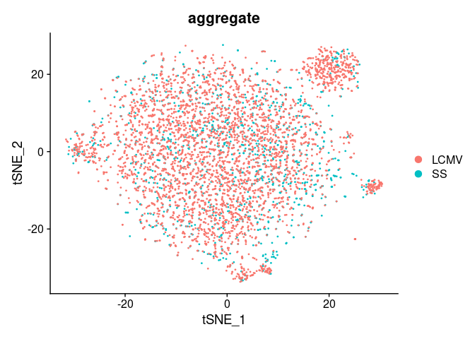
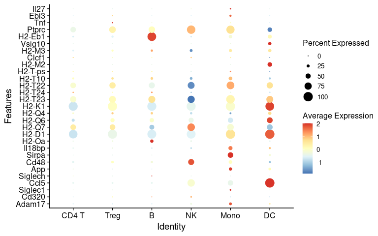
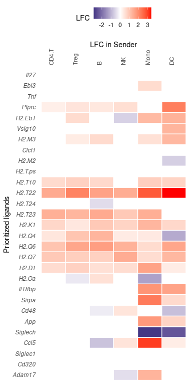
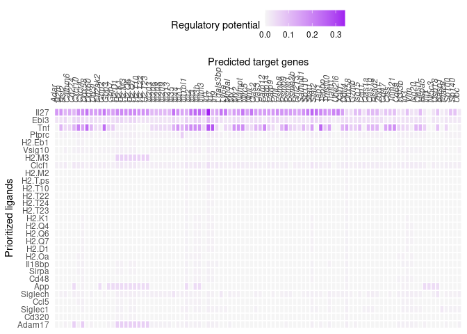
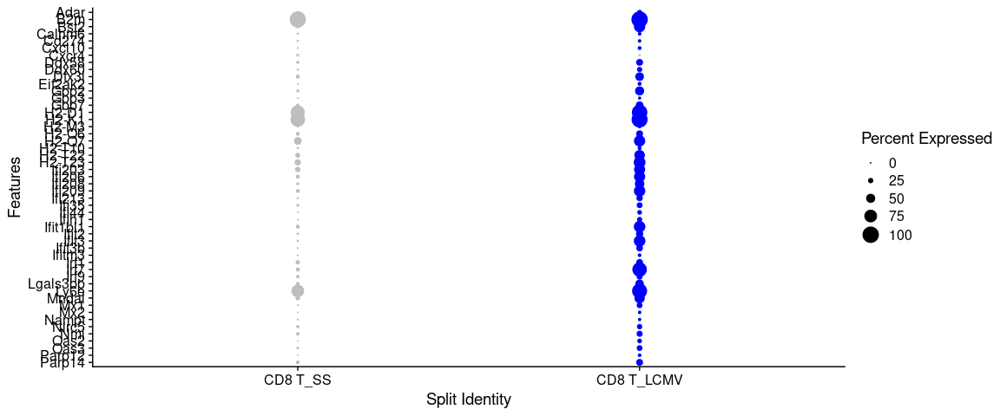
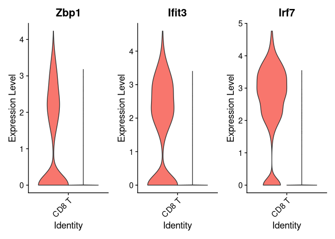
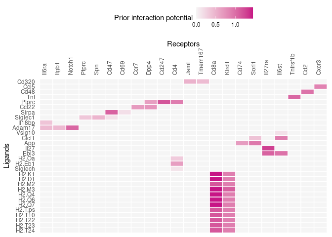
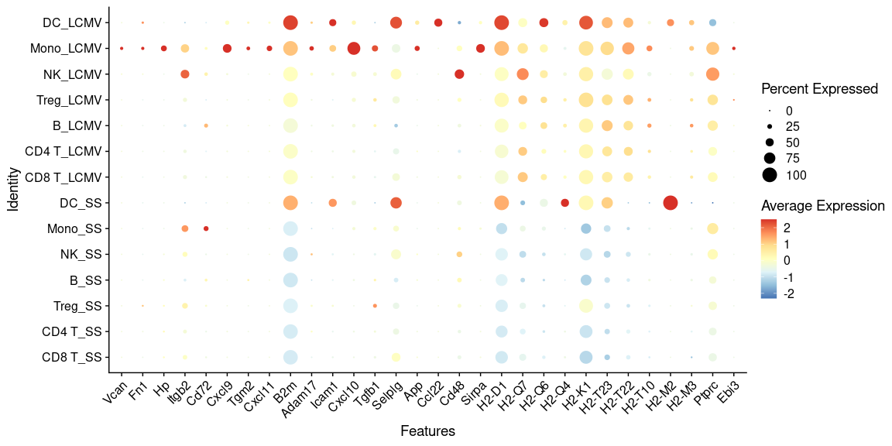

Perform NicheNet analysis starting from a Seurat object
================
Robin Browaeys
2023-10-02

<!-- github markdown built using 
rmarkdown::render("vignettes/seurat_wrapper.Rmd", output_format = "github_document")
-->

In this vignette, you can learn how to perform a basic NicheNet analysis
on a Seurat (v3-v5) object containing single-cell expression data.
**Assuming you have captured the changes in gene expression resulting
from your cell-cell communication (CCC) process of interest,** a
NicheNet analysis can help you to generate hypotheses about the CCC
process. Specifically, NicheNet can predict 1) which ligands from the
microenvironment or cell population(s) (“sender/niche”) are most likely
to affect target gene expression in an interacting cell population
(“receiver/target”) and 2) which specific target genes are affected by
which of these predicted ligands.

The wrapper function we will show consists of the same different steps
that are discussed in detail in the main NicheNet vignette [Perform
NicheNet analysis starting from a Seurat object: step-by-step
analysis](seurat_steps.md).Please make sure you understand the different
steps described in this vignette before performing a real NicheNet
analysis on your data. We generally recommend the step-by-step analysis
as it allows users to adapt specific steps of the pipeline to make them
more appropriate for their data.

To perform a NicheNet analysis, three features are extracted from the
input data: the potential ligands, the gene set of interest, and the
background gene set. This vignette will extract each feature as
described in this flowchart:


As example expression data of interacting cells, we will use mouse
NICHE-seq data to explore intercellular communication in the T cell area
in the inguinal lymph node before and 72 hours after lymphocytic
choriomeningitis virus (LCMV) infection (Medaglia et al. 2017). We will
focus on CD8 T cells as the receiver population, and as this dataset
contains two conditions (before and after LCMV infection), the
differentially expressed genes between these two conditions in CD8 T
cells will be used as our gene set of interest. We will then prioritize
which ligands from the microenvironment (sender-agnostic approach) and
from specific immune cell populations like monocytes, dendritic cells,
NK cells, B cells, and CD4 T cells (sender-focused approach) can
regulate and induce these observed gene expression changes.

The [ligand-target matrix](https://doi.org/10.5281/zenodo.7074290) and
the [Seurat object of the processed NICHE-seq single-cell
data](https://doi.org/10.5281/zenodo.3531889) can be downloaded from
Zenodo.

# Prepare NicheNet analysis

### Load packages

``` r
library(nichenetr) # Please update to v2.0.4
library(Seurat)
library(SeuratObject)
library(tidyverse)
```

If you would use and load other packages, we recommend to load these 3
packages after the others.

### Read in NicheNet’s networks

The ligand-target prior model, ligand-receptor network, and weighted
integrated networks are needed for this vignette. The ligand-target
prior model is a matrix describing the potential that a ligand may
regulate a target gene, and it is used to run the ligand activity
analysis. The ligand-receptor network contains information on potential
ligand-receptor bindings, and it is used to identify potential ligands.
Finally, the weighted ligand-receptor network contains weights
representing the potential that a ligand will bind to a receptor, and it
is used for visualization.

``` r
organism <- "mouse"

if(organism == "human"){
  lr_network <- readRDS(url("https://zenodo.org/record/7074291/files/lr_network_human_21122021.rds"))
  ligand_target_matrix <- readRDS(url("https://zenodo.org/record/7074291/files/ligand_target_matrix_nsga2r_final.rds"))
  weighted_networks <- readRDS(url("https://zenodo.org/record/7074291/files/weighted_networks_nsga2r_final.rds"))
} else if(organism == "mouse"){
  lr_network <- readRDS(url("https://zenodo.org/record/7074291/files/lr_network_mouse_21122021.rds"))
  ligand_target_matrix <- readRDS(url("https://zenodo.org/record/7074291/files/ligand_target_matrix_nsga2r_final_mouse.rds"))
  weighted_networks <- readRDS(url("https://zenodo.org/record/7074291/files/weighted_networks_nsga2r_final_mouse.rds"))

}

lr_network <- lr_network %>% distinct(from, to)
head(lr_network)
## # A tibble: 6 × 2
##   from          to   
##   <chr>         <chr>
## 1 2300002M23Rik Ddr1 
## 2 2610528A11Rik Gpr15
## 3 9530003J23Rik Itgal
## 4 a             Atrn 
## 5 a             F11r 
## 6 a             Mc1r
ligand_target_matrix[1:5,1:5] # target genes in rows, ligands in columns
##               2300002M23Rik 2610528A11Rik 9530003J23Rik            a          A2m
## 0610005C13Rik  0.000000e+00  0.000000e+00  1.311297e-05 0.000000e+00 1.390053e-05
## 0610009B22Rik  0.000000e+00  0.000000e+00  1.269301e-05 0.000000e+00 1.345536e-05
## 0610009L18Rik  8.872902e-05  4.977197e-05  2.581909e-04 7.570125e-05 9.802264e-05
## 0610010F05Rik  2.194046e-03  1.111556e-03  3.142374e-03 1.631658e-03 2.585820e-03
## 0610010K14Rik  2.271606e-03  9.360769e-04  3.546140e-03 1.697713e-03 2.632082e-03

weighted_networks_lr <- weighted_networks$lr_sig %>% inner_join(lr_network, by = c("from","to"))
head(weighted_networks$lr_sig) # interactions and their weights in the ligand-receptor + signaling network
## # A tibble: 6 × 3
##   from          to     weight
##   <chr>         <chr>   <dbl>
## 1 0610010F05Rik App    0.110 
## 2 0610010F05Rik Cat    0.0673
## 3 0610010F05Rik H1f2   0.0660
## 4 0610010F05Rik Lrrc49 0.0829
## 5 0610010F05Rik Nicn1  0.0864
## 6 0610010F05Rik Srpk1  0.123
head(weighted_networks$gr) # interactions and their weights in the gene regulatory network
## # A tibble: 6 × 3
##   from          to            weight
##   <chr>         <chr>          <dbl>
## 1 0610010K14Rik 0610010K14Rik 0.121 
## 2 0610010K14Rik 2510039O18Rik 0.121 
## 3 0610010K14Rik 2610021A01Rik 0.0256
## 4 0610010K14Rik 9130401M01Rik 0.0263
## 5 0610010K14Rik Alg1          0.127 
## 6 0610010K14Rik Alox12        0.128
```

### Read in the expression data of interacting cells

We processed and aggregated the original dataset by using the Seurat
alignment pipeline. As we created this object using Seurat v3, it has to
be updated with `UpdateSeuratObject`. Note that genes should be named by
their official mouse/human gene symbol. If your expression data has the
older gene symbols, you may want to use our alias conversion function to
avoid the loss of gene names.

``` r
seuratObj <- readRDS(url("https://zenodo.org/record/3531889/files/seuratObj.rds"))

# For newer Seurat versions, you may need to run the following
seuratObj <- UpdateSeuratObject(seuratObj)

# Convert gene names
seuratObj <- alias_to_symbol_seurat(seuratObj, "mouse")

seuratObj@meta.data %>% head()
##         nGene nUMI orig.ident aggregate res.0.6 celltype nCount_RNA nFeature_RNA
## W380370   880 1611      LN_SS        SS       1    CD8 T       1607          876
## W380372   541  891      LN_SS        SS       0    CD4 T        885          536
## W380374   742 1229      LN_SS        SS       0    CD4 T       1223          737
## W380378   847 1546      LN_SS        SS       1    CD8 T       1537          838
## W380379   839 1606      LN_SS        SS       0    CD4 T       1603          836
## W380381   517  844      LN_SS        SS       0    CD4 T        840          513
```

Visualize which cell populations are present: CD4 T cells (including
regulatory T cells), CD8 T cells, B cells, NK cells, dendritic cells
(DCs) and inflammatory monocytes.

``` r
# Note that the number of cells of some cell types is very low and should preferably be higher for a real application
seuratObj@meta.data$celltype %>% table() 
## .
##     B CD4 T CD8 T    DC  Mono    NK  Treg 
##   382  2562  1645    18    90   131   199
DimPlot(seuratObj, reduction = "tsne")
```

<!-- -->

Visualize the data to see to which condition cells belong. The metadata
column that denotes the condition (steady-state or after LCMV infection)
is here called ‘aggregate’.

``` r
seuratObj@meta.data$aggregate %>% table()
## .
## LCMV   SS 
## 3886 1141
DimPlot(seuratObj, reduction = "tsne", group.by = "aggregate")
```

<!-- -->

``` r
nichenet_seuratobj_cluster_de
## function(seurat_obj, receiver_affected, receiver_reference, sender = "all",ligand_target_matrix,lr_network,weighted_networks,
##                                         expression_pct = 0.10, lfc_cutoff = 0.25, geneset = "DE", filter_top_ligands = TRUE, top_n_ligands = 30,
##                                         top_n_targets = 200, cutoff_visualization = 0.33,
##                                         verbose = TRUE, assay_oi = NULL)
## {
##   requireNamespace("Seurat")
##   requireNamespace("dplyr")
## 
##   # input check
##   # input check
##   if(! "RNA" %in% names(seurat_obj@assays)){
##     if ("Spatial" %in% names(seurat_obj@assays)){
##       warning("You are going to apply NicheNet on a spatial seurat object. Be sure it's ok to use NicheNet the way you are planning to do it. So this means: you should have changes in gene expression in receiver cells caused by cell-cell interactions. Note that in the case of spatial transcriptomics, you are not dealing with single cells but with 'spots' containing multiple cells of the same of different cell types.")
## 
##       if (class(seurat_obj@assays$Spatial@data) != "matrix" & class(seurat_obj@assays$Spatial@data) != "dgCMatrix") {
##         warning("Spatial Seurat object should contain a matrix of normalized expression data. Check 'seurat_obj@assays$Spatial@data' for default or 'seurat_obj@assays$SCT@data' for when the single-cell transform pipeline was applied")
##       }
##       if (sum(dim(seurat_obj@assays$Spatial@data)) == 0) {
##         stop("Seurat object should contain normalized expression data (numeric matrix). Check 'seurat_obj@assays$Spatial@data'")
##       }
##     }} else {
##       if (class(seurat_obj@assays$RNA@data) != "matrix" &
##           class(seurat_obj@assays$RNA@data) != "dgCMatrix") {
##         warning("Seurat object should contain a matrix of normalized expression data. Check 'seurat_obj@assays$RNA@data' for default or 'seurat_obj@assays$integrated@data' for integrated data or seurat_obj@assays$SCT@data for when the single-cell transform pipeline was applied")
##       }
## 
##       if ("integrated" %in% names(seurat_obj@assays)) {
##         if (sum(dim(seurat_obj@assays$RNA@data)) == 0 & sum(dim(seurat_obj@assays$integrated@data)) ==
##             0)
##           stop("Seurat object should contain normalized expression data (numeric matrix). Check 'seurat_obj@assays$RNA@data' for default or 'seurat_obj@assays$integrated@data' for integrated data")
##       }
##       else if ("SCT" %in% names(seurat_obj@assays)) {
##         if (sum(dim(seurat_obj@assays$RNA@data)) == 0 & sum(dim(seurat_obj@assays$SCT@data)) ==
##             0) {
##           stop("Seurat object should contain normalized expression data (numeric matrix). Check 'seurat_obj@assays$RNA@data' for default or 'seurat_obj@assays$SCT@data' for data corrected via SCT")
##         }
##       }
##       else {
##         if (sum(dim(seurat_obj@assays$RNA@data)) == 0) {
##           stop("Seurat object should contain normalized expression data (numeric matrix). Check 'seurat_obj@assays$RNA@data'")
##         }
##       }
##     }
## 
## 
##   if(sum(receiver_affected %in% unique(Idents(seurat_obj))) != length(receiver_affected))
##     stop("The defined receiver_affected cell type should be an identity class of your seurat object")
##   if(sum(receiver_reference %in% unique(Idents(seurat_obj))) != length(receiver_reference))
##     stop("The defined receiver_reference cell type should be an identity class of your seurat object")
##   if(length(sender) == 1){
##     if(sender != "all" & sender != "undefined"){
##       if(sum(sender %in% unique(Idents(seurat_obj))) != length(sender)){
##         stop("The sender argument should be 'all' or 'undefined' or an identity class of your seurat object")
##       }
##     }
##   } else {
##     if(sum(sender %in% unique(Idents(seurat_obj))) != length(sender)){
##       stop("The sender argument should be 'all' or 'undefined' or an identity class of your seurat object")
##     }
##   }
##   if(geneset != "DE" & geneset != "up" & geneset != "down")
##     stop("geneset should be 'DE', 'up' or 'down'")
## 
##   if("integrated" %in% names(seurat_obj@assays)){
##     warning("Seurat object is result from the Seurat integration workflow. Make sure that the way of defining expressed and differentially expressed genes in this wrapper is appropriate for your integrated data.")
##   }
## 
##   # Read in and process NicheNet networks, define ligands and receptors
##   if (verbose == TRUE){print("Read in and process NicheNet's networks")}
##   weighted_networks_lr = weighted_networks$lr_sig %>% inner_join(lr_network %>% distinct(from,to), by = c("from","to"))
## 
##   ligands = lr_network %>% pull(from) %>% unique()
##   receptors = lr_network %>% pull(to) %>% unique()
## 
##   if (verbose == TRUE){print("Define expressed ligands and receptors in receiver and sender cells")}
## 
##   # step1 nichenet analysis: get expressed genes in sender and receiver cells
## 
##   ## receiver
##   # expressed genes: only in steady state population (for determining receptors)
##   list_expressed_genes_receiver_ss = c(receiver_reference) %>% unique() %>% lapply(get_expressed_genes, seurat_obj, expression_pct, assay_oi)
##   names(list_expressed_genes_receiver_ss) = c(receiver_reference) %>% unique()
##   expressed_genes_receiver_ss = list_expressed_genes_receiver_ss %>% unlist() %>% unique()
## 
##   # expressed genes: both in steady state and affected population (for determining background of expressed genes)
##   list_expressed_genes_receiver = c(receiver_reference,receiver_affected) %>% unique() %>% lapply(get_expressed_genes, seurat_obj, expression_pct, assay_oi)
##   names(list_expressed_genes_receiver) = c(receiver_reference,receiver_affected) %>% unique()
##   expressed_genes_receiver = list_expressed_genes_receiver %>% unlist() %>% unique()
## 
##   ## sender
##   if (length(sender) == 1){
##     if (sender == "all"){
##       sender_celltypes = Idents(seurat_obj) %>% levels()
##       list_expressed_genes_sender = sender_celltypes %>% lapply(get_expressed_genes, seurat_obj, expression_pct, assay_oi)
##       names(list_expressed_genes_sender) = sender_celltypes
##       expressed_genes_sender = list_expressed_genes_sender %>% unlist() %>% unique()
## 
##     } else if (sender == "undefined") {
##       if("integrated" %in% names(seurat_obj@assays)){
##         expressed_genes_sender = union(seurat_obj@assays$integrated@data %>% rownames(),rownames(ligand_target_matrix)) %>% union(colnames(ligand_target_matrix))
##       } else {
##         expressed_genes_sender = union(seurat_obj@assays$RNA@data %>% rownames(),rownames(ligand_target_matrix)) %>% union(colnames(ligand_target_matrix))
##         }
##     } else if (sender != "all" & sender != "undefined") {
##       sender_celltypes = sender
##       list_expressed_genes_sender = sender_celltypes %>% unique() %>% lapply(get_expressed_genes, seurat_obj, expression_pct, assay_oi)
##       names(list_expressed_genes_sender) = sender_celltypes %>% unique()
##       expressed_genes_sender = list_expressed_genes_sender %>% unlist() %>% unique()
##     }
##   } else {
##     sender_celltypes = sender
##     list_expressed_genes_sender = sender_celltypes %>% unique() %>% lapply(get_expressed_genes, seurat_obj, expression_pct, assay_oi)
##     names(list_expressed_genes_sender) = sender_celltypes %>% unique()
##     expressed_genes_sender = list_expressed_genes_sender %>% unlist() %>% unique()
##   }
## 
##   # step2 nichenet analysis: define background and gene list of interest: here differential expression between two conditions of cell type of interest
##   if (verbose == TRUE){print("Perform DE analysis between two receiver cell clusters")}
## 
##   DE_table_receiver = FindMarkers(object = seurat_obj, ident.1 = receiver_affected, ident.2 = receiver_reference, min.pct = expression_pct) %>% rownames_to_column("gene")
## 
##   SeuratV4 = c("avg_log2FC") %in% colnames(DE_table_receiver)
## 
##   if(SeuratV4 == TRUE){
##     if (geneset == "DE"){
##       geneset_oi = DE_table_receiver %>% filter(p_val_adj <= 0.05 & abs(avg_log2FC) >= lfc_cutoff) %>% pull(gene)
##     } else if (geneset == "up") {
##       geneset_oi = DE_table_receiver %>% filter(p_val_adj <= 0.05 & avg_log2FC >= lfc_cutoff) %>% pull(gene)
##     } else if (geneset == "down") {
##       geneset_oi = DE_table_receiver %>% filter(p_val_adj <= 0.05 & avg_log2FC <= lfc_cutoff) %>% pull(gene)
##     }
##   } else {
##     if (geneset == "DE"){
##       geneset_oi = DE_table_receiver %>% filter(p_val_adj <= 0.05 & abs(avg_logFC) >= lfc_cutoff) %>% pull(gene)
##     } else if (geneset == "up") {
##       geneset_oi = DE_table_receiver %>% filter(p_val_adj <= 0.05 & avg_logFC >= lfc_cutoff) %>% pull(gene)
##     } else if (geneset == "down") {
##       geneset_oi = DE_table_receiver %>% filter(p_val_adj <= 0.05 & avg_logFC <= lfc_cutoff) %>% pull(gene)
##     }
##   }
## 
## 
## 
##   geneset_oi = geneset_oi %>% .[. %in% rownames(ligand_target_matrix)]
##   if (length(geneset_oi) == 0){
##     stop("No genes were differentially expressed")
##   }
##   background_expressed_genes = expressed_genes_receiver %>% .[. %in% rownames(ligand_target_matrix)]
## 
##   # step3 nichenet analysis: define potential ligands
##   expressed_ligands = intersect(ligands,expressed_genes_sender)
##   expressed_receptors = intersect(receptors,expressed_genes_receiver)
##   if (length(expressed_ligands) == 0){
##     stop("No ligands expressed in sender cell")
##   }
##   if (length(expressed_receptors) == 0){
##     stop("No receptors expressed in receiver cell")
##   }
##   potential_ligands = lr_network %>% filter(from %in% expressed_ligands & to %in% expressed_receptors) %>% pull(from) %>% unique()
##   if (length(potential_ligands) == 0){
##     stop("No potentially active ligands")
##   }
## 
##   if (verbose == TRUE){print("Perform NicheNet ligand activity analysis")}
## 
##   # step4 perform NicheNet's ligand activity analysis
##   ligand_activities = predict_ligand_activities(geneset = geneset_oi, background_expressed_genes = background_expressed_genes, ligand_target_matrix = ligand_target_matrix, potential_ligands = potential_ligands)
##   ligand_activities = ligand_activities %>%
##     arrange(-aupr_corrected) %>%
##     mutate(rank = rank(desc(aupr_corrected)))
## 
##   if(filter_top_ligands == TRUE){
##     best_upstream_ligands = ligand_activities %>% top_n(top_n_ligands, aupr_corrected) %>% arrange(-aupr_corrected) %>% pull(test_ligand) %>% unique()
##   } else {
##     best_upstream_ligands = ligand_activities %>% arrange(-aupr_corrected) %>% pull(test_ligand) %>% unique()
##   }
##   if (verbose == TRUE){print("Infer active target genes of the prioritized ligands")}
## 
##   # step5 infer target genes of the top-ranked ligands
##   active_ligand_target_links_df = best_upstream_ligands %>% lapply(get_weighted_ligand_target_links,geneset = geneset_oi, ligand_target_matrix = ligand_target_matrix, n = top_n_targets) %>% bind_rows() %>% drop_na()
## 
##   if(nrow(active_ligand_target_links_df) > 0){
##     active_ligand_target_links = prepare_ligand_target_visualization(ligand_target_df = active_ligand_target_links_df, ligand_target_matrix = ligand_target_matrix, cutoff = cutoff_visualization)
##     order_ligands = intersect(best_upstream_ligands, colnames(active_ligand_target_links)) %>% rev() %>% make.names()
##     order_targets = active_ligand_target_links_df$target %>% unique() %>% intersect(rownames(active_ligand_target_links)) %>% make.names()
##     rownames(active_ligand_target_links) = rownames(active_ligand_target_links) %>% make.names()
##     colnames(active_ligand_target_links) = colnames(active_ligand_target_links) %>% make.names()
## 
##     order_targets = order_targets %>% intersect(rownames(active_ligand_target_links))
##     order_ligands = order_ligands %>% intersect(colnames(active_ligand_target_links))
## 
##     vis_ligand_target = active_ligand_target_links[order_targets,order_ligands] %>% t()
##     p_ligand_target_network = vis_ligand_target %>% make_heatmap_ggplot("Prioritized ligands","Predicted target genes", color = "purple",legend_position = "top", x_axis_position = "top",legend_title = "Regulatory potential")  + theme(axis.text.x = element_text(face = "italic")) #+ scale_fill_gradient2(low = "whitesmoke",  high = "purple", breaks = c(0,0.006,0.012))
##   } else {
##     vis_ligand_target = NULL
##     p_ligand_target_network = NULL
##     print("no highly likely active targets found for top ligands")
##   }
## 
##   # combined heatmap: overlay ligand activities
##   ligand_aupr_matrix = ligand_activities %>% select(aupr_corrected) %>% as.matrix() %>% magrittr::set_rownames(ligand_activities$test_ligand)
## 
##   rownames(ligand_aupr_matrix) = rownames(ligand_aupr_matrix) %>% make.names()
##   colnames(ligand_aupr_matrix) = colnames(ligand_aupr_matrix) %>% make.names()
## 
##   vis_ligand_aupr = ligand_aupr_matrix[order_ligands, ] %>% as.matrix(ncol = 1) %>% magrittr::set_colnames("AUPR")
##   p_ligand_aupr = vis_ligand_aupr %>% make_heatmap_ggplot("Prioritized ligands","Ligand activity", color = "darkorange",legend_position = "top", x_axis_position = "top", legend_title = "AUPR\n(target gene prediction ability)") + theme(legend.text = element_text(size = 9))
##   p_ligand_aupr
## 
##   figures_without_legend = cowplot::plot_grid(
##     p_ligand_aupr + theme(legend.position = "none", axis.ticks = element_blank()) + theme(axis.title.x = element_text()),
##     p_ligand_target_network + theme(legend.position = "none", axis.ticks = element_blank()) + ylab(""),
##     align = "hv",
##     nrow = 1,
##     rel_widths = c(ncol(vis_ligand_aupr)+10, ncol(vis_ligand_target)))
##   legends = cowplot::plot_grid(
##     ggpubr::as_ggplot(ggpubr::get_legend(p_ligand_aupr)),
##     ggpubr::as_ggplot(ggpubr::get_legend(p_ligand_target_network)),
##     nrow = 1,
##     align = "h")
## 
##   combined_plot = cowplot::plot_grid(figures_without_legend,
##                                      legends,
##                                      rel_heights = c(10,2), nrow = 2, align = "hv")
## 
##   # ligand-receptor plot
##   # get the ligand-receptor network of the top-ranked ligands
##   if (verbose == TRUE){print("Infer receptors of the prioritized ligands")}
## 
##   lr_network_top = lr_network %>% filter(from %in% best_upstream_ligands & to %in% expressed_receptors) %>% distinct(from,to)
##   best_upstream_receptors = lr_network_top %>% pull(to) %>% unique()
## 
##   lr_network_top_df_large = weighted_networks_lr %>% filter(from %in% best_upstream_ligands & to %in% best_upstream_receptors)
## 
##   lr_network_top_df = lr_network_top_df_large %>% spread("from","weight",fill = 0)
##   lr_network_top_matrix = lr_network_top_df %>% select(-to) %>% as.matrix() %>% magrittr::set_rownames(lr_network_top_df$to)
## 
##   if (nrow(lr_network_top_matrix) > 1){
##     dist_receptors = dist(lr_network_top_matrix, method = "binary")
##     hclust_receptors = hclust(dist_receptors, method = "ward.D2")
##     order_receptors = hclust_receptors$labels[hclust_receptors$order]
##   } else {
##     order_receptors = rownames(lr_network_top_matrix)
##   }
##   if (ncol(lr_network_top_matrix) > 1) {
##     dist_ligands = dist(lr_network_top_matrix %>% t(), method = "binary")
##     hclust_ligands = hclust(dist_ligands, method = "ward.D2")
##     order_ligands_receptor = hclust_ligands$labels[hclust_ligands$order]
##   } else {
##     order_ligands_receptor = colnames(lr_network_top_matrix)
##   }
## 
##   order_receptors = order_receptors %>% intersect(rownames(lr_network_top_matrix))
##   order_ligands_receptor = order_ligands_receptor %>% intersect(colnames(lr_network_top_matrix))
## 
##   vis_ligand_receptor_network = lr_network_top_matrix[order_receptors, order_ligands_receptor]
##   dim(vis_ligand_receptor_network) = c(length(order_receptors), length(order_ligands_receptor))
## 
##   rownames(vis_ligand_receptor_network) = order_receptors %>% make.names()
##   colnames(vis_ligand_receptor_network) = order_ligands_receptor %>% make.names()
## 
##   p_ligand_receptor_network = vis_ligand_receptor_network %>% t() %>% make_heatmap_ggplot("Ligands","Receptors", color = "mediumvioletred", x_axis_position = "top",legend_title = "Prior interaction potential")
## 
##   # ligand expression Seurat dotplot
##   if (length(sender) > 1){
##     are_there_senders = TRUE
##   }
##   if(length(sender) == 1){
##     if(sender != "undefined"){
##       are_there_senders = TRUE
##     } else {
##       are_there_senders = FALSE
##     }
##   }
## 
##   if (are_there_senders == TRUE){
##     real_makenames_conversion = lr_network$from %>% unique() %>% magrittr::set_names(lr_network$from %>% unique() %>% make.names())
##     order_ligands_adapted = real_makenames_conversion[order_ligands]
##     names(order_ligands_adapted) = NULL
##     rotated_dotplot = DotPlot(seurat_obj %>% subset(idents = sender_celltypes), features = order_ligands_adapted, cols = "RdYlBu") + coord_flip() + theme(legend.text = element_text(size = 10), legend.title = element_text(size = 12)) # flip of coordinates necessary because we want to show ligands in the rows when combining all plots
## 
##   } else {
##     rotated_dotplot = NULL
##   }
## 
## 
##   return(list(
##     ligand_activities = ligand_activities,
##     top_ligands = best_upstream_ligands,
##     top_targets = active_ligand_target_links_df$target %>% unique(),
##     top_receptors = lr_network_top_df_large$to %>% unique(),
##     ligand_target_matrix = vis_ligand_target,
##     ligand_target_heatmap = p_ligand_target_network,
##     ligand_target_df = active_ligand_target_links_df,
##     ligand_expression_dotplot = rotated_dotplot,
##     ligand_activity_target_heatmap = combined_plot,
##     ligand_receptor_matrix = vis_ligand_receptor_network,
##     ligand_receptor_heatmap = p_ligand_receptor_network,
##     ligand_receptor_df = lr_network_top_df_large %>% rename(ligand = from, receptor = to),
##     geneset_oi = geneset_oi,
##     background_expressed_genes = background_expressed_genes
## 
##   ))
## }
## <environment: namespace:nichenetr>
```

# Perform the NicheNet analysis

In this case study, we want to apply NicheNet to predict which ligands
expressed by the microenvironment (sender-agnostic) and immune cells in
the T cell area of the lymph node (sender-focused) are most likely to
have induced the differential expression in CD8 T cells after LCMV
infection. In contrary to NicheNet v1 where we only used the
“sender-focused” approach, we now recommend users to run both the
“sender-agnostic” approach and “sender-focused” approach. These
approaches only affect the list of potential ligands that are considered
for prioritization. As described in the flowchart above, we do not
define any sender populations in the ‘sender agnostic’ approach but
consider all ligands for which its cognate receptor is expressed in the
receiver population. The sender-focused approach will then filter the
list of ligands to ones where the ligands are expressed in the sender
cell population(s).

As described in the main vignette, the pipeline of a basic NicheNet
analysis consist of the following steps: \* 1. Define a set of potential
ligands for both the sender-agnostic and sender-focused approach \* 2.
Define the gene set of interest: these are the genes in the
“receiver/target” cell population that are potentially affected by
ligands expressed by interacting cells (e.g. genes differentially
expressed upon cell-cell interaction) \* 3. Define the background genes
\* 4. Perform NicheNet ligand activity analysis: rank the potential
ligands based on the presence of their target genes in the gene set of
interest (compared to the background set of genes) \* 5. Infer target
genes and receptors of top-ranked ligands

All these steps are contained in one of three wrapper functions:
`nichenet_seuratobj_aggregate`, `nichenet_seuratobj_cluster_de` and
`nichenet_seuratobj_aggregate_cluster_de`. These functions differ on how
the gene set of interest is calculated, as follows:

| **Function**                            | **Gene set of interest**                           | **Background genes**                   |
|-----------------------------------------|----------------------------------------------------|----------------------------------------|
| nichenet_seuratobj_aggregate            | DE between two conditions of the same cell type    | All expressed genes in the cell type   |
| nichenet_seuratobj_cluster_de           | DE between two cell types                          | All expressed genes in both cell types |
| nichenet_seuratobj_aggregate_cluster_de | DE between two cell types from specific conditions | All expressed genes in both cell types |

**Note:** Cell types should be the identities of the seurat object
(check using `table(Idents(seuratObj))`)

## `nichenet_seuratobj_aggregate`: explain differential expression between two conditions

For the sender-agnostic approach the sender is set to ‘undefined’. The
receiver cell population is the ‘CD8 T’ cell population, and the gene
set of interest are the genes differentially expressed in CD8 T cells
after LCMV infection. Thus, the condition of interest is ‘LCMV’, whereas
the reference/steady-state condition is ‘SS’. The column containing
condition information is ‘aggregate’. The method to calculate
differential expression is the standard Seurat Wilcoxon test. To use
other methods, users will have to go through step-by-step analysis. The
number of top-ranked ligands that are further used to predict active
target genes and construct an active ligand-receptor network is 30
(`top_n_ligands`). The number of target genes to consider per ligand
when performing the target gene inference is 200 (`top_n_targets`). We
only retain ligands and receptors that are expressed in at least a
predefined fraction of cells in one cluster (`expression_pct`, default:
10%).

``` r
nichenet_output_agnostic <- nichenet_seuratobj_aggregate(
  seurat_obj = seuratObj, 
  sender = "undefined",
  receiver = "CD8 T", 
  condition_colname = "aggregate",
  condition_oi = "LCMV",
  condition_reference = "SS",
  expression_pct = 0.05,
  ligand_target_matrix = ligand_target_matrix,
  lr_network = lr_network,
  weighted_networks = weighted_networks
  )
## [1] "Read in and process NicheNet's networks"
## [1] "Define expressed ligands and receptors in receiver and sender cells"
## [1] "Perform DE analysis in receiver cell"
## [1] "Perform NicheNet ligand activity analysis"
## [1] "Infer active target genes of the prioritized ligands"
## [1] "Infer receptors of the prioritized ligands"
```

For the sender-focused approach, simply provide one or more sender
populations:

``` r
nichenet_output <- nichenet_seuratobj_aggregate(
  seurat_obj = seuratObj, 
  sender = c("CD4 T","Treg", "Mono", "NK", "B", "DC"), 
  receiver = "CD8 T", 
  condition_colname = "aggregate",
  condition_oi = "LCMV",
  condition_reference = "SS",
  expression_pct = 0.05,
  ligand_target_matrix = ligand_target_matrix,
  lr_network = lr_network,
  weighted_networks = weighted_networks
  )
## [1] "Read in and process NicheNet's networks"
## [1] "Define expressed ligands and receptors in receiver and sender cells"
## [1] "Perform DE analysis in receiver cell"
## [1] "Perform NicheNet ligand activity analysis"
## [1] "Infer active target genes of the prioritized ligands"
## [1] "Infer receptors of the prioritized ligands"
## [1] "Perform DE analysis in sender cells"
```

**Note:** It is also possible that you want to consider all cell types
present as possible sender cell by defining `sender = "all"`. This also
includes the receiver cell type, making that you can look at autocrine
signaling as well.

### Interpret the NicheNet analysis output

We will investigate the output of the sender-focused approach.

``` r
names(nichenet_output)
##  [1] "ligand_activities"                      "top_ligands"                            "top_targets"                            "top_receptors"                          "ligand_target_matrix"                   "ligand_target_heatmap"                 
##  [7] "ligand_target_df"                       "ligand_expression_dotplot"              "ligand_differential_expression_heatmap" "ligand_activity_target_heatmap"         "ligand_receptor_matrix"                 "ligand_receptor_heatmap"               
## [13] "ligand_receptor_df"                     "geneset_oi"                             "background_expressed_genes"
```

#### Ligand activity analysis results

To see the ranking of ligands based on the predicted ligand activity:

``` r
nichenet_output$ligand_activities
## # A tibble: 127 × 6
##    test_ligand auroc  aupr aupr_corrected pearson  rank
##    <chr>       <dbl> <dbl>          <dbl>   <dbl> <dbl>
##  1 Il27        0.682 0.391         0.316    0.445     1
##  2 Ebi3        0.666 0.264         0.189    0.256     2
##  3 Tnf         0.671 0.205         0.131    0.249     3
##  4 Ptprc       0.660 0.198         0.124    0.168     4
##  5 H2-Eb1      0.656 0.195         0.120    0.182     5
##  6 Vsig10      0.649 0.194         0.119    0.170     6
##  7 H2-M3       0.632 0.192         0.118    0.185     7
##  8 Clcf1       0.637 0.175         0.101    0.162     8
##  9 H2-M2       0.634 0.174         0.0989   0.146    11
## 10 H2-T-ps     0.634 0.174         0.0989   0.146    11
## # ℹ 117 more rows
```

Ligands are ranked based on the area under the precision-recall curve
(AUPR) between a ligand’s target predictions and the observed
transcriptional response. Although other metrics like the AUROC and
pearson correlation coefficient are also computed, we demonstrated in
our validation study that the AUPRwas the most informative measure to
define ligand activity (this was the Pearson correlation for v1). The
vignette on how we performed the validation can be found at [Evaluation
of NicheNet’s ligand-target predictions](model_evaluation.md).

To get a list of the top 30 ligands:

``` r
nichenet_output$top_ligands
##  [1] "Il27"    "Ebi3"    "Tnf"     "Ptprc"   "H2-Eb1"  "Vsig10"  "H2-M3"   "Clcf1"   "H2-M2"   "H2-T-ps" "H2-T10"  "H2-T22"  "H2-T24"  "H2-T23"  "H2-K1"   "H2-Q4"   "H2-Q6"   "H2-Q7"   "H2-D1"   "H2-Oa"   "Il18bp"  "Sirpa"   "Cd48"    "App"    
## [25] "Ccl22"   "Siglech" "Ccl5"    "Siglec1" "Cd320"   "Adam17"
```

Below we will show visualizations that are in the output object. In some
cases (including this one), not all top ligands that are present in
`top_ligands` will be shown in the plot. The left-out ligands are
ligands that don’t have target genes with high enough regulatory
potential scores, and therefore did not survive the used cutoffs (in the
functions `get_weighted_ligand_target_links` and
`prepare_ligand_target_visualization` that are run internally). To
include them, you can increase the number of target genes considered or
be less stringent in the used cutoffs (`top_n_targets` and
`cutoff_visualization` , respectively). In this case, CCl22 (ranked
25th) is missing from the plots.

To see which sender cell population expresses which of the top-ranked
ligands:

``` r
nichenet_output$ligand_expression_dotplot
```

<!-- -->

As you can see, most op the top-ranked ligands seem to be mainly
expressed by dendritic cells and monocytes.

It could also be interesting to see whether some of these ligands are
differentially expressed after LCMV infection.

``` r
nichenet_output$ligand_differential_expression_heatmap
```

<!-- -->

Although this ligand differential expression is not used for
prioritization and ranking of the ligands (the ranking is only
determined based on enrichment of target genes among DE genes in the
receiver, CD8T cells), most of the top-ranked ligands also seem to be
upregulated themselves in monocytes after viral infection. This is nice
additional “evidence” that these ligands might indeed be important.

#### Inferred active ligand-target links

NicheNet also infers active target genes of these top-ranked ligands,
best visualized with the following heatmap showing which top-ranked
ligands are predicted to have regulated the expression of which
differentially expressed genes:

``` r
nichenet_output$ligand_target_heatmap
```

<!-- -->

This is a normal ggplot object that can be adapted accordingly. For
example if you want to change the color code to blue instead of purple,
change the axis ticks of the legend, and change the axis labels of the
heatmap, you can do the following:

``` r
nichenet_output$ligand_target_heatmap +
  scale_fill_gradient2(low = "whitesmoke",high = "royalblue") +
  xlab("anti-LCMV response genes in CD8 T cells") + ylab("Prioritized immmune cell ligands")
```

<!-- -->

If you want, you can also extract the ligand-target links and their
regulatory potential scores in matrix or data frame format (e.g. for
visualization in other ways or output to a csv file).

``` r
nichenet_output$ligand_target_matrix %>% .[1:10,1:6]
##         Adar         B2m        Bst2 Calhm6      Cd274      Cxcl10
## Adam17     0 0.000000000 0.008167279      0 0.06549177 0.011094196
## Cd320      0 0.000000000 0.000000000      0 0.00000000 0.000000000
## Siglec1    0 0.000000000 0.000000000      0 0.00000000 0.000000000
## Ccl5       0 0.000000000 0.000000000      0 0.00000000 0.008424993
## Siglech    0 0.008857572 0.011974948      0 0.01257584 0.008780173
## App        0 0.000000000 0.000000000      0 0.04432138 0.000000000
## Cd48       0 0.000000000 0.000000000      0 0.00000000 0.000000000
## Sirpa      0 0.000000000 0.000000000      0 0.00000000 0.007796006
## Il18bp     0 0.000000000 0.000000000      0 0.00000000 0.007808540
## H2.Oa      0 0.000000000 0.000000000      0 0.00000000 0.008143571
```

``` r
nichenet_output$ligand_target_df # weight column = regulatory potential
## # A tibble: 656 × 3
##    ligand target weight
##    <chr>  <chr>   <dbl>
##  1 Il27   Adar    0.163
##  2 Il27   B2m     0.170
##  3 Il27   Bst2    0.111
##  4 Il27   Calhm6  0.129
##  5 Il27   Cd274   0.111
##  6 Il27   Cxcl10  0.178
##  7 Il27   Cxcr4   0.178
##  8 Il27   Ddx58   0.227
##  9 Il27   Ddx60   0.160
## 10 Il27   Dtx3l   0.150
## # ℹ 646 more rows
```

To get a list of the top-predicted target genes of the 30 top-ranked
ligands:

``` r
nichenet_output$top_targets
##  [1] "Adar"     "B2m"      "Bst2"     "Calhm6"   "Cd274"    "Cxcl10"   "Cxcr4"    "Ddx58"    "Ddx60"    "Dtx3l"    "Eif2ak2"  "Gbp2"     "Gbp3"     "Gbp7"     "H2-D1"    "H2-K1"    "H2-M3"    "H2-Q6"    "H2-Q7"    "H2-T10"   "H2-T22"   "H2-T23"  
## [23] "Ifi203"   "Ifi206"   "Ifi208"   "Ifi209"   "Ifi213"   "Ifi35"    "Ifi44"    "Ifih1"    "Ifit1bl1" "Ifit2"    "Ifit3"    "Ifit3b"   "Ifitm3"   "Irf1"     "Irf7"     "Irf9"     "Lgals3bp" "Ly6e"     "Mndal"    "Mx1"      "Mx2"      "Nampt"   
## [45] "Nlrc5"    "Nmi"      "Oas2"     "Oas3"     "Parp12"   "Parp14"   "Parp9"    "Pml"      "Psmb8"    "Psmb9"    "Psme1"    "Psme2b"   "Rnf213"   "Samhd1"   "Sp110"    "Stat1"    "Stat2"    "Tap1"     "Tapbp"    "Tnfsf10"  "Trafd1"   "Ube2l6"  
## [67] "Xaf1"     "Ddit4"    "Dhx58"    "Gzmb"     "Isg15"    "Lcp1"     "Oas1a"    "Oas1g"    "Rsad2"    "Zbp1"     "Cd47"     "Ctss"     "Trim21"   "Cd69"     "H3f3b"    "Id3"      "Vim"      "Isg20"    "Oasl1"    "Hspa5"    "Ifit1"    "Nt5c3"   
## [89] "Usp18"    "Basp1"    "Plac8"    "Sp100"    "Sp140"    "Ubc"
```

You can visualize the expression of these target genes as well (only the
top 50 are shown here). Because we only focus on CD8 T cells as receiver
cells, we will only show expression in these cells. To emphasize that
these target genes are differentially expressed, we split cells up in
steady-state cells and cells after response to LCMV infection.

``` r
DotPlot(seuratObj %>% subset(idents = "CD8 T"), features = nichenet_output$top_targets[1:50] %>%
          rev(), split.by = "aggregate") + coord_flip()
```

<!-- -->

``` r
VlnPlot(seuratObj %>% subset(idents = "CD8 T"), features = c("Zbp1","Ifit3","Irf7"), split.by = "aggregate", pt.size = 0, combine = TRUE)
```

<!-- -->

The display the combined plot of ligand activities, expression,
differential expression and target genes of ligands:

``` r
nichenet_output$ligand_activity_target_heatmap
```

<!-- -->

**Important: the above figure can be considered as one of the most
important summary figures of the NicheNet analysis. Here you can see
which ligand-receptor pairs have both high differential expression and
ligand activity (=target gene enrichment). These are very interesting
predictions as key regulators of your intercellular communication
process of interest!**

#### Inferred ligand-receptor interactions for top-ranked ligands

NicheNet also infers the receiver cell receptors of these top-ranked
ligands. You can run following command for a heatmap visualization of
the ligand-receptor links:

``` r
nichenet_output$ligand_receptor_heatmap
```

<!-- -->

If you want, you can also extract the ligand-receptor links and their
interaction confidence scores in matrix or data frame format (e.g. for
visualization in other ways or output to a csv file).

``` r
nichenet_output$ligand_receptor_matrix %>% .[1:10,1:6]
##        H2.T24 H2.T23 H2.T22 H2.T10 H2.T.ps H2.Q7
## Il6ra       0      0      0      0       0     0
## Itgb1       0      0      0      0       0     0
## Notch1      0      0      0      0       0     0
## Ptprc       0      0      0      0       0     0
## Spn         0      0      0      0       0     0
## Cd47        0      0      0      0       0     0
## Cd69        0      0      0      0       0     0
## Ccr7        0      0      0      0       0     0
## Dpp4        0      0      0      0       0     0
## Cd247       0      0      0      0       0     0
```

``` r
nichenet_output$ligand_receptor_df # weight column accords to number of data sources that document this interaction
## # A tibble: 54 × 3
##    ligand receptor weight
##    <chr>  <chr>     <dbl>
##  1 Adam17 Il6ra     0.447
##  2 Adam17 Itgb1     0.454
##  3 Adam17 Notch1    1.05 
##  4 App    Cd74      0.670
##  5 App    Sorl1     0.922
##  6 Ccl22  Ccr7      0.679
##  7 Ccl22  Dpp4      0.717
##  8 Ccl5   Cxcr3     0.848
##  9 Cd320  Jaml      0.507
## 10 Cd320  Tmem167   0.432
## # ℹ 44 more rows
```

To get a list of the receptors of the 30 top-ranked ligands:

``` r
nichenet_output$top_receptors
##  [1] "Il6ra"    "Itgb1"    "Notch1"   "Cd74"     "Sorl1"    "Ccr7"     "Dpp4"     "Cxcr3"    "Jaml"     "Tmem167"  "Cd2"      "Il6st"    "Il27ra"   "Cd8a"     "Klrd1"    "Cd4"      "Cd247"    "Cd47"     "Ptprc"    "Spn"      "Cd69"     "Tnfrsf1b"
```

You can visualize the expression of these as well. Because we only focus
on CD8 T cells as receiver cells, we will only show expression in these
cells.

``` r
DotPlot(seuratObj %>% subset(idents = "CD8 T"),
        features = nichenet_output$top_receptors %>% rev(), split.by = "aggregate") +
  coord_flip()
```

<!-- -->

If you are interested in checking which geneset (and background set of
genes) was used during the ligand activity analysis:

``` r
nichenet_output$geneset_oi
##   [1] "Ifi27l2b"      "Irf7"          "Ly6a"          "Stat1"         "Ly6c2"         "Ifit3"         "Ifit1"         "Ly6c1"         "Bst2"          "B2m"           "Rnf213"        "Ifit1bl1"      "Plac8"         "Slfn1"         "Ifi209"       
##  [16] "Isg15"         "Igtp"          "Ifi206"        "Shisa5"        "Ms4a4c"        "H2-K1"         "Zbp1"          "Oasl2"         "Isg20"         "Samhd1"        "Ifi208"        "Ms4a6b"        "Trim30a"       "Usp18"         "Mndal"        
##  [31] "H2-T23"        "Slfn8"         "Gbp2"          "Ifi203"        "Iigp1"         "Tmsb4x"        "H2-T22"        "Rsad2"         "Ly6e"          "Rtp4"          "Ifit3b"        "Zfas1"         "Ifit2"         "Phf11b"        "Xaf1"         
##  [46] "Smchd1"        "Daxx"          "Alb"           "Samd9l"        "Actb"          "Parp9"         "Gbp4"          "Lgals3bp"      "Mx1"           "Ifi213"        "Irgm1"         "2410006H16Rik" "Gbp7"          "Cmpk2"         "Dtx3l"        
##  [61] "Slfn5"         "H2-D1"         "Oasl1"         "Herc6"         "Ifih1"         "Rpsa"          "P2ry13"        "Apoa2"         "Irgm2"         "Tapbp"         "Rps8"          "Stat2"         "Ifi44"         "Phf11c"        "Rpl8"         
##  [76] "Psmb8"         "Gm12250"       "Igfbp4"        "Rplp2-ps1"     "Ddx58"         "Rac2"          "Trafd1"        "Sp100"         "Gbp9"          "Pml"           "Oas2"          "Slfn2"         "Psme1"         "Apoe"          "Gas5"         
##  [91] "H2-Q7"         "Basp1"         "Ms4a4b"        "Rps27a"        "Cd52"          "Znfx1"         "Rpl13"         "Ahsg"          "Oas3"          "Nt5c3"         "Rnf114"        "Tap1"          "Rps28"         "Oas1a"         "Rplp0"        
## [106] "Ddx60"         "Vim"           "Gbp6"          "Ifi35"         "Itm2b"         "Ctss"          "Tgtp1"         "Trf"           "Pabpc1"        "H2-Q6"         "Parp14"        "Hspa8"         "Tor3a"         "Rpl23"         "Mx2"          
## [121] "Tmbim6"        "Thy1"          "Ncoa7"         "Dhx58"         "Rps10"         "Rps19"         "Psmb9"         "Il2rg"         "Etnk1"         "Irf9"          "Rps3a1"        "Gbp10"         "1600014C10Rik" "Parp12"        "Trim30d"      
## [136] "Eif2ak2"       "Eef1b2"        "Eef2"          "Ncf2"          "Npc2"          "Rps2"          "Rps3"          "Sp110"         "Ube2l6"        "Nmi"           "Uba7"          "Psmb10"        "Cxcl10"        "Rpl13a"        "Trim30c"      
## [151] "Nhp2"          "Tbrg1"         "Jaml"          "Usp25"         "Tor1aip2"      "Adar"          "Gzma"          "Gm2000"        "Rps18-ps5"     "Cd53"          "Phf11"         "Hspa5"         "Cfl1"          "Crip1"         "Slco3a1"      
## [166] "Tlr7"          "Trim21"        "Gbp8"          "Rpl10"         "Mycbp2"        "Rps16"         "Nlrc5"         "Rplp2"         "Acadl"         "Trim12c"       "Rps4x"         "Irf1"          "Psma2"         "Nme2"          "Tut4"         
## [181] "Apobec3"       "Snord12"       "Phip"          "Gzmb"          "Ifitm3"        "Sp140"         "Dusp2"         "Mrpl30"        "Malat1"        "H2-M3"         "Gbp3"          "Tmsb10"        "Dtx1"          "Tmem184b"      "Eef1g"        
## [196] "Rbl1"          "Epb41l4aos"    "Xpo1"          "Rgcc"          "Gm9844"        "Rpl35"         "Rps26"         "Il18bp"        "Sdc3"          "Cxcr4"         "Eif3m"         "Treml2"        "Rpl35a"        "Lgals8"        "Pdcd4"        
## [211] "Arrb2"         "Ubc"           "Clic4"         "H2-T10"        "Rpl10a"        "Lcp1"          "Cd274"         "Ddit4"         "Cnn2"          "Nampt"         "Ascc3"         "Ms4a6d"        "Cd47"          "Ogfrl1"        "Snord49b"     
## [226] "Ilrun"         "Calhm6"        "Psme2b"        "Hcst"          "Myh9"          "Rps27"         "Mov10"         "Gm15772"       "Arf4"          "Arhgdib"       "Ppib"          "Ubb"           "Trim25"        "Tspo"          "Id3"          
## [241] "Snord35a"      "Zup1"          "Oas1g"         "Ms4a6c"        "Rnf8"          "Casp8"         "Tnfsf10"       "Ptpn7"         "Itk"           "Rps27rt"       "Cd69"          "H3f3b"         "Nop10"         "Anxa6"         "Hk1"          
## [256] "Prkcb"         "Iqgap1"        "Keap1"         "Rpl7"          "Parp10"
nichenet_output$background_expressed_genes %>% length()
## [1] 3476
```

### Results of the sender-agnostic approach

``` r
# There is no log-fold change or expression plot because we did not define cell types
nichenet_output_agnostic$ligand_activity_target_heatmap
```

<!-- -->

As you can see in this analysis result, many genes DE in CD8 T cells
after LCMV infection are strongly predicted type I interferon targets.
The presence of a type I interferon signature in the receiver cell type,
but the absence of expression of type I interferons in sender cell
types, might indicate that type I interferons are expressed by a
different, non-profiled cell type, or at a time point before sampling.
The latter could make sense, because there always is a time delay
between expression of a ligand-encoding gene and the effect of the
ligand on a target/receiver cell (i.e. expression of target genes).

#### Running multiple NicheNet analyses on different receiver cell populations

In some cases, you might be interested in multiple target/receiver cell
populations. You can decide to run this for every cell type separately,
or in one line of code as demonstrated here (results are the same). As
example, we could have been interested in explaining DE between
steady-state and LCMV infection in both CD8 and CD4 T cells.

``` r
# To run with  all celltypes in the dataset (only when this would make sense biologically!)
# receiver_celltypes_oi <- seuratObj %>% Idents() %>% unique()

receiver_celltypes_oi = c("CD4 T", "CD8 T")

nichenet_output <- receiver_celltypes_oi %>% lapply(nichenet_seuratobj_aggregate,
                                                    seurat_obj = seuratObj,
                                                    condition_colname = "aggregate",
                                                    condition_oi = "LCMV",
                                                    condition_reference = "SS",
                                                    sender = c("CD4 T","Treg", "Mono", "NK", "B", "DC"),
                                                    ligand_target_matrix = ligand_target_matrix,
                                                    lr_network = lr_network,
                                                    weighted_networks = weighted_networks)
## [1] "Read in and process NicheNet's networks"
## [1] "Define expressed ligands and receptors in receiver and sender cells"
## [1] "Perform DE analysis in receiver cell"
## [1] "Perform NicheNet ligand activity analysis"
## [1] "Infer active target genes of the prioritized ligands"
## [1] "Infer receptors of the prioritized ligands"
## [1] "Perform DE analysis in sender cells"
## [1] "Read in and process NicheNet's networks"
## [1] "Define expressed ligands and receptors in receiver and sender cells"
## [1] "Perform DE analysis in receiver cell"
## [1] "Perform NicheNet ligand activity analysis"
## [1] "Infer active target genes of the prioritized ligands"
## [1] "Infer receptors of the prioritized ligands"
## [1] "Perform DE analysis in sender cells"

names(nichenet_output) <- receiver_celltypes_oi
```

Check which ligands were top-ranked for both CD8T and CD4T and which
ligands were more cell-type specific

``` r
common_ligands <- intersect(nichenet_output$`CD4 T`$top_ligands, nichenet_output$`CD8 T`$top_ligands)
print("Common ligands:")
## [1] "Common ligands:"
print(common_ligands)
##  [1] "Ebi3"   "Ptprc"  "H2-M3"  "H2-M2"  "H2-T10" "H2-T22" "H2-T23" "Sirpa"  "H2-K1"  "H2-Q4"  "H2-Q6"  "H2-Q7"  "H2-D1"  "Ccl22"  "Cd48"   "App"    "Tgfb1"  "Selplg" "Icam1"  "Btla"   "Cd72"   "B2m"    "Hp"     "Itgb2"

cd4_ligands <- nichenet_output$`CD4 T`$top_ligands %>% setdiff(nichenet_output$`CD8 T`$top_ligands)
cd8_ligands <- nichenet_output$`CD8 T`$top_ligands %>% setdiff(nichenet_output$`CD4 T`$top_ligands)

print("Ligands specifically regulating DE in CD4T:")
## [1] "Ligands specifically regulating DE in CD4T:"
print(cd4_ligands)
## [1] "H2-Eb1"  "H2-Oa"   "Il16"    "Fn1"     "H2-DMb1" "H2-DMb2"

print("Ligands specifically regulating DE in CD8T:")
## [1] "Ligands specifically regulating DE in CD8T:"
print(cd8_ligands)
## [1] "Cxcl10" "Adam17" "Cxcl11" "Tgm2"   "Cxcl9"  "Vcan"
```

## `nichenet_seuratobj_cluster_de`: explain differential expression between two cell types

Unlike the case above where we applied NicheNet to explain differential
expression between two conditions in one cell type, here we try to
explain differential expression between two cell populations. DE between
cell populations are sometimes (partially) caused by communication with
cells in the neighborhood, e.g., the differentiation from a progenitor
cell to a differentiated cell might be induced by niche cells. A
concrete example is discussed in the paper by Bonnardel et al. (2019):
[Stellate Cells, Hepatocytes, and Endothelial Cells Imprint the Kupffer
Cell Identity on Monocytes Colonizing the Liver Macrophage
Niche](https://www.cell.com/immunity/fulltext/S1074-7613(19)30368-1).

However, keep in mind that the comparison that you make should be
biologically relevant. as in most cases, differential expression between
cell populations will be a result of cell-intrinsic properties
(i.e. different cell types have a different gene expression profile) and
not of an intercellular communication processes. In such a case, it does
not make any sense to use NicheNet.

For demonstration purposes, we will change the Seurat object of the same
dataset such that it can be used in this setting.

``` r
seuratObj <- SetIdent(seuratObj, value = paste(seuratObj$celltype, seuratObj$aggregate, sep = "_"))
Idents(seuratObj) %>% table()
## .
##   CD8 T_SS   CD4 T_SS    Treg_SS       B_SS      NK_SS    Mono_SS      DC_SS CD8 T_LCMV CD4 T_LCMV     B_LCMV  Treg_LCMV    NK_LCMV  Mono_LCMV    DC_LCMV 
##        393        601         53         38         37         15          4       1252       1961        344        146         94         75         14
```

Now perform the NicheNet analysis to explain differential expression
between the ‘affected’ cell population ‘CD8 T cells after LCMV
infection’ and the reference cell population ‘CD8 T cells in
steady-state’ by ligands expressed by monocytes and DCs after LCMV
infection.

``` r
nichenet_output <- nichenet_seuratobj_cluster_de(
  seurat_obj = seuratObj, 
  receiver_reference = "CD8 T_SS",
  receiver_affected = "CD8 T_LCMV", 
  sender = c("DC_LCMV", "Mono_LCMV"), 
  ligand_target_matrix = ligand_target_matrix,
  lr_network = lr_network,
  weighted_networks = weighted_networks)
## [1] "Read in and process NicheNet's networks"
## [1] "Define expressed ligands and receptors in receiver and sender cells"
## [1] "Perform DE analysis between two receiver cell clusters"
## [1] "Perform NicheNet ligand activity analysis"
## [1] "Infer active target genes of the prioritized ligands"
## [1] "Infer receptors of the prioritized ligands"
```

Check the top-ranked ligands and their target genes:

``` r
nichenet_output$ligand_activity_target_heatmap
```

<!-- -->

Check the expression of the top-ranked ligands:

``` r
DotPlot(seuratObj, features = nichenet_output$top_ligands %>% rev(), cols = "RdYlBu") +
  RotatedAxis()
```

<!-- -->

It could be interesting to check which top-ranked ligands are
differentially expressed in monocytes after LCMV infection:

``` r
Mono_upregulated_ligands <- FindMarkers(seuratObj, ident.1 = "Mono_LCMV", ident.2 = "Mono_SS") %>% 
  rownames_to_column("gene") %>% filter(avg_log2FC > 0.25 & p_val_adj <= 0.05) %>%
  pull(gene) %>% intersect(nichenet_output$top_ligands)

print("Monocyte ligands upregulated after LCMV infection and explaining DE between CD8T-SS and CD8T-LCMV are: ")
## [1] "Monocyte ligands upregulated after LCMV infection and explaining DE between CD8T-SS and CD8T-LCMV are: "
print(Mono_upregulated_ligands)
## [1] "B2m"    "H2-D1"  "Cxcl10"
```

# Remarks

1.  Top-ranked ligands and target genes shown here differ from the
    predictions shown in the respective case study in the NicheNet paper
    because a different definition of expressed genes was used.
2.  Differential expression is here done via the classical Wilcoxon test
    used in Seurat to define marker genes of a cell cluster by comparing
    it to other clusters. This is not optimal if you would have repeated
    samples for your conditions. In such a case, we recommend to follow
    the vignette [Perform NicheNet analysis starting from a Seurat
    object: step-by-step analysis](seurat_steps.md) and tweak the
    differential expression step there (and perform the analysis e.g.,
    as discussed in <https://github.com/HelenaLC/muscat>).

# References

Bonnardel et al., 2019, Immunity 51, 1–17, [Stellate Cells, Hepatocytes,
and Endothelial Cells Imprint the Kupffer Cell Identity on Monocytes
Colonizing the Liver Macrophage
Niche](https://doi.org/10.1016/j.immuni.2019.08.017)

<div id="refs" class="references csl-bib-body hanging-indent">

<div id="ref-medaglia_spatial_2017" class="csl-entry">

Medaglia, Chiara, Amir Giladi, Liat Stoler-Barak, Marco De Giovanni,
Tomer Meir Salame, Adi Biram, Eyal David, et al. 2017. “Spatial
Reconstruction of Immune Niches by Combining Photoactivatable Reporters
and <span class="nocase">scRNA</span>-Seq.” *Science*, December,
eaao4277. <https://doi.org/10.1126/science.aao4277>.

</div>

</div>
