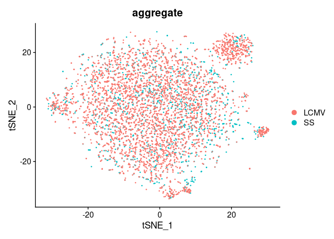
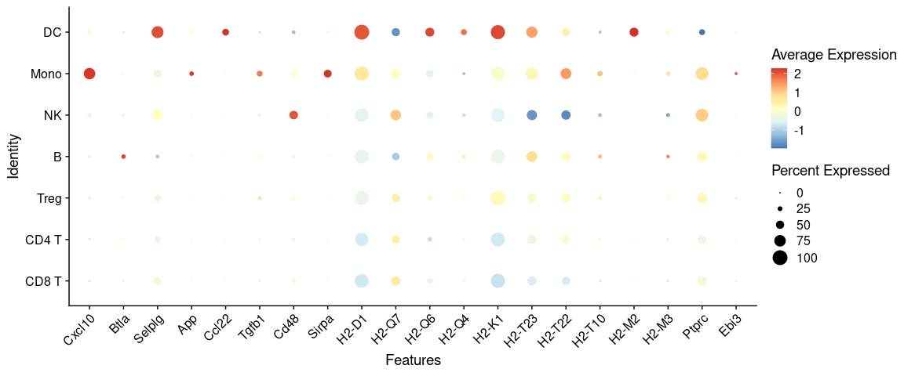
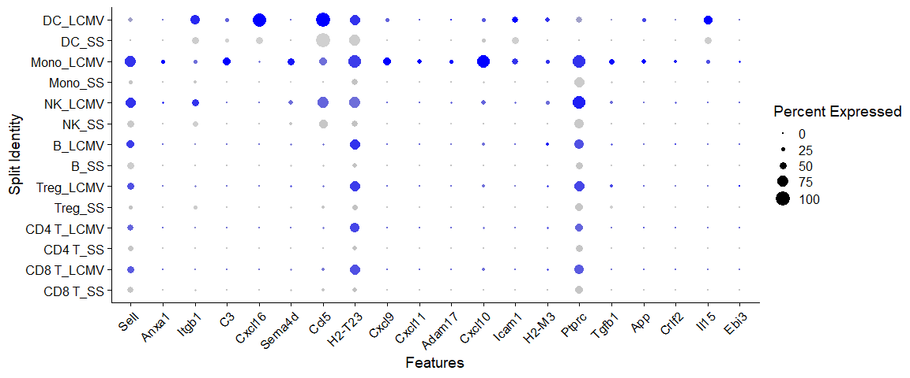
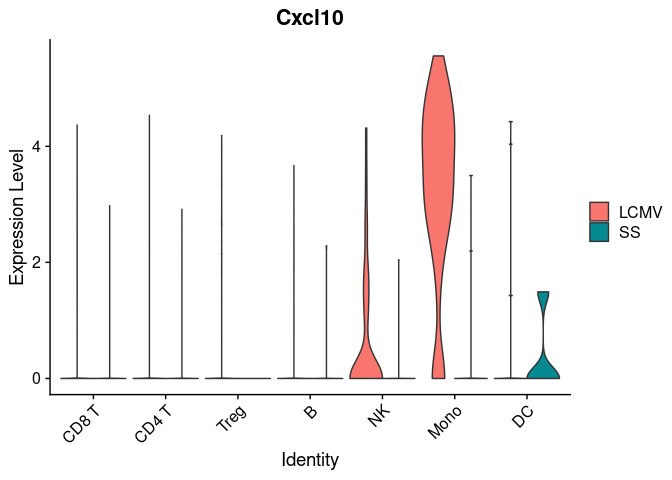
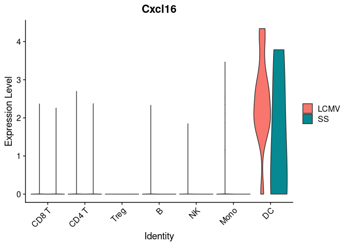
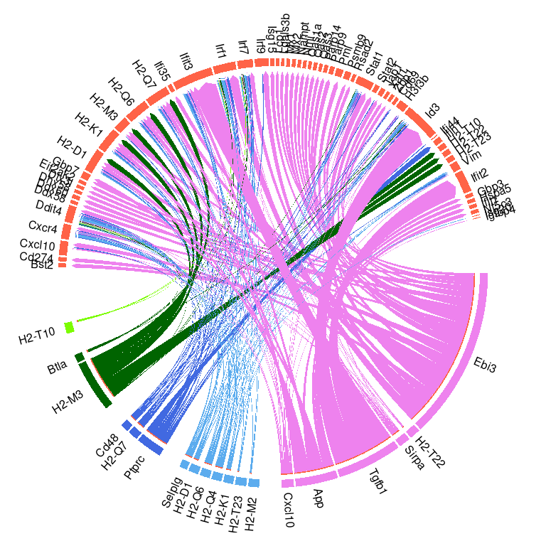
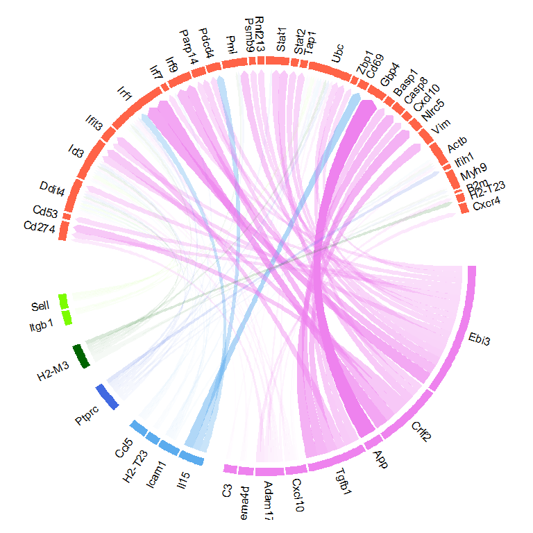
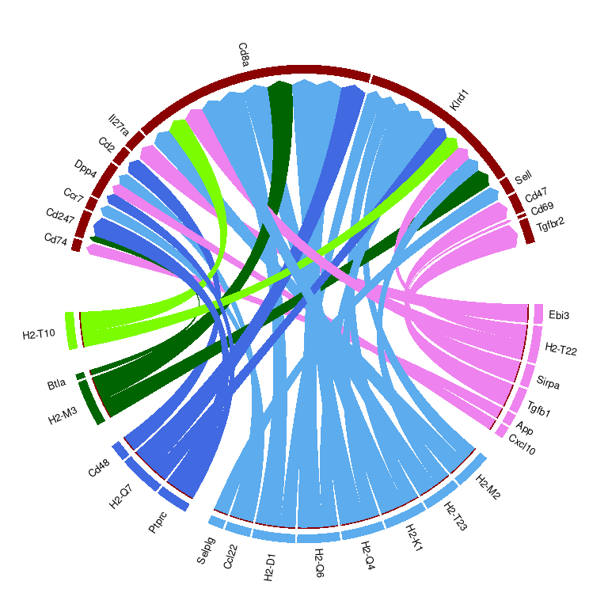
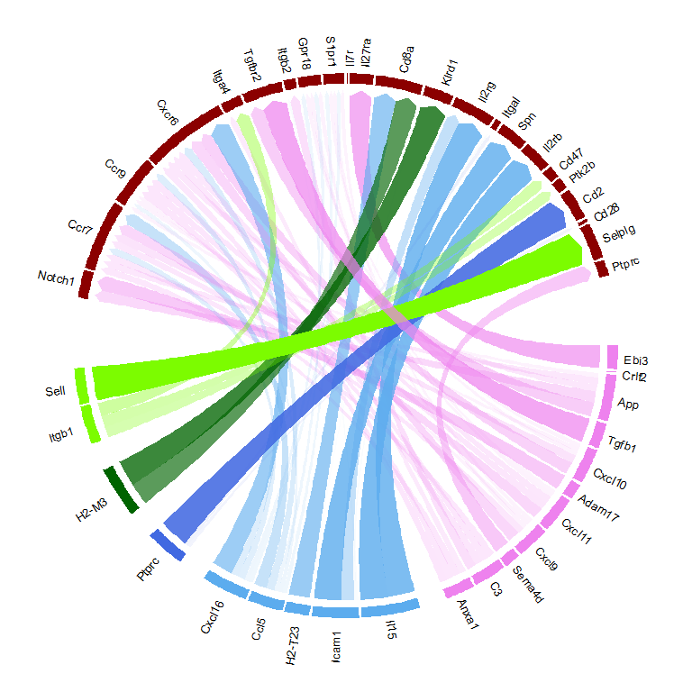

Seurat Wrapper + Circos visualization
================
Robin Browaeys
18-1-2021

<!-- github markdown built using 
rmarkdown::render("vignettes/seurat_wrapper_circos.Rmd", output_format = "github_document")
-->

In this vignette, you can learn how to perform a basic NicheNet analysis
on a Seurat v3 object - and how to visualize the output in a circos
plot. This vignette demonstrates the same workflow as shown in [Perform
NicheNet analysis starting from a Seurat
object](seurat_wrapper.md):`vignette("seurat_wrapper", package="nichenetr")`,
but adds a circos plot visualization as shown in [Circos plot
visualization to show active ligand-target links between interacting
cells](circos.md):`vignette("circos", package="nichenetr")`. For more
detailed information about the NicheNet workflow, check those vignettes.
This vignette was made upon popular request to demonstrate how those two
vignettes can be combined into one analysis workflow. Note that we as
developers of NicheNet generally recommend a visualization of the output
by combining several heatmaps (ligand activity, ligand-target links,
ligand-receptor links, ligand expression, ligand LFC,…) over using a
circos plot visualization. Certainly for cases with many sender cell
types and ligands that are expressed by more than one sender cell type.
Because in those cases, the circos plot is much less informative and
could lead to wrong interpretation of the results.

As example expression data of interacting cells, we will use mouse
NICHE-seq data from Medaglia et al. to explore intercellular
communication in the T cell area in the inguinal lymph node before and
72 hours after lymphocytic choriomeningitis virus (LCMV) infection \[See
@medaglia_spatial_2017\]. We will NicheNet to explore immune cell
crosstalk in response to this LCMV infection.

In this dataset, differential expression is observed between CD8 T cells
in steady-state and CD8 T cells after LCMV infection. NicheNet can be
applied to look at how several immune cell populations in the lymph node
(i.e., monocytes, dendritic cells, NK cells, B cells, CD4 T cells) can
regulate and induce these observed gene expression changes. NicheNet
will specifically prioritize ligands from these immune cells and their
target genes that change in expression upon LCMV infection.

The used NicheNet networks, ligand-target matrix and example expression
data of interacting cells can be downloaded from Zenodo. The NicheNet
networks and ligand-target matrix at
[](https://doi.org/10.5281/zenodo.3260758)
and the Seurat object of the processed NICHE-seq single-cell data at
[](https://doi.org/10.5281/zenodo.3531889).

# Prepare NicheNet analysis

## Load required packages, read in the Seurat object with processed expression data of interacting cells and NicheNet’s ligand-target prior model, ligand-receptor network and weighted integrated networks.

### Load Packages:

``` r
library(nichenetr)
library(Seurat) # Please update to Seurat v4
library(tidyverse)
library(circlize)
```

If you would use and load other packages, we recommend to load these 3
packages after the others.

### Read in NicheNet’s ligand-target prior model, ligand-receptor network and weighted integrated networks:

``` r
ligand_target_matrix = readRDS(url("https://zenodo.org/record/7074291/files/ligand_target_matrix_nsga2r_final_mouse.rds"))
ligand_target_matrix[1:5,1:5] # target genes in rows, ligands in columns
##               2300002M23Rik 2610528A11Rik 9530003J23Rik            a
## 0610005C13Rik  0.000000e+00  0.000000e+00  1.311297e-05 0.000000e+00
## 0610009B22Rik  0.000000e+00  0.000000e+00  1.269301e-05 0.000000e+00
## 0610009L18Rik  8.872902e-05  4.977197e-05  2.581909e-04 7.570125e-05
## 0610010F05Rik  2.194046e-03  1.111556e-03  3.142374e-03 1.631658e-03
## 0610010K14Rik  2.271606e-03  9.360769e-04  3.546140e-03 1.697713e-03
##                        A2m
## 0610005C13Rik 1.390053e-05
## 0610009B22Rik 1.345536e-05
## 0610009L18Rik 9.802264e-05
## 0610010F05Rik 2.585820e-03
## 0610010K14Rik 2.632082e-03

lr_network = readRDS(url("https://zenodo.org/record/7074291/files/lr_network_mouse_21122021.rds"))
head(lr_network)
## # A tibble: 6 × 4
##   from          to    database source  
##   <chr>         <chr> <chr>    <chr>   
## 1 2300002M23Rik Ddr1  omnipath omnipath
## 2 2610528A11Rik Gpr15 omnipath omnipath
## 3 9530003J23Rik Itgal omnipath omnipath
## 4 a             Atrn  omnipath omnipath
## 5 a             F11r  omnipath omnipath
## 6 a             Mc1r  omnipath omnipath

weighted_networks = readRDS(url("https://zenodo.org/record/7074291/files/weighted_networks_nsga2r_final_mouse.rds"))
head(weighted_networks$lr_sig) # interactions and their weights in the ligand-receptor + signaling network
## # A tibble: 6 × 3
##   from          to     weight
##   <chr>         <chr>   <dbl>
## 1 0610010F05Rik App    0.110 
## 2 0610010F05Rik Cat    0.0673
## 3 0610010F05Rik H1f2   0.0660
## 4 0610010F05Rik Lrrc49 0.0829
## 5 0610010F05Rik Nicn1  0.0864
## 6 0610010F05Rik Srpk1  0.123
head(weighted_networks$gr) # interactions and their weights in the gene regulatory network
## # A tibble: 6 × 3
##   from          to            weight
##   <chr>         <chr>          <dbl>
## 1 0610010K14Rik 0610010K14Rik 0.121 
## 2 0610010K14Rik 2510039O18Rik 0.121 
## 3 0610010K14Rik 2610021A01Rik 0.0256
## 4 0610010K14Rik 9130401M01Rik 0.0263
## 5 0610010K14Rik Alg1          0.127 
## 6 0610010K14Rik Alox12        0.128
```

### Read in the expression data of interacting cells:

``` r
seuratObj = readRDS(url("https://zenodo.org/record/3531889/files/seuratObj.rds"))
seuratObj@meta.data %>% head()
##         nGene nUMI orig.ident aggregate res.0.6 celltype nCount_RNA
## W380370   880 1611      LN_SS        SS       1    CD8 T       1607
## W380372   541  891      LN_SS        SS       0    CD4 T        885
## W380374   742 1229      LN_SS        SS       0    CD4 T       1223
## W380378   847 1546      LN_SS        SS       1    CD8 T       1537
## W380379   839 1606      LN_SS        SS       0    CD4 T       1603
## W380381   517  844      LN_SS        SS       0    CD4 T        840
##         nFeature_RNA
## W380370          876
## W380372          536
## W380374          737
## W380378          838
## W380379          836
## W380381          513
```

Visualize which cell populations are present: CD4 T cells (including
regulatory T cells), CD8 T cells, B cells, NK cells, dendritic cells
(DCs) and inflammatory monocytes

``` r
seuratObj@meta.data$celltype %>% table() # note that the number of cells of some cell types is very low and should preferably be higher for a real application
## .
##     B CD4 T CD8 T    DC  Mono    NK  Treg 
##   382  2562  1645    18    90   131   199
DimPlot(seuratObj, reduction = "tsne")
```

<!-- -->

``` r
seuratObj@meta.data$aggregate %>% table()
## .
## LCMV   SS 
## 3886 1141
DimPlot(seuratObj, reduction = "tsne", group.by = "aggregate")
```

<!-- -->

# Perform the NicheNet analysis

## NicheNet analysis on Seurat object: explain differential expression between two conditions

In this case study, the receiver cell population is the ‘CD8 T’ cell
population, whereas the sender cell populations are ‘CD4 T’, ‘Treg’,
‘Mono’, ‘NK’, ‘B’ and ‘DC’. The above described functions will consider
a gene to be expressed when it is expressed in at least a predefined
fraction of cells in one cluster (default: 10%).

The gene set of interest are the genes differentially expressed in CD8 T
cells after LCMV infection. The condition of interest is thus ‘LCMV’,
whereas the reference/steady-state condition is ‘SS’. The notion of
conditions can be extracted from the metadata column ‘aggregate’, the
method to calculate the differential expression is the standard Seurat
Wilcoxon test.

The number of top-ranked ligands that are further used to predict active
target genes and construct an active ligand-receptor network is 20 by
default.

To perform the NicheNet analysis with these specifications, run the
following:

``` r
# indicated cell types should be cell class identities
# check via: 
# seuratObj %>% Idents() %>% table()
sender_celltypes = c("CD4 T","Treg", "Mono", "NK", "B", "DC")
nichenet_output = nichenet_seuratobj_aggregate(
  seurat_obj = seuratObj, 
  receiver = "CD8 T", 
  condition_colname = "aggregate", condition_oi = "LCMV", condition_reference = "SS", 
  sender = sender_celltypes, 
  ligand_target_matrix = ligand_target_matrix, lr_network = lr_network, weighted_networks = weighted_networks)
## [1] "Read in and process NicheNet's networks"
## [1] "Define expressed ligands and receptors in receiver and sender cells"
## [1] "Perform DE analysis in receiver cell"
## [1] "Perform NicheNet ligand activity analysis"
## [1] "Infer active target genes of the prioritized ligands"
## [1] "Infer receptors of the prioritized ligands"
## [1] "Perform DE analysis in sender cells"
```

### Interpret the NicheNet analysis output

#### Ligand activity analysis results

A first thing NicheNet does, is prioritizing ligands based on predicted
ligand activity. To see the ranking of these ligands, run the following
command:

``` r
nichenet_output$ligand_activities
## # A tibble: 70 × 6
##    test_ligand auroc  aupr aupr_corrected pearson  rank
##    <chr>       <dbl> <dbl>          <dbl>   <dbl> <dbl>
##  1 Ebi3        0.658 0.381          0.235   0.293     1
##  2 Ptprc       0.642 0.305          0.159   0.161     2
##  3 H2-M3       0.610 0.287          0.142   0.181     3
##  4 H2-M2       0.614 0.272          0.126   0.147     5
##  5 H2-T10      0.614 0.272          0.126   0.147     5
##  6 H2-T22      0.614 0.272          0.126   0.147     5
##  7 H2-T23      0.614 0.271          0.126   0.147     7
##  8 H2-K1       0.607 0.258          0.113   0.132     8
##  9 H2-Q4       0.606 0.258          0.112   0.131    10
## 10 H2-Q6       0.606 0.258          0.112   0.131    10
## # … with 60 more rows
```

These ligands are expressed by one or more of the input sender cells. To
see which cell population expresses which of these top-ranked ligands,
you can run the following:

``` r
DotPlot(seuratObj, features = nichenet_output$top_ligands %>% rev(), cols = "RdYlBu") + RotatedAxis()
```

<!-- -->

As you can see, most op the top-ranked ligands seem to be mainly
expressed by dendritic cells and monocytes.

It could also be interesting to see whether some of these ligands are
differentially expressed after LCMV infection.

``` r
DotPlot(seuratObj, features = nichenet_output$top_ligands %>% rev(), split.by = "aggregate") + RotatedAxis()
```

<!-- -->

``` r
VlnPlot(seuratObj, features = c("Il15", "Cxcl10","Cxcl16"), split.by = "aggregate", pt.size = 0, combine = FALSE)
## [[1]]
```

<!-- -->

    ## 
    ## [[2]]

<!-- -->

    ## 
    ## [[3]]

<!-- -->

#### Inferred active ligand-target links

NicheNet also infers active target genes of these top-ranked ligands. To
see which top-ranked ligands are predicted to have regulated the
expression of which differentially expressed genes, you can run
following command for a heatmap visualization:

``` r
nichenet_output$ligand_target_heatmap
```

<!-- -->

## Circos plots to visualize ligand-target and ligand-receptor interactions

This visualization groups the top predicted active ligands according to
the strongest expressing cell type. Therefore we need to determine per
cell type which ligands they express more strongly than the other cell
types.

### Calculate average ligand expression in sender cells

``` r
# avg_expression_ligands = AverageExpression(seuratObj %>% subset(subset = aggregate == "LCMV"),features = nichenet_output$top_ligands) # if want to look specifically in LCMV-only cells
avg_expression_ligands = AverageExpression(seuratObj, features = nichenet_output$top_ligands)
```

### Assign ligands to sender cells

To assign ligands to sender cell type, we can e.g. look for which sender
cell types show an expression that is higher than the average + SD.

``` r
sender_ligand_assignment = avg_expression_ligands$RNA %>% apply(1, function(ligand_expression){
  ligand_expression > (ligand_expression %>% mean() + ligand_expression %>% sd())
  }) %>% t()
sender_ligand_assignment = sender_ligand_assignment %>% apply(2, function(x){x[x == TRUE]}) %>% purrr::keep(function(x){length(x) > 0})
names(sender_ligand_assignment)
## [1] "B"    "NK"   "Mono" "DC"
```

The top ligands seem to be most strongly expressed by B cells, NK cells,
monocytes and DCs. We will know also look at which ligands are common
across multiple cell types (= those that are specific to \> 1 cell type,
or those that were not assigned to a cell type in the previous block of
code)

Determine now which prioritized ligands are expressed by CAFs and or
endothelial cells

``` r

all_assigned_ligands = sender_ligand_assignment %>% lapply(function(x){names(x)}) %>% unlist()
unique_ligands = all_assigned_ligands %>% table() %>% .[. == 1] %>% names()
general_ligands = nichenet_output$top_ligands %>% setdiff(unique_ligands)

B_specific_ligands = sender_ligand_assignment$B %>% names() %>% setdiff(general_ligands)
NK_specific_ligands = sender_ligand_assignment$NK %>% names() %>% setdiff(general_ligands)
Mono_specific_ligands = sender_ligand_assignment$Mono %>% names() %>% setdiff(general_ligands)
DC_specific_ligands = sender_ligand_assignment$DC %>% names() %>% setdiff(general_ligands)

ligand_type_indication_df = tibble(
  ligand_type = c(rep("B-specific", times = B_specific_ligands %>% length()),
                  rep("NK-specific", times = NK_specific_ligands %>% length()),
                  rep("Mono-specific", times = Mono_specific_ligands %>% length()),
                  rep("DC-specific", times = DC_specific_ligands %>% length()),
                  rep("General", times = general_ligands %>% length())),
  ligand = c(B_specific_ligands, NK_specific_ligands, Mono_specific_ligands, DC_specific_ligands, general_ligands))
```

### Define the ligand-target links of interest

To avoid making a circos plots with too many ligand-target links, we
will show only links with a weight higher than a predefined cutoff:
links belonging to the 40% of lowest scores were removed. Not that this
cutoffs and other cutoffs used for this visualization can be changed
according to the user’s needs.

``` r
active_ligand_target_links_df = nichenet_output$ligand_target_df %>% mutate(target_type = "LCMV-DE") %>% inner_join(ligand_type_indication_df) # if you want ot make circos plots for multiple gene sets, combine the different data frames and differentiate which target belongs to which gene set via the target type

cutoff_include_all_ligands = active_ligand_target_links_df$weight %>% quantile(0.40)

active_ligand_target_links_df_circos = active_ligand_target_links_df %>% filter(weight > cutoff_include_all_ligands)

ligands_to_remove = setdiff(active_ligand_target_links_df$ligand %>% unique(), active_ligand_target_links_df_circos$ligand %>% unique())
targets_to_remove = setdiff(active_ligand_target_links_df$target %>% unique(), active_ligand_target_links_df_circos$target %>% unique())
  
circos_links = active_ligand_target_links_df %>% filter(!target %in% targets_to_remove &!ligand %in% ligands_to_remove)
```

Prepare the circos visualization: give each segment of ligands and
targets a specific color and order

``` r
grid_col_ligand =c("General" = "lawngreen",
            "NK-specific" = "royalblue",
            "B-specific" = "darkgreen",
            "Mono-specific" = "violet",
            "DC-specific" = "steelblue2")
grid_col_target =c(
            "LCMV-DE" = "tomato")

grid_col_tbl_ligand = tibble(ligand_type = grid_col_ligand %>% names(), color_ligand_type = grid_col_ligand)
grid_col_tbl_target = tibble(target_type = grid_col_target %>% names(), color_target_type = grid_col_target)

circos_links = circos_links %>% mutate(ligand = paste(ligand," ")) # extra space: make a difference between a gene as ligand and a gene as target!
circos_links = circos_links %>% inner_join(grid_col_tbl_ligand) %>% inner_join(grid_col_tbl_target)
links_circle = circos_links %>% select(ligand,target, weight)

ligand_color = circos_links %>% distinct(ligand,color_ligand_type)
grid_ligand_color = ligand_color$color_ligand_type %>% set_names(ligand_color$ligand)
target_color = circos_links %>% distinct(target,color_target_type)
grid_target_color = target_color$color_target_type %>% set_names(target_color$target)

grid_col =c(grid_ligand_color,grid_target_color)

# give the option that links in the circos plot will be transparant ~ ligand-target potential score
transparency = circos_links %>% mutate(weight =(weight-min(weight))/(max(weight)-min(weight))) %>% mutate(transparency = 1-weight) %>% .$transparency 
```

Prepare the circos visualization: order ligands and targets

``` r
target_order = circos_links$target %>% unique()
ligand_order = c(Mono_specific_ligands, DC_specific_ligands, NK_specific_ligands,B_specific_ligands, general_ligands) %>% c(paste(.," ")) %>% intersect(circos_links$ligand)
order = c(ligand_order,target_order)
```

Prepare the circos visualization: define the gaps between the different
segments

``` r
width_same_cell_same_ligand_type = 0.5
width_different_cell = 6
width_ligand_target = 15
width_same_cell_same_target_type = 0.5

gaps = c(
  # width_ligand_target,
  rep(width_same_cell_same_ligand_type, times = (circos_links %>% filter(ligand_type == "Mono-specific") %>% distinct(ligand) %>% nrow() -1)),
  width_different_cell,
  rep(width_same_cell_same_ligand_type, times = (circos_links %>% filter(ligand_type == "DC-specific") %>% distinct(ligand) %>% nrow() -1)),
  width_different_cell,
  rep(width_same_cell_same_ligand_type, times = (circos_links %>% filter(ligand_type == "NK-specific") %>% distinct(ligand) %>% nrow() -1)),
  width_different_cell,
  rep(width_same_cell_same_ligand_type, times = (circos_links %>% filter(ligand_type == "B-specific") %>% distinct(ligand) %>% nrow() -1)),
  width_different_cell,
  rep(width_same_cell_same_ligand_type, times = (circos_links %>% filter(ligand_type == "General") %>% distinct(ligand) %>% nrow() -1)),
  width_ligand_target,
  rep(width_same_cell_same_target_type, times = (circos_links %>% filter(target_type == "LCMV-DE") %>% distinct(target) %>% nrow() -1)),
  width_ligand_target
  )
```

Render the circos plot (all links same transparancy). Only the widths of
the blocks that indicate each target gene is proportional the
ligand-target regulatory potential (\~prior knowledge supporting the
regulatory interaction).

``` r
circos.par(gap.degree = gaps)
chordDiagram(links_circle, directional = 1,order=order,link.sort = TRUE, link.decreasing = FALSE, grid.col = grid_col,transparency = 0, diffHeight = 0.005, direction.type = c("diffHeight", "arrows"),link.arr.type = "big.arrow", link.visible = links_circle$weight >= cutoff_include_all_ligands,annotationTrack = "grid", 
    preAllocateTracks = list(track.height = 0.075))
# we go back to the first track and customize sector labels
circos.track(track.index = 1, panel.fun = function(x, y) {
    circos.text(CELL_META$xcenter, CELL_META$ylim[1], CELL_META$sector.index,
        facing = "clockwise", niceFacing = TRUE, adj = c(0, 0.55), cex = 1)
}, bg.border = NA) #
```

<!-- -->

``` r
circos.clear()
```

Render the circos plot (degree of transparancy determined by the
regulatory potential value of a ligand-target interaction)

``` r
circos.par(gap.degree = gaps)
chordDiagram(links_circle, directional = 1,order=order,link.sort = TRUE, link.decreasing = FALSE, grid.col = grid_col,transparency = transparency, diffHeight = 0.005, direction.type = c("diffHeight", "arrows"),link.arr.type = "big.arrow", link.visible = links_circle$weight >= cutoff_include_all_ligands,annotationTrack = "grid", 
    preAllocateTracks = list(track.height = 0.075))
# we go back to the first track and customize sector labels
circos.track(track.index = 1, panel.fun = function(x, y) {
    circos.text(CELL_META$xcenter, CELL_META$ylim[1], CELL_META$sector.index,
        facing = "clockwise", niceFacing = TRUE, adj = c(0, 0.55), cex = 1)
}, bg.border = NA) #
```

<!-- -->

``` r
circos.clear()
```

Save circos plot to an svg file

``` r
svg("ligand_target_circos.svg", width = 10, height = 10)
circos.par(gap.degree = gaps)
chordDiagram(links_circle, directional = 1,order=order,link.sort = TRUE, link.decreasing = FALSE, grid.col = grid_col,transparency = transparency, diffHeight = 0.005, direction.type = c("diffHeight", "arrows"),link.arr.type = "big.arrow", link.visible = links_circle$weight >= cutoff_include_all_ligands,annotationTrack = "grid",
    preAllocateTracks = list(track.height = 0.075))
# we go back to the first track and customize sector labels
circos.track(track.index = 1, panel.fun = function(x, y) {
    circos.text(CELL_META$xcenter, CELL_META$ylim[1], CELL_META$sector.index,
        facing = "clockwise", niceFacing = TRUE, adj = c(0, 0.55), cex = 1)
}, bg.border = NA) #
circos.clear()
dev.off()
## png 
##   2
```

### Visualize ligand-receptor interactions of the prioritized ligands in a circos plot

``` r
lr_network_top_df = nichenet_output$ligand_receptor_df %>% mutate(receptor_type = "LCMV_CD8T_receptor") %>% inner_join(ligand_type_indication_df)
```

``` r
grid_col_ligand =c("General" = "lawngreen",
            "NK-specific" = "royalblue",
            "B-specific" = "darkgreen",
            "Mono-specific" = "violet",
            "DC-specific" = "steelblue2")
grid_col_receptor =c(
            "LCMV_CD8T_receptor" = "darkred")

grid_col_tbl_ligand = tibble(ligand_type = grid_col_ligand %>% names(), color_ligand_type = grid_col_ligand)
grid_col_tbl_receptor = tibble(receptor_type = grid_col_receptor %>% names(), color_receptor_type = grid_col_receptor)

circos_links = lr_network_top_df %>% mutate(ligand = paste(ligand," ")) # extra space: make a difference between a gene as ligand and a gene as receptor!
circos_links = circos_links %>% inner_join(grid_col_tbl_ligand) %>% inner_join(grid_col_tbl_receptor)
links_circle = circos_links %>% select(ligand,receptor, weight)

ligand_color = circos_links %>% distinct(ligand,color_ligand_type)
grid_ligand_color = ligand_color$color_ligand_type %>% set_names(ligand_color$ligand)
receptor_color = circos_links %>% distinct(receptor,color_receptor_type)
grid_receptor_color = receptor_color$color_receptor_type %>% set_names(receptor_color$receptor)

grid_col =c(grid_ligand_color,grid_receptor_color)

# give the option that links in the circos plot will be transparant ~ ligand-receptor potential score
transparency = circos_links %>% mutate(weight =(weight-min(weight))/(max(weight)-min(weight))) %>% mutate(transparency = 1-weight) %>% .$transparency 
```

Prepare the circos visualization: order ligands and receptors

``` r
receptor_order = circos_links$receptor %>% unique()
ligand_order = c(Mono_specific_ligands, DC_specific_ligands, NK_specific_ligands,B_specific_ligands, general_ligands) %>% c(paste(.," ")) %>% intersect(circos_links$ligand)
order = c(ligand_order,receptor_order)
```

Prepare the circos visualization: define the gaps between the different
segments

``` r
width_same_cell_same_ligand_type = 0.5
width_different_cell = 6
width_ligand_receptor = 15
width_same_cell_same_receptor_type = 0.5

gaps = c(
  # width_ligand_target,
  rep(width_same_cell_same_ligand_type, times = (circos_links %>% filter(ligand_type == "Mono-specific") %>% distinct(ligand) %>% nrow() -1)),
  width_different_cell,
  rep(width_same_cell_same_ligand_type, times = (circos_links %>% filter(ligand_type == "DC-specific") %>% distinct(ligand) %>% nrow() -1)),
  width_different_cell,
  rep(width_same_cell_same_ligand_type, times = (circos_links %>% filter(ligand_type == "NK-specific") %>% distinct(ligand) %>% nrow() -1)),
  width_different_cell,
  rep(width_same_cell_same_ligand_type, times = (circos_links %>% filter(ligand_type == "B-specific") %>% distinct(ligand) %>% nrow() -1)),
  width_different_cell,
  rep(width_same_cell_same_ligand_type, times = (circos_links %>% filter(ligand_type == "General") %>% distinct(ligand) %>% nrow() -1)),
  width_ligand_receptor,
  rep(width_same_cell_same_receptor_type, times = (circos_links %>% filter(receptor_type == "LCMV_CD8T_receptor") %>% distinct(receptor) %>% nrow() -1)),
  width_ligand_receptor
  )
```

Render the circos plot (all links same transparancy). Only the widths of
the blocks that indicate each receptor is proportional the
ligand-receptor interaction weight (\~prior knowledge supporting the
interaction).

``` r
circos.par(gap.degree = gaps)
chordDiagram(links_circle, directional = 1,order=order,link.sort = TRUE, link.decreasing = FALSE, grid.col = grid_col,transparency = 0, diffHeight = 0.005, direction.type = c("diffHeight", "arrows"),link.arr.type = "big.arrow", link.visible = links_circle$weight >= cutoff_include_all_ligands,annotationTrack = "grid", 
    preAllocateTracks = list(track.height = 0.075))
# we go back to the first track and customize sector labels
circos.track(track.index = 1, panel.fun = function(x, y) {
    circos.text(CELL_META$xcenter, CELL_META$ylim[1], CELL_META$sector.index,
        facing = "clockwise", niceFacing = TRUE, adj = c(0, 0.55), cex = 0.8)
}, bg.border = NA) #
```

<!-- -->

``` r
circos.clear()
```

Render the circos plot (degree of transparancy determined by the prior
interaction weight of the ligand-receptor interaction - just as the
widths of the blocks indicating each receptor)

``` r
circos.par(gap.degree = gaps)
chordDiagram(links_circle, directional = 1,order=order,link.sort = TRUE, link.decreasing = FALSE, grid.col = grid_col,transparency = transparency, diffHeight = 0.005, direction.type = c("diffHeight", "arrows"),link.arr.type = "big.arrow", link.visible = links_circle$weight >= cutoff_include_all_ligands,annotationTrack = "grid", 
    preAllocateTracks = list(track.height = 0.075))
# we go back to the first track and customize sector labels
circos.track(track.index = 1, panel.fun = function(x, y) {
    circos.text(CELL_META$xcenter, CELL_META$ylim[1], CELL_META$sector.index,
        facing = "clockwise", niceFacing = TRUE, adj = c(0, 0.55), cex = 0.8)
}, bg.border = NA) #
```

<!-- -->

``` r
circos.clear()
```

Save circos plot to an svg file

``` r
svg("ligand_receptor_circos.svg", width = 15, height = 15)
circos.par(gap.degree = gaps)
chordDiagram(links_circle, directional = 1,order=order,link.sort = TRUE, link.decreasing = FALSE, grid.col = grid_col,transparency = transparency, diffHeight = 0.005, direction.type = c("diffHeight", "arrows"),link.arr.type = "big.arrow", link.visible = links_circle$weight >= cutoff_include_all_ligands,annotationTrack = "grid",
    preAllocateTracks = list(track.height = 0.075))
# we go back to the first track and customize sector labels
circos.track(track.index = 1, panel.fun = function(x, y) {
    circos.text(CELL_META$xcenter, CELL_META$ylim[1], CELL_META$sector.index,
        facing = "clockwise", niceFacing = TRUE, adj = c(0, 0.55), cex = 0.8)
}, bg.border = NA) #
circos.clear()
dev.off()
## png 
##   2
```
